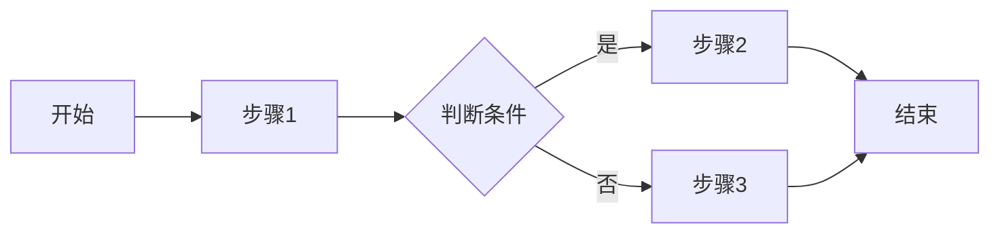
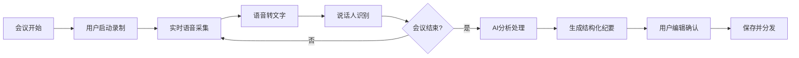

# PRD Generator

这个技能作为你的产品文档写作伙伴，帮助你从产品想法到完整PRD的全过程，包括信息收集、竞品研究、内容生成和迭代优化。

## When to Use This Skill

- 启动新产品或新功能的需求文档
- 将模糊的产品想法转化为正式文档
- 进行竞品分析并整合到需求文档
- 梳理和完善功能性/非功能性需求
- 准备产品评审会议材料
- 迭代优化现有PRD文档

## What This Skill Does

1. **交互式信息收集**: 逐步引导完善产品各模块信息
2. **竞品研究**: 搜索分析竞品，提取关键洞察
3. **内容生成**: 基于输入自动扩展和润色内容
4. **流程图绘制**: 使用Mermaid生成功能流程图
5. **模块反馈**: 对每个模块提供优化建议
6. **迭代优化**: 支持对各模块内容进行调整
7. **标准化输出**: 生成符合规范的PRD文档

## How to Use

### 初始化PRD项目

为PRD创建专用文件夹：
```
mkdir ~/prd/产品名称
cd ~/prd/产品名称
```

创建草稿文件：
```
touch prd-draft.md
```

从该目录启动Claude Code开始编写。

### 基本工作流

1. **开始PRD**:
```
帮我创建一份PRD，产品是[简要描述产品想法]
```

2. **研究竞品**:
```
帮我研究[领域]的竞品，分析他们的优劣势
```

3. **完善模块**:
```
帮我完善用户痛点这个模块，目标用户是[描述]
```

4. **获取反馈**:
```
我写完了功能概述，帮我review一下
```

5. **生成完整文档**:
```
基于收集的信息，生成完整的PRD文档
```

## Instructions

当用户请求PRD协助时：

### 1. 理解产品项目

询问澄清问题：
- 产品是什么？解决什么问题？
- 目标用户是谁？
- 产品目标是什么？（业务目标、用户目标）
- 有没有参考的竞品？
- 这是新产品还是迭代功能？
- 预期的文档详细程度？

### 2. 协作式信息收集

帮助用户逐步完善PRD各模块：

```markdown
# PRD大纲: [产品名称]

## 文档信息
- 版本号: [待定]
- 负责人: [待定]
- 创建日期: [当前日期]

## 产品概述
- [ ] 产品背景
- [ ] 产品目标
- [ ] 目标用户
- [ ] 用户痛点
- [ ] 主要功能
- [ ] 竞品分析

## 功能需求
- [ ] 功能1: [名称]
  - 功能概述
  - 用户场景
  - 功能流程
  - 前置/后置条件
  - 异常场景

## 非功能需求
- [ ] 性能需求
- [ ] 算法指标（如适用）

## 待研究
- [ ] [需要调研的问题1]
- [ ] [需要调研的问题2]
```

**迭代大纲**:
- 根据反馈调整结构
- 识别信息缺口
- 标记需要深入研究的部分

### 3. 进行竞品研究

当用户请求竞品分析时：

- 搜索相关竞品信息
- 分析核心功能和差异点
- 提取优劣势
- 总结对产品的启示

示例输出：
```markdown
## 竞品研究: [领域]

### 竞品1: [名称]

**基本信息**
- 公司/团队: [信息]
- 用户规模: [信息]
- 核心定位: [信息]

**核心功能**
1. [功能A]: [描述]
2. [功能B]: [描述]
3. [功能C]: [描述]

**优势**
- [优势1]
- [优势2]

**劣势**
- [劣势1]
- [劣势2]

**对我们的启示**
[分析总结，指出可借鉴和需避免的点]

---

### 竞品对比总结

| 维度 | 竞品1 | 竞品2 | 我们的机会 |
|------|-------|-------|------------|
| [维度1] | [评价] | [评价] | [机会点] |
| [维度2] | [评价] | [评价] | [机会点] |

已添加到 competitors.md
```

### 4. 生成功能流程图

使用Mermaid语法生成清晰的流程图：

```markdown
### 功能流程: [功能名称]



**流程说明**:
1. **步骤1**: [详细说明]
2. **判断条件**: [判断逻辑]
3. **步骤2/3**: [分支说明]
```

### 5. 提供模块反馈

当用户完成某个模块后，提供review：

```markdown
# 反馈: [模块名称]

## 做得好的地方 ✓
- [优点1]
- [优点2]
- [优点3]

## 改进建议

### 具体性
- [模糊表述] → [更具体的建议]
- [缺少数据] → [建议补充的数据]

### 完整性
- [缺失的场景] → [建议补充]
- [未考虑的边界] → [建议考虑]

### 可执行性
- [不够明确的需求] → [更清晰的表述]

## 具体修改建议

原文:
> [原始内容]

建议:
> [改进后的内容]

原因: [解释为什么这样改更好]

## 思考问题
- [引导深入思考的问题1]
- [引导深入思考的问题2]

准备进入下一个模块！
```

### 6. 内容生成规范

**产品背景** (建议500字以上):
```markdown
### 产品背景

#### 市场现状
[描述当前市场环境、行业趋势、用户行为变化]

#### 问题与机会
[描述发现的核心问题或市场机会]

#### 为什么是现在
[描述时机的重要性，为什么现在做这个产品]

#### 我们的优势
[描述团队/公司做这个产品的独特优势]
```

**用户场景** (具体、有代入感):
```markdown
### 用户场景

**场景1: [场景名称]**

- **用户**: [用户角色]
- **背景**: [场景背景]
- **目标**: [用户想要达成的目标]
- **行为**: 
  1. [步骤1]
  2. [步骤2]
  3. [步骤3]
- **结果**: [期望的结果]
- **痛点**: [当前方案的痛点]
```

**异常场景** (考虑全面):
```markdown
### 异常场景

| 异常情况 | 触发条件 | 处理方式 | 用户提示 |
|----------|----------|----------|----------|
| [异常1] | [条件] | [处理] | [提示语] |
| [异常2] | [条件] | [处理] | [提示语] |
```

### 7. 最终文档生成

当信息收集完成后，生成完整PRD：

```markdown
# [产品名称] 产品需求文档

## 1. 文档信息

| 版本号 | 创建日期 | 负责人 | 状态 |
|--------|----------|--------|------|
| V1.0 | [日期] | [姓名] | 待评审 |

## 2. 修订历史

| 版本 | 修订内容 | 修订时间 | 修订人 |
|------|----------|----------|--------|
| V1.0 | 初稿创建 | [日期] | [姓名] |

## 3. 名词解释

| 术语 | 解释 |
|------|------|
| [术语] | [解释] |

## 4. 产品概述

### 4.1 产品背景
[详细内容]

### 4.2 产品目标
[详细内容]

### 4.3 目标用户
[详细内容]

### 4.4 用户痛点
[详细内容]

### 4.5 主要功能
[详细内容]

### 4.6 竞品分析
[详细内容]

## 5. 功能需求

### 5.1 [功能名称]

#### 功能概述
[详细内容]

#### 用户场景
[详细内容]

#### 功能流程
[Mermaid流程图]

#### 前置条件
[详细内容]

#### 后置条件
[详细内容]

#### 异常场景
[详细内容]

### 5.2 非功能需求

#### 性能需求
[详细内容]

#### 算法指标
[如适用]

## 6. 参考资料
[引用链接]
```

### 8. 文档Review清单

生成文档后提供检查清单：

```markdown
# PRD Review清单

## 完整性检查
- [ ] 产品背景清晰，说明了为什么做
- [ ] 目标用户有明确画像
- [ ] 用户痛点有数据或案例支撑
- [ ] 竞品分析覆盖主要竞品
- [ ] 功能需求可执行、可验收
- [ ] 异常场景考虑全面

## 质量检查
- [ ] 无模糊表述（如"等"、"相关"、"合适的"）
- [ ] 有量化指标（性能、算法等）
- [ ] 流程图清晰完整
- [ ] 前后内容一致，无矛盾

## 可读性检查
- [ ] 结构清晰，层级分明
- [ ] 表格对齐，格式统一
- [ ] 术语有解释

准备评审！🚀
```

## Examples

### Example 1: 从想法到大纲

**用户**: "帮我创建一份PRD，产品是一个AI驱动的会议纪要工具"

**过程**:
1. 询问产品细节和目标用户
2. 创建PRD大纲结构
3. 识别需要研究的竞品
4. 标记需要深入的模块
5. 开始逐模块收集信息

**输出**:
```markdown
# PRD大纲: AI会议纪要助手

## 产品概述
- [ ] 产品背景 - 需要了解：目标市场、切入点
- [ ] 产品目标 - 需要明确：业务指标、用户指标
- [ ] 目标用户 - 初步判断：企业知识工作者
- [ ] 用户痛点 - 需要验证：手动记录效率低？
- [ ] 主要功能 - 待讨论：核心功能优先级
- [ ] 竞品分析 - 待研究：Otter.ai, Fireflies等

## 待研究问题
- [ ] 竞品的定价策略
- [ ] 用户对隐私的顾虑
- [ ] 技术可行性评估

让我们从产品背景开始，你能描述一下为什么想做这个产品吗？
```

### Example 2: 竞品研究

**用户**: "帮我研究AI会议纪要领域的竞品"

**输出**:
```markdown
## 竞品研究: AI会议纪要工具

### 竞品1: Otter.ai

**基本信息**
- 公司: Otter.ai (AISense Inc.)
- 融资: 累计融资超过6000万美元
- 用户: 企业和个人用户

**核心功能**
1. **实时转录**: 支持多人会议实时转文字
2. **说话人识别**: 自动区分不同发言人
3. **关键词提取**: 自动标记重要内容
4. **集成能力**: 支持Zoom、Teams、Meet

**优势**
- 转录准确率高（英文）
- 用户体验流畅
- 生态集成丰富

**劣势**
- 中文支持较弱
- 高级功能价格较高
- 摘要质量一般

**对我们的启示**
中文市场存在机会，可以在摘要智能化上做差异化

---

### 竞品2: 飞书妙记

**基本信息**
- 公司: 字节跳动
- 定位: 飞书生态内的会议记录工具

**核心功能**
1. **会议录制**: 自动录制飞书会议
2. **智能转写**: 语音转文字
3. **内容搜索**: 支持搜索会议内容

**优势**
- 中文支持好
- 与飞书深度集成
- 免费使用

**劣势**
- 仅限飞书生态
- AI摘要能力有限
- 无法跨平台使用

---

### 竞品对比

| 维度 | Otter.ai | 飞书妙记 | 我们的机会 |
|------|----------|----------|------------|
| 中文支持 | ⭐⭐ | ⭐⭐⭐⭐⭐ | 做到最好 |
| AI摘要 | ⭐⭐⭐ | ⭐⭐ | 核心差异化 |
| 跨平台 | ⭐⭐⭐⭐ | ⭐ | 必须支持 |
| 价格 | ⭐⭐ | ⭐⭐⭐⭐⭐ | 中等定价 |

已保存到 competitors.md ✅
```

### Example 3: 模块反馈

**用户**: "我写完了用户痛点，帮我看看：
用户痛点：
1. 开会时记笔记影响参与度
2. 会后整理纪要耗时
3. 重要信息容易遗漏"

**输出**:
```markdown
# 反馈: 用户痛点模块

## 做得好的地方 ✓
- 痛点方向正确，抓住了核心问题
- 结构清晰，分点列出
- 覆盖了会前、会中、会后

## 改进建议

### 具体性
当前表述较为笼统，建议增加具体数据或场景：

原文:
> "开会时记笔记影响参与度"

建议:
> "开会时记笔记影响参与度：调研显示，边记笔记的参会者发言次数减少40%，且容易错过讨论要点。某用户反馈：'我要么专心听，要么专心记，没法两者兼顾'"

### 完整性
建议补充以下痛点：
- 会议纪要格式不统一，难以检索
- 跨时区团队难以同步会议内容
- 行动项跟进困难

### 可验证性
建议增加数据支撑：
- 用户调研数据
- 行业报告引用
- 具体用户案例

## 思考问题
- 这些痛点的优先级如何排序？
- 哪个痛点是用户最愿意付费解决的？
- 现有方案为什么没能解决这些痛点？

准备进入下一个模块！
```

### Example 4: 功能流程生成

**用户**: "帮我画一下会议纪要生成的功能流程"

**输出**:
```markdown
### 功能流程: 会议纪要生成



**流程说明**:

1. **会议开始 → 启动录制**
   - 用户手动点击开始，或自动检测会议开始
   - 获取必要权限（麦克风、屏幕等）

2. **实时语音采集 → 语音转文字**
   - 持续采集音频流
   - 实时转写，延迟<2秒

3. **说话人识别**
   - 区分不同发言人
   - 支持预设参会人或自动识别

4. **AI分析处理**
   - 提取关键议题
   - 识别决策和行动项
   - 生成摘要

5. **用户编辑确认**
   - 支持修改错误
   - 补充遗漏信息
   - 调整格式

6. **保存并分发**
   - 保存到云端
   - 自动发送给参会人

已添加到PRD文档 ✅
```

## PRD Workflows

### 新产品PRD流程
1. 明确产品想法和目标
2. 研究竞品和市场
3. 定义目标用户和痛点
4. 梳理核心功能
5. 逐个功能详细设计
6. 补充非功能需求
7. 整体review和优化
8. 输出正式文档

### 迭代功能PRD流程
1. 明确迭代目标
2. 分析现有问题
3. 设计解决方案
4. 详细功能设计
5. 评估影响范围
6. 输出迭代PRD

### 快速PRD流程
1. 提供产品想法
2. AI自动生成初稿
3. 用户review调整
4. 补充关键细节
5. 输出文档

## Pro Tips

1. **先想清楚再动手**: 花10分钟想清楚产品核心价值
2. **用户视角优先**: 每个功能都从用户场景出发
3. **数据说话**: 用数据支撑论点，让PRD更有说服力
4. **避免模糊表述**: 不用"等"、"相关"、"合适的"
5. **流程图很重要**: 复杂逻辑用图说清楚
6. **版本管理**: 每次大改动保存新版本
7. **及时同步**: 完成后及时同步给相关方review

## File Organization

推荐的PRD项目结构：


~/prd/产品名称/
├── prd-draft.md          # PRD草稿
├── prd-v1.0.md           # 正式版本
├── competitors.md        # 竞品分析
├── user-research.md      # 用户研究
├── meeting-notes.md      # 讨论记录
└── assets/
    └── flowcharts/       # 流程图


## Best Practices

### 信息收集
- 一次只问一个模块
- 提供示例帮助理解
- 允许跳过后续补充
- 记录待确认事项

### 内容质量
- 每个需求可执行、可验收
- 用户场景具体、有代入感
- 异常场景考虑全面
- 量化指标明确

### 文档规范
- 使用统一的标题层级
- 表格对齐整洁
- 术语有解释
- 版本号规范管理

## Related Use Cases

- 生成MRD（市场需求文档）
- 生成竞品分析报告
- 生成用户故事地图
- 生成功能规格说明书
- 生成技术方案文档
```