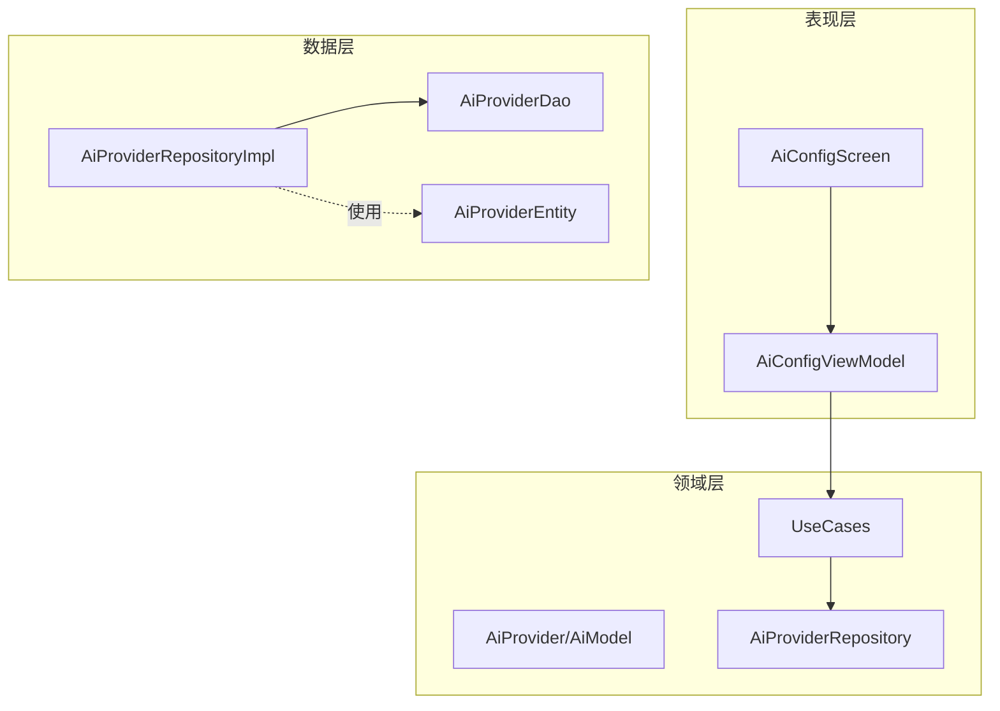
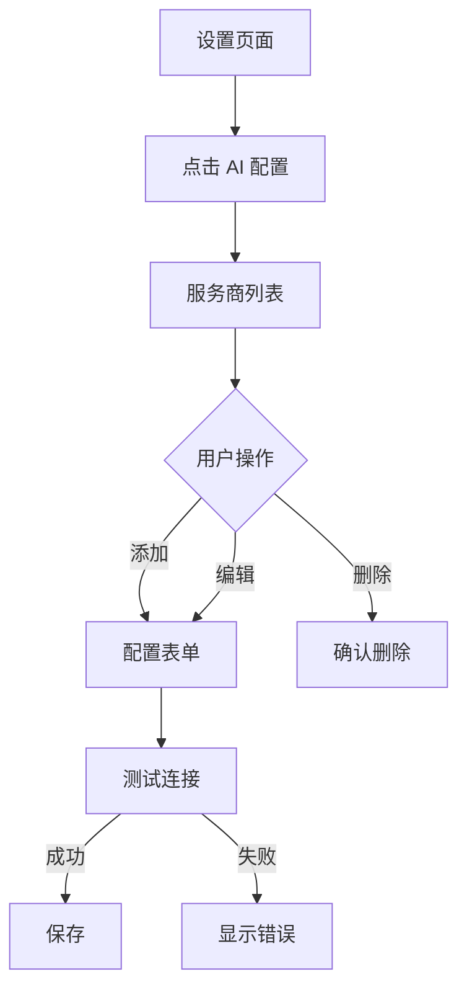

# 设计文档 - 灵活的 AI 模型配置（简化版）

## 1. 整体架构设计

### 1.1 架构概览

本功能扩展现有的 AI 配置系统，允许用户自定义 AI 服务商和模型选择。严格遵循项目的 Clean Architecture + MVVM 架构模式。

**设计原则：**
- **KISS原则**：保持简单直接，避免不必要的复杂性
- **YAGNI原则**：只实现当前需要的功能
- **架构一致性**：严格遵循项目现有架构模式
- **安全性优先**：使用 Android Jetpack Security 标准实现

**MVP 功能范围：**
- ✅ 服务商添加/编辑/删除
- ✅ API Key 安全存储（EncryptedSharedPreferences）
- ✅ 基本模型配置
- ✅ 简单连接测试
- ❌ 配置模板（未来迭代）
- ❌ 配置导入导出（未来迭代）

### 1.2 架构图



### 1.3 与现有架构的集成

**复用现有组件：**
- ✅ 使用现有的 `OpenAiApi` 接口（已支持动态 URL）
- ✅ 使用现有的 `AppDatabase` 和 Room 配置
- ✅ 使用现有的 `Result<T>` 错误处理模式
- ✅ 使用现有的 Hilt 依赖注入配置
- ✅ 使用现有的 Compose 主题和组件

**技术栈一致性：**
- JSON 解析：**Moshi**（与项目保持一致）
- 安全存储：**Android Jetpack Security EncryptedSharedPreferences**
- 数据库：**Room**
- 网络：**Retrofit + OkHttp**
- 依赖注入：**Hilt**

## 2. 核心功能设计

### 2.1 数据模型（简化版）

#### Domain 层模型

```kotlin
// 文件: domain/model/AiProvider.kt
data class AiProvider(
    val id: String,                      // UUID
    val name: String,                    // 显示名称
    val baseUrl: String,                 // API 端点
    val apiKey: String,                  // API Key（内存中明文）
    val models: List<AiModel>,           // 可用模型列表
    val defaultModelId: String,          // 默认模型 ID
    val isDefault: Boolean = false,      // 是否为默认服务商
    val createdAt: Long = System.currentTimeMillis()
)

data class AiModel(
    val id: String,                      // 模型 ID
    val displayName: String? = null      // 显示名称（可选）
)
```

#### Data 层实体

```kotlin
// 文件: data/local/entity/AiProviderEntity.kt
@Entity(
    tableName = "ai_providers",
    indices = [Index(value = ["is_default"])]
)
data class AiProviderEntity(
    @PrimaryKey
    @ColumnInfo(name = "id")
    val id: String,
    
    @ColumnInfo(name = "name")
    val name: String,
    
    @ColumnInfo(name = "base_url")
    val baseUrl: String,
    
    @ColumnInfo(name = "api_key_ref")
    val apiKeyRef: String,               // EncryptedSharedPreferences 的 key
    
    @ColumnInfo(name = "models_json")
    val modelsJson: String,              // Moshi 序列化
    
    @ColumnInfo(name = "default_model_id")
    val defaultModelId: String,
    
    @ColumnInfo(name = "is_default")
    val isDefault: Boolean = false,
    
    @ColumnInfo(name = "created_at")
    val createdAt: Long
)
```

### 2.2 基础功能

#### Repository 接口

```kotlin
// 文件: domain/repository/AiProviderRepository.kt
interface AiProviderRepository {
    fun getAllProviders(): Flow<List<AiProvider>>
    suspend fun getProvider(id: String): Result<AiProvider?>
    suspend fun getDefaultProvider(): Result<AiProvider?>
    suspend fun saveProvider(provider: AiProvider): Result<Unit>
    suspend fun deleteProvider(id: String): Result<Unit>
    suspend fun setDefaultProvider(id: String): Result<Unit>
    suspend fun testConnection(provider: AiProvider): Result<Boolean>
}
```

#### UseCase 定义

```kotlin
// 文件: domain/usecase/SaveProviderUseCase.kt
class SaveProviderUseCase @Inject constructor(
    private val repository: AiProviderRepository
) {
    suspend operator fun invoke(provider: AiProvider): Result<Unit> {
        // 简单验证
        if (provider.name.isBlank()) {
            return Result.failure(Exception("请输入服务商名称"))
        }
        if (provider.baseUrl.isBlank() || !provider.baseUrl.startsWith("http")) {
            return Result.failure(Exception("请输入有效的 URL"))
        }
        if (provider.apiKey.isBlank()) {
            return Result.failure(Exception("请输入 API Key"))
        }
        if (provider.models.isEmpty()) {
            return Result.failure(Exception("请至少添加一个模型"))
        }
        
        return repository.saveProvider(provider)
    }
}

// 其他 UseCase 类似简化...
```

### 2.3 API接口设计（简化版）

**复用现有接口：**

项目已有的 `OpenAiApi` 完全满足需求，无需修改：

```kotlin
interface OpenAiApi {
    @POST
    suspend fun chatCompletion(
        @Url fullUrl: String,
        @HeaderMap headers: Map<String, String>,
        @Body request: ChatRequestDto
    ): ChatResponseDto
}
```

**连接测试实现：**

```kotlin
suspend fun testConnection(provider: AiProvider): Result<Boolean> {
    return try {
        val request = ChatRequestDto(
            model = provider.defaultModelId,
            messages = listOf(MessageDto("user", "test")),
            maxTokens = 5
        )
        
        api.chatCompletion(
            fullUrl = "${provider.baseUrl}/chat/completions",
            headers = mapOf("Authorization" to "Bearer ${provider.apiKey}"),
            request = request
        )
        
        Result.success(true)
    } catch (e: Exception) {
        Result.success(false)
    }
}
```

## 3. UI/UX设计（简化版）

### 3.1 主要界面设计

**AiConfigScreen（服务商列表）：**
- 顶部工具栏（标题 + 返回按钮）
- 服务商列表（LazyColumn）
- 添加按钮（FAB）

**ProviderFormDialog（配置表单）：**
- 名称输入框
- API 端点输入框
- API Key 输入框（密码类型）
- 模型列表（简单列表 + 添加按钮）
- 测试连接按钮
- 保存按钮

### 3.2 基础交互流程



### 3.3 UI 组件示例

```kotlin
@Composable
fun AiConfigScreen(
    viewModel: AiConfigViewModel = hiltViewModel(),
    onNavigateBack: () -> Unit
) {
    val uiState by viewModel.uiState.collectAsStateWithLifecycle()
    
    Scaffold(
        topBar = {
            TopAppBar(
                title = { Text("AI 配置") },
                navigationIcon = {
                    IconButton(onClick = onNavigateBack) {
                        Icon(Icons.Default.ArrowBack, "返回")
                    }
                }
            )
        },
        floatingActionButton = {
            FloatingActionButton(
                onClick = { viewModel.onEvent(AiConfigUiEvent.ShowAddDialog) }
            ) {
                Icon(Icons.Default.Add, "添加")
            }
        }
    ) { padding ->
        if (uiState.providers.isEmpty()) {
            EmptyView(message = "暂无配置")
        } else {
            LazyColumn(modifier = Modifier.padding(padding)) {
                items(uiState.providers) { provider ->
                    ProviderCard(
                        provider = provider,
                        onEdit = { viewModel.onEvent(AiConfigUiEvent.ShowEditDialog(provider)) },
                        onDelete = { viewModel.onEvent(AiConfigUiEvent.DeleteProvider(provider.id)) }
                    )
                }
            }
        }
    }
}
```

## 4. 安全设计（简化版）

### 4.1 API Key 加密存储

**使用 Android Jetpack Security 标准实现：**

```kotlin
// 文件: data/local/ApiKeyStorage.kt
@Singleton
class ApiKeyStorage @Inject constructor(
    @ApplicationContext private val context: Context
) {
    private val masterKey = MasterKey.Builder(context)
        .setKeyScheme(MasterKey.KeyScheme.AES256_GCM)
        .build()
    
    private val encryptedPrefs = EncryptedSharedPreferences.create(
        context,
        "api_keys",
        masterKey,
        EncryptedSharedPreferences.PrefKeyEncryptionScheme.AES256_SIV,
        EncryptedSharedPreferences.PrefValueEncryptionScheme.AES256_GCM
    )
    
    fun save(key: String, apiKey: String) {
        encryptedPrefs.edit().putString(key, apiKey).apply()
    }
    
    fun get(key: String): String? {
        return encryptedPrefs.getString(key, null)
    }
    
    fun delete(key: String) {
        encryptedPrefs.edit().remove(key).apply()
    }
    
    fun mask(apiKey: String): String {
        return when {
            apiKey.length <= 8 -> "****"
            else -> "${apiKey.take(4)}****${apiKey.takeLast(4)}"
        }
    }
}
```

### 4.2 基本安全措施

1. **HTTPS 强制**：所有 API 请求必须使用 HTTPS
2. **日志脱敏**：不在日志中打印 API Key
3. **备份排除**：排除敏感数据的云备份

```xml
<!-- res/xml/backup_rules.xml -->
<full-backup-content>
    <exclude domain="sharedpref" path="api_keys.xml"/>
</full-backup-content>
```

## 5. 基础错误处理

### 5.1 简化的错误分类

```kotlin
sealed class AiConfigError(message: String) : Exception(message) {
    class ValidationError(message: String) : AiConfigError(message)
    class NetworkError(message: String) : AiConfigError(message)
    class StorageError(message: String) : AiConfigError(message)
}
```

### 5.2 基本错误提示

| 错误场景 | 用户提示 |
|---------|---------|
| 名称为空 | "请输入服务商名称" |
| URL 无效 | "请输入有效的 URL" |
| API Key 为空 | "请输入 API Key" |
| 连接失败 | "连接失败，请检查配置" |
| 保存失败 | "保存失败，请重试" |

**错误处理示例：**

```kotlin
viewModelScope.launch {
    saveProviderUseCase(provider)
        .onSuccess {
            _uiState.update { it.copy(isDialogVisible = false) }
        }
        .onFailure { e ->
            _uiState.update { it.copy(error = e.message) }
        }
}
```

## 6. 简化测试策略

### 6.1 核心功能测试

**单元测试（必须）：**
- SaveProviderUseCase 验证逻辑测试
- ApiKeyStorage 加密解密测试
- AiProviderRepositoryImpl CRUD 测试

**属性测试（必须）：**
```kotlin
class AiProviderPropertyTest : FunSpec({
    // **Feature: flexible-ai-config, Property 1: 配置验证完整性**
    test("空字段应被拒绝") {
        checkAll(100, Arb.string(), Arb.string()) { name, url ->
            val provider = AiProvider(
                id = UUID.randomUUID().toString(),
                name = name,
                baseUrl = url,
                apiKey = "test",
                models = listOf(AiModel("test")),
                defaultModelId = "test"
            )
            
            val useCase = SaveProviderUseCase(mockk(relaxed = true))
            val result = runBlocking { useCase(provider) }
            
            if (name.isBlank() || url.isBlank()) {
                result.isFailure shouldBe true
            }
        }
    }
})
```

### 6.2 基本集成测试

**手动测试清单：**
- [ ] 添加服务商
- [ ] 编辑服务商
- [ ] 删除服务商
- [ ] 测试连接
- [ ] 设置默认服务商

## 7. 渐进式开发计划

### 7.1 第一阶段：基础功能（1周）

**目标：**实现核心 CRUD 功能

**任务：**
1. Domain 层实现（1天）
   - 创建数据模型
   - 定义 Repository 接口
   - 实现 4 个 UseCase

2. Data 层实现（2天）
   - 创建 Entity 和 DAO
   - 实现 ApiKeyStorage
   - 实现 AiProviderRepositoryImpl
   - 数据库迁移

3. Presentation 层实现（2天）
   - 创建 ViewModel
   - 实现 AiConfigScreen
   - 实现表单对话框

4. 测试和集成（1天）
   - 单元测试
   - 集成到设置页面

### 7.2 第二阶段：增强功能（1周）

**目标：**完善用户体验

**任务：**
1. 连接测试功能
2. 错误提示优化
3. UI 交互优化
4. 属性测试

### 7.3 第三阶段：完善功能（1周）

**目标：**稳定性和性能优化

**任务：**
1. 性能优化
2. 边界情况处理
3. 文档完善
4. 用户反馈收集

## 8. 正确性属性

*属性是系统在所有有效执行中应保持为真的特征或行为。*

### Property 1: 配置验证完整性
*对于任意* 服务商配置，如果名称、API 端点或 API Key 为空，则保存操作应被拒绝。
**Validates: Requirements 2.1, 2.2, 2.3**

### Property 2: URL 格式验证
*对于任意* 字符串作为 API 端点输入，验证函数应正确识别有效的 HTTP/HTTPS URL 格式。
**Validates: Requirements 2.4**

### Property 3: 服务商保存往返一致性
*对于任意* 有效的服务商配置，保存后再读取应返回等价的配置。
**Validates: Requirements 1.3**

### Property 4: 模型列表完整性
*对于任意* 服务商配置，添加的所有模型都应在保存后能够正确读取。
**Validates: Requirements 4.1, 4.2, 4.3**

### Property 5: 默认模型约束
*对于任意* 包含多个模型的服务商配置，必须有且仅有一个模型被设置为默认模型。
**Validates: Requirements 4.4**

### Property 6: API Key 脱敏显示
*对于任意* 长度大于 8 的 API Key，脱敏显示应只包含前 4 位和后 4 位字符。
**Validates: Requirements 12.3**

### Property 7: 默认服务商唯一性
*对于任意* 服务商集合，最多只能有一个服务商被标记为默认。
**Validates: Requirements 4.5**

### Property 8: API Key 加密存储
*对于任意* 保存的服务商配置，API Key 应通过 EncryptedSharedPreferences 加密存储。
**Validates: Requirements 2.5, 12.2**

## 9. 数据库迁移

```kotlin
val MIGRATION_1_2 = object : Migration(1, 2) {
    override fun migrate(database: SupportSQLiteDatabase) {
        database.execSQL("""
            CREATE TABLE IF NOT EXISTS ai_providers (
                id TEXT PRIMARY KEY NOT NULL,
                name TEXT NOT NULL,
                base_url TEXT NOT NULL,
                api_key_ref TEXT NOT NULL,
                models_json TEXT NOT NULL,
                default_model_id TEXT NOT NULL,
                is_default INTEGER NOT NULL DEFAULT 0,
                created_at INTEGER NOT NULL
            )
        """)
        
        database.execSQL("""
            CREATE INDEX IF NOT EXISTS idx_ai_providers_is_default 
            ON ai_providers(is_default)
        """)
    }
}
```

## 10. 与现有系统的集成

### 10.1 AiRepository 集成

```kotlin
@Singleton
class AiRepositoryImpl @Inject constructor(
    private val api: OpenAiApi,
    private val providerRepository: AiProviderRepository
) : AiRepository {
    
    override suspend fun analyzeChat(
        promptContext: String,
        systemInstruction: String
    ): Result<AnalysisResult> {
        // 获取默认服务商
        val provider = providerRepository.getDefaultProvider().getOrNull()
            ?: return Result.failure(Exception("未配置 AI 服务商"))
        
        // 使用服务商配置
        val request = ChatRequestDto(
            model = provider.defaultModelId,
            messages = listOf(
                MessageDto("system", systemInstruction),
                MessageDto("user", promptContext)
            )
        )
        
        val response = api.chatCompletion(
            fullUrl = "${provider.baseUrl}/chat/completions",
            headers = mapOf("Authorization" to "Bearer ${provider.apiKey}"),
            request = request
        )
        
        // 解析响应...
    }
}
```

---

**文档版本**: v2.0（简化版）  
**最后更新**: 2025-12-09  
**开发周期**: 3周（渐进式）
