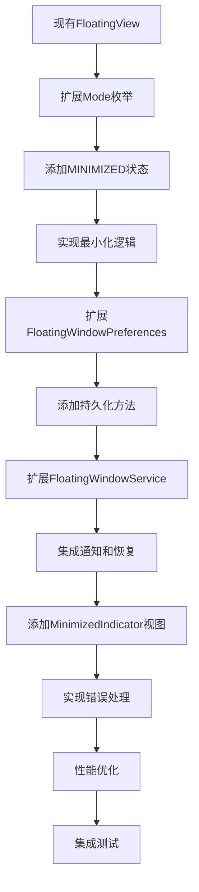

# 设计文档 - 悬浮窗最小化功能（优化版）

## 概述

本文档描述了悬浮窗最小化功能的优化设计方案，基于现有架构扩展而非重新设计，确保与项目现有代码的一致性和兼容性。

### 核心目标

1. **最小化改动**：在现有 `FloatingView` 基础上扩展，避免重复实现
2. **保持一致性**：与现有代码风格和架构模式保持一致
3. **渐进式开发**：分阶段实现，确保每个阶段都可独立验证
4. **向后兼容**：确保新功能不影响现有功能

## 架构设计

### 整体架构



### 设计原则

1. **基于现有架构扩展**：
   - 扩展现有 `FloatingView.Mode` 枚举，添加 `MINIMIZED` 状态
   - 将最小化指示器作为 `FloatingView` 的一部分，而非独立组件
   - 扩展现有 `FloatingWindowPreferences`，避免重复实现持久化

2. **单一数据源**：
   - 保持现有的状态管理方式，避免双重状态管理
   - 使用枚举而非 sealed class 表示简单状态

3. **组件复用**：
   - 复用现有的拖动、位置保存等功能
   - 最小化指示器复用现有的动画和触摸处理逻辑

## 组件设计

### 1. FloatingView 扩展

#### Mode 枚举扩展

```kotlin
// 现有枚举扩展
private enum class Mode {
    BUTTON,  // 悬浮按钮模式
    MENU,    // 菜单展开模式
    INPUT,   // 输入对话框模式
    MINIMIZED // 新增：最小化模式
}
```

#### 最小化指示器视图

```kotlin
// 在 FloatingView 中添加最小化指示器
private var minimizedIndicator: View? = null

private fun createMinimizedIndicator(): View {
    return ComposeView(context).apply {
        setContent {
            // 使用现有的状态管理逻辑
            val state = currentMode == Mode.MINIMIZED
            MinimizedIndicatorContent(
                state = minimizedState,
                onClick = { restoreFromMinimized() },
                onPositionChanged = { x, y -> saveIndicatorPosition(x, y) }
            )
        }
    }
}
```

### 2. FloatingWindowPreferences 扩展

#### 新增方法

```kotlin
// 扩展现有 Preferences 类
class FloatingWindowPreferences @Inject constructor(
    private val context: Context
) {
    // 现有方法保持不变...
    
    // 新增：最小化相关方法
    fun saveRequestInfo(requestInfo: MinimizedRequestInfo) {
        val json = moshi.adapter(MinimizedRequestInfo::class.java).toJson(requestInfo)
        sharedPreferences.edit()
            .putString(KEY_MINIMIZED_REQUEST, json)
            .apply()
    }
    
    fun getRequestInfo(): MinimizedRequestInfo? {
        val json = sharedPreferences.getString(KEY_MINIMIZED_REQUEST, null) ?: return null
        return moshi.adapter(MinimizedRequestInfo::class.java).fromJson(json)
    }
    
    fun clearRequestInfo() {
        sharedPreferences.edit()
            .remove(KEY_MINIMIZED_REQUEST)
            .apply()
    }
    
    // 现有位置保存方法可复用
    fun saveIndicatorPosition(x: Int, y: Int) {
        saveButtonPosition(x, y) // 复用现有方法
    }
    
    fun getIndicatorPosition(): Pair<Int, Int> {
        return getButtonPosition() // 复用现有方法
    }
    
    companion object {
        private const val KEY_MINIMIZED_REQUEST = "minimized_request_info"
        // 其他现有常量...
    }
}
```

### 3. FloatingWindowService 扩展

#### 最小化相关方法

```kotlin
@AndroidEntryPoint
class FloatingWindowService : Service() {
    // 现有注入保持不变...
    
    // 新增：最小化相关方法
    private fun minimizeDialog() {
        try {
            // 1. 保存当前请求信息
            val requestInfo = floatingView?.getCurrentRequestInfo()
            requestInfo?.let { floatingWindowPreferences.saveRequestInfo(it) }
            
            // 2. 获取当前位置
            val currentPos = getCurrentPosition()
            
            // 3. 切换到最小化模式
            floatingView?.switchToMinimized(currentPos.first, currentPos.second)
            
            // 4. 隐藏输入对话框，显示最小化指示器
            floatingView?.hideInputDialog()
            floatingView?.showMinimizedIndicator()
            
        } catch (e: Exception) {
            ErrorHandler.handleError(this, MinimizeError.MinimizeFailed(e.message ?: "未知错误"))
        }
    }
    
    private fun restoreFromMinimized() {
        try {
            // 1. 获取保存的请求信息
            val requestInfo = floatingWindowPreferences.getRequestInfo()
            
            // 2. 恢复输入对话框
            floatingView?.restoreFromMinimized(requestInfo)
            
            // 3. 隐藏最小化指示器
            floatingView?.hideMinimizedIndicator()
            
            // 4. 清除保存的请求信息
            floatingWindowPreferences.clearRequestInfo()
            
        } catch (e: Exception) {
            ErrorHandler.handleError(this, MinimizeError.RestoreFailed(e.message ?: "未知错误"))
        }
    }
    
    // 扩展现有通知方法
    private fun sendCompletionNotification(isSuccess: Boolean, result: Any?) {
        // 只在最小化状态下发送通知
        if (floatingView?.currentMode == Mode.MINIMIZED) {
            // 现有通知逻辑...
        }
    }
}
```

## 数据模型

### 简化的数据类

```kotlin
// 简化的请求信息
data class MinimizedRequestInfo(
    val id: String = UUID.randomUUID().toString(),
    val type: ActionType,
    val timestamp: Long = System.currentTimeMillis()
)

// 使用枚举表示状态
enum class MinimizedState {
    LOADING,   // 加载中
    SUCCESS,   // 成功
    ERROR      // 错误
}
```

## 实现细节

### 1. 状态管理

使用现有的 `FloatingView.Mode` 枚举管理状态，避免双重状态管理：

```kotlin
// 状态切换逻辑
fun switchToMinimized(x: Int, y: Int) {
    currentMode = Mode.MINIMIZED
    minimizedState = MinimizedState.LOADING
    
    // 保存位置
    saveIndicatorPosition(x, y)
    
    // 更新 UI
    updateMinimizedIndicator()
}

fun restoreFromMinimized(requestInfo: MinimizedRequestInfo?) {
    currentMode = Mode.INPUT
    requestInfo?.let { 
        // 恢复输入内容
        restoreInputContent(it)
    }
}
```

### 2. 最小化指示器

基于现有 `FloatingView` 的动画和触摸处理逻辑：

```kotlin
@Composable
fun MinimizedIndicatorContent(
    state: MinimizedState,
    onClick: () -> Unit,
    onPositionChanged: (Int, Int) -> Unit
) {
    // 复用现有的动画逻辑
    val scale by animateFloatAsState(
        targetValue = if (state == MinimizedState.LOADING) 1f else 1.1f,
        animationSpec = tween(300ms)
    )
    
    val backgroundColor by animateColorAsState(
        targetValue = state.color,
        animationSpec = tween(200ms)
    )
    
    Box(
        modifier = Modifier
            .size(56.dp)
            .scale(scale)
            .background(backgroundColor, CircleShape)
            .pointerInput(Unit) {
                detectDragGestures { change, dragAmount ->
                    onPositionChanged(
                        currentX + dragAmount.x.toInt(),
                        currentY + dragAmount.y.toInt()
                    )
                }
            }
            .clickable { onClick() },
        contentAlignment = Alignment.Center
    ) {
        // 状态图标
        when (state) {
            MinimizedState.LOADING -> CircularProgressIndicator()
            MinimizedState.SUCCESS -> Icon(Icons.Default.Check, contentDescription = "完成")
            MinimizedState.ERROR -> Icon(Icons.Default.Error, contentDescription = "错误")
        }
    }
}
```

### 3. 通知集成

扩展现有通知系统，只在最小化状态下发送：

```kotlin
private fun sendCompletionNotification(isSuccess: Boolean, result: Any?) {
    // 检查是否处于最小化状态
    if (floatingView?.currentMode == Mode.MINIMIZED) {
        val title = if (isSuccess) "处理完成" else "处理失败"
        val content = "点击查看结果"
        
        // 复用现有通知创建逻辑
        val notification = createNotification(title, content)
        notificationManager.notify(NOTIFICATION_ID_COMPLETION, notification)
    }
}
```

## 错误处理

### 简化的错误类型

```kotlin
sealed class MinimizeError(message: String) : Exception(message) {
    class MinimizeFailed(reason: String) : MinimizeError("最小化失败: $reason")
    class RestoreFailed(reason: String) : MinimizeError("恢复失败: $reason")
    class NotificationFailed(reason: String) : MinimizeError("通知失败: $reason")
}
```

### 错误处理策略

1. **最小化失败**：
   - 保持对话框打开状态
   - 显示错误提示
   - 记录错误日志

2. **恢复失败**：
   - 保持最小化指示器显示
   - 显示错误提示
   - 提供重试选项

3. **通知失败**：
   - 不影响最小化功能
   - 记录错误日志
   - 提供手动检查选项

## 性能优化

### 基于现有优化

1. **动画性能**：
   - 复用现有的硬件加速设置
   - 保持 60 FPS 的流畅度
   - 使用现有的动画时长（300ms）

2. **内存优化**：
   - 最小化时释放输入对话框资源
   - 复用现有的性能监控机制
   - 使用轻量级的最小化指示器

3. **电池优化**：
   - 最小化状态下降低更新频率
   - 复用现有的后台任务优化
   - 智能管理通知发送

## 测试策略

### 单元测试

1. **FloatingView 扩展测试**：
   - 测试模式切换逻辑
   - 测试位置保存和恢复
   - 测试最小化指示器显示

2. **FloatingWindowPreferences 测试**：
   - 测试请求信息持久化
   - 测试位置保存功能
   - 测试数据序列化

3. **FloatingWindowService 测试**：
   - 测试最小化/恢复流程
   - 测试通知发送逻辑
   - 测试错误处理

### 集成测试

1. **完整流程测试**：
   - 测试从输入对话框到最小化的完整流程
   - 测试从最小化恢复到输入对话框的流程
   - 测试通知点击恢复功能

2. **边界情况测试**：
   - 测试内存不足情况
   - 测试网络断开情况
   - 测试并发请求处理

## 版本兼容性

### Android 版本支持

基于现有的版本兼容性处理：

```kotlin
// 复用现有的版本检查逻辑
private fun createMinimizedLayoutParams(): WindowManager.LayoutParams {
    return if (Build.VERSION.SDK_INT >= Build.VERSION_CODES.O) {
        WindowManager.LayoutParams(
            WindowManager.LayoutParams.WRAP_CONTENT,
            WindowManager.LayoutParams.WRAP_CONTENT,
            WindowManager.LayoutParams.TYPE_APPLICATION_OVERLAY,
            WindowManager.LayoutParams.FLAG_NOT_FOCUSABLE,
            PixelFormat.TRANSLUCENT
        )
    } else {
        // 复用现有降级逻辑
        @Suppress("DEPRECATION")
        WindowManager.LayoutParams(
            WindowManager.LayoutParams.WRAP_CONTENT,
            WindowManager.LayoutParams.WRAP_CONTENT,
            WindowManager.LayoutParams.TYPE_PHONE,
            WindowManager.LayoutParams.FLAG_NOT_FOCUSABLE,
            PixelFormat.TRANSPARENT
        )
    }
}
```

## 迁移指南

### 从现有架构的迁移步骤

1. **阶段一：基础扩展**
   - 扩展 `FloatingView.Mode` 枚举
   - 添加最小化指示器视图
   - 实现基本的状态切换

2. **阶段二：功能集成**
   - 集成 `FloatingWindowPreferences` 持久化
   - 扩展 `FloatingWindowService` 业务逻辑
   - 实现通知功能

3. **阶段三：优化和完善**
   - 添加错误处理
   - 性能优化
   - 全面测试

### 向后兼容策略

1. **功能开关**：
   ```kotlin
   // 在 SharedPreferences 中添加开关
   private val KEY_MINIMIZE_ENABLED = "minimize_enabled"
   
   fun isMinimizeEnabled(): Boolean {
       return sharedPreferences.getBoolean(KEY_MINIMIZE_ENABLED, true)
   }
   ```

2. **降级方案**：
   ```kotlin
   // 如果最小化功能出错，可快速禁用
   fun disableMinimize() {
       sharedPreferences.edit()
           .putBoolean(KEY_MINIMIZE_ENABLED, false)
           .apply()
   }
   ```

## 总结

本优化方案通过基于现有架构扩展的方式实现悬浮窗最小化功能，具有以下优势：

1. **最小化改动**：复用现有代码，减少开发工作量
2. **降低风险**：保持架构一致性，减少引入 bug 的可能性
3. **向后兼容**：确保新功能不影响现有功能
4. **易于维护**：统一的状态管理和错误处理

通过这种设计，我们可以在保持现有功能稳定的基础上，高效地实现最小化功能。