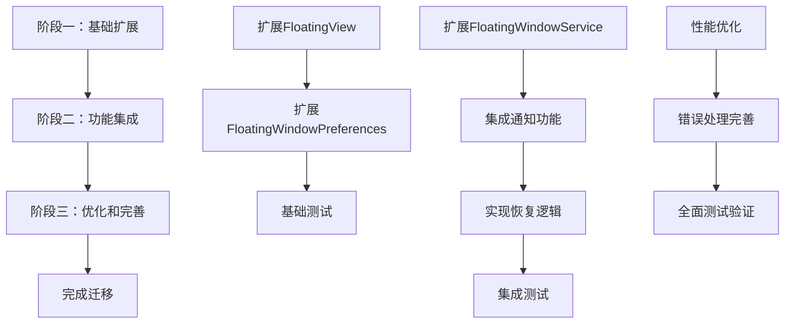

# 架构迁移指南 - 悬浮窗最小化功能

## 概述

本指南详细说明如何从现有架构平滑迁移到优化方案，确保最小化功能的实现与现有代码保持一致性和兼容性。

## 迁移策略

### 渐进式迁移

采用渐进式迁移策略，分三个阶段实施，确保每个阶段都可以独立验证和回滚：



## 阶段一：基础架构扩展

### 1.1 扩展 FloatingView.Mode

**目标**：添加最小化状态，保持现有枚举结构

**步骤**：
1. 在现有枚举中添加 `MINIMIZED` 状态
2. 更新所有使用 `Mode` 的地方，添加新状态的处理

**代码示例**：
```kotlin
// 原有枚举
private enum class Mode {
    BUTTON,  // 悬浮按钮模式
    MENU,    // 菜单展开模式
    INPUT    // 输入对话框模式
    // 新增：最小化模式
    MINIMIZED
}
```

**验证方法**：
- 确保所有现有功能不受影响
- 运行现有测试套件
- 检查 UI 渲染正常

### 1.2 扩展 FloatingWindowPreferences

**目标**：添加最小化相关的持久化方法

**步骤**：
1. 添加请求信息保存/读取方法
2. 添加指示器位置保存/读取方法
3. 使用现有的 Moshi 序列化

**代码示例**：
```kotlin
// 新增方法
fun saveRequestInfo(requestInfo: MinimizedRequestInfo) {
    val json = moshi.adapter(MinimizedRequestInfo::class.java).toJson(requestInfo)
    sharedPreferences.edit()
        .putString(KEY_MINIMIZED_REQUEST, json)
        .apply()
}

fun getRequestInfo(): MinimizedRequestInfo? {
    val json = sharedPreferences.getString(KEY_MINIMIZED_REQUEST, null) ?: return null
    return moshi.adapter(MinimizedRequestInfo::class.java).fromJson(json)
}
```

**验证方法**：
- 编写单元测试验证新方法
- 确保与现有方法不冲突
- 测试数据序列化/反序列化

### 1.3 基础测试

**目标**：确保基础扩展不影响现有功能

**测试项目**：
1. 模式切换测试
2. 位置保存测试
3. 基本交互测试

## 阶段二：功能集成

### 2.1 扩展 FloatingWindowService

**目标**：添加最小化相关业务逻辑

**步骤**：
1. 添加 `minimizeDialog()` 方法
2. 添加 `restoreFromMinimized()` 方法
3. 集成通知发送逻辑

**代码示例**：
```kotlin
private fun minimizeDialog() {
    try {
        // 保存当前请求信息
        val requestInfo = floatingView?.getCurrentRequestInfo()
        requestInfo?.let { floatingWindowPreferences.saveRequestInfo(it) }
        
        // 切换到最小化模式
        floatingView?.switchToMinimized(currentPos.first, currentPos.second)
        
        // 隐藏输入对话框，显示最小化指示器
        floatingView?.hideInputDialog()
        floatingView?.showMinimizedIndicator()
        
    } catch (e: Exception) {
        ErrorHandler.handleError(this, MinimizeError.MinimizeFailed(e.message ?: "未知错误"))
    }
}
```

**验证方法**：
- 测试最小化流程
- 验证状态切换正确
- 检查错误处理

### 2.2 集成通知功能

**目标**：复用现有通知系统

**步骤**：
1. 扩展现有通知创建逻辑
2. 添加最小化状态检查
3. 集成通知点击处理

**验证方法**：
- 测试通知发送
- 验证通知点击恢复

### 2.3 实现恢复逻辑

**目标**：实现从最小化状态恢复

**步骤**：
1. 恢复输入对话框内容
2. 切换回输入模式
3. 隐藏最小化指示器

**验证方法**：
- 测试恢复流程
- 验证数据恢复正确

### 2.4 集成测试

**目标**：验证集成功能正常

**测试项目**：
1. 完整最小化-恢复流程测试
2. 通知功能测试
3. 错误场景测试

## 阶段三：优化和完善

### 3.1 性能优化

**目标**：基于现有性能监控机制优化

**步骤**：
1. 复用现有性能监控
2. 优化最小化指示器渲染
3. 优化内存使用

**验证方法**：
- 性能指标测试
- 内存使用测试
- 动画流畅度测试

### 3.2 错误处理完善

**目标**：基于现有错误处理机制

**步骤**：
1. 复用现有 ErrorHandler
2. 添加最小化相关错误类型
3. 完善降级处理

**验证方法**：
- 错误场景测试
- 降级功能测试
- 恢复机制测试

### 3.3 全面测试验证

**目标**：确保所有功能正常

**测试项目**：
1. 边界情况测试
2. 长期稳定性测试
3. 兼容性测试
4. 性能压力测试

## 回滚策略

### 功能开关

使用 SharedPreferences 实现功能开关，可随时禁用新功能：

```kotlin
class MinimizeFeatureFlag @Inject constructor(
    private val context: Context
) {
    private val prefs = context.getSharedPreferences("minimize_flags", Context.MODE_PRIVATE)
    
    fun isEnabled(): Boolean {
        return prefs.getBoolean("minimize_enabled", true)
    }
    
    fun setEnabled(enabled: Boolean) {
        prefs.edit().putBoolean("minimize_enabled", enabled).apply()
    }
}
```

### 降级方案

如果最小化功能出现问题，可快速回退：

1. 禁用功能开关
2. 回退到原有实现
3. 清理相关数据

### 数据迁移

为现有数据提供迁移路径：

```kotlin
// 迁移现有位置数据到新的指示器位置
fun migrateButtonPositionToIndicatorPosition() {
    val buttonPos = floatingWindowPreferences.getButtonPosition()
    floatingWindowPreferences.saveIndicatorPosition(buttonPos.first, buttonPos.second)
}
```

## 验证清单

### 每个阶段的验证标准

1. **功能完整性**：新功能不影响现有功能
2. **性能指标**：满足设计要求的性能指标
3. **稳定性**：在各种场景下稳定运行
4. **兼容性**：支持所有目标 Android 版本
5. **错误处理**：所有错误都有适当的处理

## 风险控制

### 已知风险

1. **状态同步**：新旧状态管理可能出现不一致
2. **性能影响**：新功能可能影响现有性能
3. **兼容性问题**：新功能可能影响旧版本

### 风险缓解措施

1. **分阶段验证**：每个阶段独立测试
2. **功能开关**：可随时禁用新功能
3. **监控机制**：实时监控性能和错误
4. **快速回滚**：问题可快速回退

## 时间计划

### 预估时间

- **阶段一**：2-3 天
- **阶段二**：3-4 天
- **阶段三**：2-3 天

### 里程碑

1. **MVP 版本**：基础最小化功能
2. **完整版本**：包含通知和错误处理
3. **优化版本**：性能优化和全面测试

## 总结

通过渐进式迁移策略，我们可以在保持现有功能稳定的基础上，安全地实现最小化功能。关键是要确保每个阶段都可以独立验证和回滚，降低整体风险。