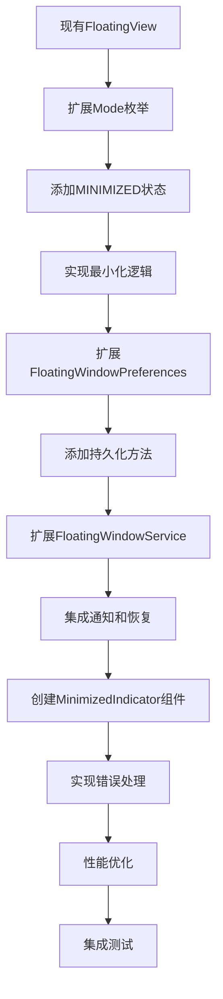

# 实现计划 - 悬浮窗最小化功能（优化版）

## 设计原则

基于现有架构扩展，遵循以下原则：
1. **最小化改动**：在现有 `FloatingView` 基础上扩展，避免重复实现
2. **保持一致性**：与现有代码风格和架构模式保持一致
3. **渐进式开发**：分阶段实现，确保每个阶段都可独立验证
4. **向后兼容**：确保新功能不影响现有功能

## 任务清单

### 阶段一：基础架构扩展

- [ ] 1. 扩展现有 FloatingView 类
  - [ ] 1.1 扩展 Mode 枚举，添加 MINIMIZED 状态
  - [ ] 1.2 在 FloatingView 中添加最小化指示器视图
  - [ ] 1.3 实现最小化/恢复状态切换逻辑
  - _需求: 1.1, 1.4, 1.5_

- [ ] 2. 扩展 FloatingWindowPreferences
  - [ ] 2.1 添加请求信息持久化方法
  - [ ] 2.2 添加指示器位置保存方法
  - [ ] 2.3 使用 Moshi 序列化请求数据
  - _需求: 9.1, 9.2, 5.3_

- [ ] 2.4 编写 FloatingWindowPreferences 单元测试
  - [ ] 测试保存和读取请求信息
  - [ ] 测试保存和读取指示器位置
  - _需求: 9.1, 9.2_

### 阶段二：服务层集成

- [ ] 3. 扩展 FloatingWindowService
  - [ ] 3.1 添加最小化相关方法
  - [ ] 3.2 集成通知功能
  - [ ] 3.3 实现应用重启恢复
  - _需求: 1.1, 1.5, 2.1, 3.1, 3.3, 3.4, 3.5_

- [ ] 3.1 编写 FloatingWindowService 单元测试
  - [ ] 测试最小化功能
  - [ ] 测试通知发送
  - [ ] 测试恢复功能
  - _需求: 1.1, 1.4, 3.1_

### 阶段三：UI 组件优化

- [ ] 4. 创建 MinimizedIndicator Composable
  - [ ] 4.1 实现状态显示（加载/成功/错误）
  - [ ] 4.2 添加动画效果
  - [ ] 4.3 实现拖动和点击处理
  - _需求: 1.2, 1.3, 4.1, 4.2, 4.3, 4.4, 4.5_

- [ ] 4.1 编写 MinimizedIndicator Compose UI 测试
  - [ ] 测试状态显示
  - [ ] 测试点击事件
  - [ ] 测试拖动功能
  - _需求: 4.1, 4.2, 4.3_

### 阶段四：错误处理和优化

- [ ] 5. 实现错误处理机制
  - [ ] 5.1 处理最小化失败
  - [ ] 5.2 处理恢复失败
  - [ ] 5.3 处理通知发送失败
  - _需求: 7.1, 7.2, 7.3_

- [ ] 5.1 编写错误处理单元测试
  - [ ] 测试最小化失败处理
  - [ ] 测试恢复失败处理
  - [ ] 测试超时错误处理
  - _需求: 7.1, 7.2, 7.4, 7.5_

### 阶段五：性能和兼容性

- [ ] 6. 性能优化
  - [ ] 6.1 优化动画性能（60 FPS）
  - [ ] 6.2 优化内存使用
  - [ ] 6.3 添加性能监控
  - _需求: 6.1, 6.3, 6.4, 6.5_

- [ ] 7. 版本兼容性处理
  - [ ] 7.1 Android 8.0+ 通知渠道
  - [ ] 7.2 Android 9.0+ 前台服务权限
  - [ ] 7.3 Android 13+ 通知权限
  - _需求: 3.1_

### 阶段六：集成测试和验证

- [ ] 8. 集成测试
  - [ ] 8.1 测试完整最小化-恢复流程
  - [ ] 8.2 测试通知功能
  - [ ] 8.3 测试拖动位置保存
  - [ ] 8.4 测试应用重启恢复
  - _需求: 所有需求_

- [ ] 9. 最终检查点
  - [ ] 9.1 确保所有测试通过
  - [ ] 9.2 验证所有需求已实现
  - [ ] 9.3 检查代码质量和文档
  - _需求: 所有需求_

## 实现优先级

### P0 - 核心功能
- 阶段一：基础架构扩展
- 阶段二：服务层集成
- 阶段三：UI 组件优化

### P1 - 重要功能
- 阶段四：错误处理和优化
- 阶段五：性能和兼容性

### P2 - 辅助功能
- 阶段六：集成测试和验证
- 阶段七：最终检查点

## 架构设计

## 关键决策点

1. **状态管理**：使用现有 `FloatingView.Mode` 枚举扩展，避免双重状态管理
2. **组件设计**：将最小化指示器作为 `FloatingView` 的一部分，而非独立组件
3. **持久化**：扩展现有 `FloatingWindowPreferences`，避免重复实现
4. **测试策略**：优先测试核心功能，确保基本可用性

## 风险控制

1. **功能开关**：通过 SharedPreferences 添加功能开关，可随时禁用新功能
2. **降级方案**：如果最小化功能出现问题，可快速回退到原有实现
3. **分阶段发布**：每个阶段独立验证，降低整体风险