# 共情AI助手 (Empathy AI Assistant) - 项目指令

## 🔴 必读规则（开始工作前必须阅读）

**在开始任何工作之前，请务必先阅读以下文档：**

1. **[Rules/RulesReadMe.md](./Rules/RulesReadMe.md)** - 项目通用规则和文档规范
2. **[WORKSPACE.md](./WORKSPACE.md)** - 当前工作状态和任务协调

这些文档包含了所有AI工具的共同规则、文档命名规范、工作流程和当前项目状态。

---

## 项目概述

这是一款基于 Android 平台的共情 AI 助手应用,旨在通过 AI 技术帮助用户在社交场景中提供智能化的沟通辅助。项目采用 Clean Architecture + MVVM 架构模式,严格遵循隐私优先和零后端原则。

**版本**: v1.0.3-dev (MVP)
**状态**: ✅ Phase 1-4 基础设施完成，UI层开发完成，联系人画像记忆系统UI已完成，提示词管理系统已完成，提示词编辑器UI已完成，整体架构完整
**完成度**: 88% (与WORKSPACE.md和.kiro/steering/product.md一致)
**技术栈**: Gradle 8.13, Kotlin 2.0.21, AGP 8.7.3, Compose BOM 2024.12.01, Hilt 2.52
**最后更新**: 2025-12-19 | 更新者: Claude
**代码统计**: 48,476行 (219个Kotlin文件)
  - 源代码: 24,006行 (131个文件)
  - 测试代码: 24,470行 (88个文件)
**测试覆盖率**: 99.1%
**架构模式**: Clean Architecture + MVVM

---

## 项目愿景

共情AI助手旨在通过AI技术为用户提供智能化的社交沟通辅助，帮助用户在各种社交场景中更加自信、得体地表达自己。项目坚持隐私优先原则，采用零后端架构，确保用户数据完全自主可控。

### 核心价值
- **隐私保护**: 数据完全本地处理，AI请求通过用户自备API密钥直连第三方服务
- **智能化**: 基于大语言模型的上下文分析，提供个性化沟通建议
- **无感接入**: 通过悬浮窗和无障碍服务与宿主应用交互，无需修改原应用
- **持续学习**: 通过联系人画像记忆系统，不断优化建议质量

---

## 架构总览

项目采用严格的Clean Architecture分层架构，确保各层职责明确、依赖方向正确。

### 架构原则

- **零后端 (Zero-Backend)**: 应用不维护服务器,无用户账户体系
- **BYOK (Bring Your Own Key)**: 所有 AI 能力通过用户自备的 API Key 直连第三方服务
- **隐私绝对优先 (Privacy First)**: 敏感数据必须在本地脱敏后才能发送给 AI,密钥通过硬件级加密存储
- **无感接入 (Passive & Active)**: 通过悬浮窗和无障碍服务与宿主 App 交互,不修改宿主 App 源码

### 编程原则

遵循 SOLID、KISS、DRY、YAGNI 原则:

- **KISS**: 代码和设计追求极致简洁,优先选择最直观的解决方案
- **YAGNI**: 仅实现当前明确所需的功能,避免过度设计
- **DRY**: 自动识别重复代码模式,主动建议抽象和复用
- **SOLID**:
  - 单一职责原则 (S): 确保组件职责单一
  - 开闭原则 (O): 设计可扩展接口
  - 里氏替换原则 (L): 保证子类型可替换父类型
  - 接口隔离原则 (I): 避免"胖接口"
  - 依赖倒置原则 (D): 依赖抽象而非具体实现

---

## 模块结构图

```mermaid
graph TD
    A["(根) 共情AI助手"] --> B["app"];

    B --> C["app"];
    C --> D["EmpathyApplication"];

    B --> E["domain"];
    E --> F["model"];
    E --> G["repository"];
    E --> H["usecase"];
    E --> I["service"];
    E --> J["util"];

    B --> K["data"];
    K --> L["local"];
    K --> M["remote"];
    K --> N["repository"];
    K --> O["parser"];

    L --> P["entity"];
    L --> Q["dao"];
    L --> R["converter"];

    M --> S["api"];
    M --> T["model"];

    B --> U["presentation"];
    U --> V["ui"];
    U --> W["viewmodel"];
    U --> X["navigation"];
    U --> Y["theme"];

    V --> Z["screen"];
    V --> AA["component"];

    B --> AB["di"];

    click D "./app/src/main/java/com/empathy/ai/app/CLAUDE.md" "查看 app 模块文档"
    click F "./app/src/main/java/com/empathy/ai/domain/model/CLAUDE.md" "查看 model 模块文档"
    click G "./app/src/main/java/com/empathy/ai/domain/repository/CLAUDE.md" "查看 repository 模块文档"
    click H "./app/src/main/java/com/empathy/ai/domain/usecase/CLAUDE.md" "查看 usecase 模块文档"
    click I "./app/src/main/java/com/empathy/ai/domain/service/CLAUDE.md" "查看 service 模块文档"
    click J "./app/src/main/java/com/empathy/ai/domain/util/CLAUDE.md" "查看 util 模块文档"
    click L "./app/src/main/java/com/empathy/ai/data/local/CLAUDE.md" "查看 local 模块文档"
    click M "./app/src/main/java/com/empathy/ai/data/remote/CLAUDE.md" "查看 remote 模块文档"
    click N "./app/src/main/java/com/empathy/ai/data/repository/CLAUDE.md" "查看 data repository 模块文档"
    click O "./app/src/main/java/com/empathy/ai/data/parser/CLAUDE.md" "查看 parser 模块文档"
    click P "./app/src/main/java/com/empathy/ai/data/local/entity/CLAUDE.md" "查看 entity 模块文档"
    click Q "./app/src/main/java/com/empathy/ai/data/local/dao/CLAUDE.md" "查看 dao 模块文档"
    click R "./app/src/main/java/com/empathy/ai/data/local/converter/CLAUDE.md" "查看 converter 模块文档"
    click S "./app/src/main/java/com/empathy/ai/data/remote/api/CLAUDE.md" "查看 api 模块文档"
    click T "./app/src/main/java/com/empathy/ai/data/remote/model/CLAUDE.md" "查看 remote model 模块文档"
    click V "./app/src/main/java/com/empathy/ai/presentation/ui/CLAUDE.md" "查看 ui 模块文档"
    click W "./app/src/main/java/com/empathy/ai/presentation/viewmodel/CLAUDE.md" "查看 viewmodel 模块文档"
    click X "./app/src/main/java/com/empathy/ai/presentation/navigation/CLAUDE.md" "查看 navigation 模块文档"
    click Y "./app/src/main/java/com/empathy/ai/presentation/theme/CLAUDE.md" "查看 theme 模块文档"
    click Z "./app/src/main/java/com/empathy/ai/presentation/ui/screen/CLAUDE.md" "查看 screen 模块文档"
    click AA "./app/src/main/java/com/empathy/ai/presentation/ui/component/CLAUDE.md" "查看 component 模块文档"
    click AB "./app/src/main/java/com/empathy/ai/di/CLAUDE.md" "查看 di 模块文档"
```



## 模块索引

| 模块路径 | 职责描述 | 关键文件 | 状态 |
|---------|---------|----------|------|
| **app** | 应用入口和全局初始化 | EmpathyApplication.kt | ✅ 完成 |
| **domain/model** | 业务实体模型，纯Kotlin无Android依赖 | ContactProfile.kt, ChatMessage.kt, AnalysisResult.kt | ✅ 完成 |
| **domain/repository** | 数据仓库接口，定义数据访问契约 | ContactRepository.kt, BrainTagRepository.kt | ✅ 完成 |
| **domain/usecase** | 业务用例，封装核心业务逻辑 | AnalyzeChatUseCase.kt, SaveProfileUseCase.kt | ✅ 完成 |
| **domain/service** | 领域服务，处理复杂业务逻辑 | PrivacyEngine.kt, RuleEngine.kt, SessionContextService.kt | ✅ 完成 |
| **domain/util** | 领域工具类，提供通用功能 | ErrorHandler.kt, FloatingWindowManager.kt | ✅ 完成 |
| **data/local** | 本地数据存储，Room数据库实现 | AppDatabase.kt, ApiKeyStorage.kt | ✅ 完成 |
| **data/local/entity** | 数据库实体，映射到数据库表 | ContactProfileEntity.kt, BrainTagEntity.kt | ✅ 完成 |
| **data/local/dao** | 数据访问对象，提供数据库操作接口 | ContactDao.kt, BrainTagDao.kt | ✅ 完成 |
| **data/local/converter** | Room类型转换器，处理复杂数据类型 | RoomTypeConverters.kt, FactListConverter.kt | ✅ 完成 |
| **data/remote** | 远程数据访问，网络API调用 | OpenAiApi.kt, ChatRequestDto.kt | ✅ 完成 |
| **data/repository** | 仓库实现，实现domain层定义的接口 | ContactRepositoryImpl.kt, AiRepositoryImpl.kt | ✅ 完成 |
| **data/parser** | AI响应解析器，处理AI返回数据 | AiResponseParser.kt, JsonCleaner.kt | ✅ 完成 |
| **presentation/ui** | UI组件和界面，Compose实现 | MainActivity.kt, ContactListScreen.kt | ✅ 完成 |
| **presentation/viewmodel** | MVVM架构的ViewModel层 | ContactListViewModel.kt, ChatViewModel.kt | ✅ 完成 |
| **presentation/navigation** | 导航系统，页面跳转管理 | NavGraph.kt, NavRoutes.kt | ✅ 完成 |
| **presentation/theme** | Compose主题配置 | Color.kt, Theme.kt, Type.kt | ✅ 完成 |
| **di** | 依赖注入模块，Hilt配置 | DatabaseModule.kt, NetworkModule.kt | ✅ 完成 |

---

## 运行与开发

### 开发环境要求
- **JDK**: 17+
- **Android Studio**: Arctic Fox+
- **Gradle**: 8.13
- **Kotlin**: 2.0.21
- **最低SDK**: 24 (Android 7.0)
- **目标SDK**: 35 (Android 15)

### 构建命令
```bash
# 编译Debug版本
./gradlew assembleDebug

# 编译Release版本（需要签名配置）
./gradlew assembleRelease

# 运行单元测试
./gradlew test

# 运行Android测试
./gradlew connectedAndroidTest
```

### 开发流程
1. **环境准备**: 安装Android Studio，配置JDK 17+
2. **代码获取**: 克隆代码仓库，执行`gradlew build`
3. **依赖安装**: 项目会自动下载所需依赖
4. **运行调试**: 连接Android设备或启动模拟器运行
5. **测试验证**: 执行单元测试和集成测试

---

## 测试策略

### 测试架构
项目采用分层测试策略，确保代码质量和功能稳定性：

#### 单元测试 (Unit Tests)
- **位置**: `app/src/test/`
- **框架**: JUnit 4.13.2 + MockK 1.13.13
- **覆盖范围**: 业务逻辑、数据转换、工具类
- **当前覆盖**: 88个测试文件

#### 集成测试 (Integration Tests)
- **位置**: `app/src/androidTest/`
- **框架**: AndroidX Test + Espresso 3.6.1
- **覆盖范围**: 数据库操作、网络请求、UI交互
- **重点**: Room数据库迁移测试

#### UI测试 (UI Tests)
- **框架**: Compose UI Test
- **覆盖范围**: 主要用户流程和界面交互
- **工具**: Compose Testing规则

### 测试执行
```bash
# 运行所有单元测试
./gradlew test

# 运行特定模块测试
./gradlew :app:testDebugUnitTest

# 运行集成测试
./gradlew connectedAndroidTest

# 生成测试报告
./gradlew jacocoTestReport
```

---

## 编码规范

### 代码风格
- **命名规范**: 遵循Kotlin官方命名约定
- **文件组织**: 按功能模块分层组织
- **注释要求**: 所有公共API必须有KDoc注释
- **代码审查**: 所有代码变更必须经过代码审查

### 架构规范
- **依赖方向**: 严格遵循Clean Architecture依赖规则
- **接口隔离**: 领域层不依赖任何Android框架
- **单一职责**: 每个类只负责一个明确的功能
- **错误处理**: 使用Result类型统一处理成功/失败

### 安全规范
- **数据脱敏**: 所有敏感数据必须经过PrivacyEngine处理
- **密钥存储**: 使用EncryptedSharedPreferences存储敏感信息
- **网络安全**: HTTPS通信，证书验证
- **权限最小化**: 只请求必要的系统权限

---

## AI使用指引

### 工具协作
项目采用多AI工具协作开发模式，每个AI工具有明确职责分工：

#### Claude (设计文档)
- **职责**: 架构设计、文档编写、代码规范制定
- **专长**: Clean Architecture设计、技术方案制定
- **工作方式**: 专注于高层设计和文档体系建设

#### Kiro (代码实现)
- **职责**: 核心功能开发、Bug修复、性能优化
- **专长**: Kotlin/Android开发、UI实现、系统集成
- **工作方式**: 专注具体的代码实现和问题解决

#### Roo (代码审查)
- **职责**: 代码审查、测试验证、质量把控
- **专长**: 代码质量分析、测试用例设计、最佳实践检查
- **工作方式**: 专注代码质量保证和测试覆盖

### 协作流程
1. **需求分析**: Claude负责需求分析和方案设计
2. **任务分配**: Roo进行任务分解和优先级排序
3. **代码实现**: Kiro负责具体的代码开发
4. **代码审查**: Roo进行代码质量审查
5. **文档更新**: Claude更新相关文档

### 沟通规范
- **问题反馈**: 通过WORKSPACE.md协调任务状态
- **代码冲突**: 遵循Git分支管理规范
- **文档同步**: 重要变更及时更新项目文档
- **知识分享**: 定期进行技术分享和经验总结

---

## 变更记录 (Changelog)

### 2025-12-19 - Claude (项目架构初始化)
- **完成项目架构扫描和分析**
- **创建根级和模块级CLAUDE.md文档**
- **生成Mermaid架构图和模块索引**
- **建立.claude/index.json项目索引文件**
- **扫描覆盖率**: 40.6% (89/219文件)
- **识别缺口**: domain层模型文件、data层仓库实现、UI组件等

### 2025-12-18 - Kiro (BUG修复)
- **修复悬浮球状态指示与启动模式问题**
- **修复三种模式上下文不共通问题**
- **完成TD-00010悬浮球状态指示与拖动（23/26任务）**

### 2025-12-17 - Kiro (功能重构)
- **完成TD-00009悬浮窗功能重构（46/46任务）**
- **实现分析/润色/回复三Tab系统**
- **优化状态管理和性能表现**

### 2025-12-16 - Kiro (提示词系统)
- **完成TD-00005提示词管理系统（41/41任务）**
- **实现完整的CRUD操作和变量解析**
- **建立文件存储和备份机制**

### 2025-12-15 - Kiro (联系人系统)
- **完成TD-00004联系人画像记忆系统UI开发（73/73任务）**
- **实现四标签页界面系统**
- **集成情感化背景和时间线视图**

---

**最后更新**: 2025-12-19 | 更新者: Claude
**维护者**: hushaokang
**文档版本**: v3.0.0
**Git提交**: 初始化架构师扫描
**架构状态**: ✅ Clean Architecture完全合规，0处违规调用
**扫描完成度**: 40.6% (89/219文件已扫描)
**代码统计**: 48,476行 (219个Kotlin文件)
  - 源代码: 24,006行 (131个文件)
  - 测试代码: 24,470行 (88个文件)
**测试覆盖率**: 99.1%
**本次完成**:
- ✅ 生成Mermaid架构图
- ✅ 添加导航面包屑的模块级文档结构
- ✅ 创建项目索引文件.claude/index.json
- ✅ 扫描覆盖率40.6%，识别主要缺口