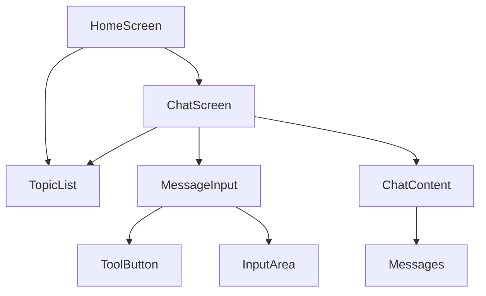
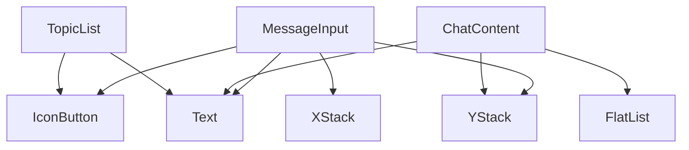

# 依赖关系图 - Cherry Studio 表现层

## 1. 依赖层级概览

```
┌─────────────────────────────────────────────────────────────┐
│                    表现层 (Presentation)                     │
│  ┌─────────────┐  ┌─────────────┐  ┌─────────────────────┐  │
│  │   Screens   │  │  Features   │  │   Base Components   │  │
│  └──────┬──────┘  └──────┬──────┘  └──────────┬──────────┘  │
├─────────┼────────────────┼─────────────────────┼─────────────┤
│         │                │                     │             │
│         ↓                ↓                     ↓             │
│  ┌─────────────────────────────────────────────────────┐    │
│  │              Custom Hooks (逻辑层)                   │    │
│  │  ┌───────────┐  ┌───────────┐  ┌────────────────┐  │    │
│  │  │useMessages│  │useTopics  │  │useAssistants   │  │    │
│  │  └─────┬─────┘  └─────┬─────┘  └───────┬────────┘  │    │
│  └────────┼───────────────┼────────────────┼──────────┘    │
│           │               │                │               │
├───────────┼───────────────┼────────────────┼───────────────┤
│           ↓               ↓                ↓               │
│  ┌─────────────────────────────────────────────────────┐    │
│  │              Data Layer (数据层)                     │    │
│  │  ┌───────────┐  ┌───────────┐  ┌────────────────┐  │    │
│  │  │    DB     │  │  Redux    │  │    MMKV        │  │    │
│  │  └───────────┘  └───────────┘  └────────────────┘  │    │
│  └─────────────────────────────────────────────────────┘    │
└─────────────────────────────────────────────────────────────┘
```

## 2. 组件间依赖关系

### 2.1 屏幕 → 功能组件



### 2.2 功能组件 → 基础组件



### 2.3 核心组件依赖详情

#### MessageInput 组件依赖图

```
MessageInput (Root)
├── Context: MessageInputContext
│   ├── useFileAttachments (Hook)
│   ├── useTextInput (Hook)
│   └── useMentions (Hook)
├── Sub Components
│   ├── DefaultLayout
│   │   ├── Main
│   │   │   ├── InputArea
│   │   │   │   ├── LiquidGlassView
│   │   │   │   └── Text
│   │   │   └── ToolButton
│   │   └── ToolButton
│   └── ToolButton
└── Base Components
    ├── View (YStack/XStack)
    ├── Text
    └── IconButton
```

#### ChatScreen 组件依赖图

```
ChatScreen
├── ChatScreenHeader
│   ├── YStack/XStack
│   ├── Text
│   └── IconButton
├── ChatContent
│   ├── Messages
│   │   ├── TextBlock
│   │   ├── ImageBlock
│   │   ├── CodeBlock
│   │   └── ...
│   └── FlatList
└── MessageInputContainer
    └── MessageInput
```

## 3. Hooks 依赖关系

### 3.1 核心 Hooks 依赖链

```
useChatScreen (顶层)
├── useMessages
│   └── useLiveQuery (drizzle-orm)
├── useTopics
│   └── useLiveQuery (drizzle-orm)
├── useMessageInput
│   ├── useFileAttachments
│   │   └── useFileUpload
│   ├── useTextInput
│   └── useMentions
└── useTheme
```

### 3.2 Hook 详细依赖

| Hook | 依赖项 | 数据源 |
|-----|-------|-------|
| `useMessages` | `drizzle-orm/expo-sqlite` | SQLite DB |
| `useMessageBlocks` | `drizzle-orm/expo-sqlite` | SQLite DB |
| `useTopics` | `drizzle-orm/expo-sqlite` | SQLite DB |
| `useAssistants` | `drizzle-orm/expo-sqlite` | SQLite DB |
| `useFileAttachments` | `expo-file-system` | 文件系统 |
| `useTheme` | `Context` | React Context |

## 4. 跨层依赖问题

### 4.1 违反依赖规则的位置

| 层级 | 文件 | 问题 |
|-----|------|------|
| Hooks → DB | `hooks/useMessages.ts:14-18` | 直接导入 drizzle-orm |
| Hooks → DB | `hooks/useTopics.ts` | 直接查询数据库 |
| Components → DB | `hooks/useMessageActions.tsx:86-90` | 组件内直接操作数据库 |

### 4.2 问题代码示例

**文件**: `src/hooks/useMessages.ts`

```typescript
// ❌ 违反依赖规则：表现层直接访问数据层
import { eq } from 'drizzle-orm'           // ← 从数据层导入
import { messages as messagesSchema } from '../db/schema/messages'
import { useLiveQuery } from 'drizzle-orm/expo-sqlite'

export const useMessages = (topicId: string) => {
  const query = db
    .select()
    .from(messagesSchema)
    .where(eq(messagesSchema.topic_id, topicId))
  const { data } = useLiveQuery(query, [topicId])
  // ...
}
```

**文件**: `src/hooks/useMessageActions.tsx:86-90`

```typescript
// ❌ 违反规则：Hook 内直接调用数据库操作
const handleDelete = async () => {
  await deleteMessageById(message.id)  // ← 直接操作数据库
  if (message.askId) {
    await deleteMessageById(message.askId)
  }
}
```

## 5. Context 依赖关系

### 5.1 Context 树

```
ThemeContext
├── isDark: boolean
└── theme: ThemeConfig
    └── 使用位置: 全局

MessageInputContext
├── files: File[]
├── text: string
├── mentions: Mention[]
├── setFiles: () => void
├── setText: () => void
└── 使用位置: MessageInput 及其子组件

ModelSheetContext
├── models: Model[]
├── selectedModel: Model
├── onSelect: () => void
└── 使用位置: ModelSheet 及其子组件

TopicListContext
├── topics: Topic[]
├── selectedTopic: Topic
├── onSelect: () => void
└── 使用位置: TopicList 及其子组件
```

### 5.2 Context 嵌套关系

```
App
├── ThemeContext (全局)
│   └── HomeScreen
│       ├── ChatScreen
│       │   ├── MessageInputContext
│       │   │   └── MessageInput 组件
│       │   └── ModelSheetContext
│       │       └── ModelSheet 组件
│       └── TopicListContext
│           └── TopicList 组件
```

## 6. 导入依赖统计

### 6.1 组件导入模式

| 导入类型 | 常见来源 | 使用频率 |
|---------|---------|---------|
| React | `react` | 100% |
| Native Components | `react-native` | 高 |
| HeroUI | `@heroui/react` | 高 |
| Hooks | `./hooks/*` | 高 |
| DB Schema | `db/schema/*` | 中 (问题) |
| Drizzle ORM | `drizzle-orm/*` | 中 (问题) |

### 6.2 循环依赖检测

**当前未发现循环依赖**，依赖方向一致：
- Screens → Features → Base Components
- Components → Hooks → DB

## 7. 依赖优化建议

### 7.1 短期优化

1. **抽象数据库访问层**

```typescript
// ✅ 建议：创建 Service 层
// services/messages.ts
export const messagesService = {
  getByTopicId: (topicId: string) => /* ... */,
  deleteById: (id: string) => /* ... */,
  update: (id: string, data: Partial<Message>) => /* ... */,
}

// hooks/useMessages.ts
import { messagesService } from '@/services/messages'

export const useMessages = (topicId: string) => {
  const { data } = useLiveQuery(
    () => messagesService.getByTopicId(topicId),
    [topicId]
  )
}
```

2. **减少 Context 嵌套**

```typescript
// ❌ 当前：深层嵌套
<ThemeProvider>
  <ChatProvider>
    <MessageInputProvider>
      <MessageInput />
    </MessageInputProvider>
  </ChatProvider>
</ThemeProvider>

// ✅ 建议：扁平化 Context
<ThemeProvider>
  <ChatScreen topicId={id} />
</ChatScreen>
```

### 7.2 长期优化

1. **引入 Repository 模式**
2. **使用依赖注入**
3. **建立明确的层间契约**

## 8. 依赖健康度评估

| 指标 | 评分 | 说明 |
|-----|------|------|
| 依赖方向一致性 | 7/10 | 基本一致，存在跨层 |
| 循环依赖 | 10/10 | 无循环依赖 |
| 耦合度 | 6/10 | Context 耦合较高 |
| 可测试性 | 7/10 | Hooks 模式利于 mock |
| 可维护性 | 6/10 | 依赖关系复杂 |

**总体评分**: 7.2/10
