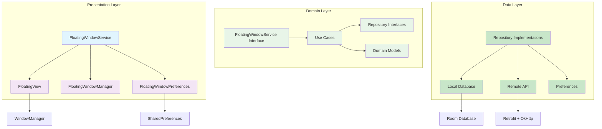
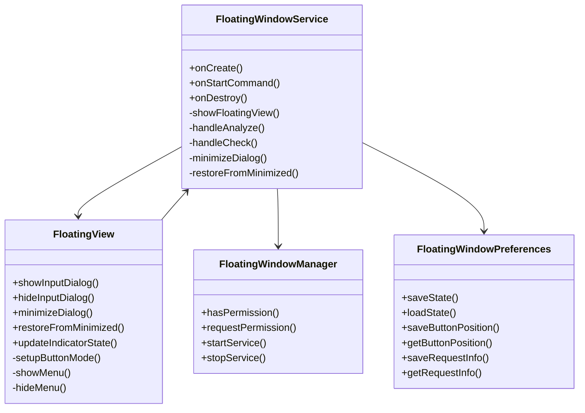

# TDD-00001-悬浮窗架构设计

## 1. 文档信息

| 项目 | 内容 |
|------|------|
| 文档类型 | TDD (Technical Design Document) |
| 文档编号 | TDD-00001 |
| 功能名称 | 悬浮窗架构设计 |
| 版本 | 1.0 |
| 创建日期 | 2025-12-12 |
| 作者 | Roo |
| 审核人 | 待定 |

## 2. 架构概述

### 2.1 架构目标
悬浮窗功能采用Clean Architecture + MVVM架构模式，确保代码的可维护性、可测试性和可扩展性。架构设计遵循以下原则：

- **关注点分离**: 业务逻辑与UI逻辑分离
- **依赖注入**: 使用Hilt进行依赖管理
- **单一职责**: 每个类职责明确单一
- **接口抽象**: 面向接口编程而非实现
- **数据驱动**: 使用响应式数据流

### 2.2 技术栈选择

| 技术领域 | 技术选择 | 版本要求 |
|---------|----------|----------|
| 开发语言 | Kotlin | 1.9+ |
| UI框架 | Jetpack Compose | 1.5+ |
| 架构模式 | Clean Architecture + MVVM | - |
| 依赖注入 | Hilt | 2.44+ |
| 数据库 | Room | 2.5+ |
| 网络请求 | Retrofit + OkHttp | 2.9+ / 4.10+ |
| JSON解析 | Moshi | 1.14+ |
| 异步处理 | Kotlin Coroutines | 1.7+ |

## 3. 整体架构设计

### 3.1 分层架构



### 3.2 核心组件关系



## 4. 详细组件设计

### 4.1 Presentation Layer

#### 4.1.1 FloatingWindowService
**职责**: 管理悬浮窗生命周期，处理用户交互，协调业务逻辑

**核心方法**:
```kotlin
class FloatingWindowService : Service() {
    // 服务生命周期
    override fun onCreate()
    override fun onStartCommand(intent: Intent?, flags: Int, startId: Int): Int
    override fun onBind(intent: Intent?): IBinder?
    override fun onDestroy()
    
    // 悬浮窗管理
    private fun showFloatingView()
    private fun hideFloatingView()
    
    // 功能处理
    private fun handleAnalyze()
    private fun handleCheck()
    
    // 状态管理
    private fun minimizeDialog()
    private fun restoreFromMinimized()
    private fun updateIndicatorState(state: IndicatorState)
    
    // 资源管理
    private fun cleanupResources()
}
```

**依赖注入**:
```kotlin
@AndroidEntryPoint
class FloatingWindowService : Service() {
    @Inject lateinit var analyzeChatUseCase: AnalyzeChatUseCase
    @Inject lateinit var checkDraftUseCase: CheckDraftUseCase
    @Inject lateinit var contactRepository: ContactRepository
    @Inject lateinit var floatingWindowPreferences: FloatingWindowPreferences
}
```

#### 4.1.2 FloatingView
**职责**: 统一管理所有UI状态和交互逻辑

**状态管理**:
```kotlin
class FloatingView(context: Context) : FrameLayout(context) {
    // 显示模式
    enum class Mode { BUTTON, MENU, INPUT, MINIMIZED }
    
    // 当前状态
    private var currentMode = Mode.BUTTON
    private var currentRequestInfo: MinimizedRequestInfo? = null
    
    // UI组件
    private lateinit var floatingButton: FloatingActionButton
    private lateinit var menuLayout: LinearLayout
    private var inputDialogView: View? = null
    private var minimizedIndicator: View? = null
    
    // 状态切换方法
    fun showInputDialog(actionType: ActionType, contacts: List<ContactProfile>, onConfirm: (String, String) -> Unit)
    fun hideInputDialog()
    fun minimizeDialog()
    fun restoreFromMinimized()
    fun updateIndicatorState(state: IndicatorState)
}
```

**触摸事件处理**:
```kotlin
override fun onTouchEvent(event: MotionEvent): Boolean {
    return when (event.action) {
        MotionEvent.ACTION_DOWN -> {
            // 记录初始位置
            initialX = layoutParams.x
            initialY = layoutParams.y
            initialTouchX = event.rawX
            initialTouchY = event.rawY
            isDragging = false
            true
        }
        MotionEvent.ACTION_MOVE -> {
            // 处理拖动逻辑
            val deltaX = event.rawX - initialTouchX
            val deltaY = event.rawY - initialTouchY
            if (abs(deltaX) > 10 || abs(deltaY) > 10) {
                isDragging = true
                updatePosition(deltaX, deltaY)
            }
            true
        }
        MotionEvent.ACTION_UP -> {
            if (isDragging) {
                saveCurrentPosition()
            } else {
                performClick()
            }
            isDragging = false
            true
        }
        else -> false
    }
}
```

#### 4.1.3 FloatingWindowManager
**职责**: 权限检查、服务管理、系统兼容性处理

**权限管理**:
```kotlin
object FloatingWindowManager {
    fun hasPermission(context: Context): PermissionResult {
        return if (Build.VERSION.SDK_INT >= Build.VERSION_CODES.M) {
            if (Settings.canDrawOverlays(context)) {
                PermissionResult.Granted
            } else {
                PermissionResult.Denied("悬浮窗权限未授予")
            }
        } else {
            PermissionResult.Granted
        }
    }
    
    fun requestPermission(activity: Activity): Boolean {
        return if (Build.VERSION.SDK_INT >= Build.VERSION_CODES.M) {
            try {
                val intent = Intent(Settings.ACTION_MANAGE_OVERLAY_PERMISSION,
                    Uri.parse("package:${activity.packageName}"))
                activity.startActivityForResult(intent, REQUEST_CODE_OVERLAY_PERMISSION)
                true
            } catch (e: Exception) {
                false
            }
        } else {
            true
        }
    }
}
```

#### 4.1.4 FloatingWindowPreferences
**职责**: 状态持久化、配置管理、数据加密

**数据存储**:
```kotlin
@Singleton
class FloatingWindowPreferences @Inject constructor(
    @ApplicationContext private val context: Context,
    private val moshi: Moshi
) {
    private val prefs: SharedPreferences = context.getSharedPreferences(
        PREFS_NAME, Context.MODE_PRIVATE
    )
    
    fun saveState(state: FloatingWindowState) {
        prefs.edit {
            putBoolean(KEY_IS_ENABLED, state.isEnabled)
            putInt(KEY_BUTTON_X, state.buttonX)
            putInt(KEY_BUTTON_Y, state.buttonY)
        }
    }
    
    fun loadState(): FloatingWindowState {
        return FloatingWindowState(
            isEnabled = prefs.getBoolean(KEY_IS_ENABLED, false),
            buttonX = prefs.getInt(KEY_BUTTON_X, 0),
            buttonY = prefs.getInt(KEY_BUTTON_Y, 0)
        )
    }
    
    fun saveRequestInfo(requestInfo: MinimizedRequestInfo) {
        val json = moshi.adapter(MinimizedRequestInfo::class.java).toJson(requestInfo)
        prefs.edit { putString(KEY_MINIMIZED_REQUEST, json) }
    }
    
    fun getRequestInfo(): MinimizedRequestInfo? {
        val json = prefs.getString(KEY_MINIMIZED_REQUEST, null) ?: return null
        return moshi.adapter(MinimizedRequestInfo::class.java).fromJson(json)
    }
}
```

### 4.2 Domain Layer

#### 4.2.1 Use Cases
**AnalyzeChatUseCase**:
```kotlin
class AnalyzeChatUseCase @Inject constructor(
    private val aiRepository: AiRepository,
    private val contactRepository: ContactRepository
) {
    suspend operator fun invoke(contactId: String, messages: List<String>): Result<AnalysisResult> {
        return try {
            // 获取联系人画像
            val contact = contactRepository.getProfile(contactId).first()
                ?: throw IllegalArgumentException("联系人不存在")
            
            // 调用AI分析
            aiRepository.analyzeChat(contact, messages)
        } catch (e: Exception) {
            Result.failure(e)
        }
    }
}
```

**CheckDraftUseCase**:
```kotlin
class CheckDraftUseCase @Inject constructor(
    private val aiRepository: AiRepository,
    private val contactRepository: ContactRepository
) {
    suspend operator fun invoke(contactId: String, text: String): Result<SafetyCheckResult> {
        return try {
            // 获取联系人画像
            val contact = contactRepository.getProfile(contactId).first()
                ?: throw IllegalArgumentException("联系人不存在")
            
            // 调用AI安全检查
            aiRepository.checkSafety(contact, text)
        } catch (e: Exception) {
            Result.failure(e)
        }
    }
}
```

#### 4.2.2 Domain Models
**FloatingWindowState**:
```kotlin
data class FloatingWindowState(
    val isEnabled: Boolean = false,
    val buttonX: Int = 0,
    val buttonY: Int = 0
)
```

**MinimizedRequestInfo**:
```kotlin
data class MinimizedRequestInfo(
    val id: String,
    val type: ActionType,
    val contactId: String,
    val inputText: String,
    val selectedContactIndex: Int,
    val timestamp: Long
)
```

**IndicatorState**:
```kotlin
enum class IndicatorState {
    LOADING,   // 加载中
    SUCCESS,   // 成功
    ERROR      // 错误
}
```

### 4.3 Data Layer

#### 4.3.1 Repository Implementations
**AiRepositoryImpl**:
```kotlin
@Singleton
class AiRepositoryImpl @Inject constructor(
    private val openAiApi: OpenAiApi,
    private val privacyEngine: PrivacyEngine,
    private val errorHandler: ErrorHandler
) : AiRepository {
    
    override suspend fun analyzeChat(contact: ContactProfile, messages: List<String>): Result<AnalysisResult> {
        return try {
            // 数据脱敏处理
            val sanitizedMessages = messages.map { privacyEngine.sanitize(it) }
            
            // 构建请求
            val request = ChatRequestDto(
                contact = contact,
                messages = sanitizedMessages
            )
            
            // 调用API
            val response = openAiApi.analyzeChat(request)
            
            // 处理响应
            val result = mapToAnalysisResult(response)
            Result.success(result)
        } catch (e: Exception) {
            errorHandler.handleError(e)
            Result.failure(e)
        }
    }
    
    override suspend fun checkSafety(contact: ContactProfile, text: String): Result<SafetyCheckResult> {
        return try {
            // 数据脱敏处理
            val sanitizedText = privacyEngine.sanitize(text)
            
            // 构建请求
            val request = SafetyCheckRequestDto(
                contact = contact,
                text = sanitizedText
            )
            
            // 调用API
            val response = openAiApi.checkSafety(request)
            
            // 处理响应
            val result = mapToSafetyCheckResult(response)
            Result.success(result)
        } catch (e: Exception) {
            errorHandler.handleError(e)
            Result.failure(e)
        }
    }
}
```

#### 4.3.2 Local Database
**AppDatabase**:
```kotlin
@Database(
    entities = [
        ContactProfileEntity::class,
        BrainTagEntity::class,
        AiProviderEntity::class
    ],
    version = 1,
    exportSchema = false
)
@TypeConverters(RoomTypeConverters::class)
abstract class AppDatabase : RoomDatabase() {
    abstract fun contactDao(): ContactDao
    abstract fun brainTagDao(): BrainTagDao
    abstract fun aiProviderDao(): AiProviderDao
}
```

#### 4.3.3 Remote API
**OpenAiApi**:
```kotlin
interface OpenAiApi {
    @POST("chat/analyze")
    suspend fun analyzeChat(@Body request: ChatRequestDto): Response<ChatResponseDto>
    
    @POST("chat/check")
    suspend fun checkSafety(@Body request: SafetyCheckRequestDto): Response<SafetyCheckResponseDto>
    
    @GET("models")
    suspend fun getAvailableModels(): Response<List<ModelDto>>
}
```

## 5. 依赖注入设计

### 5.1 Hilt模块结构

**DatabaseModule**:
```kotlin
@Module
@InstallIn(SingletonComponent::class)
object DatabaseModule {
    
    @Provides
    @Singleton
    fun provideAppDatabase(@ApplicationContext context: Context): AppDatabase {
        return Room.databaseBuilder(
            context,
            AppDatabase::class.java,
            "empathy_database"
        ).build()
    }
    
    @Provides
    fun provideContactDao(database: AppDatabase): ContactDao = database.contactDao()
    
    @Provides
    fun provideBrainTagDao(database: AppDatabase): BrainTagDao = database.brainTagDao()
    
    @Provides
    fun provideAiProviderDao(database: AppDatabase): AiProviderDao = database.aiProviderDao()
}
```

**NetworkModule**:
```kotlin
@Module
@InstallIn(SingletonComponent::class)
object NetworkModule {
    
    @Provides
    @Singleton
    fun provideOkHttpClient(): OkHttpClient {
        return OkHttpClient.Builder()
            .addInterceptor(HttpLoggingInterceptor().apply {
                level = if (BuildConfig.DEBUG) {
                    HttpLoggingInterceptor.Level.BODY
                } else {
                    HttpLoggingInterceptor.Level.NONE
                }
            })
            .connectTimeout(30, TimeUnit.SECONDS)
            .readTimeout(30, TimeUnit.SECONDS)
            .writeTimeout(30, TimeUnit.SECONDS)
            .build()
    }
    
    @Provides
    @Singleton
    fun provideMoshi(): Moshi {
        return Moshi.Builder()
            .add(KotlinJsonAdapterFactory())
            .build()
    }
    
    @Provides
    @Singleton
    fun provideRetrofit(okHttpClient: OkHttpClient, moshi: Moshi): Retrofit {
        return Retrofit.Builder()
            .baseUrl("https://api.empathy-ai.com/")
            .client(okHttpClient)
            .addConverterFactory(MoshiConverterFactory.create(moshi))
            .build()
    }
    
    @Provides
    @Singleton
    fun provideOpenAiApi(retrofit: Retrofit): OpenAiApi = retrofit.create(OpenAiApi::class)
}
```

**RepositoryModule**:
```kotlin
@Module
@InstallIn(SingletonComponent::class)
abstract class RepositoryModule {
    
    @Binds
    abstract fun bindAiRepository(aiRepositoryImpl: AiRepositoryImpl): AiRepository
    
    @Binds
    abstract fun bindContactRepository(contactRepositoryImpl: ContactRepositoryImpl): ContactRepository
    
    @Binds
    abstract fun bindBrainTagRepository(brainTagRepositoryImpl: BrainTagRepositoryImpl): BrainTagRepository
}
```

## 6. 性能优化设计

### 6.1 内存管理

**资源释放策略**:
```kotlin
class FloatingView {
    private fun releaseInputDialogResources() {
        // 清除监听器
        clearAllListeners()
        
        // 清除适配器
        contactSpinner?.adapter = null
        
        // 清除焦点
        inputText?.clearFocus()
        
        // 隐藏软键盘
        hideKeyboard()
        
        // 建议垃圾回收
        System.gc()
    }
    
    private fun clearAllListeners() {
        btnConfirm?.setOnClickListener(null)
        btnCancel?.setOnClickListener(null)
        btnMinimize?.setOnClickListener(null)
        inputText?.removeTextChangedListener(textWatcher)
    }
}
```

**内存监控**:
```kotlin
class PerformanceMonitor {
    fun startMonitoring() {
        // 记录初始内存
        val initialMemory = getUsedMemory()
        
        // 定期检查内存使用
        CoroutineScope(Dispatchers.IO).launch {
            while (isMonitoring) {
                delay(5000) // 每5秒检查一次
                val currentMemory = getUsedMemory()
                if (currentMemory > MEMORY_THRESHOLD) {
                    // 触发内存优化
                    optimizeMemory()
                }
            }
        }
    }
    
    private fun getUsedMemory(): Long {
        val runtime = Runtime.getRuntime()
        return runtime.totalMemory() - runtime.freeMemory()
    }
}
```

### 6.2 渲染优化

**硬件加速**:
```kotlin
class FloatingView {
    private fun enableHardwareAcceleration() {
        // 启用硬件加速
        setLayerType(View.LAYER_TYPE_HARDWARE, null)
        
        // 为子视图启用硬件加速
        floatingButton.setLayerType(View.LAYER_TYPE_HARDWARE, null)
        menuLayout.setLayerType(View.LAYER_TYPE_HARDWARE, null)
    }
}
```

**动画优化**:
```kotlin
class FloatingView {
    private fun animateWithHardwareAcceleration(view: View, animation: ViewPropertyAnimator) {
        // 启用硬件层
        view.setLayerType(View.LAYER_TYPE_HARDWARE, null)
        
        // 执行动画
        animation.start()
        
        // 动画结束后恢复
        animation.withEndAction {
            view.setLayerType(View.LAYER_TYPE_NONE, null)
        }
    }
}
```

### 6.3 响应优化

**触摸事件优化**:
```kotlin
class FloatingView {
    override fun onTouchEvent(event: MotionEvent): Boolean {
        val startTime = System.nanoTime()
        
        when (event.action) {
            MotionEvent.ACTION_DOWN -> {
                // 立即响应触摸
                handleTouchDown(event)
            }
            MotionEvent.ACTION_MOVE -> {
                // 限制更新频率到60FPS
                if (shouldUpdatePosition()) {
                    handleTouchMove(event)
                }
            }
            MotionEvent.ACTION_UP -> {
                handleTouchUp(event)
            }
        }
        
        // 记录响应时间
        val responseTime = (System.nanoTime() - startTime) / 1_000_000.0
        if (responseTime > RESPONSE_TIME_THRESHOLD) {
            Log.w("FloatingView", "Touch response time: ${responseTime}ms")
        }
        
        return true
    }
    
    private fun shouldUpdatePosition(): Boolean {
        val currentTime = System.currentTimeMillis()
        return currentTime - lastUpdateTime > UPDATE_INTERVAL_MS
    }
}
```

## 7. 错误处理设计

### 7.1 异常处理策略

**分层错误处理**:
```kotlin
// Domain Layer
sealed class AppError : Exception() {
    object NetworkError : AppError()
    object ValidationError : AppError()
    object PermissionError : AppError()
    data class UnknownError(override val message: String) : AppError()
}

// Presentation Layer
class ErrorHandler {
    fun handleError(error: Throwable): AppError {
        return when (error) {
            is IOException -> AppError.NetworkError
            is SecurityException -> AppError.PermissionError
            is IllegalArgumentException -> AppError.ValidationError
            else -> AppError.UnknownError(error.message ?: "未知错误")
        }
    }
    
    fun showError(context: Context, error: AppError) {
        val message = when (error) {
            is AppError.NetworkError -> "网络连接失败，请检查网络设置"
            is AppError.PermissionError -> "权限不足，请前往设置开启权限"
            is AppError.ValidationError -> "输入验证失败，请检查输入内容"
            is AppError.UnknownError -> error.message
        }
        Toast.makeText(context, message, Toast.LENGTH_LONG).show()
    }
}
```

### 7.2 恢复机制

**状态恢复**:
```kotlin
class FloatingWindowService {
    private fun restoreRequestState() {
        // 获取保存的请求信息
        val requestInfo = floatingWindowPreferences.getRequestInfo()
        
        if (requestInfo != null) {
            // 检查请求是否过期
            val currentTime = System.currentTimeMillis()
            val elapsedTime = currentTime - requestInfo.timestamp
            val expirationTime = 10 * 60 * 1000L // 10分钟
            
            if (elapsedTime > expirationTime) {
                // 清除过期请求
                floatingWindowPreferences.clearRequestInfo()
            } else {
                // 恢复请求状态
                currentRequestInfo = requestInfo
                restoreMinimizedIndicator(requestInfo)
            }
        }
    }
}
```

## 8. 测试策略

### 8.1 单元测试

**测试覆盖范围**:
- Use Cases: 100%覆盖
- Repository: 90%覆盖
- Domain Models: 100%覆盖
- Utility Classes: 95%覆盖

**测试示例**:
```kotlin
@Test
fun `analyzeChatUseCase should return success result when API call succeeds`() = runTest {
    // Given
    val contact = ContactProfile(id = "1", name = "测试联系人")
    val messages = listOf("测试消息")
    val expectedResult = AnalysisResult(
        riskLevel = "低风险",
        strategyAnalysis = "测试分析",
        replySuggestion = "测试建议"
    )
    
    coEvery { aiRepository.analyzeChat(contact, messages) } returns Result.success(expectedResult)
    
    // When
    val result = analyzeChatUseCase("1", messages)
    
    // Then
    assertTrue(result.isSuccess)
    assertEquals(expectedResult, result.getOrNull())
}
```

### 8.2 集成测试

**测试场景**:
- 悬浮窗服务启动/停止
- 权限获取流程
- 数据库操作
- 网络API调用

**测试示例**:
```kotlin
@Test
fun `floating window service should start successfully with granted permission`() {
    // Given
    every { Settings.canDrawOverlays(context) } returns true
    
    // When
    val result = floatingWindowManager.startService(context)
    
    // Then
    assertTrue(result is ServiceStartResult.Success)
    verify { context.startForegroundService(any()) }
}
```

### 8.3 UI测试

**测试场景**:
- 悬浮按钮点击/拖动
- 菜单展开/收起
- 输入对话框交互
- 最小化/恢复流程

**测试示例**:
```kotlin
@Test
fun `floating button should show menu when clicked`() {
    // Given
    composeTestRule.setContent {
        FloatingView(context)
    }
    
    // When
    onNodeWithContentDescription("AI助手悬浮按钮").performClick()
    
    // Then
    onNodeWithText("帮我分析").assertIsDisplayed()
    onNodeWithText("帮我检查").assertIsDisplayed()
}
```

## 9. 部署设计

### 9.1 构建配置

**Gradle配置**:
```kotlin
android {
    compileSdk 35
    
    defaultConfig {
        minSdk 24
        targetSdk 35
        
        testInstrumentationRunner "androidx.test.runner.AndroidJUnitRunner"
    }
    
    buildFeatures {
        compose = true
        buildConfig = true
    }
    
    buildTypes {
        release {
            isMinifyEnabled = true
            isShrinkResources = true
            proguardFiles(
                getDefaultProguardFile("proguard-android-optimize.txt"),
                "proguard-rules.pro"
            )
        }
        debug {
            isMinifyEnabled = false
            applicationIdSuffix = ".debug"
        }
    }
}
```

### 9.2 权限配置

**AndroidManifest.xml**:
```xml
<uses-permission android:name="android.permission.SYSTEM_ALERT_WINDOW" />
<uses-permission android:name="android.permission.FOREGROUND_SERVICE" />
<uses-permission android:name="android.permission.POST_NOTIFICATIONS" />

<application>
    <service
        android:name=".domain.service.FloatingWindowService"
        android:enabled="true"
        android:exported="false"
        android:foregroundServiceType="dataSync" />
</application>
```

### 9.3 发布检查清单

**发布前检查**:
- [ ] 权限声明完整
- [ ] 混淆规则配置
- [ ] 签名配置正确
- [ ] 版本号更新
- [ ] 测试覆盖率达标
- [ ] 性能基准测试通过
- [ ] 兼容性测试完成