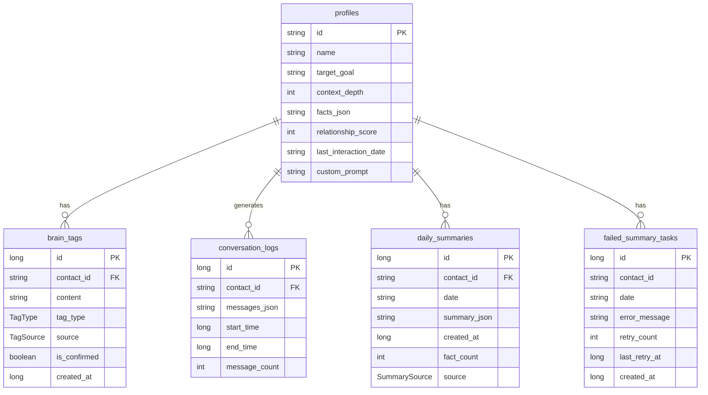

# Data Local Entity - 数据库实体模块

[根目录](../../../../../../../CLAUDE.md) > [app](../../../../../) > [data](../../../) > [local](../../) > [entity](../) > **entity**

## 模块职责

Data Local Entity模块包含所有Room数据库的实体定义，这些实体直接映射到数据库表结构，是数据持久化的基础。每个实体都遵循Room注解规范，确保与数据库的正确映射关系。

## 实体设计规范

### 命名规范
- **实体类名**: PascalCase + Entity后缀（如ContactProfileEntity）
- **表名**: snake_case + 复数形式（如profiles）
- **列名**: snake_case风格
- **属性名**: camelCase风格

### 基本原则
- 使用@Entity注解标记实体
- 每个表必须有主键
- 外键关系通过ID引用
- 复杂数据类型使用TypeConverter

## 核心实体

### 1. ContactProfileEntity - 联系人画像实体
- **文件**: `ContactProfileEntity.kt`
- **表名**: `profiles`
- **主键**: `id` (String, 非自增)

**关键字段**:
```kotlin
@Entity(tableName = "profiles")
data class ContactProfileEntity(
    @PrimaryKey
    @ColumnInfo(name = "id")
    val id: String,

    @ColumnInfo(name = "name")
    val name: String,

    @ColumnInfo(name = "target_goal")
    val targetGoal: String,

    @ColumnInfo(name = "context_depth")
    val contextDepth: Int = 10,

    @ColumnInfo(name = "facts_json")
    val factsJson: String = "[]",

    @ColumnInfo(name = "relationship_score")
    val relationshipScore: Int = 50,

    @ColumnInfo(name = "last_interaction_date")
    val lastInteractionDate: String? = null,

    @ColumnInfo(name = "custom_prompt")
    val customPrompt: String? = null
)
```

**特殊处理**:
- `factsJson`: 存储List<Fact>的JSON序列化
- `lastInteractionDate`: 使用"yyyy-MM-dd"格式
- `customPrompt`: 联系人级别的自定义提示词

### 2. BrainTagEntity - 标签实体
- **文件**: `BrainTagEntity.kt`
- **表名**: `brain_tags`
- **主键**: `id` (Integer, 自增)

**关键字段**:
```kotlin
@Entity(
    tableName = "brain_tags",
    foreignKeys = [
        ForeignKey(
            entity = ContactProfileEntity::class,
            parentColumns = ["id"],
            childColumns = ["contact_id"],
            onDelete = ForeignKey.CASCADE
        )
    ]
)
data class BrainTagEntity(
    @PrimaryKey(autoGenerate = true)
    @ColumnInfo(name = "id")
    val id: Long = 0,

    @ColumnInfo(name = "contact_id", index = true)
    val contactId: String,

    @ColumnInfo(name = "content")
    val content: String,

    @ColumnInfo(name = "tag_type")
    val tagType: TagType,

    @ColumnInfo(name = "source")
    val source: TagSource,

    @ColumnInfo(name = "is_confirmed")
    val isConfirmed: Boolean = false,

    @ColumnInfo(name = "created_at")
    val createdAt: Long = System.currentTimeMillis()
)
```

**关联关系**:
- 外键关联到profiles表
- 联级删除：删除联系人时自动删除标签

### 3. AiProviderEntity - AI服务商实体
- **文件**: `AiProviderEntity.kt`
- **表名**: `ai_providers`
- **主键**: `id` (Integer, 自增)

**关键字段**:
```kotlin
@Entity(tableName = "ai_providers")
data class AiProviderEntity(
    @PrimaryKey(autoGenerate = true)
    @ColumnInfo(name = "id")
    val id: Long = 0,

    @ColumnInfo(name = "name")
    val name: String,

    @ColumnInfo(name = "base_url")
    val baseUrl: String,

    @ColumnInfo(name = "api_key_ref")
    val apiKeyRef: String,

    @ColumnInfo(name = "models_json")
    val modelsJson: String,

    @ColumnInfo(name = "default_model_id")
    val defaultModelId: String,

    @ColumnInfo(name = "is_default")
    val isDefault: Boolean = false,

    @ColumnInfo(name = "timeout_ms")
    val timeoutMs: Int = 30000,

    @ColumnInfo(name = "created_at")
    val createdAt: Long = System.currentTimeMillis()
)
```

**特殊字段**:
- `api_key_ref`: API密钥引用，实际密钥存储在EncryptedSharedPreferences
- `models_json`: 支持的模型列表JSON

### 4. ConversationLogEntity - 对话日志实体
- **文件**: `ConversationLogEntity.kt`
- **表名**: `conversation_logs`
- **主键**: `id` (Integer, 自增)

**关键字段**:
```kotlin
@Entity(
    tableName = "conversation_logs",
    foreignKeys = [
        ForeignKey(
            entity = ContactProfileEntity::class,
            parentColumns = ["id"],
            childColumns = ["contact_id"],
            onDelete = ForeignKey.CASCADE
        )
    ],
    indices = [
        Index(value = ["contact_id", "start_time"])
    ]
)
data class ConversationLogEntity(
    @PrimaryKey(autoGenerate = true)
    @ColumnInfo(name = "id")
    val id: Long = 0,

    @ColumnInfo(name = "contact_id", index = true)
    val contactId: String,

    @ColumnInfo(name = "messages_json")
    val messagesJson: String,

    @ColumnInfo(name = "start_time")
    val startTime: Long,

    @ColumnInfo(name = "end_time")
    val endTime: Long,

    @ColumnInfo(name = "message_count")
    val messageCount: Int = 0
)
```

**索引优化**:
- 在contact_id和start_time上创建复合索引
- 优化按联系人查询时间范围的性能

### 5. DailySummaryEntity - 每日总结实体
- **文件**: `DailySummaryEntity.kt`
- **表名**: `daily_summaries`
- **主键**: `id` (Integer, 自增)
- **唯一约束**: (contactId, date)

**关键字段**:
```kotlin
@Entity(
    tableName = "daily_summaries",
    uniqueConstraints = [
        UniqueConstraint(
            value = ["contact_id", "date"],
            onConflict = OnConflictStrategy.REPLACE
        )
    ]
)
data class DailySummaryEntity(
    @PrimaryKey(autoGenerate = true)
    @ColumnInfo(name = "id")
    val id: Long = 0,

    @ColumnInfo(name = "contact_id", index = true)
    val contactId: String,

    @ColumnInfo(name = "date")
    val date: String, // "yyyy-MM-dd" format

    @ColumnInfo(name = "summary_json")
    val summaryJson: String,

    @ColumnInfo(name = "created_at")
    val createdAt: Long = System.currentTimeMillis(),

    @ColumnInfo(name = "fact_count")
    val factCount: Int = 0,

    @ColumnInfo(name = "source")
    val source: SummarySource = SummarySource.AUTO
)
```

### 6. FailedSummaryTaskEntity - 失败总结任务实体
- **文件**: `FailedSummaryTaskEntity.kt`
- **表名**: `failed_summary_tasks`
- **主键**: `id` (Integer, 自增)

**关键字段**:
```kotlin
@Entity(tableName = "failed_summary_tasks")
data class FailedSummaryTaskEntity(
    @PrimaryKey(autoGenerate = true)
    @ColumnInfo(name = "id")
    val id: Long = 0,

    @ColumnInfo(name = "contact_id")
    val contactId: String,

    @ColumnInfo(name = "date")
    val date: String,

    @ColumnInfo(name = "error_message")
    val errorMessage: String,

    @ColumnInfo(name = "retry_count")
    val retryCount: Int = 0,

    @ColumnInfo(name = "last_retry_at")
    val lastRetryAt: Long = System.currentTimeMillis(),

    @ColumnInfo(name = "created_at")
    val createdAt: Long = System.currentTimeMillis()
)
```

## 枚举类型定义

### TagType - 标签类型
```kotlin
enum class TagType {
    RISK_RED,      // 雷区标签
    STRATEGY_GREEN // 策略标签
}
```

### TagSource - 标签来源
```kotlin
enum class TagSource {
    MANUAL,         // 手动添加
    AI_INFERRED     // AI推断
}
```

### SummarySource - 总结来源
```kotlin
enum class SummarySource {
    AUTO,           // 自动生成
    MANUAL          // 手动生成
}
```

## 实体关系图



## 数据库迁移历史

### 版本 1 → 2
- 添加`ai_providers`表
- 支持多AI服务商配置

### 版本 2 → 3
- `ai_providers`表添加`timeout_ms`字段

### 版本 3 → 4
- 添加`conversation_logs`表
- 添加`daily_summaries`表
- 添加记忆系统支持

### 版本 4 → 5
- 添加`failed_summary_tasks`表
- 支持失败任务重试

### 版本 5 → 6
- `brain_tags`表添加`is_confirmed`字段
- 支持标签确认机制

### 版本 6 → 7
- 修复`conversation_logs`表索引
- 优化查询性能

### 版本 7 → 8
- `profiles`表添加`custom_prompt`字段
- 支持联系人级自定义提示词

## 设计最佳实践

### 1. 字段类型选择
- 文本数据使用String类型
- 日期时间使用Long类型（时间戳）
- 枚举使用专门的Enum类型
- 布尔值使用Boolean类型

### 2. 索引策略
- 主键自动创建索引
- 外键字段创建索引
- 查询频繁的字段创建索引
- 复合查询创建复合索引

### 3. 外键约束
- 定义合适的删除策略（CASCADE、SET_NULL等）
- 考虑数据一致性问题
- 避免循环依赖

### 4. 默认值处理
- 为可选字段提供默认值
- 使用非null类型确保数据完整性
- 特殊值使用null表示

## 测试策略

### 单元测试
- 实体创建验证
- 字段约束测试
- 默认值测试

### 迁移测试
- 每个迁移都要有测试
- 验证数据完整性
- 测试回滚场景

### 性能测试
- 大数据量查询测试
- 索引效果验证
- 事务性能测试

## 相关文件清单

- `ContactProfileEntity.kt` - 联系人画像实体
- `BrainTagEntity.kt` - 标签实体
- `AiProviderEntity.kt` - AI服务商实体
- `ConversationLogEntity.kt` - 对话日志实体
- `DailySummaryEntity.kt` - 每日总结实体
- `FailedSummaryTaskEntity.kt` - 失败任务实体

## 变更记录 (Changelog)

### 2025-12-20 - Claude (模块文档创建)
- **创建data/local/entity模块文档**
- **记录所有实体定义和关系**
- **添加实体关系图和迁移历史**