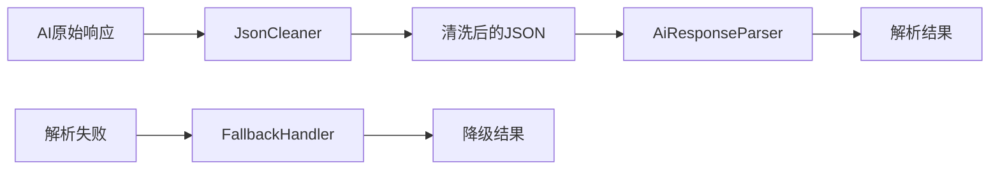

# Data Parser - AI响应解析模块

[根目录](../../../../CLAUDE.md) > [app](../../../) > [data](../../) > [parser](../) > **parser**

## 模块职责

Data Parser模块负责解析和清洗来自AI服务的响应数据，将原始文本转换为结构化的领域模型。该模块是数据层的重要组成部分，确保AI响应能够正确转换为应用可用的数据结构。

## 核心组件

### 1. AiResponseParser - AI响应解析器接口
- **文件**: `AiResponseParser.kt`
- **职责**: 定义统一的解析契约，支持多种数据类型的解析
- **功能**:
  - 解析分析结果（AnalysisResult）
  - 解析安全检查结果（SafetyCheckResult）
  - 解析提取数据（ExtractedData）
  - 提供通用解析方法

**设计特点**:
- 使用接口定义，支持多种实现
- 支持解析上下文（ParsingContext）
- 返回Result类型，优雅处理错误

### 2. JsonCleaner - JSON清洗器接口
- **文件**: `JsonCleaner.kt`
- **职责**: 处理JSON清洗，修复格式问题
- **功能**:
  - 移除Markdown代码块标记
  - 修复JSON格式错误
  - 处理Unicode编码和转义字符
  - 提取有效的JSON对象

**设计特点**:
- 支持清洗上下文（CleaningContext）
- 提供验证方法检查JSON有效性
- 智能提取JSON对象

### 3. EnhancedJsonCleaner - 增强JSON清洗器
- **文件**: `EnhancedJsonCleaner.kt`
- **职责**: JsonCleaner的增强实现
- **功能**:
  - 更强大的JSON修复能力
  - 支持多种格式问题
  - 提供详细的清洗日志

### 4. FieldMapper - 字段映射器
- **文件**: `FieldMapper.kt`
- **职责**: 处理字段名映射和数据转换
- **功能**:
  - 字段名映射（snake_case ↔ camelCase）
  - 数据类型转换
  - 默认值填充

### 5. FallbackHandler - 降级处理器
- **文件**: `FallbackHandler.kt`
- **职责**: 解析失败时的降级处理
- **功能**:
  - 提供默认值
  - 部分解析支持
  - 错误恢复策略

## 解析流程

### 完整解析链


### 解析步骤
1. **接收原始响应**: 从AI服务获取原始文本
2. **JSON清洗**: 使用JsonCleaner清理格式问题
3. **数据解析**: 使用AiResponseParser转换为领域模型
4. **错误处理**: 解析失败时使用FallbackHandler

## 使用示例

### 基本解析示例
```kotlin
// 创建解析器
val parser: AiResponseParser = AiResponseParserImpl()
val cleaner: JsonCleaner = EnhancedJsonCleaner()

// 清洗和解析
val rawResponse = aiService.chatCompletion(request)
val cleanedJson = cleaner.clean(rawResponse)
val result = parser.parseAnalysisResult(cleanedJson)

result.fold(
    onSuccess = { analysisResult ->
        // 处理成功结果
        updateUI(analysisResult)
    },
    onFailure = { error ->
        // 处理错误
        showError(error.message)
    }
)
```

### 带上下文的解析
```kotlin
// 创建解析上下文
val context = ParsingContext()
    .withModelName("gpt-4")
    .withOperationType("chat_analysis")
    .withDetailedLogging(true)

// 执行解析
val result = parser.parse(
    json = cleanedJson,
    targetType = AnalysisResult::class.java,
    context = context
)
```

### 降级处理示例
```kotlin
// 使用降级处理器
val fallbackHandler = FallbackHandler()

val result = parser.parseExtractedData(json)
    .getOrElse { error ->
        // 解析失败，使用降级策略
        fallbackHandler.handleParseError(error, json)
    }
```

## 设计原则

1. **可靠性优先**: 确保即使AI响应格式有问题也能优雅处理
2. **可扩展性**: 接口设计支持多种解析策略
3. **错误恢复**: 提供多层降级机制
4. **性能考虑**: 避免重复解析，支持部分解析
5. **日志友好**: 提供详细的解析日志

## 错误处理策略

### 1. 清洗错误
- **格式错误**: 尝试修复常见格式问题
- **编码问题**: 处理Unicode和转义字符
- **嵌入文本**: 提取纯JSON部分

### 2. 解析错误
- **字段缺失**: 使用默认值
- **类型不匹配**: 尝试类型转换
- **结构错误**: 部分解析支持

### 3. 降级策略
- **完全失败**: 返回空对象或默认值
- **部分失败**: 返回解析成功的部分
- **重试机制**: 对临时错误支持重试

## 性能优化

### 1. 缓存策略
- 缓存解析结果，避免重复解析
- 缓存清洗规则，提升清洗速度

### 2. 懒加载
- 按需创建解析器实例
- 延迟加载复杂的数据结构

### 3. 内存管理
- 及时释放大对象
- 使用对象池复用解析器

## 测试策略

### 1. 单元测试
- 测试各种JSON格式
- 测试错误处理逻辑
- 测试边界情况

### 2. 集成测试
- 测试完整解析流程
- 测试与AI服务的集成
- 测试降级策略

### 3. 压力测试
- 测试大JSON解析性能
- 测试并发解析能力
- 测试内存使用情况

## 注意事项

1. **安全性**: 避免解析恶意JSON，防止注入攻击
2. **兼容性**: 支持不同AI服务商的响应格式
3. **可维护性**: 保持解析逻辑清晰，易于修改
4. **监控**: 记录解析错误率，及时发现异常

## 相关文件清单

- AiResponseParser.kt - AI响应解析器接口
- JsonCleaner.kt - JSON清洗器接口
- EnhancedJsonCleaner.kt - 增强JSON清洗器实现
- FieldMapper.kt - 字段映射器
- FallbackHandler.kt - 降级处理器

## 变更记录 (Changelog)

### 2025-12-20 - Claude (模块文档创建)
- **创建data/parser模块文档**
- **记录5个核心解析组件的功能**
- **提供解析流程图和使用示例**