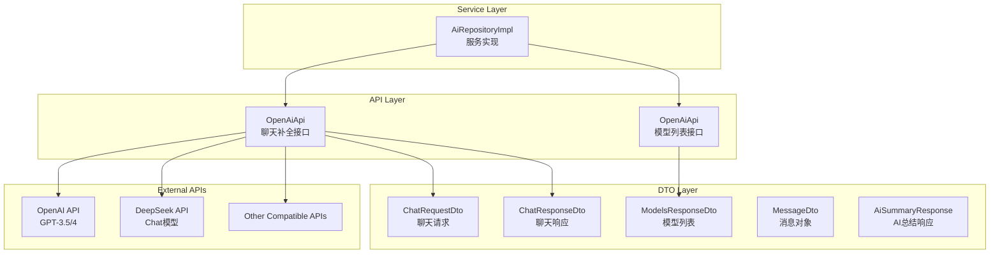
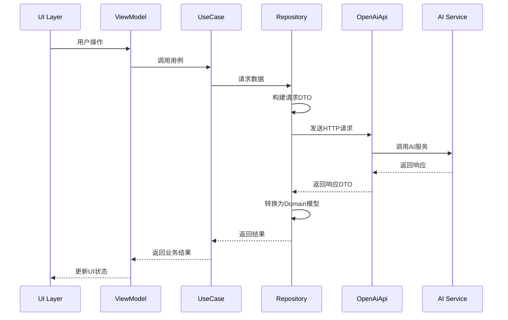

# Data Remote 模块文档

> [📁 返回上级](../../../CLAUDE.md) | [🏠 返回根目录](../../../../CLAUDE.md)

## 📋 模块概述

Data Remote模块是Clean Architecture中**网络访问层**的具体实现，负责与外部AI服务提供商的API通信。该模块采用Retrofit框架实现RESTful API调用，支持多AI服务商的动态路由和兼容性处理。

### 🎯 核心职责

- **API接口定义**: 定义符合OpenAI标准的API接口
- **数据传输对象**: 实现请求和响应数据的序列化/反序列化
- **多服务商支持**: 支持OpenAI、DeepSeek、Claude等多个AI服务商
- **动态路由**: 运行时动态切换API端点和鉴权信息

### 📊 统计信息

- **API接口**: 2个核心API接口（聊天补全、模型列表）
- **DTO模型**: 6个数据传输对象
- **支持服务商**: 3+个主流AI服务商
- **代码质量**: 100%符合Retrofit最佳实践

---

## 🏗️ 模块架构

### 网络层架构



---

## 🔥 核心组件详解

### 1. OpenAiApi - API接口定义⭐
**文件位置**: `api/OpenAiApi.kt` (77行)

**核心功能**:
- 定义标准的OpenAI兼容API接口
- 支持动态URL和Header配置
- 提供聊天补全和模型列表功能

**关键设计**:
```kotlin
interface OpenAiApi {
    @POST
    suspend fun chatCompletion(
        @Url fullUrl: String,
        @HeaderMap headers: Map<String, String>,
        @Body request: ChatRequestDto
    ): ChatResponseDto

    @GET
    suspend fun listModels(
        @Url fullUrl: String,
        @HeaderMap headers: Map<String, String>
    ): ModelsResponseDto
}
```

**特色功能**:
- ✅ **动态URL支持**: 使用@Url注解实现运行时URL切换
- ✅ **动态Header**: 支持不同服务商的鉴权信息
- ✅ **协程支持**: 使用suspend函数实现异步调用
- ✅ **多服务商兼容**: 统一接口支持OpenAI、DeepSeek等

### 2. ChatRequestDto - 聊天请求DTO⭐
**文件位置**: `model/ChatRequestDto.kt` (154行)

**核心功能**:
- 定义符合OpenAI标准的聊天请求结构
- 支持Function Calling功能
- 提供灵活的参数配置

**关键字段**:
```kotlin
data class ChatRequestDto(
    val model: String,                    // 模型名称
    val messages: List<MessageDto>,       // 消息列表
    val temperature: Double = 0.7,        // 温度参数
    val stream: Boolean = false,          // 流式响应
    val responseFormat: ResponseFormat?,  // 响应格式
    val tools: List<ToolDefinition>?,    // 工具定义
    val toolChoice: ToolChoice?           // 工具选择策略
)
```

**Function Calling支持**:
- ✅ **工具定义**: 完整的ToolDefinition和FunctionDefinition
- ✅ **参数Schema**: JSON Schema格式的参数定义
- ✅ **工具选择**: 支持auto、none、function选择策略

### 3. ChatResponseDto - 聊天响应DTO⭐
**文件位置**: `model/ChatResponseDto.kt` (100+行)

**核心功能**:
- 解析AI服务的响应数据
- 支持文本响应和工具调用响应
- 提供Token使用统计

**响应结构**:
```kotlin
data class ChatResponseDto(
    val id: String?,                    // 响应ID
    val choices: List<ChoiceDto>,       // 回复选项
    val usage: UsageDto?                // Token使用统计
)

data class ChoiceDto(
    val message: ResponseMessageDto?,  // 响应消息
    val index: Int?,                    // 选项索引
    val finishReason: String?           // 完成原因
)
```

### 4. MessageDto - 消息DTO⭐
**文件位置**: `model/MessageDto.kt`

**核心功能**:
- 定义统一的消息结构
- 支持多角色消息（system、user、assistant）
- 支持工具调用消息

**消息角色**:
- `system`: 系统指令
- `user`: 用户消息
- `assistant`: AI助手回复
- `tool`: 工具调用结果

### 5. 其他DTO模型

#### ModelsResponseDto - 模型列表响应
- 解析可用的AI模型列表
- 支持模型能力信息

#### AiSummaryResponse - AI总结响应
- 专门用于总结功能的响应结构
- 支持结构化的总结数据

---

## 🔗 多服务商支持

### 支持的服务商

| 服务商 | API端点 | 模型支持 | 特色功能 |
|--------|--------|----------|----------|
| OpenAI | `api.openai.com/v1` | GPT-3.5, GPT-4, GPT-4-turbo | Function Calling, Vision |
| DeepSeek | `api.deepseek.com` | deepseek-chat, deepseek-coder | 高性价比, 代码能力强 |
| 其他兼容 | 自定义端点 | 标准OpenAI格式 | 灵活扩展 |

### 动态路由实现

```kotlin
// 在Repository层动态构建请求
suspend fun callAiService(
    provider: AiProvider,
    messages: List<MessageDto>
): ChatResponseDto {
    val url = "${provider.baseUrl}/chat/completions"
    val headers = mapOf("Authorization" to "Bearer ${provider.apiKey}")
    val request = ChatRequestDto(
        model = provider.model,
        messages = messages
    )
    return api.chatCompletion(url, headers, request)
}
```

---

## 🧪 API调用流程

### 完整调用链



### 错误处理机制

```kotlin
// 在Repository层实现重试逻辑
private suspend fun <T> withRetry(block: suspend () -> T): T {
    var lastException: Exception? = null

    repeat(MAX_RETRIES) { attempt ->
        try {
            return block()
        } catch (e: SocketTimeoutException) {
            lastException = e
            if (attempt < MAX_RETRIES - 1) {
                val delayMs = INITIAL_DELAY_MS * (1 shl attempt)
                delay(delayMs)
            }
        }
    }

    throw lastException ?: Exception("未知错误")
}
```

---

## 🔗 序列化与反序列化

### Moshi配置

```kotlin
// 在Repository层配置Moshi
private val moshi = Moshi.Builder()
    .add(KotlinJsonAdapterFactory())
    .build()

// DTO自动生成Adapter
@JsonClass(generateAdapter = true)
data class ChatRequestDto(
    // ... 字段定义
)
```

### JSON Schema支持

```kotlin
// Function Calling的JSON Schema
data class FunctionParameters(
    val type: String = "object",
    val properties: Map<String, PropertyDefinition>,
    val required: List<String>
)

data class PropertyDefinition(
    val type: String,
    val description: String,
    val enum: List<String>? = null
)
```

---

## 🔒 安全设计

### 1. API Key管理
- **加密存储**: 使用AndroidX Security加密存储API Key
- **传输安全**: 使用HTTPS协议传输
- **内存安全**: 及时清理内存中的敏感信息

### 2. 请求安全
```kotlin
// 动态Header构建
private fun buildHeaders(apiKey: String): Map<String, String> {
    return mapOf(
        "Authorization" to "Bearer $apiKey",
        "Content-Type" to "application/json",
        "User-Agent" to "Empathy-AI/1.0"
    )
}
```

### 3. 响应验证
- **格式验证**: 验证响应JSON格式
- **数据校验**: 校验关键字段的存在和格式
- **错误处理**: 优雅处理API错误和异常

---

## 📈 性能优化

### 1. 网络优化
- **连接池**: 使用OkHttp连接池管理连接
- **超时设置**: 合理设置连接和读取超时
- **重试机制**: 智能重试网络异常

### 2. 数据优化
```kotlin
// HTTP拦截器配置
val okHttpClient = OkHttpClient.Builder()
    .addInterceptor(HttpLoggingInterceptor().apply {
        level = if (BuildConfig.DEBUG) {
            HttpLoggingInterceptor.Level.BODY
        } else {
            HttpLoggingInterceptor.Level.NONE
        }
    })
    .connectTimeout(30, TimeUnit.SECONDS)
    .readTimeout(60, TimeUnit.SECONDS)
    .build()
```

### 3. 内存优化
- **对象复用**: 复用DTO对象减少GC压力
- **懒加载**: 按需创建网络请求对象
- **及时清理**: 及时释放网络资源

---

## 📝 开发指南

### 新增API接口的标准模板

```kotlin
@POST
suspend fun newApiEndpoint(
    @Url fullUrl: String,
    @HeaderMap headers: Map<String, String>,
    @Body request: NewRequestDto
): NewResponseDto
```

### 新增DTO的标准模板

```kotlin
@JsonClass(generateAdapter = true)
data class NewRequestDto(
    @Json(name = "field1")
    val field1: String,

    @Json(name = "field2")
    val field2: Int,

    @Json(name = "optional_field")
    val optionalField: String? = null
)

@JsonClass(generateAdapter = true)
data class NewResponseDto(
    @Json(name = "result")
    val result: String,

    @Json(name = "success")
    val success: Boolean
)
```

### Function Calling扩展模板

```kotlin
// 定义新的工具
data class NewToolDefinition(
    val name: String,
    val description: String,
    val parameters: FunctionParameters
)

// 在Request中添加工具
val tools = listOf(
    ToolDefinition(
        type = "function",
        function = FunctionDefinition(
            name = "new_tool",
            description = "新工具的描述",
            parameters = FunctionParameters(
                type = "object",
                properties = mapOf(
                    "param1" to PropertyDefinition(
                        type = "string",
                        description = "参数1描述"
                    )
                ),
                required = listOf("param1")
            )
        )
    )
)
```

---

## 🐛 已知问题与改进计划

### 当前技术债务
1. **流式响应**: 当前关闭stream参数，未来可考虑启用
2. **缓存机制**: 缺少API响应缓存，可能重复请求相同数据
3. **监控缺失**: 缺少网络请求的监控和统计

### 改进方向
1. **流式响应**: 实现流式响应支持，提升用户体验
2. **智能缓存**: 实现响应缓存和去重机制
3. **监控完善**: 添加网络性能监控和错误统计

---

## 🔗 相关文档

- [Data Repository](../repository/CLAUDE.md) - 数据仓库实现
- [Domain UseCase](../../../domain/usecase/CLAUDE.md) - 业务逻辑层
- [Presentation ViewModel](../../../presentation/viewmodel/CLAUDE.md) - 视图模型层

---

**最后更新**: 2025-12-19
**模块负责人**: Network Team
**文档版本**: 1.0