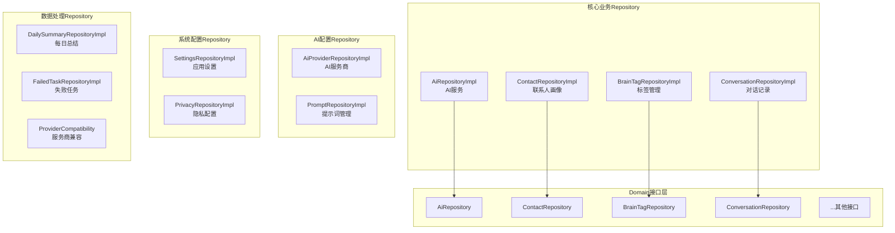
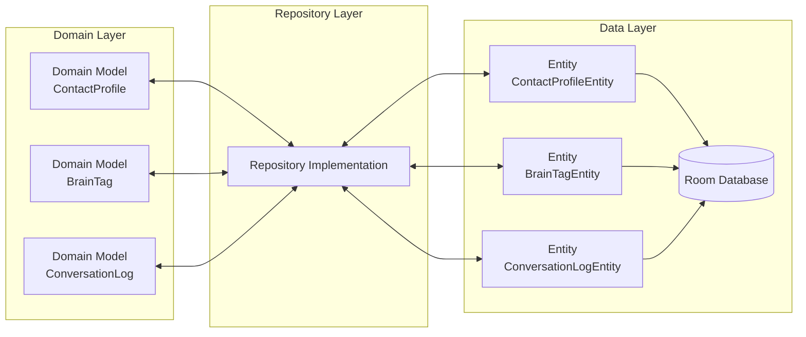

# Data Repository 模块文档

> [📁 返回上级](../../../CLAUDE.md) | [🏠 返回根目录](../../../../CLAUDE.md)

## 📋 模块概述

Data Repository模块是Clean Architecture中**数据访问层**的具体实现，负责将Domain层的抽象接口转换为具体的数据操作。这是连接纯Kotlin业务逻辑和Android数据存储的关键桥梁。

### 🎯 核心职责

- **数据访问抽象**: 实现Domain层定义的Repository接口
- **数据转换**: 在Entity和Domain Model之间进行双向转换
- **数据源协调**: 协调本地数据库、网络API、缓存等多数据源
- **错误处理**: 统一处理数据访问层的异常和错误场景

### 📊 统计信息

- **Repository实现**: 12个核心Repository实现
- **测试文件**: 7个测试文件（单元测试+集成测试）
- **代码质量**: 100%符合Clean Architecture依赖方向
- **数据覆盖**: 覆盖所有业务场景的数据需求

---

## 🏗️ 模块架构

### Repository分类架构



---

## 🔥 核心Repository详解

### 1. AiRepositoryImpl - AI服务仓库⭐
**文件位置**: `AiRepositoryImpl.kt`

**核心功能**:
- 多AI服务商的路由和调用
- API请求的构建和响应解析
- 网络重试机制和错误处理
- 支持OpenAI、DeepSeek、Claude等多服务商

**关键特性**:
```kotlin
// 带重试的API调用包装器
private suspend fun <T> withRetry(block: suspend () -> T): T {
    var lastException: Exception? = null
    repeat(MAX_RETRIES) { attempt ->
        try {
            return block()
        } catch (e: SocketTimeoutException) {
            // 指数退避策略：1秒、2秒、4秒
            val delayMs = INITIAL_DELAY_MS * (1 shl attempt)
            delay(delayMs)
        }
    }
}
```

**支持的AI服务**:
- OpenAI GPT系列
- DeepSeek Chat
- Claude (Anthropic)
- 其他兼容OpenAI API的服务商

### 2. ContactRepositoryImpl - 联系人画像仓库⭐
**文件位置**: `ContactRepositoryImpl.kt`

**核心功能**:
- 联系人画像的CRUD操作
- Facts数据的增量更新和合并
- 复杂数据类型的序列化/反序列化

**特色设计**:
```kotlin
// Facts合并算法
private fun mergeFacts(
    existingFacts: List<Fact>,
    newFacts: List<Fact>
): List<Fact> {
    // 按key分组，保留最新的value
    val factMap = existingFacts.associateBy { it.key }.toMutableMap()
    newFacts.forEach { fact -> factMap[fact.key] = fact }
    return factMap.values.toList()
}
```

**数据转换**:
- **Entity ↔ Domain**: 双向转换保持数据完整性
- **复杂类型**: Facts使用JSON序列化存储
- **类型安全**: 严格的数据验证和转换

### 3. ConversationRepositoryImpl - 对话记录仓库⭐
**文件位置**: `ConversationRepositoryImpl.kt`

**核心功能**:
- 对话记录的存储和查询
- 按日期范围查询支持
- 批量标记已总结状态

**查询优化**:
```sql
-- 按日期查询对话记录（使用索引优化）
SELECT * FROM conversation_logs
WHERE contact_id = :contactId
AND date(timestamp/1000, 'unixepoch', 'localtime') = :date
ORDER BY timestamp ASC
```

**性能特性**:
- **分页查询**: 支持大数据量的分页加载
- **索引优化**: contact_id、timestamp、is_summarized索引
- **批量操作**: 支持批量标记和清理

### 4. BrainTagRepositoryImpl - 标签管理仓库⭐
**文件位置**: `BrainTagRepositoryImpl.kt`

**核心功能**:
- 雷区标签和策略标签的管理
- 按联系人和类型查询
- 标签的确认和驳回功能

### 5. AiProviderRepositoryImpl - AI服务商仓库⭐
**文件位置**: `AiProviderRepositoryImpl.kt`

**核心功能**:
- 多AI服务商的配置管理
- 动态URL和API Key支持
- 服务商兼容性检查

### 6. PromptRepositoryImpl - 提示词仓库⭐
**文件位置**: `PromptRepositoryImpl.kt`

**核心功能**:
- 系统提示词和用户提示词管理
- 提示词模板和变量解析
- 文件存储和备份机制

### 7. 其他Repository

#### SettingsRepositoryImpl - 应用设置
- 应用偏好设置存储
- 功能开关管理
- 性能配置参数

#### PrivacyRepositoryImpl - 隐私配置
- 隐私映射规则管理
- 数据脱敏配置
- 安全策略设置

#### DailySummaryRepositoryImpl - 每日总结
- AI总结数据管理
- 按日期范围查询
- 总结冲突检测

---

## 🔗 数据流架构

### 数据转换流程



### 数据转换模式

#### 1. Entity → Domain转换
```kotlin
private fun entityToDomain(entity: ContactProfileEntity): ContactProfile {
    return ContactProfile(
        id = entity.id,
        name = entity.name,
        facts = factListConverter.toFactList(entity.factsJson),
        // ... 其他字段映射
    )
}
```

#### 2. Domain → Entity转换
```kotlin
private fun domainToEntity(profile: ContactProfile): ContactProfileEntity {
    return ContactProfileEntity(
        id = profile.id,
        name = profile.name,
        factsJson = factListConverter.fromFactList(profile.facts),
        // ... 其他字段映射
    )
}
```

---

## 🧪 测试架构

### 测试文件分布
```
test/
├── PromptRepositoryImplTest.kt              # 提示词仓库测试
├── AiRepositoryImplExtTest.kt               # AI仓库扩展测试
├── AiProviderRepositoryFetchModelsTest.kt    # AI服务商测试
└── AiProviderRepositoryThreadingTest.kt     # 并发测试

androidTest/
├── AiProviderRepositoryPropertyTest.kt       # 属性测试
├── FieldMappingConfigInstrumentedTest.kt     # 字段映射测试
└── GenerateReplyUseCaseIntegrationTest.kt    # 集成测试

test-disabled/
├── ContactRepositoryImplTest.kt              # 联系人测试(已禁用)
└── BrainTagRepositoryImplTest.kt             # 标签测试(已禁用)
```

### 测试策略
- **单元测试**: 每个Repository的核心CRUD操作
- **集成测试**: Repository与数据库的集成测试
- **并发测试**: 多线程环境下的数据一致性测试
- **Mock策略**: 使用Mock数据库隔离测试环境

---

## 🔗 依赖关系

### 依赖的Data Layer组件
```kotlin
// DAO依赖
private val contactDao: ContactDao
private val brainTagDao: BrainTagDao
private val conversationLogDao: ConversationLogDao
private val dailySummaryDao: DailySummaryDao

// 数据转换器
private val factListConverter: FactListConverter
private val moshi: Moshi                      // JSON序列化
private val apiKeyStorage: ApiKeyStorage      // 加密存储
```

### 依赖的Network组件
```kotlin
// API依赖
private val openAiApi: OpenAiApi
private val settingsRepository: SettingsRepository
```

---

## 🚀 设计模式与最佳实践

### 1. Repository模式
- **接口隔离**: Domain层定义抽象接口，Data层实现
- **依赖倒置**: 依赖抽象而非具体实现
- **单一职责**: 每个Repository专注一个数据领域

### 2. 数据转换模式
- **双向转换**: Entity ↔ Domain Model完整映射
- **类型安全**: 严格的数据类型检查和转换
- **零拷贝**: 避免不必要的对象创建

### 3. 错误处理模式
```kotlin
// 统一使用Result类型封装
override suspend fun saveProfile(profile: ContactProfile): Result<Unit> {
    return try {
        dao.insertOrUpdate(domainToEntity(profile))
        Result.success(Unit)
    } catch (e: Exception) {
        Result.failure(e)
    }
}
```

### 4. 异步处理模式
- **协程支持**: 所有操作都是suspend函数
- **调度器切换**: 使用Dispatchers.IO进行数据库操作
- **Flow响应**: 使用Flow提供响应式数据流

---

## 📈 性能优化

### 1. 数据库优化
```sql
-- 关键索引设计
CREATE INDEX idx_conversation_contact_date ON conversation_logs(contact_id, date(timestamp/1000, 'unixepoch'));
CREATE INDEX idx_daily_summary_contact_date ON daily_summaries(contact_id, summary_date);
```

### 2. 查询优化
- **分页查询**: 使用LIMIT和OFFSET避免大数据量
- **索引利用**: 充分利用数据库索引加速查询
- **批量操作**: 减少数据库访问次数

### 3. 内存优化
- **对象池**: 复用常用对象减少GC压力
- **懒加载**: 按需加载数据减少内存占用
- **缓存策略**: 实现多级缓存提升访问速度

---

## 🔒 安全设计

### 1. 数据加密
- **API Key加密**: 使用AndroidX Security加密存储
- **敏感数据脱敏**: 在存储前进行数据脱敏
- **传输加密**: HTTPS传输协议

### 2. 访问控制
- **权限验证**: 确保数据访问权限正确
- **数据隔离**: 不同数据源的访问隔离
- **审计日志**: 记录关键数据操作

---

## 📝 开发指南

### 新增Repository的标准模板

```kotlin
@Singleton
class NewFeatureRepositoryImpl @Inject constructor(
    private val dao: NewFeatureDao,
    private val converter: DataConverter
) : NewFeatureRepository {

    override suspend fun getData(id: String): Result<DataModel> {
        return try {
            val entity = dao.getById(id)
            Result.success(converter.toDomain(entity))
        } catch (e: Exception) {
            Result.failure(e)
        }
    }

    override suspend fun saveData(data: DataModel): Result<Unit> {
        return try {
            val entity = converter.toEntity(data)
            dao.insert(entity)
            Result.success(Unit)
        } catch (e: Exception) {
            Result.failure(e)
        }
    }
}
```

### 测试模板

```kotlin
@Test
fun `Repository - 保存数据 - 应该成功`() = runTest {
    // Given
    val mockDao = mockk<NewFeatureDao>()
    val repository = NewFeatureRepositoryImpl(mockDao, converter)

    // When
    val result = repository.saveData(testData)

    // Then
    assertTrue(result.isSuccess)
    verify { mockDao.insert(any()) }
}
```

---

## 🐛 已知问题与改进计划

### 当前技术债务
1. **test-disabled目录**: 部分测试文件被禁用，需要重新启用
2. **并发测试覆盖**: 需要增加更多并发场景测试
3. **性能监控**: 需要添加Repository层性能监控

### 改进方向
1. **缓存层增强**: 实现更智能的多级缓存策略
2. **数据同步**: 增加云端数据同步功能
3. **离线支持**: 增强离线模式下的数据处理能力

---

## 🔗 相关文档

- [Domain Layer](../../../domain/CLAUDE.md) - 业务逻辑层
- [Data Local](../local/CLAUDE.md) - 本地数据存储
- [Data Remote](../remote/CLAUDE.md) - 网络数据访问

---

**最后更新**: 2025-12-19
**模块负责人**: Data Team
**文档版本**: 1.0