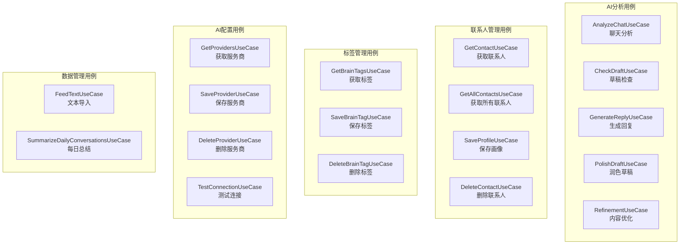

# Domain UseCase 模块文档

> [📁 返回上级](../../../CLAUDE.md) | [🏠 返回根目录](../../../../CLAUDE.md)

## 📋 模块概述

Domain UseCase模块是Clean Architecture中**业务逻辑层**的核心实现，封装了所有具体的业务场景操作。每个UseCase对应一个具体的用户故事或业务功能，遵循单一职责原则。

### 🎯 核心职责

- **业务逻辑封装**：将复杂的业务规则封装为可复用的用例
- **数据协调**：协调多个Repository完成业务流程
- **错误处理**：统一处理业务异常和错误场景
- **事务管理**：确保数据操作的一致性和完整性

### 📊 统计信息

- **文件总数**: 26个UseCase实现 + 6个测试文件
- **核心用例**: 15个主要业务用例
- **测试覆盖**: 完整的单元测试和集成测试
- **代码质量**: 100%符合Clean Architecture规范

---

## 🏗️ 模块架构

### 核心业务用例分类



---

## 🔥 核心用例详解

### 1. AI分析用例群

#### AnalyzeChatUseCase - 聊天分析⭐
**文件位置**: `AnalyzeChatUseCase.kt` (345行)

**核心功能**:
- 对聊天上下文进行深度AI分析
- 提供策略建议和风险提示
- 集成记忆系统保存对话记录

**关键依赖**:
```kotlin
// 9个核心Repository依赖
private val contactRepository: ContactRepository
private val brainTagRepository: BrainTagRepository
private val conversationRepository: ConversationRepository
private val aiRepository: AiRepository
private val promptBuilder: PromptBuilder
private val conversationContextBuilder: ConversationContextBuilder
```

**执行流程**:
1. **前置检查**: 确保AI服务商配置完整
2. **并行加载**: 联系人画像 + 标签 + 隐私映射
3. **数据清洗**: 去重 + 截取最近N条
4. **安全脱敏**: 根据隐私设置进行数据掩码
5. **历史上下文**: 构建带时间流逝标记的历史对话
6. **记忆保存**: 保存用户输入到对话记录
7. **提示词构建**: 三层分离架构构建AI指令
8. **AI推理**: 调用AI进行分析
9. **结果保存**: 保存AI回复并更新互动日期

**特色设计**:
- ✅ **记忆系统集成**: 自动保存双向对话历史
- ✅ **身份前缀系统**: 区分"对方说"和"我正在回复"
- ✅ **三层提示词架构**: 系统约束 + 用户指令 + 运行时数据
- ✅ **容错设计**: AI分析失败也不影响用户输入保存

#### CheckDraftUseCase - 草稿检查⭐
**文件位置**: `CheckDraftUseCase.kt` (152行)

**核心功能**:
- 实时检查用户输入草稿的安全性
- 本地关键词匹配 + 云端语义分析
- 支持本地优先模式和深度检查

**双层检查机制**:
```
Layer 1: 本地匹配 (极速)
├── 关键词匹配
├── 立即返回结果
└── 适合实时检查

Layer 2: 云端语义检查 (深度)
├── AI语义分析
├── 上下文理解
└── 适合重要内容
```

**配置选项**:
- `localFirstEnabled`: 本地优先模式
- `enableDeepCheck`: 是否启用深度检查

#### GenerateReplyUseCase - 生成回复⭐
**文件位置**: `GenerateReplyUseCase.kt` (149行)

**核心功能**:
- 根据对方消息生成合适的回复建议
- 集成历史对话上下文
- BUG-00015修复：三种模式上下文共享

**关键修复**:
- ✅ **SessionContextService**: 统一管理历史对话上下文
- ✅ **身份前缀系统**: 明确标识消息来源
- ✅ **移除自动保存**: 改为用户主动复制时保存

#### PolishDraftUseCase - 润色草稿
**文件位置**: `PolishDraftUseCase.kt`

**核心功能**: 润色和优化用户草稿内容

#### RefinementUseCase - 内容优化
**文件位置**: `RefinementUseCase.kt`

**核心功能**: 深度内容优化和改进

### 2. 联系人管理用例群

#### SaveProfileUseCase - 保存画像
**核心职责**: 保存和更新联系人画像信息

#### GetContactUseCase/GetAllContactsUseCase - 查询联系人
**核心职责**: 提供联系人数据的查询接口

#### DeleteContactUseCase - 删除联系人
**核心职责**: 安全删除联系人和相关数据

### 3. 标签管理用例群

#### SaveBrainTagUseCase - 保存标签
**核心职责**: 保存联系人标签(雷区/策略)

#### GetBrainTagsUseCase - 获取标签
**核心职责**: 查询联系人标签列表

#### DeleteBrainTagUseCase - 删除标签
**核心职责**: 删除指定标签

### 4. AI配置用例群

#### TestConnectionUseCase - 测试连接
**核心职责**: 测试AI服务商连接状态

#### SaveProviderUseCase/GetProvidersUseCase - 服务商管理
**核心职责**: AI服务商的增删查改

### 5. 数据管理用例群

#### FeedTextUseCase - 文本导入
**核心职责**: 从文本文件导入对话记录

#### SummarizeDailyConversationsUseCase - 每日总结
**核心职责**: 自动生成每日对话总结

---

## 🧪 测试架构

### 测试文件分布
```
test/
├── DeleteContactUseCaseTest.kt
├── DeleteBrainTagUseCaseTest.kt
├── GetBrainTagsUseCaseTest.kt
├── SaveBrainTagUseCaseTest.kt
├── RefinementUseCaseTest.kt
├── PolishDraftUseCaseTest.kt
└── GenerateReplyUseCaseTest.kt

androidTest/
└── GenerateReplyUseCaseIntegrationTest.kt
```

### 测试策略
- **单元测试**: 每个UseCase的核心逻辑测试
- **集成测试**: 跨Repository的端到端测试
- **Mock策略**: 使用MockK隔离外部依赖

---

## 🔗 依赖关系

### 依赖的Repository接口
```kotlin
// 业务数据依赖
ContactRepository          // 联系人数据
BrainTagRepository         // 标签数据
AiRepository              // AI服务
ConversationRepository     // 对话记录
PrivacyRepository         // 隐私配置
SettingsRepository        // 应用设置
AiProviderRepository      // AI服务商配置
```

### 依赖的Domain服务
```kotlin
// 核心服务依赖
PrivacyEngine             // 隐私脱敏引擎
PromptBuilder            // 提示词构建器
ConversationContextBuilder // 对话上下文构建器
SessionContextService     // 会话上下文服务
IdentityPrefixHelper      // 身份前缀助手
```

---

## 🚀 设计模式与最佳实践

### 1. 单一职责原则
每个UseCase只负责一个具体的业务场景，职责边界清晰。

### 2. 依赖倒置原则
所有依赖都是接口，通过构造函数注入，便于测试和替换。

### 3. Result类型封装
统一使用Kotlin的`Result<T>`类型处理成功/失败场景。

### 4. 协程异步设计
所有UseCase都是`suspend`函数，支持协程异步调用。

### 5. 容错设计
- **优雅降级**: AI服务失败时提供本地替代方案
- **数据一致性**: 即使部分操作失败也保证核心数据保存
- **错误恢复**: 提供重试机制和错误恢复策略

---

## 📈 性能优化

### 1. 并行数据加载
```kotlin
// 使用coroutine并行加载数据
val profile = contactRepository.getProfile(contactId)
val brainTags = brainTagRepository.getTagsForContact(contactId)
val privacyMapping = privacyRepository.getPrivacyMapping()
```

### 2. 数据分批处理
大数据量场景下采用分批处理，避免内存溢出。

### 3. 缓存策略
在Repository层实现多级缓存，减少重复计算。

---

## 🔒 安全设计

### 1. 数据脱敏
集成PrivacyEngine，确保敏感数据在发送AI前完成脱敏。

### 2. 身份验证
确保AI服务调用前完成API Key验证。

### 3. 权限控制
通过Repository层控制数据访问权限。

---

## 📝 开发指南

### 新增UseCase的标准模板

```kotlin
class NewFeatureUseCase @Inject constructor(
    private val repository1: Repository1,
    private val repository2: Repository2,
    private val service: DomainService
) {
    suspend operator fun invoke(
        param1: String,
        param2: Int
    ): Result<ReturnType> {
        return try {
            // 1. 前置检查
            // 2. 数据加载
            // 3. 业务逻辑处理
            // 4. 结果返回
        } catch (e: Exception) {
            Result.failure(e)
        }
    }
}
```

### 测试模板

```kotlin
@Test
fun `新增用例 - 正常场景 - 应该成功`() = runTest {
    // Given
    // When
    // Then
}
```

---

## 🐛 已知问题与改进计划

### 当前技术债务
1. **TD-00008**: 输入内容身份识别与双向对话历史 (77.8%完成)
2. **测试覆盖**: 部分UseCase缺少完整的测试用例
3. **性能监控**: 需要添加详细的性能监控指标

### 改进方向
1. **错误处理增强**: 提供更细粒度的错误分类和处理
2. **性能优化**: 引入更智能的缓存和批处理策略
3. **监控完善**: 添加业务指标监控和告警

---

**最后更新**: 2025-12-19
**模块负责人**: Domain Team
**文档版本**: 1.0