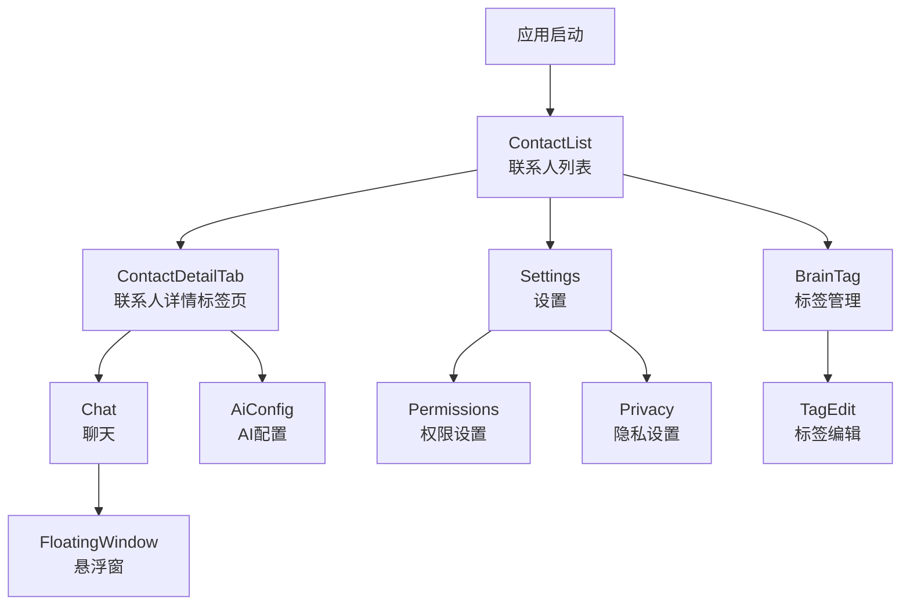

# Presentation Navigation - 导航系统模块

[根目录](../../../../CLAUDE.md) > [app](../../../) > [presentation](../../) > [navigation](../) > **navigation**

## 模块职责

Presentation Navigation模块负责管理应用的页面导航和路由系统，使用Jetpack Navigation Compose实现声明式的导航逻辑。该模块定义了应用的所有导航路径、页面间的跳转关系和参数传递机制。

## 核心组件

### 1. NavGraph - 应用导航图
- **文件**: `NavGraph.kt`
- **职责**: 定义应用的整体导航结构
- **功能**:
  - 设置导航宿主（NavHost）
  - 定义起始页面
  - 配置所有页面路由
  - 处理页面间参数传递

**支持的页面**:
- 联系人列表页 (ContactListScreen)
- 联系人详情页 (ContactDetailScreen)
- 联系人详情标签页 (ContactDetailTabScreen)
- 聊天页面 (ChatScreen)
- AI配置页 (AiConfigScreen)
- 设置页面 (SettingsScreen)
- 标签管理页 (BrainTagScreen)

### 2. NavRoutes - 导航路由定义
- **文件**: `NavRoutes.kt`
- **职责**: 定义所有导航路由常量
- **功能**:
  - 定义路由路径常量
  - 提供路由参数占位符
  - 创建带参数的路由

**路由常量示例**:
```kotlin
object NavRoutes {
    const val CONTACT_LIST = "contact_list"
    const val CONTACT_DETAIL = "contact_detail"
    const val CONTACT_DETAIL_TAB = "contact_detail_tab"
    const val CHAT = "chat"
    const val AI_CONFIG = "ai_config"
    const val SETTINGS = "settings"
    const val BRAIN_TAG = "brain_tag"

    // 带参数的路由创建方法
    fun createContactDetailRoute(contactId: String): String
    fun createContactDetailTabRoute(contactId: String): String
    fun createChatRoute(contactId: String): String
}
```

### 3. PromptEditorNavigation - 提示词编辑器导航
- **文件**: `PromptEditorNavigation.kt`
- **职责**: 提示词编辑器相关的导航逻辑
- **功能**:
  - 管理提示词编辑器的导航状态
  - 处理编辑器内部页面切换
  - 支持编辑器的模态导航

## 导航架构

### 导航层次结构


### 参数传递机制
1. **必需参数**: 使用路径参数（如 `/{contactId}`）
2. **可选参数**: 使用查询参数（如 `?mode=edit`）
3. **复杂对象**: 使用ViewModel共享状态

## 使用示例

### 基本导航示例
```kotlin
// 在Screen中导航到其他页面
@Composable
fun ContactListScreen(
    onNavigateToDetail: (String) -> Unit,
    onNavigateToSettings: () -> Unit
) {
    LazyColumn {
        items(contacts) { contact ->
            ContactItem(
                onClick = {
                    // 导航到联系人详情
                    onNavigateToDetail(contact.id)
                }
            )
        }
    }

    FloatingActionButton(
        onClick = onNavigateToSettings
    ) {
        Icon(Icons.Default.Settings, "设置")
    }
}
```

### 带参数的导航
```kotlin
// 在ViewModel中处理导航
class ContactListViewModel : ViewModel() {
    private val _navigationEvent = MutableSharedFlow<NavigationEvent>()
    val navigationEvent = _navigationEvent.asSharedFlow()

    fun onContactClick(contactId: String) {
        viewModelScope.launch {
            _navigationEvent.emit(
                NavigationEvent.NavigateToContactDetail(contactId)
            )
        }
    }
}

// 在Composable中监听导航事件
@Composable
fun ContactListScreen(
    viewModel: ContactListViewModel,
    navController: NavController
) {
    LaunchedEffect(Unit) {
        viewModel.navigationEvent.collect { event ->
            when (event) {
                is NavigationEvent.NavigateToContactDetail -> {
                    navController.navigate(
                        NavRoutes.createContactDetailTabRoute(event.contactId)
                    )
                }
            }
        }
    }
}
```

### 返回导航处理
```kotlin
// 处理返回按钮
@Composable
fun ContactDetailScreen(
    navController: NavController
) {
    TopAppBar(
        navigationIcon = {
            IconButton(
                onClick = { navController.popBackStack() }
            ) {
                Icon(Icons.Default.ArrowBack, "返回")
            }
        }
    )
}
```

## 导航最佳实践

### 1. 路由命名规范
- 使用常量定义路由，避免硬编码
- 路由名使用下划线分隔
- 保持路由名称语义化

### 2. 参数处理
- 使用路径参数传递必需ID
- 使用ViewModel共享复杂状态
- 验证参数的有效性

### 3. 导航事件管理
- 使用SharedFlow或Channel传递导航事件
- 在ViewModel中决定导航逻辑
- 保持UI层的状态无关性

### 4. 深度链接支持
```kotlin
// 支持深度链接的导航
composable(
    route = NavRoutes.CONTACT_DETAIL,
    arguments = listOf(
        navArgument("contactId") {
            type = NavType.StringType
            nullable = false
        }
    ),
    deepLinks = listOf(
        navDeepLink {
            uriPattern = "https://empathy.ai/contact/{contactId}"
        }
    )
) { backStackEntry ->
    val contactId = backStackEntry.arguments?.getString("contactId")
    ContactDetailScreen(contactId = contactId)
}
```

## 高级特性

### 1. 条件导航
```kotlin
// 根据条件决定导航
@Composable
fun ConditionalNavigation(
    hasPermission: Boolean,
    navController: NavController
) {
    LaunchedEffect(hasPermission) {
        if (!hasPermission) {
            navController.navigate(NavRoutes.PERMISSION_REQUEST)
        }
    }
}
```

### 2. 导航结果返回
```kotlin
// 从目标页面返回结果
navController.previousBackStackEntry
    ?.savedStateHandle
    ?.set("result_key", result)

navController.popBackStack()

// 在源页面接收结果
val result by navController.currentBackStackEntry
    ?.savedStateHandle
    ?.getLiveData<String>("result_key")
    ?.observeAsState()
```

### 3. 嵌套导航
```kotlin
// 创建嵌套导航图
navigation(
    startDestination = "tab1",
    route = "main"
) {
    composable("tab1") { /* Tab1内容 */ }
    composable("tab2") { /* Tab2内容 */ }
    composable("tab3") { /* Tab3内容 */ }
}
```

## 测试策略

### 1. 导航测试
```kotlin
@Test
fun testNavigationToContactDetail() {
    val navController = TestNavController()

    // 触发导航动作
    viewModel.onContactClick("123")

    // 验证导航
    assertEquals(
        NavRoutes.createContactDetailRoute("123"),
        navController.currentDestination?.route
    )
}
```

### 2. 参数传递测试
```kotlin
@Test
fun testParameterPassing() {
    val navController = TestNavController()
    navController.navigate(
        NavRoutes.createContactDetailRoute("contact123")
    )

    val contactId = navController.currentBackStackEntry
        ?.arguments
        ?.getString("contactId")

    assertEquals("contact123", contactId)
}
```

## 常见问题

### 1. 导航状态丢失
- **问题**: 配置更改时导航状态丢失
- **解决**: 使用SavedStateHandle保存必要状态

### 2. 循环导航
- **问题**: 页面间相互导航导致循环
- **解决**: 明确导航流程，避免不必要的返回

### 3. 参数传递复杂
- **问题**: 复杂对象难以通过导航传递
- **解决**: 使用ViewModel或Repository共享状态

## 相关文件清单

- NavGraph.kt - 应用导航图定义
- NavRoutes.kt - 导航路由常量
- PromptEditorNavigation.kt - 提示词编辑器导航逻辑

## 变更记录 (Changelog)

### 2025-12-20 - Claude (模块文档创建)
- **创建presentation/navigation模块文档**
- **记录导航系统的核心组件和使用方式**
- **提供导航最佳实践和测试策略**