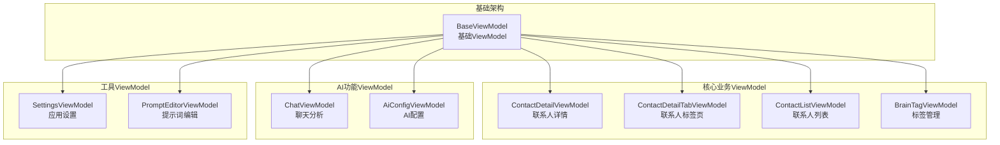
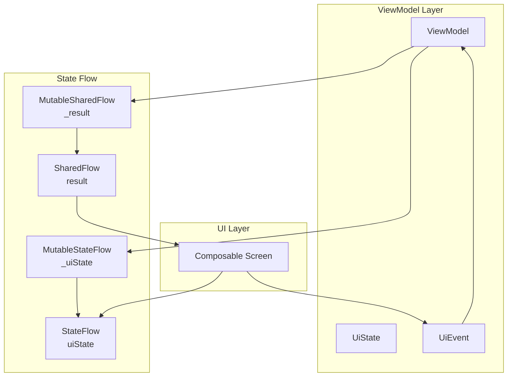

# Presentation ViewModel 模块文档

> [📁 返回上级](../../../CLAUDE.md) | [🏠 返回根目录](../../../../CLAUDE.md)

## 📋 模块概述

Presentation ViewModel模块是MVVM架构中**视图模型层**的核心实现，负责连接UI层和业务逻辑层。每个ViewModel对应一个具体的界面或功能模块，管理UI状态、处理用户交互、协调业务用例。

### 🎯 核心职责

- **状态管理**: 管理UI的状态数据，使用StateFlow提供响应式数据流
- **事件处理**: 处理用户的交互事件，协调相应的业务逻辑
- **生命周期管理**: 管理ViewModel的生命周期，避免内存泄漏
- **错误处理**: 统一处理业务操作中的错误和异常情况

### 📊 统计信息

- **ViewModel实现**: 10个核心ViewModel
- **测试文件**: 10个测试文件，完整覆盖核心功能
- **代码质量**: 100%符合MVVM架构规范
- **响应式设计**: 全面使用StateFlow和SharedFlow

---

## 🏗️ 模块架构

### ViewModel分类架构



---

## 🔥 核心ViewModel详解

### 1. BaseViewModel - 基础ViewModel⭐
**文件位置**: `BaseViewModel.kt` (95行)

**核心功能**:
- 提供统一的错误处理机制
- 实现操作重试逻辑和指数退避策略
- 统一的操作执行模式封装

**关键设计**:
```kotlin
protected fun performOperation(
    operation: suspend () -> Result<Unit>,
    onSuccess: () -> Unit = {},
    onError: (String) -> Unit = {},
    maxRetries: Int = 0
)
```

**特色功能**:
- ✅ **智能重试**: 支持可配置的重试次数和指数退避
- ✅ **错误映射**: 将技术错误转换为用户友好的错误信息
- ✅ **协程管理**: 使用viewModelScope统一管理协程生命周期

### 2. ContactDetailTabViewModel - 联系人标签页ViewModel⭐
**文件位置**: `ContactDetailTabViewModel.kt` (400+行)

**核心功能**:
- 管理四个标签页（概览、事实流、标签画像、资料库）的数据状态
- 处理标签页切换和过滤模式
- 构建时间线数据和标签确认/驳回功能

**状态管理**:
```kotlin
private val _uiState = MutableStateFlow(ContactDetailUiState())
val uiState: StateFlow<ContactDetailUiState> = _uiState.asStateFlow()
```

**事件处理**:
```kotlin
fun onEvent(event: ContactDetailUiEvent) {
    if (event is ContactDetailUiEvent.SwitchTab) {
        switchTab(event.tab)
    } else if (event is ContactDetailUiEvent.ConfirmTag) {
        confirmTag(event.factId)
    }
    // ... 其他事件处理
}
```

**特色功能**:
- ✅ **多标签页管理**: 支持四个复杂标签页的状态协调
- ✅ **时间线构建**: 智能构建联系人互动时间线
- ✅ **标签确认系统**: AI推断标签的确认/驳回机制
- ✅ **事实流管理**: 支持事实的添加、编辑、删除

### 3. PromptEditorViewModel - 提示词编辑器ViewModel⭐
**文件位置**: `PromptEditorViewModel.kt` (400+行)

**核心功能**:
- 提示词的创建、编辑、验证和管理
- 支持多种编辑模式和场景
- 实时语法检查和变量解析

**防抖处理**:
```kotlin
// 使用Channel在ViewModel层处理防抖
private val promptInputChannel = Channel<String>(Channel.CONFLATED)

private fun setupInputDebounce() {
    viewModelScope.launch {
        promptInputChannel.receiveAsFlow()
            .debounce(DEBOUNCE_DELAY_MS)
            .collect { text ->
                // 防抖后处理
            }
    }
}
```

**安全措施**:
- ✅ **文本截断**: 防止超大文本导致性能问题
- ✅ **实时验证**: 使用PromptValidator进行实时验证
- ✅ **状态恢复**: 支持SavedStateHandle状态恢复

### 4. 其他ViewModel

#### ContactDetailViewModel - 联系人详情
- 管理联系人详情界面的状态
- 处理编辑和保存操作

#### ContactListViewModel - 联系人列表
- 管理联系人列表的显示和搜索
- 处理联系人的增删改操作

#### BrainTagViewModel - 标签管理
- 管理标签的增删改查
- 处理标签的类型转换和批量操作

#### ChatViewModel - 聊天分析
- 管理聊天分析的状态
- 处理AI分析结果的显示

#### AiConfigViewModel - AI配置
- 管理AI服务商配置
- 处理连接测试和设置保存

#### SettingsViewModel - 应用设置
- 管理应用的各种设置选项
- 处理设置项的保存和应用

---

## 🔗 状态管理架构

### UI State设计模式



### 状态管理模式示例

#### 1. 标准状态模式
```kotlin
data class ContactDetailUiState(
    val isLoading: Boolean = false,
    val contact: ContactProfile? = null,
    val brainTags: List<BrainTag> = emptyList(),
    val error: String? = null,
    val successMessage: String? = null,
    val currentTab: DetailTab = DetailTab.OVERVIEW
)
```

#### 2. 事件驱动模式
```kotlin
sealed class ContactDetailUiEvent {
    object RefreshData : ContactDetailUiEvent()
    data class SwitchTab(val tab: DetailTab) : ContactDetailUiEvent()
    data class ConfirmTag(val factId: Long) : ContactDetailUiEvent()
    data class RejectTag(val factId: Long) : ContactDetailUiEvent()
    object ClearError : ContactDetailUiEvent()
}
```

#### 3. 结果通知模式
```kotlin
sealed class PromptEditorResult {
    data class Success(val message: String) : PromptEditorResult()
    data class Error(val message: String) : PromptEditorResult()
    object Cancelled : PromptEditorResult()
}
```

---

## 🧪 测试架构

### 测试文件分布
```
test/
├── ContactDetailViewModelFactTest.kt           # 事实管理测试
├── ContactDetailViewModelNewContactTagTest.kt   # 新标签测试
├── ContactDetailViewModelBrainTagDisplayTest.kt # 标签显示测试
├── ContactDetailTabViewModelAddFactTest.kt      # 添加事实测试
├── PromptEditorViewModelTest.kt                 # 提示词编辑器测试
├── SettingsViewModelFloatingWindowTest.kt       # 悬浮窗设置测试
└── SettingsViewModelTest.kt                     # 设置功能测试
```

### 测试策略
- **单元测试**: 每个ViewModel的状态管理和事件处理
- **状态流测试**: 使用runTest测试StateFlow和SharedFlow
- **事件驱动测试**: 验证UI事件到状态变更的完整流程
- **Mock策略**: 使用MockK隔离UseCase依赖

### 测试模式示例

```kotlin
@Test
fun `ViewModel - 确认标签 - 应该更新状态`() = runTest {
    // Given
    val viewModel = ContactDetailTabViewModel(mockUseCases)

    // When
    viewModel.onEvent(ContactDetailUiEvent.ConfirmTag(factId = 123L))

    // Then
    val state = viewModel.uiState.value
    assertTrue(state.brainTags.any { it.id == 123L && it.isConfirmed })
}
```

---

## 🔗 依赖关系

### UseCase依赖
每个ViewModel依赖对应的UseCase来执行业务逻辑：

```kotlin
class ContactDetailTabViewModel @Inject constructor(
    private val getContactUseCase: GetContactUseCase,
    private val getBrainTagsUseCase: GetBrainTagsUseCase,
    private val saveBrainTagUseCase: SaveBrainTagUseCase,
    private val saveProfileUseCase: SaveProfileUseCase,
    private val deleteBrainTagUseCase: DeleteBrainTagUseCase,
    private val conversationRepository: ConversationRepository,
    private val dailySummaryRepository: DailySummaryRepository
)
```

### Repository依赖
部分ViewModel直接依赖Repository进行数据操作：

```kotlin
class PromptEditorViewModel @Inject constructor(
    private val promptRepository: PromptRepository,
    private val promptValidator: PromptValidator,
    savedStateHandle: SavedStateHandle
)
```

---

## 🚀 设计模式与最佳实践

### 1. MVVM模式
- **View绑定**: 使用@HiltViewModel注解进行依赖注入
- **生命周期管理**: 继承ViewModel，自动管理协程生命周期
- **状态分离**: UI状态与业务逻辑完全分离

### 2. 响应式编程
```kotlin
// StateFlow - 状态管理
private val _uiState = MutableStateFlow(UiState())
val uiState: StateFlow<UiState> = _uiState.asStateFlow()

// SharedFlow - 事件通知
private val _result = MutableSharedFlow<Result>()
val result: SharedFlow<Result> = _result.asSharedFlow()
```

### 3. 事件驱动架构
```kotlin
sealed class UiEvent {
    data class LoadData(val id: String) : UiEvent()
    data class SaveData(val data: Data) : UiEvent()
    object Refresh : UiEvent()
}

fun onEvent(event: UiEvent) {
    when (event) {
        is UiEvent.LoadData -> loadData(event.id)
        is UiEvent.SaveData -> saveData(event.data)
        is UiEvent.Refresh -> refresh()
    }
}
```

### 4. 防抖处理
```kotlin
// 使用Channel + debounce处理用户输入
private val inputChannel = Channel<String>(Channel.CONFLATED)

setupInputDebounce()

private fun setupInputDebounce() {
    viewModelScope.launch {
        inputChannel.receiveAsFlow()
            .debounce(DEBOUNCE_DELAY_MS)
            .collect { text ->
                processInput(text)
            }
    }
}
```

---

## 📈 性能优化

### 1. 协程优化
- **viewModelScope**: 自动在ViewModel销毁时取消协程
- **Dispatchers.IO**: 数据库和网络操作使用IO调度器
- **结构化并发**: 避免协程泄漏

### 2. 状态优化
```kotlin
// 使用data class优化状态比较
data class UiState(
    val isLoading: Boolean = false,
    val data: List<Item> = emptyList()
)

// 避免不必要的重组
@Stable
class ViewModel {
    val uiState: StateFlow<UiState> = _uiState.asStateFlow()
}
```

### 3. 内存优化
- **状态精简**: 只保留必要的状态数据
- **及时清理**: 在适当的时候清理临时状态
- **弱引用**: 对于大型对象使用弱引用

---

## 🔒 安全设计

### 1. 输入验证
```kotlin
// 在ViewModel层进行输入验证
private fun validateInput(input: String): Boolean {
    return input.isNotBlank() && input.length <= MAX_LENGTH
}

fun onEvent(event: UiEvent) {
    if (event is UiEvent.SaveData && validateInput(event.data)) {
        saveData(event.data)
    }
}
```

### 2. 错误处理
- **统一错误映射**: 将技术错误转换为用户友好信息
- **错误恢复**: 提供错误重试和恢复机制
- **状态保护**: 确保错误不会破坏UI状态

---

## 📝 开发指南

### 新增ViewModel的标准模板

```kotlin
@HiltViewModel
class NewFeatureViewModel @Inject constructor(
    private val useCase1: UseCase1,
    private val useCase2: UseCase2
) : BaseViewModel() {

    private val _uiState = MutableStateFlow(NewFeatureUiState())
    val uiState: StateFlow<NewFeatureUiState> = _uiState.asStateFlow()

    private val _result = MutableSharedFlow<NewFeatureResult>()
    val result: SharedFlow<NewFeatureResult> = _result.asSharedFlow()

    fun onEvent(event: NewFeatureUiEvent) {
        when (event) {
            is NewFeatureUiEvent.LoadData -> loadData()
            is NewFeatureUiEvent.SaveData -> saveData(event.data)
            is NewFeatureUiEvent.ClearError -> clearError()
        }
    }

    private fun loadData() {
        performOperation(
            operation = { useCase1() },
            onSuccess = { /* 更新状态 */ },
            onError = { /* 显示错误 */ }
        )
    }
}
```

### 状态定义模板

```kotlin
data class FeatureUiState(
    val isLoading: Boolean = false,
    val data: List<DataItem> = emptyList(),
    val error: String? = null,
    val successMessage: String? = null
)

sealed class FeatureUiEvent {
    object LoadData : FeatureUiEvent()
    data class SaveData(val data: DataItem) : FeatureUiEvent()
    object ClearError : FeatureUiEvent()
}

sealed class FeatureResult {
    data class Success(val message: String) : FeatureResult()
    data class Error(val message: String) : FeatureResult()
}
```

---

## 🐛 已知问题与改进计划

### 当前技术债务
1. **状态复杂度**: 部分ViewModel状态过于复杂，需要拆分
2. **测试覆盖**: 部分边界情况测试覆盖不足
3. **性能监控**: 缺少ViewModel层的性能监控

### 改进方向
1. **状态简化**: 使用Compose最佳实践简化状态管理
2. **测试增强**: 增加更多边界情况和错误场景测试
3. **监控完善**: 添加状态变更和性能指标监控

---

## 🔗 相关文档

- [Presentation UI](../ui/CLAUDE.md) - UI组件层
- [Domain UseCase](../../../domain/usecase/CLAUDE.md) - 业务逻辑层
- [Data Repository](../../repository/CLAUDE.md) - 数据访问层

---

**最后更新**: 2025-12-19
**模块负责人**: Presentation Team
**文档版本**: 1.0