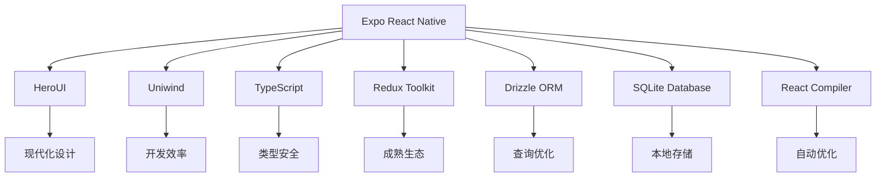
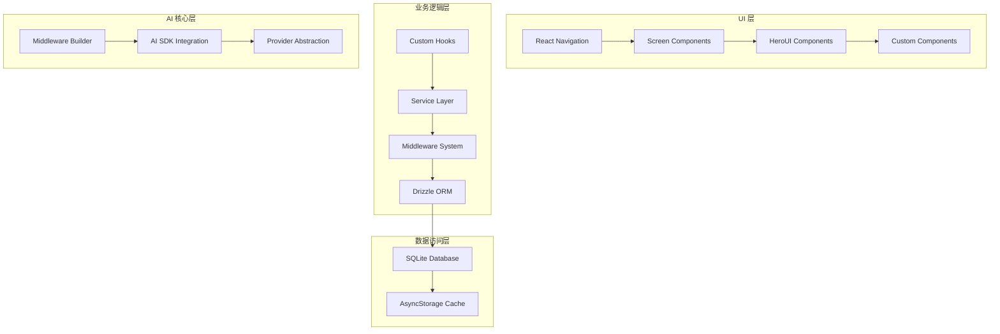

# Cherry Studio 架构分析报告

## 📋 执行摘要

本报告基于对 Cherry Studio 项目的深入分析，涵盖了项目的技术栈选择、架构模式、设计决策以及潜在改进方向。分析重点关注了项目的整体架构设计理念、各模块的组织方式、以及技术选型的合理性。

---

## 🏗️ 项目概览

**项目名称**: Cherry Studio App  
**项目类型**: React Native 移动应用  
**核心定位**: AI 对话助手移动端应用  
**技术栈**: Expo + TypeScript + HeroUI + Uniwind + React Compiler  

---

## 📊 技术栈分析

### 核心技术选型

| 技术领域 | 选择 | 优势 | 潜在风险 |
|---------|------|------|---------|
| **框架** | Expo React Native | 快速开发、跨平台兼容、丰富生态 | Expo 依赖更新可能带来兼容性问题 |
| **UI 组件库** | HeroUI | 现代化设计、完整组件生态 | 相对较新，社区资源有限 |
| **样式方案** | Uniwind (Tailwind) | 原子化 CSS、开发效率高 | 学习成本、调试复杂度 |
| **状态管理** | Redux Toolkit | 成熟稳定、开发工具完善 | 样板代码较多、性能开销 |
| **数据库** | Drizzle ORM + SQLite | 类型安全、查询优化 | 复杂查询性能瓶颈 |
| **编译优化** | React Compiler | 自动优化、减少手动 memo | 新技术、生态成熟度待验证 |

### 技术栈兼容性评估

---

## 🏛️ 架构设计模式

### 1. 整体架构理念

Cherry Studio 采用了 **分层架构 + 模块化设计**的理念，体现了"Slow is Fast"的开发哲学：

- **关注点分离**: 业务逻辑与 UI 层清晰分离
- **组件抽象**: 高度可复用的组件设计
- **类型安全**: 全面的 TypeScript 类型系统
- **跨端兼容**: 基于 Expo 的统一跨平台方案

### 2. 核心架构层次

---

## 📁 详细模块分析

### 1. 导航架构 (Navigation Architecture)

**设计模式**: 层次化导航结构
**核心文件**: [`src/navigators/`](src/navigators/)

**架构特点**:
- **四层导航体系**: Main → AppDrawer → 功能模块 → 子功能
- **类型安全**: 完整的 TypeScript 参数定义
- **用户体验优化**: 统一过渡动画、手势支持

**优势**:
- 清晰的功能分层
- 良好的代码组织
- 易于扩展和维护

**潜在问题**:
- 导航层级较深 (最多4层)
- 状态管理复杂度高

### 2. 数据库架构 (Database Architecture)

**设计模式**: 多数据库分离 + ORM 模式
**核心文件**: [`src/database/`](src/database/)

**架构特点**:
- **数据库分离**: 按业务领域分离 (Assistant, Message, Topic, Provider 等)
- **ORM 抽象**: Drizzle 提供类型安全的查询接口
- **查询分离**: 业务查询与数据库访问分离

**优势**:
- 类型安全的数据库操作
- 清晰的业务领域划分
- 易于测试和维护

**潜在问题**:
- 多数据库管理复杂度
- 查询性能可能成为瓶颈
- 数据迁移复杂

### 3. 服务层架构 (Service Layer Architecture)

**设计模式**: 单例服务 + 缓存策略
**核心文件**: [`src/services/`](src/services/)

**架构特点**:
- **单例模式**: 确保全局状态一致性
- **多层缓存**: 系统助手缓存 + LRU 缓存 + 持久化缓存
- **乐观更新**: 立即 UI 响应 + 后台持久化
- **订阅发布**: 完整的响应式状态管理

**代表服务**: [`AssistantService.ts`](src/services/AssistantService.ts) - 902行代码，展现了复杂的状态管理

**优势**:
- 高性能的缓存策略
- 优秀的用户体验 (乐观更新)
- 完整的错误处理和回滚机制
- 类型安全的状态管理

**潜在问题**:
- 服务类过于复杂 (如 AssistantService)
- 内存占用可能较高
- 状态同步复杂度高

### 4. 状态管理 (State Management)

**设计模式**: Redux Toolkit + 持久化
**核心文件**: [`src/store/`](src/store/)

**架构特点**:
- **Redux Toolkit**: 现代化的状态管理
- **自动持久化**: redux-persist 集成
- **类型安全**: 完整的 TypeScript 类型定义

**优势**:
- 成熟稳定的状态管理方案
- 优秀的开发工具支持
- 时间旅行调试功能

**潜在问题**:
- Redux 样板代码较多
- 学习曲线相对陡峭
- 可能存在性能开销

### 5. AI 核心中间件系统 (AI Core Middleware)

**设计模式**: 建造者模式 + 动态中间件链
**核心文件**: [`src/aiCore/middleware/`](src/aiCore/middleware/)

**架构特点**:
- **建造者模式**: 动态构建中间件链
- **条件中间件**: 根据模型、Provider、功能动态添加
- **类型安全**: 完整的 TypeScript 中间件类型定义

**优势**:
- 高度可扩展的中间件系统
- 类型安全的中间件执行
- 支持复杂的 AI 功能组合

**潜在问题**:
- 中间件执行顺序复杂
- 调试难度较高
- 性能开销可能较大

### 6. 组件架构 (Component Architecture)

**设计模式**: 复合组件 + Context 模式
**核心文件**: [`src/componentsV2/`](src/componentsV2/)

**架构特点**:
- **复合组件**: 如 MessageInput - 高度可复用的输入组件
- **Context 模式**: 通过 React Context 共享状态
- **Hook 抽象**: 业务逻辑抽象为自定义 Hooks

**代表组件**: [`MessageInput`](src/componentsV2/features/ChatScreen/MessageInput/) - 完整的复合组件架构

**优势**:
- 高度可复用的组件设计
- 清晰的状态管理
- 易于测试和维护

**潜在问题**:
- 组件复杂度较高
- 学习成本较高
- Context 依赖可能复杂

---

## 🎯 架构优势分析

### 1. 技术选型优势

1. **现代化技术栈**: Expo + React Compiler + HeroUI + Uniwind 的组合体现了对现代开发趋势的把握
2. **类型安全优先**: 全面的 TypeScript 类型系统确保了代码质量和开发效率
3. **跨端兼容性**: Expo 提供了统一的跨平台解决方案

### 2. 架构设计优势

1. **关注点分离**: 清晰的分层架构便于维护和测试
2. **高内聚低耦合**: 各模块职责明确，依赖关系清晰
3. **可扩展性**: 中间件系统和插件化设计支持功能扩展

### 3. 开发体验优势

1. **React Compiler**: 自动优化减少手动性能调优工作
2. **缓存策略**: 多层缓存提供优秀的用户体验
3. **开发工具**: 完整的开发工具链支持高效开发

---

## ⚠️ 潜在问题与风险

### 1. 技术风险

1. **React Compiler**: 新技术，生态成熟度待验证
2. **Expo 依赖**: 版本升级可能带来兼容性问题
3. **HeroUI**: 相对较新的组件库，社区资源有限

### 2. 架构复杂度风险

1. **过度工程化**: 某些服务类过于复杂 (如 AssistantService 902行)
2. **状态管理复杂**: 多层状态管理可能导致调试困难
3. **性能瓶颈**: 多数据库和复杂缓存策略可能影响性能

### 3. 维护性风险

1. **学习成本**: 复杂的架构需要较长的学习时间
2. **测试复杂度**: 多层抽象增加了测试的复杂度
3. **文档维护**: 需要维护大量的架构文档

---

## 🔧 关键架构决策点

### 1. 数据库架构决策

**当前选择**: 多数据库 + Drizzle ORM  
**决策依据**: 业务领域分离 + 类型安全  
**替代方案**: 考虑简化为单一数据库 + 分层 Repository 模式

### 2. 状态管理决策

**当前选择**: Redux Toolkit + redux-persist  
**决策依据**: 成熟稳定 + 工具完善  
**替代方案**: 考虑 Zustand 或 Jotai 等更轻量的方案

### 3. 组件架构决策

**当前选择**: 复合组件 + Context  
**决策依据**: 复用性 + 状态管理  
**替代方案**: 考虑原子化组件设计

### 4. AI 中间件系统决策

**当前选择**: 建造者模式 + 动态链  
**决策依据**: 可扩展性 + 功能组合  
**替代方案**: 考虑简化为固定中间件链 + 插件系统

---

## 📋 架构讨论重点议程

### 1. 架构简化讨论

- **服务层复杂度**: AssistantService 等服务类是否过于复杂？
- **数据库设计**: 多数据库分离的必要性评估
- **状态管理**: Redux 是否为最佳选择？

### 2. 性能优化讨论

- **缓存策略**: 多层缓存的性能影响
- **React Compiler**: 实际效果评估
- **数据库查询**: Drizzle 查询优化策略

### 3. 开发体验讨论

- **组件复用**: 如何提高组件的复用性？
- **类型安全**: TypeScript 严格模式执行效果
- **开发工具**: 当前工具链的完善程度

### 4. 未来扩展性讨论

- **插件系统**: AI 中间件插件化可能性
- **模块化**: 如何进一步模块化架构？
- **跨平台**: Web 端架构的可行性

---

## 💡 建议的改进方向

### 1. 短期改进 (1-3个月)

1. **服务层简化**: 重构 AssistantService 等复杂服务类
2. **性能监控**: 添加性能监控和指标收集
3. **文档完善**: 补充架构决策文档和最佳实践
4. **测试覆盖**: 提高关键模块的测试覆盖率

### 2. 中期改进 (3-6个月)

1. **架构重构**: 基于使用反馈进行架构调整
2. **组件库评估**: 评估 HeroUI vs 其他组件库的长期价值
3. **状态管理优化**: 可能的状态管理方案迁移
4. **AI 核心优化**: 中间件系统性能优化

### 3. 长期规划 (6个月以上)

1. **跨平台扩展**: Web 端架构支持
2. **插件生态**: 建立第三方插件系统
3. **微服务架构**: 考虑服务拆分的可能性
4. **技术栈演进**: 新技术栈的评估和迁移

---

## 📝 总结

Cherry Studio 展现了一个**技术先进、架构清晰、设计合理**的 React Native 项目。项目采用了现代化的技术栈，体现了对"Slow is Fast"开发哲学的深度理解。

**核心优势**:
- 技术选型前瞻且合理
- 架构设计清晰且可扩展
- 类型安全执行到位
- 开发体验优化充分

**主要挑战**:
- 某些模块复杂度较高
- 技术栈的成熟度需要验证
- 架构简化需求存在

**发展建议**:
- 保持技术选型的前瞻性
- 适度简化复杂架构
- 持续优化开发体验
- 建立完善的反馈机制

这个架构为后续的技术讨论提供了坚实的基础，值得深入探讨各个设计决策的合理性和改进空间。