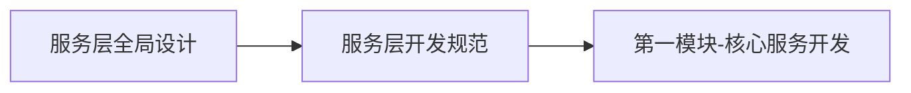
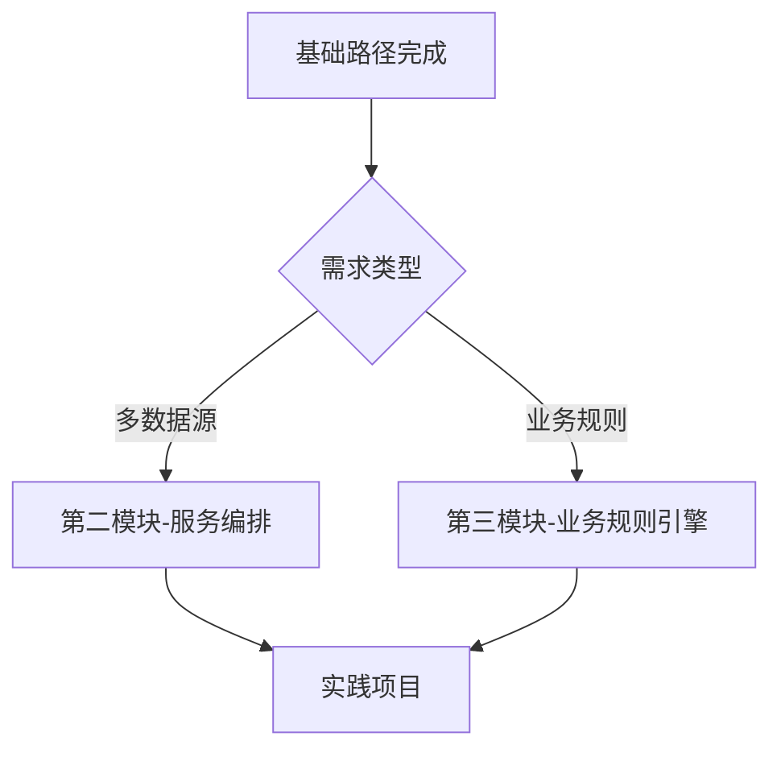

# 服务层架构文档

## 📚 文档导航

服务层(Service Layer)位于Clean Architecture的领域层(Domain Layer),是连接表现层和数据层的核心枢纽。本目录包含服务层的完整架构设计和开发指南。

---

### 核心设计文档

#### 1. [服务层全局设计](./服务层全局设计.md) ⭐ 必读

**内容概要**:
- 服务层在Clean Architecture中的定位
- UseCase vs Service的职责划分
- 架构分层图与核心组件对比
- 五大核心设计原则
- 服务层与数据层的交互边界

**适合阅读**: 所有开发者,了解整体架构

---

#### 2. [服务层开发规范](./服务层开发规范.md)

**内容概要**:
- UseCase命名规范 (动词+名词+UseCase)
- Service命名规范 (名词+Engine/Service/Manager)
- 代码组织标准结构
- 依赖注入规范
- Result<T>错误处理模式
- 协程使用规范
- 单元测试模板

**适合阅读**: 准备编写代码的开发者

---

### 模块开发指南

#### 3. [第一模块-核心服务开发](./第一模块-核心服务开发.md)

**内容概要**:
- **UseCase五步开发法**
  - 第一步: 明确业务场景
  - 第二步: 定义接口签名
  - 第三步: 实现业务流程
  - 第四步: 抽取辅助方法
  - 第五步: 编写单元测试
- 业务逻辑封装最佳实践
- 完整的CheckDraftUseCase示例

**适合阅读**: 开发新UseCase时参考

---

#### 4. [第二模块-服务编排](./第二模块-服务编排.md)

**内容概要**:
- 多Repository协调模式
  - 串行调用 (Serial Execution)
  - 并行调用 (Parallel Execution)
  - 混合编排 (Hybrid Orchestration)
- 数据流转与转换模式
- 数据清洗策略
- Flow响应式数据流
- 典型编排场景示例

**适合阅读**: 处理复杂数据流时参考

---

#### 5. [第三模块-业务规则引擎](./第三模块-业务规则引擎.md)

**内容概要**:
- 规则系统架构
- 基于BrainTag的规则定义
- PrivacyEngine隐私脱敏引擎
- 两层安全检查架构
  - Layer 1: 本地关键词匹配
  - Layer 2: AI语义检查
- 规则匹配策略(精确/子串/正则/语义)
- 规则优先级设计
- 可扩展的策略模式实现

**适合阅读**: 实现业务规则时参考

---

## 🚀 快速开始指南

### 新开发者阅读路径

```
第一天: 理解架构
  └─ 阅读 [服务层全局设计] (15分钟)
     └─ 理解UseCase和Service的区别
     └─ 掌握核心设计原则

第二天: 学习规范
  └─ 阅读 [服务层开发规范] (10分钟)
     └─ 掌握命名规范
     └─ 了解代码组织标准

第三天及之后: 按需学习
  └─ 需要开发UseCase → 阅读 [第一模块-核心服务开发]
  └─ 需要处理多数据源 → 阅读 [第二模块-服务编排]
  └─ 需要实现业务规则 → 阅读 [第三模块-业务规则引擎]
```

---

### 实践路径速查

| 场景 | 参考文档 | 关键章节 |
|------|---------|---------|
| 开发新UseCase | [第一模块-核心服务开发](./第一模块-核心服务开发.md) | UseCase五步开发法 |
| 协调多个Repository | [第二模块-服务编排](./第二模块-服务编排.md) | 并行调用模式 |
| 实现隐私脱敏 | [第三模块-业务规则引擎](./第三模块-业务规则引擎.md) | PrivacyEngine实现 |
| 实现安全检查 | [第三模块-业务规则引擎](./第三模块-业务规则引擎.md) | 两层检查架构 |
| 编写单元测试 | [服务层开发规范](./服务层开发规范.md) | 测试规范章节 |
| 错误处理 | [服务层开发规范](./服务层开发规范.md) | Result封装模式 |

---

## 📖 推荐学习顺序

### 基础路径 (必读)



**时间**: 约40分钟  
**收获**: 能够独立开发一个标准UseCase

---

### 进阶路径 (按需)



**时间**: 各20-30分钟  
**收获**: 掌握复杂场景的处理能力

---

## 💡 核心概念速览

### UseCase (用例)

**定义**: 封装单个业务流程,对应用户的一个操作意图

**示例**:
```kotlin
class AnalyzeChatUseCase @Inject constructor(
    private val contactRepository: ContactRepository,
    private val aiRepository: AiRepository
) {
    suspend operator fun invoke(
        contactId: String,
        context: List<String>
    ): Result<AnalysisResult> {
        // 业务逻辑...
    }
}
```

**特点**:
- ✅ 单一职责
- ✅ 使用`operator fun invoke`
- ✅ 返回`Result<T>`
- ✅ 所有操作都是`suspend`

---

### Service (领域服务)

**定义**: 提供跨多个UseCase的可复用能力

**示例**:
```kotlin
object PrivacyEngine {
    fun mask(rawText: String, mapping: Map<String, String>): String {
        // 脱敏逻辑...
    }
}
```

**特点**:
- ✅ 无状态单例(object)
- ✅ 纯函数(无副作用)
- ✅ 不依赖Repository
- ✅ 可在多个UseCase中复用

---

## 📊 已实现的组件

### UseCase列表

| UseCase | 功能说明 | 文件位置 | 状态 |
|---------|---------|---------|------|
| AnalyzeChatUseCase | 分析聊天场景,生成策略建议 | `domain/usecase/` | ✅ |
| CheckDraftUseCase | 检查草稿是否触发雷区 | `domain/usecase/` | ✅ |
| FeedTextUseCase | 喂养文本到联系人画像 | `domain/usecase/` | ✅ |

### Service列表

| Service | 功能说明 | 文件位置 | 状态 |
|---------|---------|---------|------|
| PrivacyEngine | 隐私脱敏引擎 | `domain/service/` | ✅ |

---

## 🎯 开发清单

### 开发新UseCase时的检查清单

- [ ] 已阅读 [服务层全局设计](./服务层全局设计.md)
- [ ] 已阅读 [服务层开发规范](./服务层开发规范.md)
- [ ] 已参考 [第一模块-核心服务开发](./第一模块-核心服务开发.md)
- [ ] 命名符合规范 (动词+名词+UseCase)
- [ ] 使用构造函数注入依赖
- [ ] 实现了`operator fun invoke`
- [ ] 返回`Result<T>`类型
- [ ] 所有IO操作都是`suspend`
- [ ] 编写了完整的KDoc注释
- [ ] 编写了单元测试

---

## 📅 文档更新记录

| 日期 | 版本 | 更新内容 | 作者 |
|------|------|---------|------|
| 2025-12-03 | v1.0.0 | 初始版本创建,完成5个核心文档 | hushaokang |

---

## 🔗 相关文档

- [项目架构设计](../../项目架构设计.md) - 整体架构设计
- [数据层设计](../数据层/) - 数据层文档
- [业务层设计](../业务层/) - 业务层文档
- [开发指南](../../02-开发指南/) - 开发实践指南

---

## ❓ 常见问题

### Q1: UseCase和Service有什么区别?

**UseCase**: 封装单个业务流程,一次性执行,依赖多个Repository  
**Service**: 提供可复用能力,无状态,不依赖Repository

详见: [服务层全局设计 - 核心组件对比](./服务层全局设计.md#核心组件对比)

### Q2: 什么时候使用并行调用?

当多个Repository调用之间没有依赖关系时,应该使用并行调用以提升性能。

详见: [第二模块-服务编排 - 并行调用模式](./第二模块-服务编排.md#模式二并行调用)

### Q3: 如何处理错误?

所有UseCase必须返回`Result<T>`,在内部捕获异常并转换为业务异常。

详见: [服务层开发规范 - 错误处理规范](./服务层开发规范.md#四错误处理规范)

---

**维护者**: hushaokang  
**最后更新**: 2025-12-03  
**文档状态**: ✅ 完整