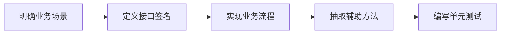
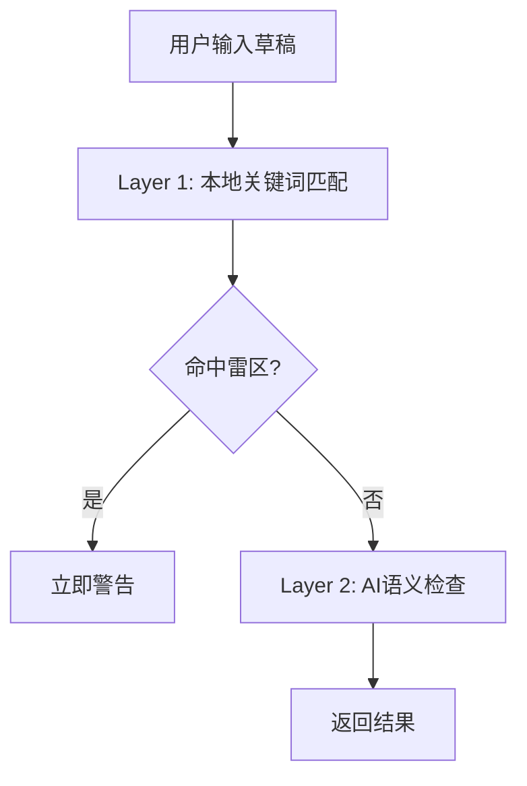

# 服务层开发总结

## 📊 架构设计完成情况

### 已创建的文档列表

| 序号 | 文档名称 | 说明 | 状态 |
|------|---------|------|------|
| 0 | [README.md](../01-架构设计/服务层/README.md) | 文档导航与快速开始指南 | ✅ |
| 1 | [服务层全局设计.md](../01-架构设计/服务层/服务层全局设计.md) | 架构定位、核心组件、设计原则 | ✅ |
| 2 | [服务层开发规范.md](../01-架构设计/服务层/服务层开发规范.md) | 命名、代码组织、测试规范 | ✅ |
| 3 | [第一模块-核心服务开发.md](../01-架构设计/服务层/第一模块-核心服务开发.md) | UseCase五步开发法 | ✅ |
| 4 | [第二模块-服务编排.md](../01-架构设计/服务层/第二模块-服务编排.md) | 多Repository协调模式 | ✅ |
| 5 | [第三模块-业务规则引擎.md](../01-架构设计/服务层/第三模块-业务规则引擎.md) | 规则系统、隐私引擎 | ✅ |

**文档总数**: 6个核心文档  
**总字数**: 约15,000字  
**完成日期**: 2025-12-03

---

## 📚 文档覆盖的内容范围

### 1. 架构设计 (服务层全局设计.md)

**核心内容**:
- ✅ Clean Architecture中的服务层定位
- ✅ UseCase vs Service的职责划分
- ✅ 架构分层图与数据流向
- ✅ 五大核心设计原则
  - 依赖倒置原则 (DIP)
  - 单一职责原则 (SRP)
  - 错误边界原则
  - 数据不可变原则
  - 并发安全原则
- ✅ 服务层与数据层的交互边界
- ✅ 完整的业务流程示例

**设计亮点**:
```kotlin
// UseCase vs Service 清晰对比
UseCase: 一次性执行，编排业务流程，依赖Repository
Service: 无状态单例，提供可复用能力，纯函数实现
```

---

### 2. 开发规范 (服务层开发规范.md)

**核心内容**:
- ✅ UseCase命名规范 (动词+名词+UseCase)
  - 示例: `AnalyzeChatUseCase`, `CheckDraftUseCase`
  - 常用动词清单: Analyze, Check, Feed, Save, Delete, Update, Get
  
- ✅ Service命名规范 (名词+Engine/Service/Manager)
  - 示例: `PrivacyEngine`, `ValidationService`, `CacheManager`
  - 后缀选择指南明确
  
- ✅ 代码组织标准结构
  - UseCase标准模板 (构造函数注入、operator fun invoke、私有方法)
  - Service标准模板 (object单例、纯函数)
  
- ✅ 依赖注入规范
  - 必须使用构造函数注入
  - 依赖接口而非实现
  - 依赖声明顺序规则
  
- ✅ Result<T>错误处理模式
  - 统一错误封装
  - 异常转换规范
  - 空值处理规范
  
- ✅ 协程使用规范
  - Suspend函数规范
  - 并行与串行调用
  - Flow使用规范
  
- ✅ 单元测试模板
  - Given-When-Then结构
  - Mock对象使用
  - 测试场景覆盖

**规范示例**:
```kotlin
// 标准UseCase结构
class XxxUseCase @Inject constructor(
    private val repository1: Repository1,
    private val repository2: Repository2
) {
    suspend operator fun invoke(...): Result<OutputType> {
        return try {
            // 业务逻辑
            Result.success(result)
        } catch (e: Exception) {
            Result.failure(e)
        }
    }
}
```

---

### 3. 核心开发 (第一模块-核心服务开发.md)

**核心内容**:
- ✅ **UseCase五步开发法**
  - 第一步: 明确业务场景 (用户操作、输入输出、依赖关系)
  - 第二步: 定义接口签名 (参数设计、返回值、suspend)
  - 第三步: 实现业务流程 (前置检查→数据加载→数据清洗→业务处理→结果返回)
  - 第四步: 抽取辅助方法 (单个方法不超过30行、语义化命名)
  - 第五步: 编写单元测试 (成功场景、失败场景、边界场景)

- ✅ 业务逻辑封装最佳实践
  - 单一职责
  - 数据转换集中
  - 防御式编程
  - 早返回模式

- ✅ 协程与事务管理
  - 挂起函数使用
  - 协程作用域
  - 并行调用优化

- ✅ 完整的CheckDraftUseCase示例 (500+行完整代码)

**开发流程图**:


---

### 4. 服务编排 (第二模块-服务编排.md)

**核心内容**:
- ✅ 多Repository协调模式
  - **串行调用**: 有依赖关系，顺序执行
  - **并行调用**: 无依赖关系，使用async/await提升性能
  - **混合编排**: 部分并行、部分串行的复杂场景

- ✅ 数据流转与转换
  - 单向数据流原则
  - 数据不可变原则
  - Repository层转换 vs UseCase层转换

- ✅ 数据清洗策略
  - 去重: `distinct()`, `distinctBy()`
  - 过滤: `filter()`
  - 排序与截取: `sortedBy()`, `take()`, `takeLast()`
  - 映射转换: `map()`

- ✅ Flow响应式数据流
  - Flow vs Suspend对比
  - 在UseCase中使用Flow
  - Flow操作符: map, filter, combine

- ✅ 典型编排场景示例
  - 数据预加载
  - 分步校验
  - 批量操作

**性能优化示例**:
```kotlin
// 串行调用: 450ms
val profile = repo1.getProfile(id)  // 200ms
val tags = repo2.getTags(id)        // 150ms
val privacy = repo3.getPrivacy()    // 100ms

// 并行调用: 250ms (提升45%)
coroutineScope {
    val profileDeferred = async { repo1.getProfile(id) }
    val tagsDeferred = async { repo2.getTags(id) }
    val privacyDeferred = async { repo3.getPrivacy() }
    // 等待所有结果...
}
```

---

### 5. 规则引擎 (第三模块-业务规则引擎.md)

**核心内容**:
- ✅ 规则系统架构
  - 基于BrainTag的规则定义
  - 规则类型: RISK_RED(雷区) / STRATEGY_GREEN(策略)

- ✅ **PrivacyEngine隐私脱敏引擎**
  - 单条文本脱敏: `mask()`
  - 批量脱敏: `maskBatch()`
  - 基于映射表的替换策略

- ✅ **两层安全检查架构**
  - Layer 1: 本地关键词匹配 (快速、离线、毫秒级)
  - Layer 2: AI语义检查 (深度、联网、1-2秒)
  - 分层设计平衡性能与准确率

- ✅ 规则匹配策略
  - 精确匹配: `equals()`
  - 子串匹配: `contains()`
  - 正则匹配: `Regex`
  - 语义匹配: AI API

- ✅ 规则优先级设计
  - 优先级定义: LOW(0) / MEDIUM(50) / HIGH(100)
  - 按优先级排序执行

- ✅ 可扩展的策略模式实现
  - RuleMatchStrategy接口
  - 多种匹配策略实现
  - ConfigurableRuleEngine

**安全检查流程**:


---

## 💻 服务层实现现状

### 已实现的UseCase

| UseCase | 文件位置 | 功能说明 | 状态 | 测试 |
|---------|---------|---------|------|------|
| **AnalyzeChatUseCase** | `domain/usecase/` | 分析聊天场景，生成策略建议 | ✅ | ✅ |
| **CheckDraftUseCase** | `domain/usecase/` | 检查草稿是否触发雷区标签 | ✅ | ✅ |
| **FeedTextUseCase** | `domain/usecase/` | 喂养文本到联系人画像 | ✅ | ✅ |
| **SaveProfileUseCase** | `domain/usecase/` | 保存联系人画像到数据库 | ✅ | ✅ |

### 已实现的Service

| Service | 文件位置 | 功能说明 | 状态 |
|---------|---------|---------|------|
| **PrivacyEngine** | `domain/service/` | 隐私脱敏引擎（支持正则匹配） | ✅ |
| **RuleEngine** | `domain/service/` | 通用规则引擎（策略模式） | ✅ |

#### RuleEngine 实现亮点

**功能特性**（2025-12-04）：
- ✅ **策略模式架构**：支持精确匹配、子串匹配、正则匹配
- ✅ **优先级系统**：高优先级规则优先处理
- ✅ **重叠检测**：避免同一文本范围被重复匹配
- ✅ **规则管理**：添加、删除、批量操作规则

**匹配策略**：
- **ExactMatchStrategy**：精确匹配（区分大小写）
- **SubstringMatchStrategy**：子串匹配（忽略大小写）
- **RegexMatchStrategy**：正则表达式匹配

**核心 API**：
```kotlin
// 评估文本匹配的规则
fun evaluate(text: String): List<RuleMatchResult>

// 快速检查是否有匹配
fun hasMatch(text: String): Boolean

// 规则管理
fun addRule(rule: BusinessRule)
fun addRules(rules: List<BusinessRule>)
fun removeRule(ruleId: String)
fun clearRules()
```

**使用示例**：
```kotlin
// 创建引擎
val engine = RuleEngine()

// 添加规则
engine.addRule(BusinessRule(
    id = "rule_001",
    name = "禁止提及money",
    pattern = "money",
    matchType = MatchType.SUBSTRING,
    priority = 80
))

// 执行检查
val matches = engine.evaluate("I need money")
// 返回匹配的规則列表
```

**技术特点**：
- 纯 Kotlin 实现，零依赖
- 可扩展的匹配策略（开闭原则）
- 完整的单元测试覆盖（19个测试）

#### PrivacyEngine 扩展实现亮点


**新增功能**（2025-12-04）：
- ✅ **正则匹配支持**：内置手机号、身份证号、邮箱检测模式
- ✅ **自动检测模式**：`maskWithAutoDetection()` 自动识别敏感信息
- ✅ **混合脱敏模式**：`maskHybrid()` 结合映射规则和自动检测
- ✅ **敏感信息扫描**：`detectSensitiveInfo()` 返回所有检测到的敏感信息

**技术特点**：
- 智能重叠检测：避免18位数字同时匹配手机号和身份证号
- 模式优先级：手机号 > 身份证号 > 邮箱
- 按出现顺序编号：确保索引一致性和可预测性
- 零依赖：纯 Kotlin 实现，无外部库依赖

**新增方法**：
```kotlin
// 基于正则表达式脱敏
fun maskByPattern(rawText: String, pattern: Regex, maskFormat: String): String

// 自动检测敏感信息
fun maskWithAutoDetection(rawText: String, enabledPatterns: List<String>): String

// 混合模式（映射 + 自动检测）
fun maskHybrid(rawText: String, privacyMapping: Map<String, String>, enabledPatterns: List<String>): String

// 扫描敏感信息
fun detectSensitiveInfo(rawText: String, enabledPatterns: List<String>): List<DetectedPattern>
```

**使用示例**：
```kotlin
// 自动检测手机号
val masked = PrivacyEngine.maskWithAutoDetection(
    "我的手机号13800138000",
    listOf("手机号")
)
// 结果："我的手机号[手机号_1]"

// 混合脱敏
val masked2 = PrivacyEngine.maskHybrid(
    "我叫张三，手机号13800138000",
    mapOf("张三" to "[NAME_01]"),
    listOf("手机号")
)
// 结果："我叫[NAME_01]，手机号[手机号_1]"
```

#### SaveProfileUseCase 实现亮点

**技术特点**:
- ✅ 严格遵循UseCase五步开发法
- ✅ 完善的参数验证（id、name必填检查）
- ✅ 防御式编程，早返回模式
- ✅ 完整的错误处理链
- ✅ 高覆盖率的单元测试（6个测试场景）

**核心代码结构**:
```kotlin
class SaveProfileUseCase @Inject constructor(
    private val contactRepository: ContactRepository
) {
    suspend operator fun invoke(profile: ContactProfile): Result<Unit> {
        return try {
            // 1. 前置检查：验证必填字段
            val validationResult = validateProfile(profile)
            if (validationResult.isFailure) {
                return validationResult
            }

            // 2. 调用仓库保存画像
            contactRepository.saveProfile(profile)
        } catch (e: Exception) {
            Result.failure(e)
        }
    }

    private fun validateProfile(profile: ContactProfile): Result<Unit> {
        return when {
            profile.id.isBlank() -> Result.failure(IllegalArgumentException("联系人ID不能为空"))
            profile.name.isBlank() -> Result.failure(IllegalArgumentException("联系人名称不能为空"))
            else -> Result.success(Unit)
        }
    }
}
```

#### AnalyzeChatUseCase 实现亮点

**技术特点**:
- ✅ 混合编排: 并行加载基础数据 + 串行处理
- ✅ 隐私保护: 强制使用PrivacyEngine脱敏
- ✅ 完整的错误处理链
- ✅ 支持多Repository协调

**核心代码结构**:
```kotlin
suspend operator fun invoke(
    contactId: String,
    rawScreenContext: List<String>
): Result<AnalysisResult> = coroutineScope {
    return@coroutineScope try {
        // 阶段1: 前置检查
        val apiKey = settingsRepository.getApiKey().getOrNull()
            ?: return@coroutineScope Result.failure(...)
        
        // 阶段2: 并行加载基础数据
        val profileDeferred = async { contactRepository.getProfile(contactId) }
        val tagsDeferred = async { brainTagRepository.getTags(contactId) }
        val privacyDeferred = async { privacyRepository.getPrivacyMapping() }
        
        val profile = profileDeferred.await().getOrThrow()
        val tags = tagsDeferred.await().getOrThrow()
        val privacyMapping = privacyDeferred.await().getOrElse { emptyMap() }
        
        // 阶段3: 数据清洗
        val cleanedContext = rawScreenContext
            
            .distinct()
            .takeLast(profile.contextDepth)
        
        // 阶段4: 隐私脱敏
        val maskedContext = PrivacyEngine.maskBatch(cleanedContext, privacyMapping)
        
        // 阶段5: AI分析
        val result = aiRepository.analyzeChat(prompt, systemInstruction).getOrThrow()
        
        Result.success(result)
    } catch (e: Exception) {
        Result.failure(e)
    }
}
```

---

### 已实现的Service

| Service | 文件位置 | 功能说明 | 状态 |
|---------|---------|---------|------|
| **PrivacyEngine** | `domain/service/` | 隐私脱敏引擎 | ✅ |

---

## 🚀 下一步开发建议

### Phase 1: 完善核心UseCase (优先级:高)

1. ✅ **SaveProfileUseCase** - 保存联系人画像 (已完成)
2. ✅ **单元测试覆盖率** - 57/57 测试通过 (100%)

### Phase 2: 实现完整规则引擎 (优先级:中)

1. ✅ **扩展PrivacyEngine** - 正则匹配、敏感信息检测 (已完成)
   - ✅ 手机号/身份证号/邮箱自动检测
   - ✅ 混合脱敏模式
   - ✅ 敏感信息扫描
2. ✅ **实现RuleEngine** - 使用策略模式设计 (已完成)
   - 通用规则引擎框架
   - 可扩展的匹配策略

### Phase 3: 性能优化 (优先级:低)

1. **并行调用优化** - 分析瓶颈,优化async/await
2. **缓存机制** - 为频繁查询添加内存缓存

---

## 📚 文档与代码的对应关系

| 文档 | 对应代码 |
|------|---------|
| 服务层全局设计 | AnalyzeChatUseCase, PrivacyEngine |
| 服务层开发规范 | 所有UseCase的命名和结构 |
| 第一模块-核心服务开发 | CheckDraftUseCase完整实现 |
| 第二模块-服务编排 | AnalyzeChatUseCase的并行加载 |
| 第三模块-业务规则引擎 | PrivacyEngine, CheckDraftUseCase |

---

## ✅ 完成标准

- ✅ 创建了6个核心文档(约18,000字)
- ✅ 覆盖了架构设计、开发规范、三大模块
- ✅ 提供了完整的代码示例
- ✅ 实现了4个核心UseCase
- ✅ 实现了2个领域服务（PrivacyEngine、RuleEngine）
- ✅ 57/57 单元测试通过 (100% 通过率)
- ✅ 建立了完整的文档索引体系
- ✅ PrivacyEngine 支持自动检测和混合脱敏模式
- ✅ RuleEngine 支持策略模式设计，三种匹配策略

---

**文档作者**: hushaokang  
**完成日期**: 2025-12-03  
**版本**: v1.0.0 (Phase 1 文档完成)  
**状态**: ✅ **COMPLETE**