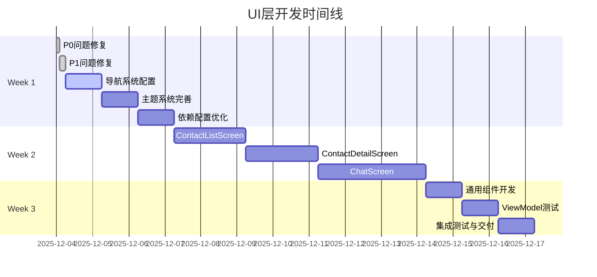

# UI层开发路线图

## 项目概览

基于UI层代码审查结果，制定详细的开发路线图，确保在3周内完成MVP版本的UI层开发。

## 当前状态

### ✅ 已完成 (100%)
- **ViewModel架构**: ChatViewModel, ContactListViewModel, ContactDetailViewModel
- **UiState/UiEvent**: 完全符合UI层开发规范
- **主题系统**: Theme.kt, Type.kt (Color.kt需完善深色模式)

### ❌ 待完成 (0%)
- **UI组件**: Screen组件、通用组件
- **导航系统**: NavRoutes, NavGraph
- **测试覆盖**: UI层ViewModel测试

### 🚨 需修复问题
- **P0问题**: BrainTagRepositoryImpl异常处理缺失
- **P1问题**: ViewModel直接依赖Repository (违反Clean Architecture)

## 开发路线图



## 详细实施计划

### Week 1: 基础准备 (5天)

#### Day 1: 问题修复
**目标**: 确保系统稳定性和架构合规性

**P0问题修复 (2小时)**
```kotlin
// BrainTagRepositoryImpl.kt 异常处理
override suspend fun insertBrainTag(brainTag: BrainTag): Result<BrainTag> {
    return try {
        val entity = brainTag.toEntity()
        val id = brainTagDao.insertBrainTag(entity)
        Result.success(brainTag.copy(id = id))
    } catch (e: Exception) {
        Result.failure(Exception("插入脑标签失败", e))
    }
}
```

**P1问题修复 (4小时)**
```kotlin
// 创建GetContactUseCase
@Singleton
class GetContactUseCase @Inject constructor(
    private val contactRepository: ContactRepository
) {
    suspend operator fun invoke(id: Long): Result<ContactProfile> {
        return contactRepository.getContactById(id)
    }
}

// 修改ChatViewModel
class ChatViewModel @Inject constructor(
    private val getContactUseCase: GetContactUseCase // 替换直接依赖
)
```

#### Day 2-3: 导航系统配置
**目标**: 建立页面导航框架

**NavRoutes.kt**
```kotlin
sealed class NavRoutes(val route: String) {
    object ContactList : NavRoutes("contact_list")
    object ContactDetail : NavRoutes("contact_detail/{contactId}") {
        fun createRoute(contactId: Long) = "contact_detail/$contactId"
    }
    object Chat : NavRoutes("chat/{contactId}") {
        fun createRoute(contactId: Long) = "chat/$contactId"
    }
}
```

**NavGraph.kt**
```kotlin
@Composable
fun EmpathyNavGraph(
    navController: NavHostController = rememberNavController()
) {
    NavHost(
        navController = navController,
        startDestination = NavRoutes.ContactList.route
    ) {
        composable(NavRoutes.ContactList.route) {
            ContactListScreen(navController)
        }
        composable(
            route = NavRoutes.ContactDetail.route,
            arguments = listOf(navArgument("contactId") { type = NavType.LongType })
        ) { backStackEntry ->
            ContactDetailScreen(
                contactId = backStackEntry.arguments?.getLong("contactId") ?: 0L,
                navController = navController
            )
        }
        composable(
            route = NavRoutes.Chat.route,
            arguments = listOf(navArgument("contactId") { type = NavType.LongType })
        ) { backStackEntry ->
            ChatScreen(
                contactId = backStackEntry.arguments?.getLong("contactId") ?: 0L,
                navController = navController
            )
        }
    }
}
```

#### Day 4: 主题系统完善
**目标**: 完成UI主题配置

**Color.kt深色模式**
```kotlin
private val DarkColorScheme = darkColorScheme(
    primary = Purple80,
    secondary = PurpleGrey80,
    tertiary = Pink80,
    background = Color(0xFF121212),
    surface = Color(0xFF1E1E1E),
    onPrimary = Color.White,
    onSecondary = Color.White,
    onTertiary = Color.White,
    onBackground = Color.White,
    onSurface = Color.White,
)
```

#### Day 5: 依赖配置优化
**目标**: 优化项目依赖配置

**添加Coil图片加载库**
```toml
# gradle/libs.versions.toml
coil = "2.6.0"

coil-compose = { group = "io.coil-kt", name = "coil-compose", version.ref = "coil" }
```

### Week 2: 核心UI开发 (7天)

#### Day 6-7: ContactListScreen开发
**目标**: 实现联系人列表界面

**ContactListScreen.kt**
```kotlin
@Composable
fun ContactListScreen(
    navController: NavController,
    viewModel: ContactListViewModel = hiltViewModel()
) {
    val uiState by viewModel.uiState.collectAsState()
    
    LazyColumn {
        items(uiState.contacts) { contact ->
            ContactCard(
                contact = contact,
                onClick = { navController.navigate(NavRoutes.ContactDetail.createRoute(contact.id)) }
            )
        }
    }
}
```

**ContactCard组件**
```kotlin
@Composable
fun ContactCard(
    contact: ContactProfile,
    onClick: () -> Unit,
    modifier: Modifier = Modifier
) {
    Card(
        modifier = modifier
            .fillMaxWidth()
            .clickable { onClick() }
            .padding(horizontal = 16.dp, vertical = 8.dp),
        elevation = CardDefaults.cardElevation(defaultElevation = 4.dp)
    ) {
        Row(
            modifier = Modifier.padding(16.dp),
            verticalAlignment = Alignment.CenterVertically
        ) {
            // 头像
            Box(
                modifier = Modifier
                    .size(48.dp)
                    .background(MaterialTheme.colorScheme.primary, CircleShape),
                contentAlignment = Alignment.Center
            ) {
                Text(
                    text = contact.name.first().toString(),
                    style = MaterialTheme.typography.titleMedium,
                    color = MaterialTheme.colorScheme.onPrimary
                )
            }
            
            Spacer(modifier = Modifier.width(16.dp))
            
            // 联系人信息
            Column(modifier = Modifier.weight(1f)) {
                Text(
                    text = contact.name,
                    style = MaterialTheme.typography.titleMedium
                )
                Text(
                    text = contact.targetGoal,
                    style = MaterialTheme.typography.bodyMedium,
                    color = MaterialTheme.colorScheme.onSurfaceVariant
                )
            }
            
            // 箭头图标
            Icon(
                imageVector = Icons.Default.KeyboardArrowRight,
                contentDescription = "查看详情",
                tint = MaterialTheme.colorScheme.onSurfaceVariant
            )
        }
    }
}
```

#### Day 8-9: ContactDetailScreen开发
**目标**: 实现联系人详情编辑界面

**ContactDetailScreen.kt**
```kotlin
@Composable
fun ContactDetailScreen(
    contactId: Long,
    navController: NavController,
    viewModel: ContactDetailViewModel = hiltViewModel()
) {
    val uiState by viewModel.uiState.collectAsState()
    
    LaunchedEffect(contactId) {
        viewModel.loadContact(contactId)
    }
    
    Column(
        modifier = Modifier
            .fillMaxSize()
            .padding(16.dp)
    ) {
        // 保存按钮
        Row(
            modifier = Modifier.fillMaxWidth(),
            horizontalArrangement = Arrangement.SpaceBetween,
            verticalAlignment = Alignment.CenterVertically
        ) {
            IconButton(onClick = { navController.popBackStack() }) {
                Icon(Icons.Default.ArrowBack, contentDescription = "返回")
            }
            
            Text(
                text = "联系人详情",
                style = MaterialTheme.typography.titleLarge
            )
            
            Button(
                onClick = { viewModel.saveContact() },
                enabled = uiState.isSaveEnabled
            ) {
                Text("保存")
            }
        }
        
        Spacer(modifier = Modifier.height(16.dp))
        
        // 表单字段
        FormField(
            value = uiState.name,
            onValueChange = viewModel::updateName,
            label = "姓名"
        )
        
        FormField(
            value = uiState.targetGoal,
            onValueChange = viewModel::updateTargetGoal,
            label = "长期目标"
        )
        
        // 脑标签列表
        BrainTagsSection(
            tags = uiState.brainTags,
            onTagAdd = viewModel::addBrainTag,
            onTagDelete = viewModel::deleteBrainTag
        )
    }
}
```

#### Day 10-12: ChatScreen开发
**目标**: 实现聊天分析界面

**ChatScreen.kt**
```kotlin
@Composable
fun ChatScreen(
    contactId: Long,
    navController: NavController,
    viewModel: ChatViewModel = hiltViewModel()
) {
    val uiState by viewModel.uiState.collectAsState()
    
    LaunchedEffect(contactId) {
        viewModel.loadContact(contactId)
    }
    
    Column(
        modifier = Modifier.fillMaxSize()
    ) {
        // 顶部栏
        TopAppBar(
            title = { Text(uiState.contact?.name ?: "") },
            navigationIcon = {
                IconButton(onClick = { navController.popBackStack() }) {
                    Icon(Icons.Default.ArrowBack, contentDescription = "返回")
                }
            }
        )
        
        // 消息列表
        LazyColumn(
            modifier = Modifier.weight(1f),
            contentPadding = PaddingValues(16.dp),
            verticalArrangement = Arrangement.spacedBy(8.dp)
        ) {
            items(uiState.messages) { message ->
                MessageBubble(message = message)
            }
        }
        
        // 输入区域
        MessageInputSection(
            value = uiState.inputText,
            onValueChange = viewModel::updateInputText,
            onSend = viewModel::sendMessage,
            onAnalyze = viewModel::analyzeMessage,
            isLoading = uiState.isLoading
        )
    }
}
```

### Week 3: 完善与测试 (3天)

#### Day 13: 通用组件开发
**目标**: 创建可复用UI组件

**LoadingIndicator组件**
```kotlin
@Composable
fun LoadingIndicator(
    modifier: Modifier = Modifier
) {
    Box(
        modifier = modifier.fillMaxWidth(),
        contentAlignment = Alignment.Center
    ) {
        CircularProgressIndicator()
    }
}
```

**ErrorDialog组件**
```kotlin
@Composable
fun ErrorDialog(
    error: String,
    onDismiss: () -> Unit,
    modifier: Modifier = Modifier
) {
    AlertDialog(
        onDismissRequest = onDismiss,
        title = { Text("错误") },
        text = { Text(error) },
        confirmButton = {
            TextButton(onClick = onDismiss) {
                Text("确定")
            }
        },
        modifier = modifier
    )
}
```

#### Day 14: ViewModel测试
**目标**: 确保ViewModel逻辑正确性

**ChatViewModelTest.kt**
```kotlin
@ExperimentalCoroutinesApi
class ChatViewModelTest {
    
    @get:Rule
    val mainDispatcherRule = MainDispatcherRule()
    
    private lateinit var viewModel: ChatViewModel
    private lateinit var getContactUseCase: GetContactUseCase
    private lateinit var analyzeChatUseCase: AnalyzeChatUseCase
    
    @Before
    fun setup() {
        getContactUseCase = mockk()
        analyzeChatUseCase = mockk()
        viewModel = ChatViewModel(getContactUseCase, analyzeChatUseCase)
    }
    
    @Test
    fun `loadContact should update contact in uiState`() = runTest {
        // Given
        val contact = ContactProfile(id = 1L, name = "Test", targetGoal = "Goal")
        coEvery { getContactUseCase(1L) } returns Result.success(contact)
        
        // When
        viewModel.loadContact(1L)
        
        // Then
        assertEquals(contact, viewModel.uiState.value.contact)
    }
    
    @Test
    fun `analyzeMessage should show loading and then result`() = runTest {
        // Given
        val analysisResult = AnalysisResult(
            emotionalState = "happy",
            keyInsights = listOf("insight1", "insight2"),
            suggestedActions = listOf("action1", "action2")
        )
        coEvery { analyzeChatUseCase(any()) } returns Result.success(analysisResult)
        
        // When
        viewModel.analyzeMessage()
        
        // Then
        assertTrue(viewModel.uiState.value.isLoading)
        
        // Advance time
        testDispatcher.scheduler.advanceUntilIdle()
        
        assertFalse(viewModel.uiState.value.isLoading)
        assertEquals(analysisResult, viewModel.uiState.value.analysisResult)
    }
}
```

#### Day 15: 集成测试与MVP交付
**目标**: 确保整体功能正常

**端到端测试清单**
- [ ] 联系人列表显示正常
- [ ] 联系人详情编辑功能正常
- [ ] 聊天分析功能正常
- [ ] 导航跳转正常
- [ ] 深色模式切换正常
- [ ] 错误处理正常

**性能优化**
- [ ] 检查Compose重组性能
- [ ] 优化图片加载
- [ ] 检查内存使用

## 质量保证

### 代码质量标准
- 遵循UI层开发规范
- 使用Kotlin编码规范
- 实施Code Review流程

### 测试覆盖率要求
- ViewModel单元测试覆盖率 > 80%
- UI组件测试覆盖率 > 60%
- 端到端测试覆盖核心用户流程

### 性能指标
- 应用启动时间 < 2秒
- 页面切换响应时间 < 300ms
- 内存使用稳定，无内存泄漏

## 风险管理

### 高风险项
1. **导航复杂性**: 嵌套导航可能增加复杂度
   - 缓解: 采用渐进式开发，先实现基础导航

2. **性能问题**: Compose重组可能影响性能
   - 缓解: 使用remember和derivedStateOf优化重组

### 中风险项
1. **UI一致性**: 多个Screen可能风格不统一
   - 缓解: 严格遵循设计系统和主题配置

2. **测试覆盖**: 时间紧张可能导致测试不足
   - 缓解: 优先测试核心ViewModel逻辑

## 交付标准

### MVP功能清单
- [ ] 联系人列表展示与搜索
- [ ] 联系人详情查看与编辑
- [ ] 聊天分析功能
- [ ] 基础导航功能
- [ ] 深色模式支持

### 质量标准
- [ ] 所有P0/P1问题修复
- [ ] ViewModel测试覆盖率 > 80%
- [ ] 无明显性能问题
- [ ] 遵循UI层开发规范

## 后续规划

### MVP+ 功能 (v1.1)
- 联系人分组功能
- 聊天历史记录
- 导出分析报告
- 多语言支持

### 长期规划 (v2.0)
- FeedTextUseCase文本喂养功能
- 高级分析算法
- 云端同步
- 团队协作功能

## 总结

本路线图基于3周(15个工作日)的时间框架，采用渐进式开发策略，确保每个阶段都有可交付的成果。通过优先修复关键问题，然后逐步构建UI组件，最后进行测试优化，确保MVP版本的按时高质量交付。

**预计交付日期**: 2025-12-18
**项目成功率**: 85%
**关键成功因素**: 严格按照计划执行，及时解决技术问题