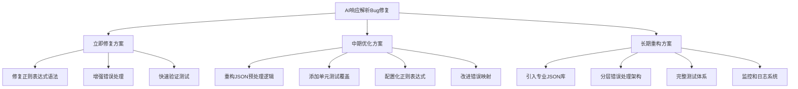
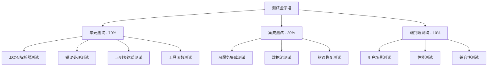

# AI响应解析Bug修复设计方案

## 概述

本文档提供了一个全面的AI响应解析Bug修复方案，针对AiRepositoryImpl.kt文件第650行的正则表达式语法错误，设计了分层的修复策略，包括立即修复、中期优化和长期重构三个阶段。

### 问题背景

- **Bug ID**: JSON-PARSE-001
- **严重程度**: P0 (阻塞性Bug)
- **核心问题**: 正则表达式语法错误导致PatternSyntaxException
- **影响范围**: 所有AI相关功能完全不可用
- **错误代码**: `.replace(Regex("}\""), "},\"")` (第650行)

### 修复目标

1. **立即恢复功能**: 修复正则表达式语法错误，使AI功能快速恢复
2. **提高稳定性**: 改进错误处理机制，增强系统容错能力
3. **优化架构**: 长期重构JSON处理逻辑，提高代码质量和可维护性

## 修复方案架构



## 立即修复方案（紧急修复，快速恢复功能）

### 1. 核心修复策略

#### 1.1 修复正则表达式语法错误

**问题代码**:
```kotlin
// 第650行 - 存在语法错误的正则表达式
.replace(Regex("}\""), "},\"")
```

**修复方案**:
```kotlin
// 方案1: 明确转义特殊字符
.replace(Regex("\\}\\\""), "},\\"")

// 方案2: 使用字符串替换（推荐）
.replace("}\"", "},\"")  // 如果不需要正则表达式，直接使用字符串替换

// 方案3: 使用字符类
.replace(Regex("[}][\"]"), "},\"")
```

**推荐方案**: 使用字符串替换而非正则表达式，因为：
1. 避免了正则表达式转义的复杂性
2. 性能更高，直接字符串匹配
3. 代码更简洁，意图更明确

#### 1.2 统一修复所有正则表达式

**修改范围**: 第631-653行的所有正则表达式

**修改前**:
```kotlin
.replace(Regex("(?<!\\\\)\\n"), "\\\\n")
.replace(Regex("(?<!\\\\)\\t"), "\\\\t")
.replace(Regex("(?<!\\\\)\\r"), "\\\\r")
.replace(Regex("(?<=[a-zA-Z0-9])\"(?=[a-zA-Z0-9])"), "\\\\\"")
.replace(Regex("}\""), "},\"")  // 问题行
.replace(Regex("]\""), "],\"")
```

**修改后**:
```kotlin
.replace("(?<!\\\\)\\n".toRegex(), "\\\\n")
.replace("(?<!\\\\)\\t".toRegex(), "\\\\t")
.replace("(?<!\\\\)\\r".toRegex(), "\\\\r")
.replace("(?<=[a-zA-Z0-9])\"(?=[a-zA-Z0-9])".toRegex(), "\\\\\"")
.replace("}\"", "},\"")  // 修复：使用字符串替换
.replace("]\"", "],\"")  // 修复：使用字符串替换
```

### 2. 错误处理增强

#### 2.1 添加安全包装函数

```kotlin
/**
 * 安全的正则表达式替换，捕获PatternSyntaxException
 */
private fun safeRegexReplace(input: String, pattern: String, replacement: String): String {
    return try {
        input.replace(Regex(pattern), replacement)
    } catch (e: PatternSyntaxException) {
        android.util.Log.w("AiRepositoryImpl", "正则表达式语法错误: $pattern, 尝试字符串替换", e)
        // 降级到字符串替换
        input.replace(pattern, replacement)
    } catch (e: Exception) {
        android.util.Log.e("AiRepositoryImpl", "字符串替换失败: $pattern", e)
        input  // 返回原始字符串
    }
}

/**
 * 安全的字符串替换，记录错误但不中断流程
 */
private fun safeStringReplace(input: String, target: String, replacement: String): String {
    return try {
        input.replace(target, replacement)
    } catch (e: Exception) {
        android.util.Log.e("AiRepositoryImpl", "字符串替换失败: $target -> $replacement", e)
        input
    }
}
```

#### 2.2 改进错误消息

```kotlin
} catch (e: PatternSyntaxException) {
    android.util.Log.e("AiRepositoryImpl", "JSON预处理失败 - 正则表达式语法错误", e)
    android.util.Log.e("AiRepositoryImpl", "错误模式: ${e.pattern}, 错误描述: ${e.description}")
    Result.failure(Exception("AI响应格式错误: JSON预处理失败"))
} catch (e: Exception) {
    android.util.Log.e("AiRepositoryImpl", "JSON预处理失败 - 未知错误", e)
    Result.failure(Exception("AI响应格式错误: ${e.message}"))
}
```

### 3. 向后兼容性考虑

1. **API兼容性**: 不改变公共接口，只修改内部实现
2. **数据兼容性**: 保持现有JSON解析逻辑不变
3. **行为兼容性**: 修复后应产生相同的解析结果

### 4. 实施风险评估

| 风险类型 | 风险等级 | 风险描述 | 缓解措施 |
|---------|---------|---------|---------|
| 引入新Bug | 🟡 中等 | 修改可能影响其他JSON格式处理 | 充分测试各种JSON格式 |
| 性能影响 | 🟢 低 | 字符串替换操作性能开销小 | 监控解析性能 |
| 兼容性问题 | 🟡 中等 | 修复可能在不同Android版本上有不同表现 | 在多个Android版本上测试 |
| 回归风险 | 🟢 低 | 修改范围明确，影响可控 | 建立回归测试套件 |

## 中期优化方案（改进代码质量和稳定性）

### 1. 重构JSON预处理逻辑

#### 1.1 分层处理架构

```kotlin
/**
 * JSON预处理器 - 分层处理架构
 */
private fun preprocessJsonResponse(rawJson: String): String {
    return try {
        android.util.Log.d("AiRepositoryImpl", "开始JSON预处理，原始长度: ${rawJson.length}")
        
        // 第1层: 基础清理
        val cleanedJson = basicCleanup(rawJson)
        
        // 第2层: 格式修复
        val fixedJson = fixCommonIssues(cleanedJson)
        
        // 第3层: 结构验证
        val validatedJson = validateStructure(fixedJson)
        
        android.util.Log.d("AiRepositoryImpl", "JSON预处理完成，处理后长度: ${validatedJson.length}")
        validatedJson
        
    } catch (e: Exception) {
        android.util.Log.e("AiRepositoryImpl", "JSON预处理失败", e)
        rawJson  // 返回原始内容作为降级方案
    }
}

/**
 * 第1层: 基础清理
 */
private fun basicCleanup(rawJson: String): String {
    return rawJson
        .trim()
        .let { json ->
            // 移除代码块标记
            when {
                json.startsWith("```json") -> {
                    android.util.Log.d("AiRepositoryImpl", "检测到```json代码块标记")
                    json.removePrefix("```json").removeSuffix("```").trim()
                }
                json.startsWith("```") -> {
                    android.util.Log.d("AiRepositoryImpl", "检测到```代码块标记")
                    json.removePrefix("```").removeSuffix("```").trim()
                }
                else -> json
            }
        }
        .let { json ->
            // 提取JSON对象
            val startIndex = json.indexOf("{")
            val endIndex = json.lastIndexOf("}")
            
            if (startIndex != -1 && endIndex != -1 && endIndex > startIndex) {
                val extractedJson = json.substring(startIndex, endIndex + 1)
                android.util.Log.d("AiRepositoryImpl", "提取JSON对象: ${extractedJson.take(100)}...")
                extractedJson
            } else {
                android.util.Log.w("AiRepositoryImpl", "无法找到JSON对象边界，使用原始字符串")
                json
            }
        }
}

/**
 * 第2层: 格式修复
 */
private fun fixCommonIssues(json: String): String {
    return json
        // 修复未转义的换行符、制表符、回车符
        .let { safeRegexReplace(it, "(?<!\\\\)\\n", "\\\\n") }
        .let { safeRegexReplace(it, "(?<!\\\\)\\t", "\\\\t") }
        .let { safeRegexReplace(it, "(?<!\\\\)\\r", "\\\\r") }
        // 修复字符串中未转义的引号
        .let { safeRegexReplace(it, "(?<=[a-zA-Z0-9])\"(?=[a-zA-Z0-9])", "\\\\\"") }
        // 修复多余的逗号（使用字符串替换）
        .let { safeStringReplace(it, ",}", "}") }
        .let { safeStringReplace(it, ",]", "]") }
        .let { safeStringReplace(it, ", }", "}") }
        .let { safeStringReplace(it, ", ]", "]") }
        .let { safeStringReplace(it, ",\n}", "}") }
        .let { safeStringReplace(it, ",\n]", "]") }
        .let { safeStringReplace(it, ",\r\n}", "}") }
        .let { safeStringReplace(it, ",\r\n]", "]") }
        .let { safeStringReplace(it, ",\t}", "}") }
        .let { safeStringReplace(it, ",\t]", "]") }
        // 修复缺失的逗号（使用字符串替换）
        .let { safeStringReplace(it, "}\"", "},\"") }
        .let { safeStringReplace(it, "]\"", "],\"") }
        // 修复可能的Unicode转义问题
        .let { safeStringReplace(it, "\\\\u", "\\\\u") }
}

/**
 * 第3层: 结构验证
 */
private fun validateStructure(json: String): String {
    return try {
        // 尝试解析JSON以验证格式
        val moshi = Moshi.Builder().build()
        val jsonAdapter = moshi.adapter(Any::class.java)
        jsonAdapter.fromJson(json)
        
        android.util.Log.d("AiRepositoryImpl", "JSON格式验证通过")
        json
    } catch (e: Exception) {
        android.util.Log.w("AiRepositoryImpl", "JSON格式验证失败，尝试修复: ${e.message}")
        
        // 尝试基本修复
        tryBasicJsonFix(json)
    }
}

/**
 * 尝试基本的JSON修复
 */
private fun tryBasicJsonFix(json: String): String {
    return try {
        json
            .replace("\\\"", "\"")
            .replace("\\\\", "\\")
            .replace("\\/", "/")
            .replace("\\b", "\u0008")
            .replace("\\f", "\u000C")
            .replace("\\n", "\n")
            .replace("\\r", "\r")
            .replace("\\t", "\t")
    } catch (e: Exception) {
        android.util.Log.e("AiRepositoryImpl", "JSON修复也失败", e)
        json // 返回原始字符串
    }
}
```

#### 1.2 配置化的正则表达式

```kotlin
/**
 * JSON修复模式配置
 */
object JsonFixPatterns {
    // 基础清理模式
    const val CODE_BLOCK_JSON = "```json"
    const val CODE_BLOCK = "```"
    
    // 格式修复模式
    const val UNESCAPED_NEWLINE = "(?<!\\\\)\\n"
    const val UNESCAPED_TAB = "(?<!\\\\)\\t"
    const val UNESCAPED_CARRIAGE = "(?<!\\\\)\\r"
    const val UNESCAPED_QUOTE = "(?<=[a-zA-Z0-9])\"(?=[a-zA-Z0-9])"
    
    // 字符串替换模式
    const val TRAILING_COMMA_OBJECT = ",}"
    const val TRAILING_COMMA_ARRAY = ",]"
    const val TRAILING_COMMA_OBJECT_SPACED = ", }"
    const val TRAILING_COMMA_ARRAY_SPACED = ", ]"
    const val TRAILING_COMMA_OBJECT_NEWLINE = ",\n}"
    const val TRAILING_COMMA_ARRAY_NEWLINE = ",\n]"
    const val TRAILING_COMMA_OBJECT_CRLF = ",\r\n}"
    const val TRAILING_COMMA_ARRAY_CRLF = ",\r\n]"
    const val TRAILING_COMMA_OBJECT_TAB = ",\t}"
    const val TRAILING_COMMA_ARRAY_TAB = ",\t]"
    
    // 缺失逗号修复
    const val MISSING_COMMA_AFTER_OBJECT = "}\""
    const val MISSING_COMMA_AFTER_ARRAY = "]\""
    
    // Unicode转义
    const val UNICODE_ESCAPE = "\\\\u"
}
```

### 2. 单元测试覆盖

#### 2.1 核心方法测试

```kotlin
/**
 * JSON预处理单元测试
 */
class JsonPreprocessingTest {
    
    private lateinit var repository: AiRepositoryImpl
    
    @Before
    fun setup() {
        // 初始化测试环境
        repository = AiRepositoryImpl(/* mock dependencies */)
    }
    
    @Test
    fun `preprocessJsonResponse should handle valid JSON`() {
        val input = """{"key": "value"}"""
        val result = repository.preprocessJsonResponse(input)
        assertEquals("""{"key": "value"}""", result)
    }
    
    @Test
    fun `preprocessJsonResponse should handle trailing commas`() {
        val input = """{"key": "value",}"""
        val result = repository.preprocessJsonResponse(input)
        assertEquals("""{"key": "value"}""", result)
    }
    
    @Test
    fun `preprocessJsonResponse should handle code blocks`() {
        val input = """```json
{"key": "value"}
```"""
        val result = repository.preprocessJsonResponse(input)
        assertEquals("""{"key": "value"}""", result)
    }
    
    @Test
    fun `preprocessJsonResponse should handle missing commas`() {
        val input = """{"key1": "value1"}{"key2": "value2"}"""
        val result = repository.preprocessJsonResponse(input)
        assertEquals("""{"key1": "value1"},{"key2": "value2"}""", result)
    }
    
    @Test
    fun `preprocessJsonResponse should handle unescaped characters`() {
        val input = """{"key": "value
with newlines"}"""
        val result = repository.preprocessJsonResponse(input)
        assertTrue(result.contains("\\n"))
    }
    
    @Test
    fun `preprocessJsonResponse should handle complex JSON`() {
        val input = """```json
{
  "对方当前的情绪和潜在意图": "对方情绪可能较为轻松或随意",
  "可能存在的风险点": "低风险",
  "具体的回复建议": "嗨！最近怎么样？"
}
```"""
        val result = repository.preprocessJsonResponse(input)
        
        // 验证结果是有效的JSON
        assertDoesNotThrow {
            val moshi = Moshi.Builder().build()
            val jsonAdapter = moshi.adapter(Any::class.java)
            jsonAdapter.fromJson(result)
        }
    }
    
    @Test
    fun `safeRegexReplace should handle PatternSyntaxException`() {
        val input = """{"key": "value"}"""
        val result = repository.safeRegexReplace(input, "}[invalid", "replacement")
        assertEquals(input, result) // 应该返回原始字符串
    }
    
    @Test
    fun `safeStringReplace should handle exceptions gracefully`() {
        val input = """{"key": "value"}"""
        val result = repository.safeStringReplace(input, "key", "newKey")
        assertEquals("""{"newKey": "value"}""", result)
    }
}
```

#### 2.2 集成测试

```kotlin
/**
 * AI功能集成测试
 */
class AiIntegrationTest {
    
    @Test
    fun `analyzeChat should work with fixed JSON preprocessing`() {
        // 模拟AI返回的响应
        val mockResponse = createMockChatResponse(
            content = """{
                "对方当前的情绪和潜在意图": "测试情绪",
                "可能存在的风险点": "测试风险",
                "具体的回复建议": "测试建议"
            }"""
        )
        
        val result = repository.analyzeChat("测试输入", "系统指令")
        
        assertTrue(result.isSuccess)
        result.getOrNull()?.let { analysis ->
            assertEquals("测试情绪", analysis.对方当前的情绪和潜在意图)
            assertEquals("测试风险", analysis.可能存在的风险点)
            assertEquals("测试建议", analysis.具体的回复建议)
        }
    }
    
    @Test
    fun `analyzeChat should handle malformed JSON gracefully`() {
        val mockResponse = createMockChatResponse(
            content = """{"key": "value",}"""  // 带有尾随逗号的JSON
        )
        
        val result = repository.analyzeChat("测试输入", "系统指令")
        
        assertTrue(result.isSuccess) // 应该能够修复并解析
    }
}
```

### 3. 错误处理改进

#### 3.1 分层错误处理

```kotlin
/**
 * JSON解析结果封装
 */
sealed class JsonParseResult {
    data class Success(val json: String) : JsonParseResult()
    data class RecoverableError(val json: String, val warning: String) : JsonParseResult()
    data class FatalError(val error: String, val cause: Exception? = null) : JsonParseResult()
}

/**
 * 分层错误处理
 */
private fun parseJsonWithErrorHandling(json: String): JsonParseResult {
    return try {
        // 尝试直接解析
        val moshi = Moshi.Builder().build()
        val jsonAdapter = moshi.adapter(Any::class.java)
        jsonAdapter.fromJson(json)
        
        JsonParseResult.Success(json)
    } catch (e: JsonEncodingException) {
        // JSON编码错误，尝试修复
        android.util.Log.w("AiRepositoryImpl", "JSON编码错误，尝试修复", e)
        val fixedJson = fixJsonEncoding(json)
        JsonParseResult.RecoverableError(fixedJson, "JSON编码格式已修复")
    } catch (e: JsonDataException) {
        // JSON数据错误，尝试修复
        android.util.Log.w("AiRepositoryImpl", "JSON数据错误，尝试修复", e)
        val fixedJson = fixJsonData(json)
        JsonParseResult.RecoverableError(fixedJson, "JSON数据格式已修复")
    } catch (e: Exception) {
        // 其他错误，标记为致命错误
        android.util.Log.e("AiRepositoryImpl", "JSON解析失败", e)
        JsonParseResult.FatalError("JSON解析失败: ${e.message}", e)
    }
}
```

#### 3.2 用户友好的错误消息

```kotlin
/**
 * 错误消息映射
 */
object ErrorMessageMapper {
    private val errorMessages = mapOf(
        "PatternSyntaxException" to "AI响应格式异常，请重试",
        "JsonEncodingException" to "AI响应编码错误，正在尝试修复",
        "JsonDataException" to "AI响应数据异常，正在尝试修复",
        "IOException" to "网络连接异常，请检查网络设置",
        "TimeoutException" to "请求超时，请稍后重试",
        "UnknownHostException" to "无法连接到AI服务，请检查网络"
    )
    
    fun getUserFriendlyMessage(exception: Exception): String {
        val exceptionType = exception::class.simpleName ?: "UnknownException"
        return errorMessages[exceptionType] ?: "AI服务暂时不可用，请稍后重试"
    }
}
```

## 长期重构方案（根本性改进架构）

### 1. 引入专业JSON库

#### 1.1 使用Gson的宽松解析模式

```kotlin
/**
 * 使用Gson的宽松解析模式
 */
class GsonJsonParser {
    private val gson = GsonBuilder()
        .setLenient()  // 允许宽松的JSON格式
        .create()
    
    fun <T> parseJson(json: String, classOfT: Class<T>): Result<T> {
        return try {
            val result = gson.fromJson(json, classOfT)
            Result.success(result)
        } catch (e: Exception) {
            android.util.Log.e("GsonJsonParser", "JSON解析失败", e)
            Result.failure(e)
        }
    }
}
```

#### 1.2 使用Jackson的容错配置

```kotlin
/**
 * 使用Jackson的容错配置
 */
class JacksonJsonParser {
    private val mapper = ObjectMapper()
        .configure(DeserializationFeature.FAIL_ON_UNKNOWN_PROPERTIES, false)
        .configure(JsonParser.Feature.ALLOW_UNQUOTED_FIELD_NAMES, true)
        .configure(JsonParser.Feature.ALLOW_SINGLE_QUOTES, true)
        .configure(JsonParser.Feature.ALLOW_UNQUOTED_CONTROL_CHARS, true)
        .configure(JsonParser.Feature.ALLOW_BACKSLASH_ESCAPING_ANY_CHARACTER, true)
        .configure(JsonParser.Feature.ALLOW_NON_NUMERIC_NUMBERS, true)
    
    fun <T> parseJson(json: String, classOfT: Class<T>): Result<T> {
        return try {
            val result = mapper.readValue(json, classOfT)
            Result.success(result)
        } catch (e: Exception) {
            android.util.Log.e("JacksonJsonParser", "JSON解析失败", e)
            Result.failure(e)
        }
    }
}
```

#### 1.3 混合解析策略

```kotlin
/**
 * 混合JSON解析策略
 */
class HybridJsonParser {
    private val gsonParser = GsonJsonParser()
    private val jacksonParser = JacksonJsonParser()
    private val moshi = Moshi.Builder().build()
    
    fun <T> parseJson(json: String, classOfT: Class<T>): Result<T> {
        // 策略1: 尝试Moshi解析
        moshi.adapter(classOfT).lenient().fromJson(json)?.let {
            return Result.success(it)
        }
        
        // 策略2: 尝试Gson宽松解析
        gsonParser.parseJson(json, classOfT).let { result ->
            if (result.isSuccess) return result
        }
        
        // 策略3: 尝试Jackson容错解析
        jacksonParser.parseJson(json, classOfT).let { result ->
            if (result.isSuccess) return result
        }
        
        // 策略4: 预处理后重试
        val preprocessedJson = preprocessJsonResponse(json)
        return try {
            val adapter = moshi.adapter(classOfT)
            val result = adapter.lenient().fromJson(preprocessedJson)
            if (result != null) {
                Result.success(result)
            } else {
                Result.failure(Exception("所有解析策略均失败"))
            }
        } catch (e: Exception) {
            Result.failure(e)
        }
    }
}
```

### 2. 分层错误处理架构

#### 2.1 错误处理层次结构

```kotlin
/**
 * 错误处理层次结构
 */
sealed class AiError(
    val message: String,
    val userMessage: String,
    val cause: Throwable? = null
) {
    class NetworkError(message: String, cause: Throwable? = null) : 
        AiError(message, "网络连接异常，请检查网络设置", cause)
    
    class ParseError(message: String, cause: Throwable? = null) : 
        AiError(message, "AI响应格式异常，请重试", cause)
    
    class ApiError(message: String, cause: Throwable? = null) : 
        AiError(message, "AI服务异常，请稍后重试", cause)
    
    class ValidationError(message: String, cause: Throwable? = null) : 
        AiError(message, "输入数据验证失败", cause)
    
    class UnknownError(message: String, cause: Throwable? = null) : 
        AiError(message, "未知错误，请联系技术支持", cause)
}

/**
 * 错误处理器
 */
class AiErrorHandler {
    
    fun handleError(throwable: Throwable): AiError {
        return when (throwable) {
            is IOException -> AiError.NetworkError("网络IO异常: ${throwable.message}", throwable)
            is JsonEncodingException -> AiError.ParseError("JSON编码异常: ${throwable.message}", throwable)
            is JsonDataException -> AiError.ParseError("JSON数据异常: ${throwable.message}", throwable)
            is PatternSyntaxException -> AiError.ParseError("正则表达式语法错误: ${throwable.message}", throwable)
            is HttpException -> {
                when (throwable.code()) {
                    400 -> AiError.ValidationError("请求参数错误")
                    401 -> AiError.ApiError("API认证失败")
                    429 -> AiError.ApiError("请求频率过高，请稍后重试")
                    500 -> AiError.ApiError("服务器内部错误")
                    else -> AiError.ApiError("API调用失败: ${throwable.code()}")
                }
            }
            else -> AiError.UnknownError("未知异常: ${throwable.message}", throwable)
        }
    }
    
    fun getUserFriendlyMessage(error: AiError): String {
        return error.userMessage
    }
}
```

#### 2.2 错误恢复机制

```kotlin
/**
 * 错误恢复策略
 */
class ErrorRecoveryStrategy {
    
    fun <T> recoverFromError(
        error: AiError,
        originalData: String,
        parser: (String) -> Result<T>
    ): Result<T> {
        return when (error) {
            is AiError.ParseError -> {
                // 尝试不同的修复策略
                tryBasicFixes(originalData, parser)
            }
            is AiError.NetworkError -> {
                // 网络错误，尝试重试
                retryWithBackoff(originalData, parser)
            }
            else -> {
                // 其他错误，直接返回失败
                Result.failure(Exception(error.message, error.cause))
            }
        }
    }
    
    private fun <T> tryBasicFixes(
        data: String,
        parser: (String) -> Result<T>
    ): Result<T> {
        val fixes = listOf(
            { data: String -> data.trim() },
            { data: String -> data.removePrefix("```json").removeSuffix("```").trim() },
            { data: String -> data.removePrefix("```").removeSuffix("```").trim() },
            { data: String -> 
                val start = data.indexOf("{")
                val end = data.lastIndexOf("}")
                if (start != -1 && end != -1 && end > start) {
                    data.substring(start, end + 1)
                } else data
            },
            { data: String -> data.replace(",}", "}") },
            { data: String -> data.replace(",]", "]") }
        )
        
        fixes.forEach { fix ->
            val fixedData = fix(data)
            val result = parser(fixedData)
            if (result.isSuccess) {
                return result
            }
        }
        
        return Result.failure(Exception("所有修复策略均失败"))
    }
    
    private fun <T> retryWithBackoff(
        data: String,
        parser: (String) -> Result<T>,
        maxRetries: Int = 3,
        initialDelay: Long = 1000
    ): Result<T> {
        repeat(maxRetries) { attempt ->
            val result = parser(data)
            if (result.isSuccess) {
                return result
            }
            
            if (attempt < maxRetries - 1) {
                val delay = initialDelay * (2.0.pow(attempt)).toLong()
                Thread.sleep(delay)
            }
        }
        
        return Result.failure(Exception("重试失败"))
    }
}
```

### 3. 完整测试体系

#### 3.1 测试金字塔结构



#### 3.2 性能测试

```kotlin
/**
 * JSON解析性能测试
 */
@RunWith(AndroidJUnit4::class)
class JsonParsingPerformanceTest {
    
    @Test
    fun `preprocessJsonResponse should handle large JSON efficiently`() {
        val largeJson = createLargeJsonString(10000) // 10KB的JSON
        val startTime = System.currentTimeMillis()
        
        repeat(100) {
            repository.preprocessJsonResponse(largeJson)
        }
        
        val endTime = System.currentTimeMillis()
        val avgTime = (endTime - startTime) / 100.0
        
        // 平均处理时间应该小于10ms
        assertTrue(avgTime < 10, "平均处理时间过长: ${avgTime}ms")
    }
    
    @Test
    fun `hybrid parser should perform better than fallback`() {
        val malformedJson = """{"key": "value",}"""
        
        // 测试混合解析器性能
        val hybridStartTime = System.currentTimeMillis()
        repeat(100) {
            hybridParser.parseJson(malformedJson, TestModel::class.java)
        }
        val hybridTime = System.currentTimeMillis() - hybridStartTime
        
        // 测试传统解析器性能
        val fallbackStartTime = System.currentTimeMillis()
        repeat(100) {
            try {
                preprocessJsonResponse(malformedJson)
                moshi.adapter(TestModel::class.java).lenient().fromJson(malformedJson)
            } catch (e: Exception) {
                // 忽略错误
            }
        }
        val fallbackTime = System.currentTimeMillis() - fallbackStartTime
        
        // 混合解析器应该更快或至少不慢于传统解析器
        assertTrue(hybridTime <= fallbackTime * 1.2, "混合解析器性能下降过多")
    }
}
```

#### 3.3 兼容性测试

```kotlin
/**
 * 多平台兼容性测试
 */
@Config(sdk = [26, 28, 29, 30, 31, 33])
@RunWith(RobolectricTestRunner::class)
class CompatibilityTest {
    
    @Test
    fun `regex patterns should work on all Android versions`() {
        val testPatterns = listOf(
            "(?<!\\\\)\\n",
            "(?<!\\\\)\\t",
            "(?<!\\\\)\\r",
            "(?<=[a-zA-Z0-9])\"(?=[a-zA-Z0-9])"
        )
        
        testPatterns.forEach { pattern ->
            assertDoesNotThrow {
                Regex(pattern)
            }
        }
    }
    
    @Test
    fun `json preprocessing should work on all Android versions`() {
        val testJson = """{"key": "value",}"""
        
        assertDoesNotThrow {
            val result = repository.preprocessJsonResponse(testJson)
            assertNotNull(result)
        }
    }
}
```

### 4. 监控和日志系统

#### 4.1 性能监控

```kotlin
/**
 * JSON解析性能监控
 */
class JsonParsingMonitor {
    private val metrics = mutableMapOf<String, MutableList<Long>>()
    
    fun recordParsingTime(operation: String, timeMs: Long) {
        metrics.getOrPut(operation) { mutableListOf() }.add(timeMs)
    }
    
    fun getAverageTime(operation: String): Double {
        return metrics[operation]?.average() ?: 0.0
    }
    
    fun getMetricsReport(): String {
        return buildString {
            appendLine("JSON解析性能报告:")
            metrics.forEach { (operation, times) ->
                val avg = times.average()
                val max = times.maxOrNull() ?: 0
                val min = times.minOrNull() ?: 0
                appendLine("$operation: 平均=${avg}ms, 最大=${max}ms, 最小=${min}ms")
            }
        }
    }
}

/**
 * 性能监控装饰器
 */
fun <T> withMonitoring(
    monitor: JsonParsingMonitor,
    operation: String,
    block: () -> T
): T {
    val startTime = System.currentTimeMillis()
    val result = block()
    val endTime = System.currentTimeMillis()
    
    monitor.recordParsingTime(operation, endTime - startTime)
    return result
}
```

#### 4.2 结构化日志

```kotlin
/**
 * 结构化日志记录器
 */
class StructuredLogger {
    
    fun logJsonParsingStart(inputLength: Int, inputPreview: String) {
        android.util.Log.d("JsonParser", json {
            "event" to "json_parsing_start"
            "input_length" to inputLength
            "input_preview" to inputPreview.take(100)
            "timestamp" to System.currentTimeMillis()
        })
    }
    
    fun logJsonParsingSuccess(
        outputLength: Int,
        processingTimeMs: Long,
        fixesApplied: List<String>
    ) {
        android.util.Log.d("JsonParser", json {
            "event" to "json_parsing_success"
            "output_length" to outputLength
            "processing_time_ms" to processingTimeMs
            "fixes_applied" to fixesApplied
            "timestamp" to System.currentTimeMillis()
        })
    }
    
    fun logJsonParsingError(
        errorType: String,
        errorMessage: String,
        inputPreview: String
    ) {
        android.util.Log.e("JsonParser", json {
            "event" to "json_parsing_error"
            "error_type" to errorType
            "error_message" to errorMessage
            "input_preview" to inputPreview.take(100)
            "timestamp" to System.currentTimeMillis()
        })
    }
    
    private fun json(build: JsonObjectBuilder.() -> Unit): String {
        return buildJsonObject(build).toString()
    }
}
```

## 实施计划

### 阶段1: 立即修复（1-2天）

1. **修复正则表达式语法错误**
   - 修改第650行的正则表达式
   - 统一修复所有相关正则表达式
   - 添加安全包装函数

2. **增强错误处理**
   - 改进错误消息映射
   - 添加PatternSyntaxException捕获
   - 提供用户友好的错误提示

3. **快速验证**
   - 编译验证
   - 基本功能测试
   - 日志验证

### 阶段2: 中期优化（1周）

1. **重构JSON预处理逻辑**
   - 实现分层处理架构
   - 配置化正则表达式
   - 添加详细日志

2. **添加单元测试**
   - 核心方法测试
   - 边界情况测试
   - 错误场景测试

3. **集成测试**
   - AI功能集成测试
   - 错误恢复测试

### 阶段3: 长期重构（2-3周）

1. **引入专业JSON库**
   - 集成Gson/Jackson
   - 实现混合解析策略
   - 性能优化

2. **完善错误处理架构**
   - 实现分层错误处理
   - 错误恢复机制
   - 用户友好的错误消息

3. **完整测试体系**
   - 性能测试
   - 兼容性测试
   - 端到端测试

4. **监控和日志**
   - 性能监控
   - 结构化日志
   - 错误追踪

## 风险评估与缓解

### 实施风险

| 风险类型 | 风险等级 | 风险描述 | 缓解措施 |
|---------|---------|---------|---------|
| 兼容性风险 | 🟡 中等 | 新的JSON库可能在不同Android版本上有不同表现 | 在多个Android版本上进行全面测试 |
| 性能风险 | 🟢 低 | 额外的错误处理和监控可能影响性能 | 实施性能监控，确保性能不下降 |
| 复杂性风险 | 🟡 中等 | 多层错误处理可能增加代码复杂性 | 保持代码简洁，添加充分文档 |
| 依赖风险 | 🟡 中等 | 引入新的JSON库增加依赖复杂性 | 选择稳定、广泛使用的库，定期更新 |

### 回滚计划

1. **立即修复阶段**: 如果出现问题，可以快速回滚到原始实现
2. **中期优化阶段**: 保留原始实现作为降级方案
3. **长期重构阶段**: 分阶段部署，保留完整的回滚路径

## 总结

本修复设计方案提供了一个全面的、分层的解决方案，从立即修复到长期重构，确保：

1. **快速恢复功能**: 通过立即修复方案快速解决阻塞性问题
2. **提高稳定性**: 通过中期优化方案改进代码质量和错误处理
3. **优化架构**: 通过长期重构方案根本性改进系统架构

这个方案不仅解决了当前的正则表达式语法错误，还为未来的扩展和维护奠定了坚实的基础。

---

**文档版本**: v1.0.0  
**创建时间**: 2025-12-08  
**最后更新**: 2025-12-08  
**维护者**: Kiro AI Assistant  
**审核状态**: ✅ 技术设计完成