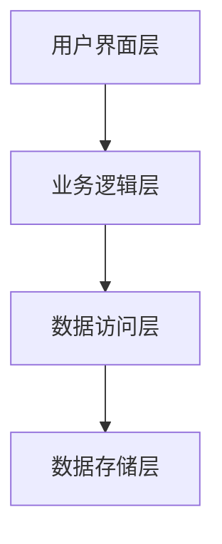

# 文档模板库

本目录包含标准化的文档模板、示例和格式规范，确保文档的一致性和专业性。

## 模板分类

### 1. 基础模板
- 文档基础结构模板
- 标准格式规范
- 常用元素定义

### 2. 技术文档模板
- API文档模板
- 架构设计文档模板
- 开发指南模板
- 测试文档模板

### 3. 管理文档模板
- 项目管理模板
- 发布管理模板
- 审查记录模板

### 4. 示例文档
- 完整文档示例
- 优秀文档参考
- 格式规范示例

## 基础模板

### 文档结构模板

```markdown
---
title: [文档标题]
version: [版本号]
created: [创建日期]
updated: [更新日期]
author: [作者姓名]
status: [状态: 草稿/审核中/已发布]
tags: [标签1, 标签2, 标签3]
related: [相关文档链接]
---

# [文档标题]

## 概述

[文档的简要概述，1-2段说明文档的目的、范围和目标读者]

## 目录结构

```
[目录结构]
```

## 正文内容

[文档的主要内容，按照逻辑层次组织]

## 参考资料

[相关参考资料和链接]

---

**维护者**: [维护人员]  
**更新频率**: [更新频率]  
**最后更新**: [最后更新日期]
```

### 标题层级规范

```markdown
# 一级标题 (H1)
## 二级标题 (H2)
### 三级标题 (H3)
#### 四级标题 (H4)
```

### 列表规范

```markdown
- 无序列表
  - 项目1
  - 项目2

1. 有序列表
  1. 第一步
  2. 第二步
  3. 第三步

- 任务列表
  - [x] 已完成任务
  - [ ] 待完成任务
```

### 代码块规范

```markdown
```kotlin
// Kotlin代码示例
fun exampleFunction() {
    // 代码内容
}
```

```bash
# Bash命令示例
./gradlew build
```

### 表格规范

```markdown
| 列1 | 列2 | 列3 |
|------|------|------|------|
| 内容1 | 内容2 | 内容3 |
| 内容4 | 内容5 | 内容6 |
```

## 技术文档模板

### API文档模板

```markdown
# API接口文档

## 概述

[API的基本信息和用途]

## 接口列表

### 接口名称

**接口地址**: `[API地址]`  
**请求方法**: `GET/POST/PUT/DELETE`  
**请求格式**: `JSON/XML/Form-Data`  
**响应格式**: `JSON/XML`  
**认证方式**: `Bearer Token/Basic Auth`  

#### 请求参数

| 参数名 | 类型 | 必填 | 默认值 | 说明 |
|-------|------|------|--------|------|
| param1 | string | 是 | - | 参数1说明 |
| param2 | number | 否 | 100 | 参数2说明 |

#### 响应示例

```json
{
  "code": 200,
  "message": "success",
  "data": {
    "key": "value"
  }
}
```

#### 错误码说明

| 错误码 | 说明 | 解决方案 |
|-------|------|----------|
| 400 | 请求参数错误 | 检查请求参数格式和内容 |
| 401 | 认证失败 | 检查认证信息是否正确 |
| 403 | 权限不足 | 联系管理员获取权限 |
| 500 | 服务器内部错误 | 联系技术支持 |

### 架构设计文档模板

```markdown
# 系统架构设计

## 架构概述

[系统整体架构的简要说明]

## 架构图



## 技术选型

### 核心框架
- **框架名称**: [框架名称]
- **版本**: [版本号]
- **选择原因**: [选择该框架的原因]

### 数据存储
- **数据库**: [数据库类型和版本]
- **缓存**: [缓存技术和方案]
- **文件存储**: [文件存储方案]

### 通信协议
- **HTTP/HTTPS**: [通信协议说明]
- **WebSocket**: [实时通信方案]
- **数据格式**: [JSON/XML/Protocol Buffer]

## 模块设计

### 模块划分
- [ ] 模块1：[功能描述]
- [ ] 模块2：[功能描述]
- [ ] 模块3：[功能描述]

### 接口设计
- **内部接口**: [模块间通信接口]
- **外部接口**: [与外部系统通信接口]

## 部署架构

### 环境划分
- **开发环境**: [开发环境配置]
- **测试环境**: [测试环境配置]
- **生产环境**: [生产环境配置]

### 部署流程
1. **构建流程**: [构建步骤和工具]
2. **部署策略**: [部署方式和策略]
3. **监控方案**: [监控和日志方案]

## 开发指南模板

```markdown
# 开发指南

## 环境搭建

### 系统要求
- **操作系统**: [支持的操作系统]
- **开发工具**: [IDE和必需工具]
- **硬件要求**: [最低硬件配置]

### 环境配置

#### 开发环境
```bash
# 1. 克隆项目
git clone [项目地址]

# 2. 安装依赖
./gradlew build

# 3. 配置环境
cp .env.example .env
```

#### 依赖管理
```kotlin
// build.gradle.kts
dependencies {
    implementation("com.example:library:1.0.0")
}
```

## 开发规范

### 代码规范
- **命名规范**: [变量、函数、类命名规则]
- **注释规范**: [代码注释要求和格式]
- **格式规范**: [代码格式化和风格要求]

### Git工作流
1. **分支策略**: [分支管理策略]
2. **提交规范**: [提交信息和格式要求]
3. **代码审查**: [代码审查流程和标准]
4. **合并策略**: [代码合并策略和流程]

## 测试文档模板

```markdown
# 测试文档

## 测试策略

### 测试类型
- **单元测试**: [单元测试范围和工具]
- **集成测试**: [集成测试范围和工具]
- **端到端测试**: [E2E测试范围和工具]
- **性能测试**: [性能测试指标和工具]

### 测试环境

#### 测试环境配置
```bash
# 测试环境搭建
./scripts/setup-test-env.sh

# 测试数据准备
./scripts/prepare-test-data.sh
```

### 测试用例

#### 测试用例模板
```markdown
### 测试用例名称

**测试目的**: [测试的目标和验证点]  
**前置条件**: [测试前需要满足的条件]  
**测试步骤**: [详细的测试操作步骤]  
**预期结果**: [期望的测试结果]  
**实际结果**: [实际的测试结果]  
**测试状态**: [通过/失败/阻塞]

#### 测试步骤
1. [步骤1的详细描述]
2. [步骤2的详细描述]
3. [步骤3的详细描述]

#### 测试数据
| 测试项 | 测试数据 | 预期结果 |
|-------|---------|-----------|-------------|
| 正常输入 | "正常测试文本" | 处理成功 |
| 异常输入 | "异常测试文本" | 错误处理 |
| 边界值 | "边界测试值" | 边界处理 |
```

### 测试报告

#### 测试报告模板
```markdown
# 测试报告

**测试日期**: [测试执行日期]  
**测试人员**: [测试执行人员]  
**测试版本**: [被测试的软件版本]  
**测试环境**: [测试环境信息]

## 测试结果

### 测试统计
- **总用例数**: [总用例数量]
- **通过用例数**: [通过的用例数量]
- **失败用例数**: [失败的用例数量]
- **通过率**: [通过百分比]%

### 问题记录
| 严重级别 | 问题描述 | 复现步骤 | 解决方案 | 状态 |
|---------|---------|---------|---------|--------|
| P0 | [问题描述] | [复现步骤] | [解决方案] | [已修复] |
| P1 | [问题描述] | [复现步骤] | [解决方案] | [修复中] |
| P2 | [问题描述] | [复现步骤] | [解决方案] | [待处理] |

## 管理文档模板

### 项目管理模板

```markdown
# 项目管理

## 项目概览

### 基本信息
- **项目名称**: [项目名称]
- **项目经理**: [项目经理姓名]
- **开始日期**: [项目开始日期]
- **预计完成**: [预计完成日期]
- **当前状态**: [当前项目状态]

### 团队信息
- **开发团队**: [开发团队成员和角色]
- **测试团队**: [测试团队成员和角色]
- **运维团队**: [运维团队成员和角色]

## 里程碑计划

| 里程碑 | 计划完成日期 | 实际完成日期 | 状态 | 负责人 |
|-------|-------------|-------------|------|--------|
| M1 | [日期1] | [日期1] | [已完成] | [负责人1] |
| M2 | [日期2] | [日期2] | [进行中] | [负责人2] |
| M3 | [日期3] | [日期3] | [未开始] | [负责人3] |

## 风险管理

| 风险项 | 影响程度 | 发生概率 | 应对措施 | 负责人 |
|-------|---------|---------|---------|--------|
| 技术风险 | 高 | 中等 | [应对措施] | [负责人] |
| 进度风险 | 中 | 低 | [应对措施] | [负责人] |
| 资源风险 | 低 | 低 | [应对措施] | [负责人] |

### 发布管理模板

```markdown
# 发布管理

## 发布计划

### 版本信息
- **版本号**: [版本号]
- **发布日期**: [计划发布日期]
- **发布类型**: [主要/次要/修复]
- **发布负责人**: [发布负责人]

### 发布检查

#### 发布前检查
- [ ] 代码审查完成
- [ ] 测试验证通过
- [ ] 文档更新完成
- [ ] 部署环境准备

#### 发布后验证
- [ ] 功能验证正常
- [ ] 性能指标正常
- [ ] 用户反馈收集

## 版本历史

| 版本 | 发布日期 | 主要变更 | Bug修复 | 发布负责人 |
|-------|---------|---------|---------|------------|
| v1.0.0 | [日期] | [变更描述] | [修复列表] | [负责人] |
| v1.1.0 | [日期] | [变更描述] | [修复列表] | [负责人] |

---

**模板维护者**: 文档管理员  
**更新频率**: 模板优化时更新  
**最后更新**: 2025-12-08
```

### 使用指南

1. **选择合适模板**: 根据文档类型选择对应模板
2. **填充必要信息**: 完整填写模板中的所有必填项
3. **遵循格式规范**: 严格按照模板的格式和结构
4. **定制化内容**: 在模板基础上根据具体需求进行适当调整
5. **审查和更新**: 完成后进行审查和定期更新

---

**创建日期**: 2025-12-08  
**维护者**: 文档管理员  
**更新频率**: 模板优化时更新