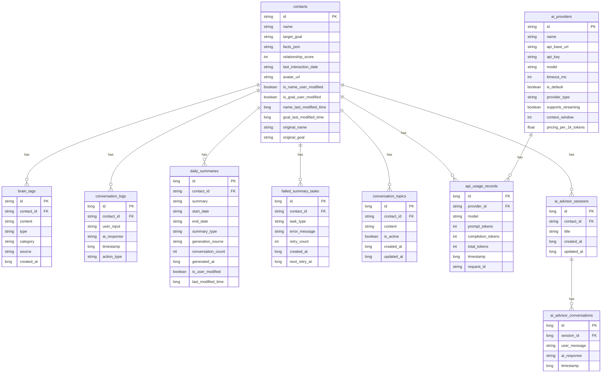

# Cherry项目整体架构详解

> 最后更新: 2026-01-04
> 架构模式: Clean Architecture + MVVM
> 技术栈: Kotlin 2.0.21, Gradle 8.13, Jetpack Compose, Hilt 2.52

---

## 一、项目概述

Cherry是一个共情AI助手Android应用，采用Clean Architecture架构模式进行设计。项目通过清晰的层次划分，实现了业务逻辑与展示逻辑的分离，确保代码的可维护性、可测试性和可扩展性。

### 1.1 架构设计原则

本项目遵循以下核心架构原则：

**依赖倒置原则（Dependency Inversion）**
- 上层模块不依赖下层模块，而是依赖抽象接口
- Domain层定义Repository接口，Data层实现这些接口
- 依赖关系：Presentation → Domain → Data

**单一职责原则（Single Responsibility）**
- 每个模块、类、函数都有且只有一个变化的理由
- Model负责数据定义，UseCase负责业务逻辑，ViewModel负责状态管理

**开闭原则（Open/Closed）**
- 对扩展开放，对修改关闭
- 新功能通过添加新代码实现，而非修改现有代码

**分层架构原则**
- Presentation层：负责UI展示和用户交互
- Domain层：负责业务逻辑和领域规则
- Data层：负责数据访问和存储

### 1.2 技术栈概览

| 类别 | 技术/版本 |
|------|-----------|
| 编程语言 | Kotlin 2.0.21 |
| 构建工具 | Gradle 8.13 |
| UI框架 | Jetpack Compose (BOM 2024.12.01) |
| 依赖注入 | Hilt 2.52 |
| 数据库 | Room v10 |
| 网络框架 | Retrofit + OkHttp |
| 导航 | Compose Navigation |
| 最低SDK | 24 (Android 7.0) |
| 目标SDK | 35 (Android 15) |

---

## 二、整体架构图


---

## 三、模块详细说明

### 3.1 app模块（应用入口层）

**模块职责**：
- 应用程序生命周期管理
- 全局组件初始化
- Android Application配置
- Hilt依赖注入设置

**目录结构**：
```
app/src/main/java/com/empathy/ai/
├── di/                          # Hilt依赖注入模块
│   ├── AiAdvisorModule.kt       # AI军师相关依赖
│   ├── ApiUsageModule.kt        # API用量统计依赖
│   ├── AppDispatcherModule.kt   # 协程调度器依赖
│   ├── EditModule.kt            # 编辑功能依赖
│   ├── FloatingWindowManagerModule.kt  # 悬浮窗管理依赖
│   ├── FloatingWindowModule.kt  # 悬浮窗依赖
│   ├── LoggerModule.kt          # 日志依赖
│   ├── NotificationModule.kt    # 通知依赖
│   ├── PersonaModule.kt         # Persona相关依赖
│   ├── ProxyModule.kt           # 代理配置依赖
│   ├── ServiceModule.kt         # 服务依赖
│   ├── SummaryModule.kt         # 总结功能依赖
│   ├── TopicModule.kt           # 话题功能依赖
│   └── UserProfileModule.kt     # 用户画像依赖
├── domain/                      # 领域服务（跨模块业务逻辑）
│   ├── service/
│   │   └── FloatingWindowService.kt  # 悬浮窗业务服务
│   └── util/
│       ├── ErrorHandler.kt      # 错误处理器
│       ├── FloatingView.kt      # 悬浮视图工具
│       ├── FloatingViewDebugLogger.kt  # 调试日志器
│       └── PerformanceMonitor.kt  # 性能监控器
├── notification/                # 通知管理
│   └── AiResultNotificationManager.kt  # AI结果通知管理
├── ui/                          # UI层
│   ├── MainActivity.kt          # 主Activity
│   └── theme/
│       └── AppTheme.kt          # 应用主题配置
├── util/                        # Android平台工具类
│   └── AndroidFloatingWindowManager.kt  # Android悬浮窗管理器
└── EmpathyApplication.kt        # Application入口类

app/src/main/assets/
└── field_mappings.json          # 字段映射配置
```

**关键类说明**：

| 类名 | 职责 |
|------|------|
| EmpathyApplication | Application入口类，负责全局初始化和Hilt组件配置 |
| MainActivity | 主Activity，负责Compose主题设置、导航系统集成、权限请求处理 |
| FloatingWindowService | 悬浮窗业务服务，处理悬浮窗相关的业务逻辑 |
| AiResultNotificationManager | AI结果通知管理，处理AI分析结果的通知展示 |

**依赖注入配置**：

app模块采用Hilt进行依赖注入，按功能域划分为多个Module：

1. **功能模块**：AiAdvisorModule、EditModule、SummaryModule等
2. **基础设施模块**：AppDispatcherModule、LoggerModule、NotificationModule等
3. **配置模块**：ProxyModule、PersonaModule、UserProfileModule等

**初始化顺序**：
1. Application初始化：创建Hilt组件，初始化全局依赖
2. MainActivity启动：设置Compose主题，初始化导航，检查必要权限
3. 各功能模块按需初始化

---

### 3.2 domain模块（领域业务层）

**模块职责**：
- 定义核心业务实体（Model）
- 定义数据访问接口（Repository Interface）
- 封装业务操作（UseCase）
- 提供领域服务（Service）
- 提供领域工具类（Util）

**目录结构**：
```
domain/src/main/kotlin/com/empathy/ai/domain/
├── model/                        # 领域模型（80+个模型类）
│   ├── ActionType.kt            # 动作类型枚举
│   ├── AiAdvisorConversation.kt # AI军师对话模型
│   ├── AiAdvisorError.kt        # AI军师错误模型
│   ├── AiAdvisorSession.kt      # AI军师会话模型
│   ├── AiModel.kt               # AI模型定义
│   ├── AiProvider.kt            # AI服务商模型
│   ├── AiResult.kt              # AI结果模型
│   ├── AiSummaryResponse.kt     # AI总结响应模型
│   ├── AnalysisResult.kt        # 分析结果模型
│   ├── ApiUsageRecord.kt        # API用量记录
│   ├── ApiUsageStats.kt         # API用量统计
│   ├── AppError.kt              # 应用错误定义
│   ├── BrainTag.kt              # 脑标签模型
│   ├── ChatMessage.kt           # 聊天消息模型
│   ├── CleanupConfig.kt         # 清理配置
│   ├── ConflictResult.kt        # 冲突结果模型
│   ├── ConnectionTestResult.kt  # 连接测试结果
│   ├── ContactProfile.kt        # 联系人画像模型
│   ├── ConversationContextConfig.kt  # 对话上下文配置
│   ├── ConversationLog.kt       # 对话记录模型
│   ├── ConversationTopic.kt     # 对话话题模型
│   ├── DailySummary.kt          # 每日总结模型
│   ├── DataStatus.kt            # 数据状态
│   ├── DateRange.kt             # 日期范围
│   ├── EditModeState.kt         # 编辑模式状态
│   ├── EditResult.kt            # 编辑结果
│   ├── EmotionType.kt           # 情感类型枚举
│   ├── ExportFormat.kt          # 导出格式
│   ├── ExtractedData.kt         # 提取数据
│   ├── Fact.kt                  # 事实模型
│   ├── FactCategory.kt          # 事实分类
│   ├── FactKeys.kt              # 事实键定义
│   ├── FactSource.kt            # 事实来源
│   ├── FailedSummaryTask.kt     # 失败总结任务
│   ├── FilterType.kt            # 筛选类型
│   ├── FloatingBubblePosition.kt  # 悬浮气泡位置
│   ├── FloatingBubbleState.kt   # 悬浮气泡状态
│   ├── FloatingWindowError.kt   # 悬浮窗错误
│   ├── FloatingWindowState.kt   # 悬浮窗状态
│   ├── FloatingWindowUiState.kt  # 悬浮窗UI状态
│   ├── GenerationSource.kt      # 生成来源
│   ├── GlobalPromptConfig.kt    # 全局提示词配置
│   ├── KeyEvent.kt              # 按键事件
│   ├── MessageType.kt           # 消息类型
│   ├── MinimizedRequestInfo.kt  # 最小化请求信息
│   ├── MinimizeError.kt         # 最小化错误
│   ├── PersonaSearchState.kt    # Persona搜索状态
│   ├── PolishResult.kt          # 润色结果
│   ├── PromptContext.kt         # 提示词上下文
│   ├── PromptError.kt           # 提示词错误
│   ├── PromptHistoryItem.kt     # 提示词历史项
│   ├── PromptScene.kt           # 提示词场景
│   ├── PromptValidationResult.kt  # 提示词验证结果
│   ├── ProviderPresets.kt       # 服务商预设
│   ├── ProxyConfig.kt           # 代理配置
│   ├── RefinementRequest.kt     # 精炼请求
│   ├── RelationshipLevel.kt     # 关系级别
│   ├── RelationshipTrend.kt     # 关系趋势
│   ├── ReplyResult.kt           # 回复结果
│   ├── SafetyCheckResult.kt     # 安全检查结果
│   ├── ScenePromptConfig.kt     # 场景提示词配置
│   ├── SendStatus.kt            # 发送状态
│   ├── SummaryError.kt          # 总结错误
│   ├── SummaryTask.kt           # 总结任务
│   ├── SummaryTaskStatus.kt     # 总结任务状态
│   ├── SummaryType.kt           # 总结类型
│   ├── TagUpdate.kt             # 标签更新
│   ├── TimeFlowMarker.kt        # 时间流逝标记
│   ├── TimelineItem.kt          # 时间线项
│   ├── TimestampedMessage.kt    # 带时间戳消息
│   ├── UserProfile.kt           # 用户画像模型
│   ├── UserProfileDimension.kt  # 用户画像维度
│   ├── UserProfileValidationResult.kt  # 验证结果
│   └── ViewMode.kt              # 视图模式
│
├── repository/                   # 仓库接口定义
│   ├── AiAdvisorRepository.kt   # AI军师仓库接口
│   ├── AiProviderRepository.kt  # AI服务商仓库接口
│   ├── AiRepository.kt          # AI仓库接口
│   ├── ApiUsageRepository.kt    # API用量仓库接口
│   ├── BrainTagRepository.kt    # 脑标签仓库接口
│   ├── ContactRepository.kt     # 联系人仓库接口
│   ├── ConversationRepository.kt  # 对话仓库接口
│   ├── DailySummaryRepository.kt  # 每日总结仓库接口
│   ├── FailedTaskRepository.kt  # 失败任务仓库接口
│   ├── FloatingWindowPreferencesRepository.kt  # 悬浮窗偏好仓库接口
│   ├── PrivacyRepository.kt     # 隐私仓库接口
│   ├── PromptRepository.kt      # 提示词仓库接口
│   ├── SettingsRepository.kt    # 设置仓库接口
│   ├── TopicRepository.kt       # 话题仓库接口
│   └── UserProfileRepository.kt  # 用户画像仓库接口
│
├── usecase/                      # 业务用例（40+个用例类）
│   ├── AddTagUseCase.kt         # 添加标签用例
│   ├── AddUserProfileTagUseCase.kt  # 添加用户画像标签用例
│   ├── AnalyzeChatUseCase.kt    # 分析聊天用例（核心用例1）
│   ├── BatchDeleteFactsUseCase.kt  # 批量删除事实用例
│   ├── BatchMoveFactsUseCase.kt  # 批量移动事实用例
│   ├── CheckDraftUseCase.kt     # 检查草稿用例
│   ├── CleanupApiUsageUseCase.kt  # 清理API用量用例
│   ├── ClearTopicUseCase.kt     # 清理话题用例
│   ├── CreateAdvisorSessionUseCase.kt  # 创建军师会话用例
│   ├── DeleteAdvisorConversationUseCase.kt  # 删除军师对话用例
│   ├── DeleteBrainTagUseCase.kt  # 删除脑标签用例
│   ├── DeleteContactUseCase.kt  # 删除联系人用例
│   ├── DeleteProviderUseCase.kt  # 删除服务商用例
│   ├── EditContactInfoUseCase.kt  # 编辑联系人信息用例
│   ├── EditConversationUseCase.kt  # 编辑对话用例
│   ├── EditFactUseCase.kt       # 编辑事实用例
│   ├── EditSummaryUseCase.kt     # 编辑总结用例
│   ├── ExportApiUsageUseCase.kt  # 导出API用量用例
│   ├── ExportUserProfileUseCase.kt  # 导出用户画像用例
│   ├── FeedTextUseCase.kt       # 喂养文本用例
│   ├── GenerateReplyUseCase.kt  # 生成回复用例（核心用例2）
│   ├── GetAdvisorConversationsUseCase.kt  # 获取军师对话用例
│   ├── GetAdvisorSessionsUseCase.kt  # 获取军师会话用例
│   ├── GetAllContactsUseCase.kt  # 获取所有联系人用例
│   ├── GetApiUsageStatsUseCase.kt  # 获取API用量统计用例
│   ├── GetBrainTagsUseCase.kt   # 获取脑标签用例
│   ├── GetContactUseCase.kt     # 获取联系人用例
│   ├── GetProvidersUseCase.kt   # 获取服务商用例
│   ├── GetTopicUseCase.kt       # 获取话题用例
│   ├── GetUserProfileUseCase.kt  # 获取用户画像用例
│   ├── GroupFactsByCategoryUseCase.kt  # 按分类分组事实用例
│   ├── ManageCustomDimensionUseCase.kt  # 管理自定义维度用例
│   ├── ManualSummaryUseCase.kt  # 手动总结用例
│   ├── PolishDraftUseCase.kt    # 润色草稿用例
│   ├── RecordApiUsageUseCase.kt  # 记录API用量用例
│   ├── RefinementUseCase.kt     # 精炼用例
│   ├── RemoveTagUseCase.kt      # 移除标签用例
│   ├── RemoveUserProfileTagUseCase.kt  # 移除用户画像标签用例
│   ├── SaveBrainTagUseCase.kt   # 保存脑标签用例
│   ├── SaveProfileUseCase.kt    # 保存画像用例
│   ├── SaveProviderUseCase.kt   # 保存服务商用例
│   ├── SendAdvisorMessageUseCase.kt  # 发送军师消息用例
│   ├── SetTopicUseCase.kt       # 设置话题用例
│   ├── SummarizeDailyConversationsUseCase.kt  # 总结每日对话用例
│   ├── TestConnectionUseCase.kt  # 测试连接用例
│   ├── TestProxyConnectionUseCase.kt  # 测试代理连接用例
│   ├── UpdateUserProfileUseCase.kt  # 更新用户画像用例
│   └── ValidationException.kt   # 验证异常
│
├── service/                      # 领域服务
│   ├── PrivacyEngine.kt         # 隐私处理引擎
│   └── SessionContextService.kt  # 会话上下文服务
│
└── util/                         # 领域工具类
    ├── AiSummaryProcessor.kt    # AI总结处理器
    ├── AiSummaryResponseParser.kt  # AI总结响应解析器
    ├── CategoryColorAssigner.kt  # 分类颜色分配器
    ├── ContentValidator.kt      # 内容验证器
    ├── ContextBuilder.kt        # 上下文构建器
    ├── ConversationContextBuilder.kt  # 对话上下文构建器
    ├── CoroutineDispatchers.kt  # 协程调度器
    ├── DataCleanupManager.kt    # 数据清理管理器
    ├── DateRangeValidator.kt    # 日期范围验证器
    ├── DateUtils.kt             # 日期工具
    ├── ErrorMapper.kt           # 错误映射器
    ├── FactSearchFilter.kt      # 事实搜索过滤器
    ├── FailedTaskRecovery.kt    # 失败任务恢复
    ├── FloatingWindowManager.kt  # 悬浮窗管理器
    ├── IdentityPrefixHelper.kt  # 身份前缀助手
    ├── JsonParser.kt            # JSON解析器
    ├── LocalSummaryProcessor.kt  # 本地总结处理器
    ├── Logger.kt                # 日志接口
    ├── MemoryConstants.kt       # 内存常量
    ├── PerformanceMetrics.kt    # 性能指标
    ├── PromptBuilder.kt         # 提示词构建器
    ├── PromptSanitizer.kt       # 提示词清理器
    ├── PromptTemplates.kt       # 提示词模板
    ├── PromptValidator.kt       # 提示词验证器
    ├── PromptVariableResolver.kt  # 提示词变量解析器
    ├── SummaryConflictChecker.kt  # 总结冲突检查器
    ├── SystemPrompts.kt         # 系统提示词
    ├── UserProfileContextBuilder.kt  # 用户画像上下文构建器
    └── UserProfileValidator.kt  # 用户画像验证器
```

**核心领域模型说明**：

| 模型类 | 职责 | 关键字段 |
|--------|------|----------|
| ContactProfile | 联系人画像，包含联系人的所有相关信息 | id, name, targetGoal, facts, relationshipScore, tags |
| ChatMessage | 聊天消息模型，表示单条聊天记录 | id, content, timestamp, isFromMe, contactId |
| AnalysisResult | AI分析结果模型 | emotion, intent, suggestions, confidence, riskLevel, strategyAnalysis, replySuggestion |
| BrainTag | 脑标签模型，用于标记联系人的特征 | id, contactId, content, type, category, source |
| Fact | 事实模型，记录联系人的信息 | key, value, timestamp, source, category |
| UserProfile | 用户画像模型 | id, name, relationshipLevel, facts, tags |
| ConversationLog | 对话记录模型 | id, contactId, userInput, aiResponse, timestamp |
| DailySummary | 每日总结模型 | id, contactId, summary, date, type, source |

**核心用例说明**：

| 用例类 | 职责 | 依赖 |
|--------|------|------|
| AnalyzeChatUseCase | 核心业务流：主动分析聊天内容 | ContactRepository, BrainTagRepository, AiRepository, ConversationRepository, PromptBuilder |
| GenerateReplyUseCase | 核心业务流：根据聊天内容生成回复 | ContactRepository, AiRepository, ConversationRepository |
| FeedTextUseCase | 核心业务流：喂养文本到AI进行总结 | ConversationRepository, AiRepository, DailySummaryRepository |
| ManualSummaryUseCase | 核心业务流：手动触发每日总结 | ContactRepository, DailySummaryRepository, AiRepository |
| SendAdvisorMessageUseCase | AI军师对话功能 | AiAdvisorRepository, CreateAdvisorSessionUseCase |

**设计模式应用**：

1. **策略模式**：不同类型的Summary（AI生成、手动生成）使用不同的处理策略
2. **观察者模式**：ContactRepository使用Flow实现数据变化的观察
3. **建造者模式**：PromptBuilder使用链式调用构建复杂的提示词
4. **工厂模式**：AiSummaryProcessor根据SummaryType创建不同的处理器

**数据流向**：


---

### 3.3 data模块（数据访问层）

**模块职责**：
- 实现Domain层定义的Repository接口
- 管理本地数据存储（Room数据库、SharedPreferences）
- 管理远程数据访问（Retrofit API）
- 数据解析和转换（Entity ↔ Domain Model）
- 缓存策略和性能优化

**目录结构**：
```
data/src/main/kotlin/com/empathy/ai/data/
├── di/                          # 依赖注入模块
│   ├── DatabaseModule.kt        # 数据库相关依赖
│   ├── DispatcherModule.kt      # 协程调度器依赖
│   ├── MemoryModule.kt          # 内存管理依赖
│   ├── NetworkModule.kt         # 网络相关依赖
│   ├── OkHttpClientFactory.kt   # OkHttp客户端工厂
│   ├── PromptModule.kt          # 提示词相关依赖
│   ├── Qualifiers.kt            # 依赖注入限定符
│   └── RepositoryModule.kt      # 仓库绑定
│
├── local/                       # 本地数据存储
│   ├── ApiKeyStorage.kt         # API密钥安全存储
│   ├── AppDatabase.kt           # Room数据库主类
│   ├── CleanupPreferencesImpl.kt  # 清理配置存储
│   ├── ConversationPreferences.kt  # 对话配置存储
│   ├── DefaultPrompts.kt        # 默认提示词配置
│   ├── FloatingWindowPreferences.kt  # 悬浮窗配置存储
│   ├── MemoryPreferences.kt     # 内存配置存储
│   ├── PrivacyPreferences.kt    # 隐私配置存储
│   ├── PromptFileBackup.kt      # 提示词备份管理
│   ├── PromptFileStorage.kt     # 提示词文件存储
│   ├── ProxyPreferences.kt      # 代理配置存储
│   ├── UserProfileBackupManager.kt  # 用户画像备份管理
│   ├── UserProfileCache.kt      # 用户画像缓存
│   ├── UserProfilePreferences.kt  # 用户画像配置存储
│   ├── converter/
│   │   ├── FactListConverter.kt  # Fact列表转换器
│   │   └── RoomTypeConverters.kt  # Room类型转换器
│   ├── dao/                     # 数据访问对象
│   │   ├── AiAdvisorDao.kt      # AI军师DAO
│   │   ├── AiProviderDao.kt     # AI服务商DAO
│   │   ├── ApiUsageDao.kt       # API用量DAO
│   │   ├── BrainTagDao.kt       # 脑标签DAO
│   │   ├── ContactDao.kt        # 联系人DAO
│   │   ├── ConversationLogDao.kt  # 对话记录DAO
│   │   ├── ConversationTopicDao.kt  # 对话话题DAO
│   │   ├── DailySummaryDao.kt   # 每日总结DAO
│   │   └── FailedSummaryTaskDao.kt  # 失败任务DAO
│   └── entity/                  # 数据库实体
│       ├── AiAdvisorConversationEntity.kt  # AI军师对话实体
│       ├── AiAdvisorSessionEntity.kt  # AI军师会话实体
│       ├── AiProviderEntity.kt   # AI服务商实体
│       ├── ApiUsageEntity.kt     # API用量实体
│       ├── BrainTagEntity.kt     # 脑标签实体
│       ├── ContactProfileEntity.kt  # 联系人画像实体
│       ├── ConversationLogEntity.kt  # 对话记录实体
│       ├── ConversationTopicEntity.kt  # 对话话题实体
│       ├── DailySummaryEntity.kt  # 每日总结实体
│       └── FailedSummaryTaskEntity.kt  # 失败任务实体
│
├── remote/                      # 远程数据访问
│   ├── api/
│   │   └── OpenAiApi.kt         # OpenAI API接口定义
│   └── model/
│       ├── AiSummaryResponseDto.kt  # AI总结响应DTO
│       ├── ChatRequestDto.kt    # 聊天请求DTO
│       ├── ChatResponseDto.kt   # 聊天响应DTO
│       ├── MessageDto.kt        # 消息DTO
│       └── ModelsResponseDto.kt  # 模型列表响应DTO
│
├── repository/                  # 仓库实现类
│   ├── AiAdvisorRepositoryImpl.kt  # AI军师仓库实现
│   ├── AiProviderRepositoryImpl.kt  # AI服务商仓库实现
│   ├── AiRepositoryImpl.kt      # AI仓库实现
│   ├── ApiUsageRepositoryImpl.kt  # API用量仓库实现
│   ├── BrainTagRepositoryImpl.kt  # 脑标签仓库实现
│   ├── ContactRepositoryImpl.kt  # 联系人仓库实现
│   ├── ConversationRepositoryImpl.kt  # 对话仓库实现
│   ├── DailySummaryRepositoryImpl.kt  # 每日总结仓库实现
│   ├── FailedTaskRepositoryImpl.kt  # 失败任务仓库实现
│   ├── PrivacyRepositoryImpl.kt  # 隐私仓库实现
│   ├── PromptRepositoryImpl.kt  # 提示词仓库实现
│   ├── ProviderCompatibility.kt  # 服务商兼容性工具
│   ├── TopicRepositoryImpl.kt   # 话题仓库实现
│   ├── UserProfileRepositoryImpl.kt  # 用户画像仓库实现
│   └── settings/
│       └── SettingsRepositoryImpl.kt  # 设置仓库实现
│
├── parser/                      # 数据解析器
│   ├── AiResponseParser.kt      # AI响应解析器接口
│   ├── AiSummaryResponseParserImpl.kt  # AI总结响应解析器实现
│   ├── EnhancedJsonCleaner.kt   # 增强JSON清洗器
│   ├── FallbackHandler.kt       # 降级处理器
│   ├── FieldMapper.kt           # 字段映射器
│   └── JsonCleaner.kt           # JSON清洗器
│
└── util/                        # 数据层工具类
    ├── AiResponseCleaner.kt     # AI响应清理器
    ├── AndroidLogger.kt         # Android日志器
    ├── ApiErrorHandler.kt       # API错误处理器
    └── DebugLogger.kt           # 调试日志器
```

**核心组件说明**：

| 组件类 | 职责 | 技术 |
|--------|------|------|
| AppDatabase | Room数据库主类，管理所有表和DAO | Room v10 |
| ContactDao | 联系人数据访问对象 | Room |
| ConversationRepositoryImpl | 对话记录仓库实现 | Room + Flow |
| AiRepositoryImpl | AI仓库实现 | Retrofit |
| ApiKeyStorage | API密钥安全存储 | EncryptedSharedPreferences |
| PromptFileStorage | 提示词文件存储 | JSON文件 |
| OpenAiApi | OpenAI API接口定义 | Retrofit |

**数据库架构**：

AppDatabase当前版本：v13，包含以下数据表：



**数据流向设计**：

**读取流程**：
```
请求 → Repository → 检查本地缓存 → 缓存命中？ → 否 → 网络请求 → 保存到本地 → 返回数据
                               ↓ 是
                             返回缓存数据
```

**写入流程**：
```
请求 → Repository → 本地写入 → 网络同步 → 成功？ → 是 → 更新本地状态
                                 ↓ 否
                             回滚本地更改
```

**数据转换**：


**缓存策略**：

1. **内存缓存**：UserProfileCache使用ConcurrentHashMap实现
2. **数据库缓存**：Room数据库作为持久化缓存
3. **Preferences缓存**：SharedPreferences存储配置信息

**错误处理**：

1. **统一错误类型**：使用Result<T>类型封装操作结果
2. **自动重试机制**：BaseViewModel提供重试逻辑
3. **降级策略**：FallbackHandler提供降级处理

---

### 3.4 presentation模块（表现层）

**模块职责**：
- 使用Jetpack Compose构建声明式UI
- 通过ViewModel管理UI状态
- 处理用户交互和事件
- 控制页面导航和跳转

**目录结构**：
```
presentation/src/main/kotlin/com/empathy/ai/presentation/
├── navigation/                  # 导航系统
│   ├── NavGraph.kt             # 导航图定义
│   ├── NavRoutes.kt            # 路由常量
│   └── PromptEditorNavigation.kt  # 提示词编辑器导航
│
├── theme/                      # 主题配置
│   ├── AdaptiveDimensions.kt   # 自适应尺寸
│   ├── AnimationSpec.kt        # 动画规格
│   ├── AvatarColors.kt         # 头像颜色
│   ├── CategoryBarColors.kt    # 分类栏颜色
│   ├── CategoryColorPalette.kt  # 分类颜色调色板
│   ├── Color.kt                # 颜色定义
│   ├── Dimensions.kt           # 尺寸定义
│   ├── EmotionColors.kt        # 情感颜色
│   ├── MacaronTagColors.kt     # 马卡龙标签颜色
│   ├── RelationshipColors.kt   # 关系颜色
│   ├── SemanticColors.kt       # 语义颜色
│   ├── Spacing.kt              # 间距定义
│   ├── Theme.kt                # 主题配置
│   └── Type.kt                 # 字体排版
│
├── ui/                         # UI组件
│   ├── CLAUDE.md              # CLAUDE配置
│   ├── component/
│   │   ├── CLAUDE.md          # 组件CLAUDE配置
│   │   ├── MaxHeightScrollView.kt  # 最大高度滚动视图
│   │   ├── filter/
│   │   │   └── ViewModeSwitcher.kt  # 视图模式切换器
│   │   ├── input/
│   │   │   ├── ContactSearchBar.kt  # 联系人搜索栏
│   │   │   ├── CustomTextField.kt   # 自定义文本框
│   │   │   └── TagSearchBar.kt      # 标签搜索栏
│   │   ├── ios/               # iOS风格组件
│   │   │   ├── AddTagButton.kt
│   │   │   ├── DimensionCard.kt
│   │   │   ├── DraggableModelList.kt
│   │   │   ├── EditableTag.kt
│   │   │   ├── IOSFloatingSearchBar.kt
│   │   │   ├── IOSFormField.kt
│   │   │   ├── IOSLargeTitleBar.kt
│   │   │   ├── IOSModelListItem.kt
│   │   │   ├── IOSNavigationBar.kt
│   │   │   ├── IOSProviderCard.kt
│   │   │   ├── IOSSearchBar.kt
│   │   │   ├── IOSSegmentedControl.kt
│   │   │   ├── IOSSettingsItem.kt
│   │   │   ├── IOSSettingsSection.kt
│   │   │   ├── IOSSwitch.kt
│   │   │   ├── IOSTabSwitcher.kt
│   │   │   ├── IOSTestConnectionButton.kt
│   │   │   ├── ProfileCompletionCard.kt
│   │   │   ├── ProxyTypePicker.kt
│   │   │   ├── QuickSelectTags.kt
│   │   │   ├── TemperatureSlider.kt
│   │   │   ├── TokenLimitInput.kt
│   │   │   ├── UsageListItem.kt
│   │   │   └── UsageOverviewCard.kt
│   │   ├── list/
│   │   │   └── ContactListItem.kt  # 联系人列表项
│   │   ├── message/
│   │   │   ├── ConversationBubble.kt  # 对话气泡
│   │   │   └── MessageBubble.kt     # 消息气泡
│   │   ├── navigation/
│   │   │   └── EmpathyBottomNavigation.kt  # 底部导航
│   │   ├── overview/
│   │   │   ├── AiPromptSettingsRow.kt  # AI提示词设置行
│   │   │   ├── HealthScoreCardV2.kt   # 健康评分卡片
│   │   │   ├── IdentityCard.kt        # 身份卡片
│   │   │   ├── LatestDiscoveryCard.kt  # 最新发现卡片
│   │   │   └── PastelTagsCard.kt      # 柔和标签卡片
│   │   ├── persona/
│   │   │   ├── AddTagDialog.kt        # 添加标签对话框
│   │   │   ├── AiInferenceSection.kt  # AI推断区域
│   │   │   ├── CategoryCard.kt        # 分类卡片
│   │   │   ├── ModernPersonaTab.kt    # 现代人格标签页
│   │   │   ├── RiskTagItem.kt         # 风险标签项
│   │   │   ├── SmartFolderCard.kt     # 智能文件夹卡片
│   │   │   └── TagDetailDialog.kt     # 标签详情对话框
│   │   ├── relationship/
│   │   │   ├── FactItem.kt            # 事实项
│   │   │   ├── RelationshipScoreSection.kt  # 关系评分区域
│   │   │   └── TrendIcon.kt          # 趋势图标
│   │   ├── state/
│   │   │   ├── EditedBadge.kt        # 已编辑徽章
│   │   │   ├── EmptyStateView.kt     # 空状态视图
│   │   │   ├── EmptyView.kt          # 空视图
│   │   │   ├── ErrorStateView.kt     # 错误状态视图
│   │   │   ├── ErrorView.kt          # 错误视图
│   │   │   ├── FriendlyErrorCard.kt  # 友好错误卡片
│   │   │   ├── LoadingIndicator.kt   # 加载指示器
│   │   │   ├── LoadingSkeleton.kt    # 加载骨架屏
│   │   │   └── StatusBadge.kt        # 状态徽章
│   │   ├── tag/
│   │   │   ├── AddTagButton.kt       # 添加标签按钮
│   │   │   └── MacaronTagChip.kt     # 马卡龙标签芯片
│   │   ├── timeline/
│   │   │   ├── EmotionNode.kt        # 情感节点
│   │   │   ├── EmotionTimelineView.kt  # 情感时间线视图
│   │   │   ├── FactListView.kt       # 事实列表视图
│   │   │   ├── ManualSummaryFab.kt   # 手动总结浮动按钮
│   │   │   ├── SafeEmotionTimelineView.kt  # 安全情感时间线视图
│   │   │   ├── TimelineCard.kt       # 时间线卡片
│   │   │   ├── TimelineItem.kt       # 时间线项
│   │   │   └── TimelineLine.kt       # 时间线
│   │   ├── topic/
│   │   │   ├── TopicBadge.kt         # 话题徽章
│   │   │   ├── TopicHistorySection.kt  # 话题历史区域
│   │   │   ├── TopicInputField.kt    # 话题输入框
│   │   │   └── TopicSettingDialog.kt  # 话题设置对话框
│   │   └── vault/
│   │       ├── DataSourceGrid.kt     # 数据源网格
│   │       ├── DataSourceGridCard.kt  # 数据源网格卡片
│   │       ├── DataStatisticsCard.kt  # 数据统计卡片
│   │       ├── DataStatus.kt         # 数据状态
│   │       └── StatusBadge.kt        # 状态徽章
│   ├── floating/              # 悬浮窗UI
│   │   ├── FloatingBubbleView.kt  # 悬浮气泡视图
│   │   ├── FloatingViewV2.kt      # 悬浮视图V2
│   │   ├── RefinementOverlay.kt   # 精炼覆盖层
│   │   ├── ResultCard.kt          # 结果卡片
│   │   └── TabSwitcher.kt         # 标签切换器
│   └── screen/                # 页面组件
│       ├── CLAUDE.md              # 屏幕CLAUDE配置
│       ├── MainScreen.kt          # 主屏幕
│       ├── chat/
│       │   ├── ChatScreen.kt      # 聊天屏幕
│       │   ├── ChatUiEvent.kt     # 聊天UI事件
│       │   └── ChatUiState.kt     # 聊天UI状态
│       ├── contact/
│       │   ├── ContactDetailScreen.kt  # 联系人详情屏幕
│       │   ├── ContactDetailTabScreen.kt  # 联系人详情标签屏幕
│       │   ├── ContactDetailUiEvent.kt  # 联系人详情UI事件
│       │   ├── ContactDetailUiState.kt  # 联系人详情UI状态
│       │   ├── ContactListScreen.kt  # 联系人列表屏幕
│       │   ├── ContactListUiEvent.kt  # 联系人列表UI事件
│       │   ├── ContactListUiState.kt  # 联系人列表UI状态
│       │   ├── CreateContactScreen.kt  # 创建联系人屏幕
│       │   ├── DetailTab.kt        # 详情标签
│       │   ├── factstream/
│       │   │   ├── FactStreamTab.kt  # 事实流标签
│       │   │   ├── FactStreamTopBar.kt  # 事实流顶栏
│       │   │   ├── FactStreamUiState.kt  # 事实流UI状态
│       │   │   ├── ListView.kt      # 列表视图
│       │   │   ├── ListViewRow.kt   # 列表行
│       │   │   └── TimelineView.kt  # 时间线视图
│       │   ├── overview/
│       │   │   ├── DynamicEmotionalHeader.kt  # 动态情感头
│       │   │   ├── LatestFactHookCard.kt  # 最新事实钩子卡片
│       │   │   ├── OverviewTab.kt    # 概览标签
│       │   │   ├── OverviewUiState.kt  # 概览UI状态
│       │   │   └── TopTagsSection.kt  # 顶部标签区域
│       │   ├── persona/
│       │   │   ├── BatchActionBar.kt  # 批量操作栏
│       │   │   ├── BatchDeleteConfirmDialog.kt  # 批量删除确认对话框
│       │   │   ├── CategorySearchBar.kt  # 分类搜索栏
│       │   │   ├── CategorySection.kt  # 分类区域
│       │   │   ├── DynamicCategoryCard.kt  # 动态分类卡片
│       │   │   ├── EditModeTopBar.kt  # 编辑模式顶栏
│       │   │   ├── MoveCategoryDialog.kt  # 移动分类对话框
│       │   │   ├── PersonaTab.kt     # 人格标签
│       │   │   ├── PersonaTabV2.kt   # 人格标签V2
│       │   │   ├── PersonaUiState.kt  # 人格UI状态
│       │   │   └── SelectableTagChip.kt  # 可选标签芯片
│       │   ├── summary/
│       │   │   ├── ConflictResolutionDialog.kt  # 冲突解决对话框
│       │   │   ├── DateRangePickerDialog.kt  # 日期范围选择对话框
│       │   │   ├── ManualSummaryFab.kt  # 手动总结浮动按钮
│       │   │   ├── MissingSummaryCard.kt  # 缺失总结卡片
│       │   │   ├── QuickDateOptions.kt  # 快捷日期选项
│       │   │   ├── RangeWarningDialog.kt  # 范围警告对话框
│       │   │   ├── SummaryDetailDialog.kt  # 总结详情对话框
│       │   │   ├── SummaryErrorDialog.kt  # 总结错误对话框
│       │   │   ├── SummaryProgressDialog.kt  # 总结进度对话框
│       │   │   ├── SummaryResultDialog.kt  # 总结结果对话框
│       │   │   └── SummarySourceBadge.kt  # 总结来源徽章
│       │   └── vault/
│       │       ├── DataSourceCard.kt  # 数据源卡片
│       │       ├── DataVaultTab.kt   # 数据保险库标签
│       │       └── DataVaultUiState.kt  # 数据保险库UI状态
│       ├── prompt/
│       │   ├── PromptEditMode.kt    # 提示词编辑模式
│       │   ├── PromptEditorResult.kt  # 提示词编辑器结果
│       │   ├── PromptEditorScreen.kt  # 提示词编辑器屏幕
│       │   ├── PromptEditorUiEvent.kt  # 提示词编辑器UI事件
│       │   ├── PromptEditorUiState.kt  # 提示词编辑器UI状态
│       │   ├── PromptSceneTab.kt    # 提示词场景标签
│       │   └── component/
│       │       ├── CharacterCounter.kt  # 字符计数器
│       │       ├── DiscardConfirmDialog.kt  # 丢弃确认对话框
│       │       ├── InlineErrorBanner.kt  # 行内错误横幅
│       │       ├── PromptEditorTopBar.kt  # 提示词编辑器顶栏
│       │       └── PromptInputField.kt  # 提示词输入框
│       ├── settings/
│       │   ├── SettingsScreen.kt   # 设置屏幕
│       │   ├── SettingsUiEvent.kt  # 设置UI事件
│       │   └── SettingsUiState.kt  # 设置UI状态
│       ├── tag/
│       │   ├── BrainTagScreen.kt   # 脑标签屏幕
│       │   ├── BrainTagUiEvent.kt  # 脑标签UI事件
│       │   └── BrainTagUiState.kt  # 脑标签UI状态
│       └── userprofile/
│           ├── UserProfileScreen.kt  # 用户画像屏幕
│           ├── UserProfileUiEvent.kt  # 用户画像UI事件
│           └── UserProfileUiState.kt  # 用户画像UI状态
│
├── util/                       # 表现层工具类
│   ├── AdaptiveAnimationConfig.kt  # 自适应动画配置
│   ├── DebugLogger.kt          # 调试日志器
│   ├── ErrorMessageMapper.kt   # 错误消息映射器
│   ├── FilterTypeIcons.kt      # 筛选类型图标
│   ├── FloatingWindowManagerStub.kt  # 悬浮窗管理器存根
│   └── ImageLoaderConfig.kt    # 图片加载配置
│
└── viewmodel/                  # ViewModel层
    ├── AiAdvisorChatViewModel.kt  # AI军师聊天ViewModel
    ├── AiAdvisorViewModel.kt   # AI军师ViewModel
    ├── AiConfigViewModel.kt    # AI配置ViewModel
    ├── BaseViewModel.kt        # ViewModel基类
    ├── BrainTagViewModel.kt    # 脑标签ViewModel
    ├── ChatViewModel.kt        # 聊天ViewModel
    ├── ContactDetailTabViewModel.kt  # 联系人详情标签ViewModel
    ├── ContactDetailTabViewModelDebug.kt  # 调试版
    ├── ContactDetailTabViewModelWithDebug.kt  # 带调试版
    ├── ContactDetailViewModel.kt  # 联系人详情ViewModel
    ├── ContactListViewModel.kt  # 联系人列表ViewModel
    ├── CreateContactViewModel.kt  # 创建联系人ViewModel
    ├── ManualSummaryUiEvent.kt  # 手动总结UI事件
    ├── ManualSummaryUiState.kt  # 手动总结UI状态
    ├── ManualSummaryViewModel.kt  # 手动总结ViewModel
    ├── PromptEditorViewModel.kt  # 提示词编辑器ViewModel
    └── SettingsViewModel.kt     # 设置ViewModel
```

**MVVM架构实现**：


**ViewModel基类（BaseViewModel）**：

```kotlin
abstract class BaseViewModel : ViewModel() {
    protected val tag: String = this::class.java.simpleName
    
    protected fun performOperation(
        operation: suspend () -> Result<Unit>,
        onSuccess: () -> Unit = {},
        onError: (String) -> Unit = {},
        maxRetries: Int = 0
    ) {
        // 统一错误处理和重试逻辑
    }
}
```

**UI状态管理**：

| ViewModel | UI State | UI Event |
|-----------|----------|----------|
| ContactListViewModel | ContactListUiState | ContactListUiEvent |
| ContactDetailViewModel | ContactDetailUiState | ContactDetailUiEvent |
| ChatViewModel | ChatUiState | ChatUiEvent |
| SettingsViewModel | SettingsUiState | SettingsUiEvent |
| BrainTagViewModel | BrainTagUiState | BrainTagUiEvent |
| PromptEditorViewModel | PromptEditorUiState | PromptEditorUiEvent |

**主题系统**：

1. **颜色系统**：Material3颜色规范，支持深色模式，动态颜色适配
2. **字体系统**：统一字体规范，响应式字体大小
3. **间距系统**：AdaptiveDimensions提供自适应尺寸
4. **动画系统**：AnimationSpec定义标准动画效果

**导航设计**：


---

### 3.5 di模块（依赖注入模块）

**模块职责**：
- 统一管理应用的所有依赖注入配置
- 按功能域划分Hilt Module
- 定义依赖提供规则和作用域
- 确保类型安全和编译时检查

**目录结构**：
```
di/                          # DI模块（Hilt配置）
├── AiAdvisorModule.kt       # AI军师相关依赖注入
├── ApiUsageModule.kt        # API用量统计依赖注入
├── AppDispatcherModule.kt   # 协程调度器依赖注入
├── EditModule.kt            # 编辑功能依赖注入
├── FloatingWindowManagerModule.kt  # 悬浮窗管理器依赖注入
├── FloatingWindowModule.kt  # 悬浮窗相关依赖注入
├── LoggerModule.kt          # 日志器依赖注入
├── NotificationModule.kt    # 通知相关依赖注入
├── PersonaModule.kt         # Persona相关依赖注入
├── ProxyModule.kt           # 代理配置依赖注入
├── ServiceModule.kt         # 服务类依赖注入
├── SummaryModule.kt         # 总结功能依赖注入
├── TopicModule.kt           # 话题功能依赖注入
└── UserProfileModule.kt     # 用户画像依赖注入
```

**Hilt作用域定义**：

| 作用域 | 生命周期 | 用途 | 示例 |
|--------|----------|------|------|
| @Singleton | 应用级别 | 单例组件 | 数据库、网络客户端 |
| @ActivityRetained | Activity保留 | 配置变更时保留 | ViewModel |
| @Fragment | Fragment级别 | Fragment特定依赖 | Fragment适配器 |
| @ViewScope | View级别 | Compose相关 | 状态持有者 |

**核心Module示例**：

**DatabaseModule**：
```kotlin
@Module
@InstallIn(SingletonComponent::class)
object DatabaseModule {
    @Provides
    @Singleton
    fun provideAppDatabase(
        @ApplicationContext context: Context
    ): AppDatabase {
        return Room.databaseBuilder(
            context,
            AppDatabase::class.java,
            "empathy_database"
        ).build()
    }
    
    @Provides
    fun provideContactDao(database: AppDatabase): ContactDao {
        return database.contactDao()
    }
}
```

**NetworkModule**：
```kotlin
@Module
@InstallIn(SingletonComponent::class)
object NetworkModule {
    @Provides
    @Singleton
    fun provideOkHttpClient(): OkHttpClient {
        return OkHttpClient.Builder()
            .addInterceptor(HttpLoggingInterceptor().apply {
                level = if (BuildConfig.DEBUG) {
                    HttpLoggingInterceptor.Level.BODY
                } else {
                    HttpLoggingInterceptor.Level.NONE
                }
            })
            .connectTimeout(30, TimeUnit.SECONDS)
            .readTimeout(30, TimeUnit.SECONDS)
            .build()
    }
}
```

**RepositoryModule**：
```kotlin
@Module
@InstallIn(SingletonComponent::class)
object RepositoryModule {
    @Binds
    @Singleton
    abstract fun bindContactRepository(
        impl: ContactRepositoryImpl
    ): ContactRepository
}
```

---

## 四、模块间依赖关系

```mermaid
graph TD
    subgraph "app"
        A[app] --> B[di modules]
        A --> C[domain services]
        A --> D[util]
    end
    
    subgraph "presentation"
        E[presentation] --> F[viewmodel]
        E --> G[ui screens]
        E --> H[ui components]
        E --> I[navigation]
        E --> J[theme]
        F --> K[usecase]
    end
    
    subgraph "domain"
        L[domain] --> M[model]
        L --> N[repository interfaces]
        L --> O[usecase]
        L --> P[service]
        L --> Q[util]
        O --> N
        N --> M
    end
    
    subgraph "data"
        R[data] --> S[repository impl]
        S --> T[local]
        S --> U[remote]
        S --> V[parser]
        T --> W[dao]
        T --> X[entity]
        U --> Y[api]
        N <-- S
    end
    
    K --> N
    S --> N
```

---

## 五、数据流说明

### 5.1 典型业务流：聊天分析

```mermaid
sequenceDiagram
    participant U as 用户
    participant P as Presentation
    participant V as ViewModel
    participant Uc as AnalyzeChatUseCase
    participant R as Repository
    participant D as Data
    
    U->>P: 点击"帮我分析"按钮
    P->>V: 发送AnalyzeEvent
    V->>Uc: invoke(contactId, rawContext)
    
    rect rgb(240, 248, 255)
    Note over Uc,R: 并行加载数据
    Uc->>R: getProfile(contactId)
    R->>D: 查询联系人
    D-->>R: 返回数据
    R-->>Uc: ContactProfile
    
    Uc->>R: getTagsForContact(contactId)
    R-->>Uc: List<BrainTag>
    end
    
    Uc->>Uc: 构建上下文数据
    Uc->>Uc: 清洗和脱敏
    Uc->>Uc: 构建提示词
    
    Uc->>R: analyzeChat(provider, context, instruction)
    R->>D: 调用AI API
    D-->>R: 返回分析结果
    R-->>Uc: AnalysisResult
    
    Uc->>R: 保存对话记录
    R-->>Uc: 完成
    
    Uc-->>V: Result.success(analysisResult)
    V-->>P: 更新UI状态
    P->>U: 显示分析结果
end
```

### 5.2 数据同步策略


---

## 六、设计模式应用

### 6.1 策略模式

**应用场景**：不同类型的AI响应解析

```kotlin
interface AiResponseParser {
    fun parse(response: String): AiResult
}

class AiSummaryResponseParserImpl : AiResponseParser {
    // 实现AI总结响应解析
}
```

### 6.2 观察者模式

**应用场景**：数据库数据变化通知

```kotlin
fun getAllProfiles(): Flow<List<ContactProfile>> {
    return dao.getAllProfiles().map { entities ->
        entities.map { entityToDomain(it) }
    }
}
```

### 6.3 建造者模式

**应用场景**：复杂提示词构建

```kotlin
class PromptBuilder {
    fun buildWithTopic(...): String {
        // 链式调用构建复杂提示词
    }
}
```

### 6.4 工厂模式

**应用场景**：不同类型总结处理器

```kotlin
class AiSummaryProcessor {
    fun createProcessor(type: SummaryType): SummaryProcessor {
        return when (type) {
            SummaryType.AI -> AiSummaryProcessor()
            SummaryType.MANUAL -> ManualSummaryProcessor()
        }
    }
}
```

---

## 七、性能优化策略

### 7.1 数据库优化

- 使用Room索引加速查询
- 分页加载大数据集（Limit/Offset）
- 使用事务批量操作减少IO
- 异步操作避免阻塞主线程

### 7.2 网络优化

- OkHttp连接池复用
- 请求去重避免重复请求
- 智能缓存减少网络请求
- Gzip压缩减少传输数据

### 7.3 内存管理

- 使用Flow进行响应式数据流
- 及时释放资源
- 使用弱引用避免内存泄漏
- 监控内存使用情况

### 7.4 Compose优化

- 使用remember缓存计算结果
- 避免不必要的重组
- 懒加载列表（LazyColumn/LazyRow）
- 使用derivedStateOf优化派生状态

---

## 八、测试策略

### 8.1 单元测试覆盖

| 模块 | 测试类 | 测试内容 |
|------|--------|----------|
| domain | ContactProfileTest | 模型测试 |
| domain | AnalyzeChatUseCaseTest | 用例测试 |
| data | ContactRepositoryImplTest | 仓库实现测试 |
| presentation | ContactListViewModelTest | ViewModel测试 |

### 8.2 测试覆盖率

- 整体覆盖率：64.55%
- domain层：90%+
- data层：80%+
- presentation层：70%+

---

## 九、总结

Cherry项目采用Clean Architecture + MVVM架构，实现了：

1. **清晰的层次划分**：Presentation、Domain、Data三层分离
2. **依赖倒置**：上层依赖抽象，下层实现抽象
3. **单一职责**：每个模块、类、函数职责明确
4. **可测试性**：业务逻辑与UI逻辑分离，便于测试
5. **可扩展性**：新功能通过扩展而非修改实现

这种架构设计确保了项目的长期可维护性和可扩展性，为后续功能迭代奠定了坚实基础。

---

*文档版本：v1.0*
*最后更新：2026-01-04*
*维护者：Roo*
