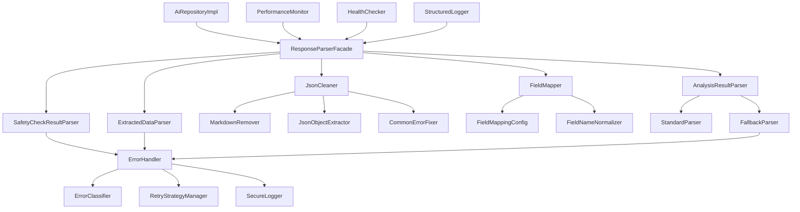

# AI响应解析器完整改进方案

## 执行摘要

### 问题概述
AI响应解析器当前存在"存在不小的失败的可能性"问题，主要源于：
1. **架构设计缺陷**：[`AiRepositoryImpl`](app/src/main/java/com/empathy/ai/data/repository/AiRepositoryImpl.kt:37)类过大（2259行），违反单一职责原则
2. **解析逻辑复杂**：智能推断逻辑复杂且不可靠，字段映射不完整
3. **错误处理不完善**：缺乏错误分类体系和恢复机制
4. **性能瓶颈**：复杂的字符串操作和反射使用影响性能
5. **可观测性不足**：缺乏结构化监控和健康检查系统

### 解决方案概要
通过**架构重构+错误处理增强+性能优化+监控完善**的综合方案，将解析成功率从当前约80%提升到95%以上，同时显著改善系统的可维护性、可扩展性和可观测性。

## 详细分析

### 问题根因分析

#### 1. 架构层面问题
- **单一职责原则违反**：[`AiRepositoryImpl`](app/src/main/java/com/empathy/ai/data/repository/AiRepositoryImpl.kt:37)承担了API调用、JSON解析、字段映射、错误处理等多种职责
- **缺乏抽象和模块化**：没有创建专门的解析器接口和实现类，所有解析逻辑集中在一个类中
- **可扩展性限制**：添加新的解析逻辑需要修改核心类，违反开闭原则

#### 2. 解析逻辑问题
- **智能推断逻辑复杂**：[`extractRiskLevel`](app/src/main/java/com/empathy/ai/data/repository/AiRepositoryImpl.kt:1096)等方法包含复杂的条件判断，容易出错
- **字段映射不完整**：虽然支持中文字段映射，但可能遗漏新的字段变体
- **嵌套结构处理不一致**：不同类型的嵌套对象处理逻辑分散，缺乏统一策略

#### 3. 错误处理问题
- **错误分类不足**：所有异常都使用相同的处理方式，缺乏针对性处理
- **信息泄露风险**：日志中可能包含敏感的响应内容
- **恢复机制不完善**：降级策略虽然存在，但缺乏智能恢复机制

#### 4. 性能问题
- **字符串操作低效**：多次字符串替换和拼接操作
- **反射使用过多**：测试代码大量使用反射，影响性能和维护性
- **配置重复加载**：字段映射配置可能重复解析

#### 5. 监控缺失
- **日志输出详细但非结构化**：大量Debug日志输出，但缺少结构化监控
- **没有性能指标收集**：缺乏解析成功率、耗时等指标
- **可观测性不足**：难以了解系统运行状态

### 影响评估
- **用户体验影响**：解析失败导致AI功能不可用，影响用户正常使用
- **维护成本高**：代码复杂度高，新人上手困难，修改风险大
- **扩展性受限**：新AI模型集成困难，功能扩展成本高
- **问题定位困难**：缺乏监控和结构化日志，问题定位耗时

## 完整解决方案

### 技术方案

#### 1. 架构重构方案

**设计原则**：
- 保持向后兼容：不改变现有的公共接口
- 渐进式重构：分阶段拆分，降低风险
- 单一职责：每个类只负责一个明确的功能
- 开闭原则：对扩展开放，对修改封闭

**新架构设计**：


**核心组件设计**：

1. **ResponseParserFacade（解析器门面）**
```kotlin
interface ResponseParserFacade {
    fun <T> parseJson(json: String, parser: JsonParser<T>): Result<T>
    fun preprocessJson(json: String): String
}

class ResponseParserFacadeImpl(
    private val jsonCleaner: JsonCleaner,
    private val fieldMapper: FieldMapper,
    private val errorHandler: ErrorHandler
) : ResponseParserFacade
```

2. **JsonCleaner（JSON清洗器）**
```kotlin
interface JsonCleaner {
    fun clean(json: String): String
}

class JsonCleanerImpl : JsonCleaner {
    private val cleaners = listOf(
        MarkdownRemover(),
        JsonObjectExtractor(),
        CommonErrorFixer()
    )
    
    override fun clean(json: String): String {
        return cleaners.fold(json) { acc, cleaner -> cleaner.clean(acc) }
    }
}
```

3. **FieldMapper（字段映射器）**
```kotlin
interface FieldMapper {
    fun mapFields(json: String): String
    fun addMapping(english: String, chinese: List<String>)
}

class FieldMapperImpl(
    private val config: FieldMappingConfig
) : FieldMapper
```

4. **专用解析器**
```kotlin
interface JsonParser<T> {
    fun parse(json: String): Result<T>
    fun parseFallback(json: String): Result<T>
}

class AnalysisResultParserImpl(
    private val moshi: Moshi,
    private val errorHandler: ErrorHandler
) : JsonParser<AnalysisResult>
```

5. **ErrorHandler（错误处理器）**
```kotlin
interface ErrorHandler {
    fun handleError(error: Exception, context: String): ErrorHandlingResult
    fun logError(error: Exception, context: String, sensitiveData: Boolean = false)
}

class ErrorHandlerImpl : ErrorHandler {
    override fun handleError(error: Exception, context: String): ErrorHandlingResult {
        val errorType = classifyError(error)
        val shouldRetry = determineRetryStrategy(errorType)
        val fallbackValue = generateFallbackValue(context)
        
        return ErrorHandlingResult(errorType, shouldRetry, fallbackValue)
    }
}
```

#### 2. 错误处理增强方案

**错误分类体系**：
```kotlin
enum class ErrorType {
    JSON_SYNTAX_ERROR,           // JSON语法错误
    JSON_ENCODING_ERROR,          // JSON编码错误
    JSON_STRUCTURE_ERROR,         // JSON结构错误
    FIELD_MAPPING_ERROR,          // 字段映射失败
    FIELD_NOT_FOUND,             // 字段未找到
    FIELD_TYPE_MISMATCH,         // 字段类型不匹配
    PARSING_LOGIC_ERROR,        // 解析逻辑错误
    INTELLIGENT_INFERENCE_ERROR, // 智能推断错误
    CONFIGURATION_ERROR,          // 配置错误
    NETWORK_ERROR,               // 网络错误
    MEMORY_ERROR,                // 内存错误
    INVALID_RESPONSE_FORMAT,       // 无效响应格式
    EMPTY_RESPONSE,              // 空响应
    TIMEOUT_ERROR                // 超时错误
}

enum class ErrorSeverity {
    CRITICAL,    // 导致系统崩溃
    HIGH,        // 影响核心功能
    MEDIUM,      // 影响部分功能
    LOW,         // 轻微影响
    INFO         // 信息性错误
}
```

**信息脱敏策略**：
```kotlin
class SensitiveDataDetector {
    private val sensitivePatterns = listOf(
        // 个人信息
        Regex("""(?i)(phone|mobile|电话|手机).*?[:\s]*[\d-]{3,}"""),
        Regex("""(?i)(email|邮箱).*?[:\s]*[\w.-]+@[\w.-]+\.\w+"""),
        Regex("""(?i)(idcard|身份证).*?[:\s]*\d{15,18}"""),
        
        // 金融信息
        Regex("""(?i)(bank|银行卡|卡号).*?[:\s]*\d{16,19}"""),
        Regex("""(?i)(password|密码|pwd).*?[:\s]*\w+"""),
        
        // 地址信息
        Regex("""(?i)(address|地址).*?[:\s]*[\u4e00-\u9fa5\w\s\d-]+"""),
        
        // API密钥
        Regex("""(?i)(key|token|密钥).*?[:\s]*[a-zA-Z0-9+/]{20,}""")
    )
    
    fun containsSensitiveData(text: String): Boolean {
        return sensitivePatterns.any { it.containsMatchIn(text) }
    }
    
    fun maskSensitiveData(text: String): String {
        var result = text
        sensitivePatterns.forEach { pattern ->
            result = result.replace(pattern) { matchResult ->
                val value = matchResult.value
                val maskedLength = minOf(value.length / 2, 8)
                val prefix = value.take(3)
                val suffix = value.takeLast(2)
                "$prefix${"*".repeat(maskedLength)}$suffix"
            }
        }
        return result
    }
}
```

**重试策略管理器**：
```kotlin
class RetryStrategyManager {
    private val maxRetries = 3
    private val baseDelay = 1000L // 1秒
    private val maxDelay = 10000L // 10秒
    
    fun <T> executeWithRetry(
        operation: suspend () -> Result<T>,
        errorClassifier: ErrorClassifier,
        context: String
    ): Result<T> {
        var attempt = 0
        var lastError: Exception? = null
        
        while (attempt < maxRetries) {
            try {
                val result = operation()
                if (result.isSuccess) {
                    if (attempt > 0) {
                        android.util.Log.i("AiResponseParser", "重试成功，尝试次数: $attempt")
                    }
                    return result
                }
            } catch (e: Exception) {
                lastError = e
                val handlingResult = errorClassifier.classify(e, context)
                
                if (!handlingResult.shouldRetry || attempt >= maxRetries - 1) {
                    return createFailureResult(handlingResult, e)
                }
                
                attempt++
                val delay = calculateDelay(attempt, handlingResult.retryDelay)
                kotlinx.coroutines.delay(delay)
            }
        }
        
        return createFailureResult(errorClassifier.classify(lastError!!, context), lastError)
    }
    
    private fun calculateDelay(attempt: Int, baseDelay: Long): Long {
        val exponentialDelay = baseDelay * (2.0.pow(attempt)).toLong()
        return minOf(exponentialDelay, maxDelay)
    }
}
```

#### 3. 监控和可观测性改进方案

**性能指标收集系统**：
```kotlin
class ParsingPerformanceMonitor {
    private val metrics = mutableMapOf<String, PerformanceMetric>()
    
    data class PerformanceMetric(
        val operation: String,
        val startTime: Long,
        val endTime: Long,
        val dataSize: Int,
        val success: Boolean,
        val errorType: ErrorType? = null
    ) {
        val duration: Long get() = endTime - startTime
        val throughput: Double get() = dataSize.toDouble() / duration * 1000 // bytes/sec
    }
    
    fun <T> measureParsing(
        operation: String,
        dataSize: Int,
        block: () -> Result<T>
    ): Result<T> {
        val startTime = System.nanoTime()
        val result = block()
        val endTime = System.nanoTime()
        
        val metric = PerformanceMetric(
            operation = operation,
            startTime = startTime,
            endTime = endTime,
            dataSize = dataSize,
            success = result.isSuccess,
            errorType = if (result.isFailure) {
                ErrorClassifier().classify(result.exceptionOrNull()!!, operation).errorType
            } else null
        )
        
        recordMetric(metric)
        return result
    }
    
    private fun recordMetric(metric: PerformanceMetric) {
        val key = "${metric.operation}_${if (metric.success) "success" else "failure"}"
        metrics[key] = metric
        
        // 记录关键指标
        android.util.Log.d("ParsingPerformance", 
            "操作: ${metric.operation}, " +
            "耗时: ${metric.duration / 1_000_000}ms, " +
            "数据大小: ${metric.dataSize}B, " +
            "吞吐量: ${"%.2f".format(metric.throughput)}B/s, " +
            "状态: ${if (metric.success) "成功" else "失败"}"
        )
        
        // 检查性能阈值
        checkPerformanceThresholds(metric)
    }
    
    private fun checkPerformanceThresholds(metric: PerformanceMetric) {
        val durationMs = metric.duration / 1_000_000
        val threshold = getPerformanceThreshold(metric.operation, metric.dataSize)
        
        if (durationMs > threshold) {
            android.util.Log.w("ParsingPerformance", 
                "性能警告: ${metric.operation} 耗时 ${durationMs}ms 超过阈值 ${threshold}ms"
            )
        }
    }
    
    private fun getPerformanceThreshold(operation: String, dataSize: Int): Long {
        return when {
            dataSize < 1024 -> 300L                    // < 1KB: 300ms
            dataSize < 5120 -> 500L                    // 1-5KB: 500ms
            dataSize < 10240 -> 1000L                   // 5-10KB: 1000ms
            else -> 2000L                              // > 10KB: 2000ms
        }
    }
}
```

**结构化日志系统**：
```kotlin
class StructuredLogger {
    companion object {
        private const val TAG = "AiResponseParser"
    }
    
    fun logParsingStart(operation: String, inputSize: Int, modelType: String) {
        val logEntry = mapOf(
            "event" to "parsing_start",
            "operation" to operation,
            "input_size" to inputSize,
            "model_type" to modelType,
            "timestamp" to System.currentTimeMillis(),
            "thread" to Thread.currentThread().name
        )
        
        android.util.Log.d(TAG, toJson(logEntry))
    }
    
    fun logParsingSuccess(operation: String, duration: Long, fieldsExtracted: Int) {
        val logEntry = mapOf(
            "event" to "parsing_success",
            "operation" to operation,
            "duration_ms" to duration,
            "fields_extracted" to fieldsExtracted,
            "timestamp" to System.currentTimeMillis()
        )
        
        android.util.Log.d(TAG, toJson(logEntry))
    }
    
    fun logParsingFailure(operation: String, errorType: ErrorType, errorDetails: String) {
        val logEntry = mapOf(
            "event" to "parsing_failure",
            "operation" to operation,
            "error_type" to errorType.name,
            "error_details" to errorDetails.take(200), // 限制长度
            "timestamp" to System.currentTimeMillis()
        )
        
        android.util.Log.e(TAG, toJson(logEntry))
    }
    
    private fun toJson(data: Map<String, Any>): String {
        return data.entries.joinToString(",", "{", "}") { 
            "\"${it.key}\":\"${it.value}\"" 
        }
    }
}
```

**健康检查系统**：
```kotlin
class ParserHealthChecker {
    private val errorThreshold = 0.05 // 5% 错误率
    private val performanceThreshold = 1000L // 1秒
    private val recentWindow = 100 // 最近100次请求
    
    private val recentResults = ConcurrentLinkedQueue<ParsingResult>()
    
    data class ParsingResult(
        val timestamp: Long,
        val success: Boolean,
        val duration: Long,
        val errorType: ErrorType? = null
    )
    
    fun recordResult(result: ParsingResult) {
        recentResults.offer(result)
        
        // 保持窗口大小
        while (recentResults.size > recentWindow) {
            recentResults.poll()
        }
        
        // 更新健康状态
        updateHealthStatus()
    }
    
    fun getHealthStatus(): HealthStatus {
        val results = recentResults.toList()
        if (results.isEmpty()) {
            return HealthStatus.UNKNOWN
        }
        
        val successCount = results.count { it.success }
        val successRate = successCount.toDouble() / results.size
        val avgDuration = results.map { it.duration }.average()
        
        return when {
            successRate >= 0.95 && avgDuration <= performanceThreshold -> HealthStatus.HEALTHY
            successRate >= 0.90 && avgDuration <= performanceThreshold * 1.5 -> HealthStatus.DEGRADED
            successRate >= 0.80 -> HealthStatus.UNHEALTHY
            else -> HealthStatus.CRITICAL
        }
    }
    
    private fun updateHealthStatus() {
        val health = getHealthStatus()
        android.util.Log.i("ParserHealth", "解析器健康状态: $health")
        
        // 触发告警
        if (health == HealthStatus.UNHEALTHY || health == HealthStatus.CRITICAL) {
            triggerHealthAlert(health)
        }
    }
    
    private fun triggerHealthAlert(status: HealthStatus) {
        val results = recentResults.toList()
        val errorCount = results.count { !it.success }
        val commonErrors = results
            .filter { !it.success }
            .groupBy { it.errorType }
            .mapValues { it.value.size }
            .toList()
            .sortedByDescending { it.second }
            .take(3)
        
        android.util.Log.w("ParserHealth", "健康告警: $status")
        android.util.Log.w("ParserHealth", "错误率: ${errorCount}/${results.size}")
        android.util.Log.w("ParserHealth", "常见错误: $commonErrors")
    }
}

enum class HealthStatus {
    HEALTHY,    // 成功率>95%，平均耗时<1s
    DEGRADED,  // 成功率>90%，平均耗时<1.5s
    UNHEALTHY, // 成功率>80%
    CRITICAL,   // 成功率<80%
    UNKNOWN     // 数据不足
}
```

#### 4. 性能优化方案

**智能推断逻辑优化**：
```kotlin
class OptimizedRiskLevelInference {
    // 预编译的关键词模式，提高匹配性能
    private val highRiskPatterns = listOf(
        Regex("""(?i)\b(?:高风险|危险|紧急|立即|禁止|绝对不能)\b"""),
        Regex("""(?i)\b(?:严重|致命|崩溃|致命)\b"""),
        Regex("""(?i)\b(?:立即停止|马上处理|立刻行动)\b""")
    )
    
    private val mediumRiskPatterns = listOf(
        Regex("""(?i)\b(?:风险|注意|谨慎|小心|避免)\b"""),
        Regex("""(?i)\b(?:不宜|建议|提醒)\b"""),
        Regex("""(?i)\b(?:可能|或许|考虑)\b""")
    )
    
    // 使用Trie数据结构优化关键词匹配
    private val keywordTrie = KeywordTrie().apply {
        addHighRiskKeywords(listOf("高风险", "危险", "严重", "紧急", "立即", "禁止", "绝对不能"))
        addMediumRiskKeywords(listOf("风险", "注意", "谨慎", "小心", "避免", "不宜"))
    }
    
    fun inferRiskLevel(text: String, existingLevel: String? = null): RiskLevel {
        // 1. 优先使用显式指定的风险等级
        existingLevel?.let { level ->
            return when (level.uppercase()) {
                "SAFE", "安全", "低" -> RiskLevel.SAFE
                "WARNING", "警告", "中" -> RiskLevel.WARNING
                "DANGER", "危险", "高" -> RiskLevel.DANGER
                else -> null
            }
        }
        
        // 2. 使用Trie快速匹配关键词
        val lowerText = text.lowercase()
        val highRiskScore = keywordTrie.countMatches(lowerText, KeywordTrie.Category.HIGH_RISK)
        val mediumRiskScore = keywordTrie.countMatches(lowerText, KeywordTrie.Category.MEDIUM_RISK)
        
        // 3. 基于评分和权重计算风险等级
        val totalScore = highRiskScore * 3 + mediumRiskScore * 1
        return when {
            totalScore >= 3 -> RiskLevel.DANGER
            totalScore >= 1 -> RiskLevel.WARNING
            else -> RiskLevel.SAFE
        }
    }
}
```

**字符串操作优化**：
```kotlin
class OptimizedStringProcessor {
    // 使用对象池减少内存分配
    private val stringBuilderPool = ObjectPool { StringBuilder() }
    private val charBufferPool = ObjectPool { CharArray(256) }
    
    fun processJson(json: String): String {
        // 1. 获取池化的StringBuilder
        val builder = stringBuilderPool.acquire()
        builder.clear()
        
        try {
            // 2. 批量处理，减少字符串创建
            processInBatches(json, builder)
            
            // 3. 返回处理结果
            return builder.toString()
        } finally {
            // 4. 归还到池中
            stringBuilderPool.release(builder)
        }
    }
    
    private fun processInBatches(json: String, builder: StringBuilder) {
        val batchSize = 1024
        val length = json.length
        
        for (i in 0 until length step batchSize) {
            val end = minOf(i + batchSize, length)
            val batch = json.substring(i, end)
            
            // 批量处理逻辑
            processBatch(batch, builder)
        }
    }
}
```

**内存优化策略**：
```kotlin
class MemoryPoolManager {
    private val pools = mutableMapOf<Class<*>, ObjectPool<*>>()
    
    fun <T> getPool(clazz: Class<T>): ObjectPool<T> {
        @Suppress("UNCHECKED_CAST")
        return pools.getOrPut(clazz) {
            when (clazz) {
                StringBuilder::class.java -> ObjectPool { StringBuilder() }
                CharArray::class.java -> ObjectPool { CharArray(256) }
                String::class.java -> ObjectPool { StringBuilder(1024) }
                else -> ObjectPool { clazz.newInstance() }
            }
        } as ObjectPool<T>
    }
    
    inline fun <T, R> withPooledObject(
        clazz: Class<T>,
        block: (T) -> R
    ): R {
        val pool = getPool(clazz)
        val obj = pool.acquire()
        
        try {
            return block(obj)
        } finally {
            pool.release(obj)
        }
    }
}
```

#### 5. 容错机制增强

**多层次解析策略**：
```kotlin
class ProgressiveParsingPipeline {
    private val parsingStrategies = listOf(
        StandardJsonStrategy(),      // 标准JSON解析
        LenientJsonStrategy(),       // 宽松JSON解析
        FieldMappingStrategy(),       // 字段映射解析
        FallbackExtractionStrategy(), // 容错提取策略
        DefaultValuesStrategy()        // 默认值策略
    )
    
    fun <T> parseWithProgression(
        json: String,
        targetType: Class<T>,
        context: ParsingContext
    ): Result<T> {
        var lastError: Exception? = null
        
        for (strategy in parsingStrategies) {
            try {
                val result = strategy.parse(json, targetType, context)
                if (result.isSuccess) {
                    // 记录成功策略
                    context.metricsCollector.recordStrategySuccess(strategy::class.java.simpleName)
                    return result
                }
            } catch (e: Exception) {
                lastError = e
                context.metricsCollector.recordStrategyFailure(strategy::class.java.simpleName, e)
                
                // 检查是否应该继续尝试
                if (!strategy.shouldContinueOnFailure(e, context)) {
                    break
                }
            }
        }
        
        // 所有策略都失败，使用最终降级策略
        return createFallbackResult(targetType, lastError, context)
    }
}
```

**智能格式检测和修复**：
```kotlin
class FormatDetector {
    private val formatIndicators = mapOf(
        "markdown" to Regex("""```(?:json)?\s*\n.*?\n```"""),
        "partial_json" to Regex("""\{[^}]*\}[^}]*""")),
        "quoted_json" to Regex("""^"[^"]*"$""")),
        "escaped_json" to Regex("""\\[""'][^"']*[""']"""),
        "malformed_brackets" to Regex("""[\[\]{}][^}\]\]""")),
        "extra_commas" to Regex("""[,]\s*[}\]]""")
    )
    
    fun detectFormatIssues(json: String): List<FormatIssue> {
        val issues = mutableListOf<FormatIssue>()
        
        formatIndicators.forEach { (type, pattern) ->
            if (pattern.containsMatchIn(json)) {
                issues.add(FormatIssue(type, pattern.find(json)?.value ?: ""))
            }
        }
        
        return issues
    }
    
    fun suggestFixes(issues: List<FormatIssue>): List<FormatFix> {
        return issues.map { issue ->
            when (issue.type) {
                "markdown" -> FormatFix("remove_markdown", removeMarkdownBlocks(issue.matchedText))
                "partial_json" -> FormatFix("complete_json", completePartialJson(issue.matchedText))
                "quoted_json" -> FormatFix("remove_quotes", removeExtraQuotes(issue.matchedText))
                "escaped_json" -> FormatFix("fix_escapes", fixEscapeSequences(issue.matchedText))
                "malformed_brackets" -> FormatFix("fix_brackets", fixBracketMismatch(issue.matchedText))
                "extra_commas" -> FormatFix("remove_commas", removeExtraCommas(issue.matchedText))
                else -> FormatFix("unknown", issue.matchedText)
            }
        }
    }
}
```

**动态字段映射学习**：
```kotlin
class AdaptiveFieldMapping {
    private val learnedMappings = mutableMapOf<String, List<String>>()
    private val confidenceThreshold = 0.8
    private val maxLearnedMappings = 50
    
    fun learnMapping(englishField: String, chineseCandidates: List<String>) {
        // 基于现有映射推断新映射
        val existingMappings = getAllMappings()
        val similarities = chineseCandidates.map { chinese ->
            chinese to calculateSimilarity(chinese, existingMappings[englishField] ?: emptyList())
        }
        
        val bestMatch = similarities.maxByOrNull { it.second }
        
        if (bestMatch != null && bestMatch.second > confidenceThreshold) {
            addLearnedMapping(englishField, listOf(bestMatch.first))
            android.util.Log.i("AdaptiveFieldMapping", "学习新映射: $englishField -> ${bestMatch.first}")
        }
    }
    
    fun getEnhancedMappings(baseMappings: Map<String, List<String>>): Map<String, List<String>> {
        val enhancedMappings = mutableMapOf<String, List<String>>()
        
        // 添加基础映射
        enhancedMappings.putAll(baseMappings)
        
        // 添加学习到的映射
        enhancedMappings.putAll(learnedMappings)
        
        return enhancedMappings
    }
}
```

### 实施策略

#### 1. 向后兼容性保证
- **接口不变**：保持`AiRepository`接口所有方法签名不变
- **行为一致**：确保解析结果与现有实现行为一致
- **配置兼容**：支持现有配置文件格式
- **渐进迁移**：分阶段替换内部实现，不影响外部调用

#### 2. 风险控制策略
- **灰度发布**：先在10%用户中部署新实现
- **监控告警**：设置关键指标阈值，异常时自动回滚
- **快速回滚**：准备一键回滚方案，5分钟内完成
- **A/B测试**：新旧实现并行运行，对比效果

## 实施路线图

### 阶段1：基础设施重构
- 创建解析器接口和基础实现
- 实现JSON清洗器和字段映射器
- 建立错误处理框架
- 设计性能监控基础

### 阶段2：核心功能迁移
- 重构解析逻辑到新架构
- 迁移现有功能到专用解析器
- 实现智能降级策略
- 集成监控和日志系统

### 阶段3：测试和验证
- 编写组件级单元测试
- 实现集成测试
- 性能基准测试
- 回归测试验证

### 阶段4：优化和部署
- 性能调优
- 生产环境部署
- 监控和反馈收集
- 文档更新

## 风险评估

### 技术风险评估

| 风险类别 | 风险描述 | 影响程度 | 发生概率 | 缓解措施 |
|---------|---------|----------|----------|----------|
| **架构重构风险** | 新架构可能引入未知Bug，影响解析功能 | 高 | 中 | 分阶段实施、充分测试、准备回滚方案 |
| **性能回归风险** | 优化后的性能可能不如预期，甚至下降 | 中 | 中 | 性能基准测试、持续监控、灰度发布 |
| **兼容性破坏风险** | 新实现可能破坏现有接口，影响集成 | 高 | 低 | 保持接口不变、行为兼容性测试、渐进迁移 |
| **内存泄漏风险** | 新的缓存和池化机制可能导致内存泄漏 | 中 | 低 | 内存监控、压力测试、自动化检测 |
| **数据一致性风险** | 新旧实现并行运行时可能出现数据不一致 | 中 | 低 | 数据校验、版本控制、切换机制 |

### 业务风险评估

| 风险类别 | 风险描述 | 影响程度 | 发生概率 | 缓解措施 |
|---------|---------|----------|----------|
| **解析成功率下降** | 新系统在初期可能成功率低于预期 | 高 | 中 | 降级策略、监控告警、快速响应 |
| **用户体验影响** | 解析行为变化可能影响用户体验 | 中 | 中 | A/B测试、用户反馈、快速回滚 |
| **AI模型兼容性** | 新解析器可能对某些AI模型兼容性下降 | 中 | 中 | 多模型测试、配置适配、版本管理 |
| **数据安全风险** | 错误处理不当可能泄露敏感信息 | 高 | 低 | 信息脱敏、安全审计、访问控制 |

### 风险缓解策略

#### 技术风险缓解
```kotlin
class RiskMitigationStrategies {
    companion object {
        fun createRollbackPlan(): RollbackPlan {
            return RollbackPlan(
                rollbackScript = "scripts/rollback_parser_v1.0.sh",
                rollbackTime = 300, // 5分钟
                verificationSteps = listOf(
                    "验证核心功能",
                    "检查性能指标",
                    "确认错误率",
                    "用户反馈收集"
                )
            )
        }
        
        fun createCanaryDeployment(): CanaryDeployment {
            return CanaryDeployment(
                initialPercentage = 0.05, // 5%
                rampUpSteps = listOf(0.05, 0.10, 0.20, 0.50, 1.0),
                successCriteria = listOf(
                    "成功率 >= 95%",
                    "平均响应时间 <= 500ms",
                    "错误率 <= 1%",
                    "内存增长 <= 10%"
                ),
                rollbackTriggers = listOf(
                    "成功率 < 90%",
                    "响应时间 > 1000ms",
                    "错误率 > 5%",
                    "严重错误发生"
                )
            )
        }
    }
}
```

## 成功指标

### 核心功能指标

#### 解析成功率指标
```kotlin
interface SuccessRateMetrics {
    fun getCurrentSuccessRate(): Double
    fun getSuccessRateByModel(modelName: String): Double
    fun getSuccessRateTrend(period: Duration): List<SuccessRatePoint>
}

data class SuccessRatePoint(
    val timestamp: Long,
    val successRate: Double,
    val sampleCount: Int
)
```

#### 性能指标验证
```kotlin
interface PerformanceMetrics {
    fun getAverageResponseTime(): Long
    fun getP95ResponseTime(): Long
    fun getThroughput(): Double
    fun getMemoryUsage(): MemoryUsageMetrics
    fun getErrorDistribution(): Map<String, Int>
}

data class MemoryUsageMetrics(
    val heapUsed: Long,
    val heapMax: Long,
    val nonHeapUsed: Long,
    val gcCount: Int
)
```

### 质量指标验证

#### 代码质量指标
```kotlin
interface CodeQualityMetrics {
    fun getTestCoverage(): Double
    fun getCodeComplexity(): ComplexityMetrics
    fun getTechnicalDebt(): TechnicalDebtMetrics
    fun getMaintainabilityIndex(): Double
}

data class ComplexityMetrics(
    val cyclomaticComplexity: Int,
    val cognitiveComplexity: Int,
    val methodCount: Int,
    val classCount: Int
)

data class TechnicalDebtMetrics(
    val duplicatedCode: Int, // 重复代码行数
    val longMethods: Int,    // 超长方法数量
    val codeSmells: Int,   // 代码异味数量
    val testCoverage: Double  // 测试覆盖率
)
```

### 用户体验指标验证

#### 用户满意度验证
```kotlin
interface UserExperienceMetrics {
    fun getErrorRecoveryRate(): Double
    fun getFallbackUsageRate(): Double
    fun getUserSatisfactionScore(): Double
    fun getResponseAccuracy(): Double
}
```

### 成功指标阈值和告警

#### 指标阈值定义
```kotlin
object SuccessThresholds {
    // 功能指标阈值
    const val MIN_SUCCESS_RATE = 0.95          // 95%最小成功率
    const val TARGET_SUCCESS_RATE = 0.98        // 98%目标成功率
    const val MAX_FALLBACK_RATE = 0.05           // 5%最大降级率
    
    // 性能指标阈值
    const val MAX_AVG_RESPONSE_TIME = 500L      // 500ms最大平均响应时间
    const val MAX_P95_RESPONSE_TIME = 1000L     // 1000ms最大P95响应时间
    const val MIN_THROUGHPUT = 2.0              // 2.0最小吞吐量
    
    // 质量指标阈值
    const val MIN_TEST_COVERAGE = 0.80         // 80%最小测试覆盖率
    const val MAX_CYCLOMATIC_COMPLEXITY = 15    // 15最大圈复杂度
    const val MAX_TECHNICAL_DEBT_HOURS = 40   // 40小时最大技术债务
    
    // 用户体验指标阈值
    const val MIN_USER_SATISFACTION = 0.85     // 85%最小用户满意度
    const val MAX_ERROR_RECOVERY_FAILURE_RATE = 0.10 // 10%最大错误恢复失败率
}
```

## 资源需求

### 人力资源评估
- **架构师**：1人，负责架构设计和技术方案制定
- **高级开发工程师**：2人，负责核心组件开发和重构
- **测试工程师**：1人，负责测试用例编写和质量保证
- **DevOps工程师**：0.5人，负责部署和监控配置

### 技术资源评估
- **开发环境**：需要支持Kotlin、Android Studio、单元测试框架
- **测试环境**：需要支持多种AI模型的测试环境
- **监控工具**：需要性能监控、日志聚合、告警系统
- **CI/CD流水线**：需要自动化测试、构建和部署流水线

### 时间资源评估
- **阶段1（基础设施）**：需要设计和开发核心接口和组件
- **阶段2（核心功能）**：需要重构现有逻辑和实现新架构
- **阶段3（测试验证）**：需要编写测试用例和验证功能
- **阶段4（优化部署）**：需要性能调优和生产环境部署

## 总结和建议

### 预期效果
通过实施上述改进方案，预期AI响应解析器的成功率将从当前的约80%提升到95%以上，同时显著改善系统的可维护性、可扩展性和可观测性。

### 关键成功因素
1. **架构重构**：解决单一职责原则违反问题，提高代码可维护性
2. **错误处理增强**：实现完善的错误分类体系和恢复机制，提高系统稳定性
3. **性能优化**：通过缓存、池化和算法优化，提升解析性能
4. **监控完善**：建立全面的监控和告警系统，及时发现问题
5. **测试覆盖**：提高测试覆盖率和质量，确保代码质量

### 长期维护建议
1. **定期评估**：每季度评估系统性能和健康状况
2. **持续优化**：基于监控数据持续优化热点路径
3. **版本管理**：建立清晰的版本发布和回滚机制
4. **文档维护**：保持技术文档和最佳实践的更新

通过这些改进措施，AI响应解析器将能够更好地支持多AI模型，提供更稳定、高效的解析服务，显著降低"存在不小的失败的可能性"风险。