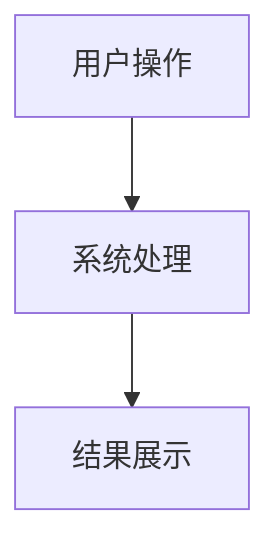
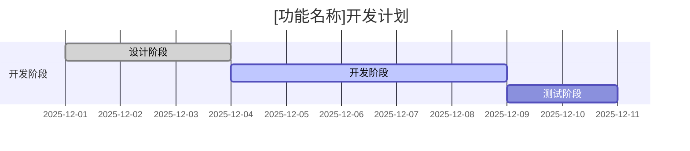
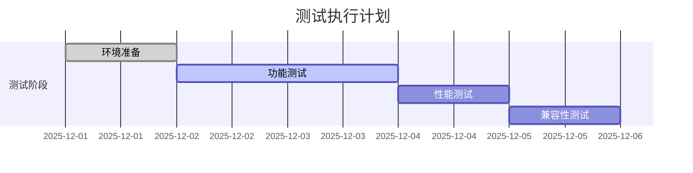
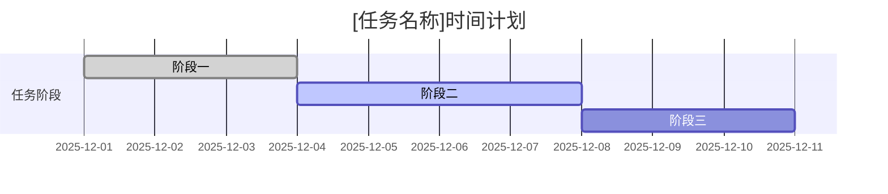
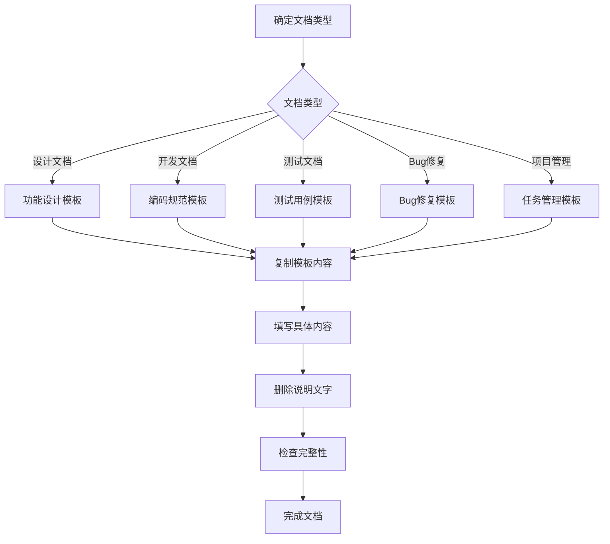

# 文档模板示例

**版本**: v1.0  
**创建日期**: 2025-12-08  
**最后更新**: 2025-12-08  
**更新人**: AI Architect Assistant  
**状态**: 活跃  
**用途**: 提供各类文档的标准化模板

---

## 📋 模板使用说明

### 模板分类

1. **基础信息模板** - 所有文档的通用头部信息
2. **设计文档模板** - 功能设计、架构设计等
3. **开发文档模板** - 开发指南、编码规范等
4. **测试文档模板** - 测试用例、测试报告等
5. **Bug修复模板** - Bug报告、修复总结等
6. **项目管理模板** - 任务管理、会议记录等

### 使用方法

1. **选择合适模板** - 根据文档类型选择对应模板
2. **复制模板内容** - 复制到新文档中
3. **填写具体内容** - 根据实际情况填写内容
4. **删除说明文字** - 删除模板中的说明性文字
5. **检查完整性** - 确保所有必要信息都已填写

---

## 🏗️ 基础信息模板

### 文档头部信息

```markdown
---
标题: [文档标题]
版本: v1.0
创建日期: YYYY-MM-DD
最后更新: YYYY-MM-DD
更新人: [姓名]
状态: [活跃/过期/草稿]
标签: [标签1, 标签2, 标签3]
相关文档: [文档链接]
---
```

### 目录结构模板

```markdown
## 目录

- [1. 概述](#1-概述)
- [2. 详细内容](#2-详细内容)
- [3. 更新历史](#3-更新历史)
```

### 更新历史模板

```markdown
## 更新历史

| 版本 | 日期 | 更新内容 | 更新人 |
|------|------|----------|--------|
| v1.0 | YYYY-MM-DD | 初始版本 | [姓名] |
| v1.1 | YYYY-MM-DD | [具体更新内容] | [姓名] |
```

---

## 📝 设计文档模板

### 功能设计文档模板

```markdown
---
标题: [功能名称]设计文档
版本: v1.0
创建日期: YYYY-MM-DD
最后更新: YYYY-MM-DD
更新人: [姓名]
状态: 活跃
标签: [设计, 功能]
相关文档: [相关文档链接]
---

# [功能名称]设计文档

## 1. 功能概述

### 1.1 功能背景
[说明功能产生的背景和原因，为什么要开发这个功能]

### 1.2 功能目标
[明确功能要达成的目标，成功的标准是什么]

### 1.3 用户场景
[描述主要使用场景，谁在什么情况下使用这个功能]

### 1.4 依赖关系
[列出此功能依赖的其他功能或模块]

## 2. 功能设计

### 2.1 功能流程
[描述功能的完整流程，可以使用流程图或时序图]



### 2.2 界面设计
[描述界面布局和交互方式]

#### 2.2.1 主要界面
- 界面元素1：[描述]
- 界面元素2：[描述]
- 交互方式：[描述用户如何交互]

#### 2.2.2 交互流程
1. 用户触发操作
2. 系统响应处理
3. 展示处理结果

### 2.3 数据设计
[描述数据结构和存储方式]

#### 2.3.1 数据模型
```kotlin
data class ExampleModel(
    val id: String,
    val name: String,
    val createdAt: Long
)
```

#### 2.3.2 存储方案
- 本地存储：[存储方式和位置]
- 云端同步：[同步策略]
- 缓存机制：[缓存策略]

## 3. 技术实现

### 3.1 技术方案
[说明采用的技术方案和选择理由]

#### 3.1.1 架构选择
- 选择方案：[具体方案]
- 选择理由：[为什么选择这个方案]
- 替代方案：[考虑过的其他方案]

#### 3.1.2 关键技术
- 技术1：[用途和优势]
- 技术2：[用途和优势]
- 技术难点：[预计的技术难点]

### 3.2 关键算法
[描述核心算法逻辑]

```kotlin
fun coreAlgorithm(input: InputType): OutputType {
    // 算法实现
    return result
}
```

### 3.3 接口设计
[定义相关接口]

#### 3.3.1 内部接口
```kotlin
interface InternalService {
    suspend fun processData(data: Data): Result<ProcessedData>
}
```

#### 3.3.2 外部接口
```kotlin
interface ExternalAPI {
    suspend fun fetchData(params: Params): Result<ApiResponse>
}
```

## 4. 测试计划

### 4.1 测试用例
[列出主要测试用例]

| 用例ID | 测试描述 | 输入数据 | 预期结果 | 优先级 |
|---------|----------|----------|----------|--------|
| TC001 | [测试描述] | [输入] | [预期] | 高 |
| TC002 | [测试描述] | [输入] | [预期] | 中 |

### 4.2 验收标准
[定义功能验收标准]

- [ ] 功能完整性：所有功能点都已实现
- [ ] 性能要求：响应时间小于X秒
- [ ] 兼容性：支持目标设备和系统版本
- [ ] 用户体验：操作流畅，反馈及时

## 5. 风险评估

### 5.1 技术风险
[识别技术风险]

| 风险项 | 风险等级 | 影响范围 | 发生概率 |
|---------|----------|----------|----------|
| [风险描述] | 高/中/低 | [影响] | 高/中/低 |

### 5.2 缓解措施
[提出风险缓解措施]

| 风险项 | 缓解措施 | 负责人 | 完成时间 |
|---------|----------|--------|----------|
| [风险描述] | [具体措施] | [负责人] | [时间] |

## 6. 实施计划

### 6.1 开发阶段
[分解开发阶段]

| 阶段 | 任务内容 | 预计工期 | 依赖关系 | 交付物 |
|------|----------|----------|----------|--------|
| 设计阶段 | 详细设计 | 3天 | 无 | 设计文档 |
| 开发阶段 | 功能实现 | 5天 | 设计完成 | 功能代码 |
| 测试阶段 | 测试验证 | 2天 | 开发完成 | 测试报告 |

### 6.2 时间安排
[制定详细时间计划]



## 7. 相关资源

### 7.1 参考文档
- [相关设计文档]
- [技术文档链接]
- [API文档链接]

### 7.2 相关代码
- [相关代码仓库链接]
- [关键代码文件路径]

## 8. 更新历史

| 版本 | 日期 | 更新内容 | 更新人 |
|------|------|----------|--------|
| v1.0 | YYYY-MM-DD | 初始版本 | [姓名] |
```

---

## 💻 开发文档模板

### 编码规范模板

```markdown
---
标题: [语言/框架]编码规范
版本: v1.0
创建日期: YYYY-MM-DD
最后更新: YYYY-MM-DD
更新人: [姓名]
状态: 活跃
标签: [规范, 编码]
相关文档: [相关规范文档]
---

# [语言/框架]编码规范

## 1. 概述

### 1.1 规范目的
[说明编码规范的目的和重要性]

### 1.2 适用范围
[明确规范适用的代码范围]

### 1.3 基本原则
[列出编码的基本原则]

## 2. 命名规范

### 2.1 文件命名
[规定文件的命名规范]

| 文件类型 | 命名格式 | 示例 | 说明 |
|---------|----------|------|------|
| 类文件 | PascalCase | UserManager.kt | 首字母大写 |
| 接口文件 | PascalCase + Interface | UserServiceInterface.kt | 接口标识 |
| 测试文件 | PascalCase + Test | UserManagerTest.kt | 测试标识 |

### 2.2 类命名
[规定类的命名规范]

| 类型 | 命名格式 | 示例 | 说明 |
|------|----------|------|------|
| 普通类 | PascalCase | UserService | 首字母大写 |
| 抽象类 | PascalCase + Base | BaseService | 基类标识 |
| 数据类 | PascalCase | UserProfile | 数据实体 |

### 2.3 方法命名
[规定方法的命名规范]

| 类型 | 命名格式 | 示例 | 说明 |
|------|----------|------|------|
| 普通方法 | camelCase | getUserInfo | 首字母小写 |
| 布尔返回 | is/has/can + 名词 | isValid | 布尔判断 |
| 获取方法 | get + 名词 | getName | 获取数据 |

### 2.4 变量命名
[规定变量的命名规范]

| 类型 | 命名格式 | 示例 | 说明 |
|------|----------|------|------|
| 局部变量 | camelCase | userName | 首字母小写 |
| 常量 | UPPER_SNAKE_CASE | MAX_RETRY_COUNT | 全大写下划线 |
| 私有变量 | m + camelCase | mUserData | 成员变量前缀 |

## 3. 代码格式

### 3.1 缩进规范
[规定代码缩进]

- 缩进方式：[空格/Tab]
- 缩进大小：[2/4个空格]
- 对齐方式：[对齐规则]

### 3.2 大括号规范
[规定大括号的使用]

```kotlin
// 推荐：大括号换行
if (condition) {
    // code here
}

// 不推荐：大括号不换行
if (condition) { // code here }
```

### 3.3 注释规范
[规定注释的写法]

#### 3.3.1 类注释
```kotlin
/**
 * 用户服务类
 * 
 * @author 作者名
 * @since 2025-12-08
 */
class UserService {
    // 类实现
}
```

#### 3.3.2 方法注释
```kotlin
/**
 * 获取用户信息
 * 
 * @param userId 用户ID
 * @return 用户信息
 * @throws UserNotFoundException 用户不存在异常
 */
fun getUserInfo(userId: String): UserInfo {
    // 方法实现
}
```

## 4. 最佳实践

### 4.1 错误处理
[规定错误处理的最佳实践]

```kotlin
// 推荐：使用Result类型
suspend fun getUser(id: String): Result<User> {
    return try {
        val user = userRepository.findById(id)
        Result.success(user)
    } catch (e: Exception) {
        Result.failure(e)
    }
}

// 不推荐：直接抛出异常
suspend fun getUser(id: String): User {
    return userRepository.findById(id) // 可能抛出异常
}
```

### 4.2 异步处理
[规定异步处理的最佳实践]

```kotlin
// 推荐：使用协程
viewModelScope.launch {
    val result = repository.fetchData()
    _uiState.value = result.fold(
        onSuccess = { SuccessState(it) },
        onFailure = { ErrorState(it.message) }
    )
}
```

## 5. 禁止事项

[列出编码中禁止的做法]

- [ ] 禁止使用魔法数字
- [ ] 禁止忽略异常处理
- [ ] 禁止硬编码字符串
- [ ] 禁止在UI线程执行耗时操作

## 6. 代码审查清单

### 6.1 提交前检查
[代码提交前的检查清单]

- [ ] 代码格式符合规范
- [ ] 注释完整准确
- [ ] 异常处理完善
- [ ] 单元测试通过
- [ ] 无调试代码残留

### 6.2 审查要点
[代码审查的关注点]

- [ ] 逻辑正确性
- [ ] 性能影响
- [ ] 安全性考虑
- [ ] 可维护性
- [ ] 测试覆盖率

## 7. 工具配置

### 7.1 IDE配置
[IDE的配置建议]

- 代码格式化配置
- 代码检查规则
- 自动导入优化

### 7.2 构建配置
[构建工具的配置]

- 代码风格检查
- 静态分析工具
- 代码覆盖率工具

## 8. 更新历史

| 版本 | 日期 | 更新内容 | 更新人 |
|------|------|----------|--------|
| v1.0 | YYYY-MM-DD | 初始版本 | [姓名] |
```

---

## 🧪 测试文档模板

### 测试用例模板

```markdown
---
标题: [功能/模块]测试用例
版本: v1.0
创建日期: YYYY-MM-DD
最后更新: YYYY-MM-DD
更新人: [姓名]
状态: 活跃
标签: [测试, 用例]
相关文档: [相关设计文档]
---

# [功能/模块]测试用例

## 1. 测试概述

### 1.1 测试目标
[明确测试的目标和范围]

### 1.2 测试环境
[描述测试环境配置]

- 操作系统：[系统和版本]
- 设备型号：[测试设备]
- 网络环境：[网络条件]
- 测试数据：[数据准备]

### 1.3 测试策略
[说明测试的整体策略]

- 测试方法：[手动/自动化]
- 测试类型：[功能/性能/兼容性]
- 测试优先级：[高/中/低]

## 2. 测试用例

### 2.1 功能测试用例
[列出功能测试用例]

| 用例ID | 测试场景 | 测试步骤 | 预期结果 | 优先级 | 状态 |
|---------|----------|----------|----------|--------|------|
| TC001 | [场景描述] | 1. 步骤1<br>2. 步骤2 | [预期结果] | 高 | [ ] |
| TC002 | [场景描述] | 1. 步骤1<br>2. 步骤2 | [预期结果] | 中 | [ ] |

### 2.2 边界测试用例
[列出边界测试用例]

| 用例ID | 边界条件 | 测试数据 | 预期结果 | 优先级 | 状态 |
|---------|----------|----------|----------|--------|------|
| BT001 | [边界描述] | [测试值] | [预期结果] | 中 | [ ] |
| BT002 | [边界描述] | [测试值] | [预期结果] | 中 | [ ] |

### 2.3 异常测试用例
[列出异常测试用例]

| 用例ID | 异常场景 | 触发方式 | 预期处理 | 优先级 | 状态 |
|---------|----------|----------|----------|--------|------|
| ET001 | [异常描述] | [触发方法] | [处理方式] | 高 | [ ] |
| ET002 | [异常描述] | [触发方法] | [处理方式] | 高 | [ ] |

## 3. 自动化测试

### 3.1 单元测试
[单元测试的说明]

```kotlin
@Test
fun `should return valid result when input is correct`() = runTest {
    // Given
    val input = "test input"
    
    // When
    val result = testFunction(input)
    
    // Then
    assertEquals("expected", result)
}
```

### 3.2 集成测试
[集成测试的说明]

```kotlin
@Test
fun `should integrate correctly with external service`() = runTest {
    // Given
    val mockService = mockk<ExternalService>()
    
    // When
    val result = systemUnderTest.processWithService(mockService)
    
    // Then
    verify { mockService.callMethod() }
    assertEquals(expected, result)
}
```

## 4. 性能测试

### 4.1 性能指标
[定义性能测试指标]

| 指标 | 目标值 | 测试方法 | 实际值 | 状态 |
|------|--------|----------|--------|------|
| 响应时间 | < 500ms | [测试方法] | [ ] | [ ] |
| 内存占用 | < 100MB | [测试方法] | [ ] | [ ] |
| CPU使用 | < 30% | [测试方法] | [ ] | [ ] |

### 4.2 压力测试
[压力测试的说明]

- 并发用户数：[数量]
- 持续时间：[时长]
- 监控指标：[指标]

## 5. 兼容性测试

### 5.1 设备兼容性
[设备兼容性测试]

| 设备类型 | 设备型号 | 系统版本 | 测试结果 | 问题记录 |
|---------|----------|----------|----------|----------|
| 手机 | [型号1] | [版本] | [ ] | |
| 手机 | [型号2] | [版本] | [ ] | |
| 平板 | [型号1] | [版本] | [ ] | |

### 5.2 系统兼容性
[系统兼容性测试]

| 系统版本 | 测试项目 | 测试结果 | 问题记录 |
|---------|----------|----------|----------|
| Android 12 | [功能列表] | [ ] | |
| Android 13 | [功能列表] | [ ] | |
| Android 14 | [功能列表] | [ ] | |

## 6. 测试执行

### 6.1 执行计划
[测试执行的时间计划]



### 6.2 执行记录
[测试执行的过程记录]

| 日期 | 执行用例 | 通过数量 | 失败数量 | 问题记录 | 执行人 |
|------|----------|----------|----------|----------|--------|
| YYYY-MM-DD | [数量] | [数量] | [问题描述] | [姓名] |

## 7. 测试报告

### 7.1 测试结果总结
[测试结果的总体总结]

- 总用例数：[数量]
- 通过用例：[数量]
- 失败用例：[数量]
- 通过率：[百分比]

### 7.2 问题分析
[对测试问题的分析]

| 问题ID | 问题描述 | 严重程度 | 影响范围 | 解决方案 | 状态 |
|---------|----------|----------|----------|--------|------|
| BUG001 | [描述] | 高/中/低 | [范围] | [方案] | [ ] |

### 7.3 质量评估
[对代码质量的评估]

- 功能完整性：[评估]
- 性能表现：[评估]
- 兼容性：[评估]
- 总体质量：[评估]

## 8. 更新历史

| 版本 | 日期 | 更新内容 | 更新人 |
|------|------|----------|--------|
| v1.0 | YYYY-MM-DD | 初始版本 | [姓名] |
```

---

## 🐛 Bug修复模板

### Bug修复报告模板

```markdown
---
标题: [Bug标题]修复报告
版本: v1.0
创建日期: YYYY-MM-DD
最后更新: YYYY-MM-DD
更新人: [姓名]
状态: 活跃
标签: [Bug, 修复, P0/P1/P2]
相关文档: [相关文档链接]
---

# [Bug标题]修复报告

## 1. Bug概述

### 1.1 Bug描述
[详细描述Bug现象和表现]

- **Bug标题**：[简洁明确的标题]
- **Bug类型**：[功能性/性能/兼容性/UI]
- **发现时间**：YYYY-MM-DD
- **发现人员**：[姓名]

### 1.2 影响范围
[说明Bug影响的功能和用户]

- **影响功能**：[列出受影响的功能]
- **影响用户**：[所有用户/部分用户/特定用户]
- **影响程度**：[严重/一般/轻微]

### 1.3 优先级
[P0/P1/P2/P3]

- **P0**：阻塞性问题，核心功能完全无法使用
- **P1**：严重问题，主要功能受影响
- **P2**：一般问题，次要功能受影响
- **P3**：轻微问题，UI或体验问题

### 1.4 复现步骤
[详细的复现步骤]

1. **环境准备**
   - [环境配置]
   - [数据准备]

2. **操作步骤**
   1. [具体操作1]
   2. [具体操作2]
   3. [具体操作3]

3. **触发条件**
   - [特殊条件]
   - [必现/偶现]

### 1.5 期望结果
[描述正确的预期行为]

- **正常表现**：[描述应该有的正确表现]
- **用户体验**：[描述用户应该有的体验]

### 1.6 实际结果
[描述错误的实际行为]

- **错误表现**：[描述实际出现的错误]
- **错误信息**：[如果有错误信息，记录下来]
- **截图/录屏**：[如果有，附上链接]

## 2. 问题分析

### 2.1 根本原因
[分析问题的根本原因]

- **直接原因**：[导致问题的直接原因]
- **间接原因**：[背后的深层原因]
- **根本原因**：[最根本的问题所在]

### 2.2 技术分析
[详细的技术分析]

#### 2.2.1 代码分析
[相关代码的分析]

```kotlin
// 问题代码示例
fun problematicFunction(input: String): Result {
    // 这里存在问题的代码
    return process(input)
}
```

#### 2.2.2 调用链分析
[方法调用链的分析]

1. **入口方法**：[方法名]
2. **中间处理**：[处理步骤]
3. **出错位置**：[具体位置]

#### 2.2.3 环境因素
[环境相关的影响]

- **系统版本**：[影响分析]
- **硬件配置**：[影响分析]
- **网络条件**：[影响分析]

### 2.3 相关代码
[涉及的关键代码片段或文件]

- **主要文件**：[文件路径]
- **关键方法**：[方法名]
- **相关配置**：[配置项]

## 3. 修复方案

### 3.1 解决思路
[说明解决问题的思路]

- **方案选择**：[为什么选择这个方案]
- **替代方案**：[考虑过的其他方案]
- **方案对比**：[各方案的优缺点]

### 3.2 具体修改
[详细说明代码修改内容]

#### 3.2.1 代码修改
[修改前后的代码对比]

```diff
- // 修改前的代码
+ // 修改后的代码
```

#### 3.2.2 配置修改
[配置文件的修改]

```diff
- # 修改前的配置
+ # 修改后的配置
```

#### 3.2.3 依赖修改
[依赖关系的修改]

- **新增依赖**：[依赖名称和版本]
- **移除依赖**：[依赖名称]
- **版本更新**：[依赖名称和新版本]

### 3.3 修复验证
[说明如何验证修复效果]

1. **单元测试**
   - [测试用例]
   - [测试结果]

2. **集成测试**
   - [测试场景]
   - [测试结果]

3. **回归测试**
   - [回归范围]
   - [测试结果]

## 4. 测试验证

### 4.1 测试用例
[用于验证修复的测试用例]

| 用例ID | 测试描述 | 测试步骤 | 预期结果 | 实际结果 | 状态 |
|---------|----------|----------|----------|----------|------|
| FIX001 | [修复验证] | [步骤] | [预期] | [实际] | [ ] |
| FIX002 | [回归测试] | [步骤] | [预期] | [实际] | [ ] |

### 4.2 测试结果
[测试执行的结果]

- **修复验证**：[通过/失败]
- **回归测试**：[通过/失败]
- **性能影响**：[无影响/有影响]
- **兼容性**：[正常/异常]

### 4.3 回归测试
[相关功能的回归测试情况]

| 功能模块 | 测试项目 | 测试结果 | 问题记录 |
|---------|----------|----------|----------|
| [模块1] | [测试项] | [ ] | |
| [模块2] | [测试项] | [ ] | |

## 5. 经验总结

### 5.1 预防措施
[如何预防类似问题]

- **代码层面**：[编码规范改进]
- **测试层面**：[测试用例补充]
- **流程层面**：[流程优化建议]

### 5.2 改进建议
[对代码或流程的改进建议]

- **架构改进**：[架构层面的建议]
- **工具改进**：[开发工具的建议]
- **流程改进**：[开发流程的建议]

### 5.3 知识沉淀
[从问题中学到的经验]

- **技术点**：[学到的技术知识]
- **调试技巧**：[有用的调试方法]
- **避坑指南**：[如何避免类似问题]

## 6. 发布计划

### 6.1 修复发布
[修复版本的发布计划]

- **修复版本**：[版本号]
- **发布时间**：[计划时间]
- **发布范围**：[全量/灰度]

### 6.2 监控计划
[发布后的监控计划]

- **监控指标**：[关键指标]
- **监控时长**：[监控时间]
- **异常处理**：[异常响应机制]

## 7. 更新历史

| 版本 | 日期 | 更新内容 | 更新人 |
|------|------|----------|--------|
| v1.0 | YYYY-MM-DD | 初始版本 | [姓名] |
| v1.1 | YYYY-MM-DD | [更新内容] | [姓名] |
```

---

## 📋 项目管理模板

### 任务管理模板

```markdown
---
标题: [任务名称]任务管理
版本: v1.0
创建日期: YYYY-MM-DD
最后更新: YYYY-MM-DD
更新人: [姓名]
状态: [进行中/已完成/已取消]
标签: [任务, 模块名]
相关文档: [相关文档链接]
---

# [任务名称]任务管理

## 1. 任务概述

### 1.1 任务背景
[说明任务的背景和原因]

### 1.2 任务目标
[明确任务要达成的目标]

### 1.3 任务价值
[说明任务的价值和意义]

## 2. 任务分解

### 2.1 主要任务
[分解为主要任务]

| 任务ID | 任务描述 | 负责人 | 预计工期 | 状态 | 依赖关系 |
|---------|----------|--------|----------|------|----------|
| T001 | [任务描述] | [姓名] | [天数] | [ ] |
| T002 | [任务描述] | [姓名] | [天数] | T001 |
| T003 | [任务描述] | [姓名] | [天数] | T002 |

### 2.2 子任务分解
[进一步分解为子任务]

#### 任务T001：[任务名称]
- [ ] 子任务1
- [ ] 子任务2
- [ ] 子任务3

## 3. 时间计划

### 3.1 里程碑
[设置关键里程碑]



### 3.2 关键节点
[重要的时间节点]

- **开始时间**：YYYY-MM-DD
- **第一个里程碑**：YYYY-MM-DD
- **第二个里程碑**：YYYY-MM-DD
- **计划完成**：YYYY-MM-DD

## 4. 资源分配

### 4.1 人员分工
[明确人员分工]

| 角色 | 姓名 | 主要职责 | 工作量 |
|------|------|----------|--------|
| 负责人 | [姓名] | [职责描述] | [百分比] |
| 协作者 | [姓名] | [职责描述] | [百分比] |
| 审查者 | [姓名] | [职责描述] | [百分比] |

### 4.2 技术资源
[所需的技术资源]

- **开发环境**：[环境要求]
- **测试设备**：[设备列表]
- **第三方服务**：[服务依赖]

## 5. 风险管理

### 5.1 风险识别
[识别可能的风险]

| 风险描述 | 风险等级 | 影响分析 | 应对措施 | 负责人 |
|----------|----------|----------|----------|--------|
| [风险1] | 高/中/低 | [影响] | [措施] | [姓名] |
| [风险2] | 高/中/低 | [影响] | [措施] | [姓名] |

### 5.2 进度跟踪
[进度的跟踪和报告]

- **日报频率**：[每日/每周]
- **报告格式**：[报告模板]
- **异常处理**：[异常响应机制]

## 6. 任务执行

### 6.1 每日进展
[记录每日进展情况]

| 日期 | 完成任务 | 遇到问题 | 解决方案 | 明日计划 |
|------|----------|----------|----------|----------|
| YYYY-MM-DD | [任务] | [问题] | [方案] | [计划] |

### 6.2 问题记录
[记录遇到的问题和解决方案]

| 问题描述 | 发生时间 | 解决时间 | 解决方案 | 经验总结 |
|----------|----------|----------|----------|----------|
| [问题] | [时间] | [时间] | [方案] | [总结] |

## 7. 任务交付

### 7.1 交付物清单
[明确交付的内容]

- [ ] 功能代码
- [ ] 设计文档
- [ ] 测试报告
- [ ] 用户手册

### 7.2 验收标准
[明确验收的标准]

- [ ] 功能完整性
- [ ] 性能达标
- [ ] 测试通过
- [ ] 文档齐全

### 7.3 交付流程
[交付的具体流程]

1. **代码提交**：[提交方式和位置]
2. **文档更新**：[文档更新要求]
3. **测试验证**：[测试验证流程]
4. **正式交付**：[交付确认方式]

## 8. 任务总结

### 8.1 完成情况
[任务的完成情况总结]

- **计划完成度**：[百分比]
- **实际完成度**：[百分比]
- **偏差分析**：[原因分析]

### 8.2 经验总结
[任务执行的经验总结]

- **成功经验**：[做得好的地方]
- **改进点**：[可以改进的地方]
- **技术收获**：[技术方面的收获]

### 8.3 后续计划
[任务完成后的后续计划]

- **维护计划**：[后续维护安排]
- **优化计划**：[后续优化方向]
- **扩展计划**：[功能扩展思路]

## 9. 更新历史

| 版本 | 日期 | 更新内容 | 更新人 |
|------|------|----------|--------|
| v1.0 | YYYY-MM-DD | 初始版本 | [姓名] |
```

---

## 📚 模板使用指南

### 模板选择流程



### 模板维护

1. **定期更新**：根据使用反馈优化模板
2. **版本管理**：维护模板的版本历史
3. **质量保证**：确保模板的实用性
4. **培训推广**：培训团队正确使用模板

### 自定义扩展

1. **项目特化**：根据项目特点调整模板
2. **团队习惯**：结合团队习惯优化模板
3. **工具集成**：与开发工具集成模板
4. **持续改进**：持续优化模板内容

---

**文档版本**: v1.0  
**创建日期**: 2025-12-08  
**最后更新**: 2025-12-08  
**更新人**: AI Architect Assistant  
**状态**: 活跃  
**下次审查**: 2025-12-15