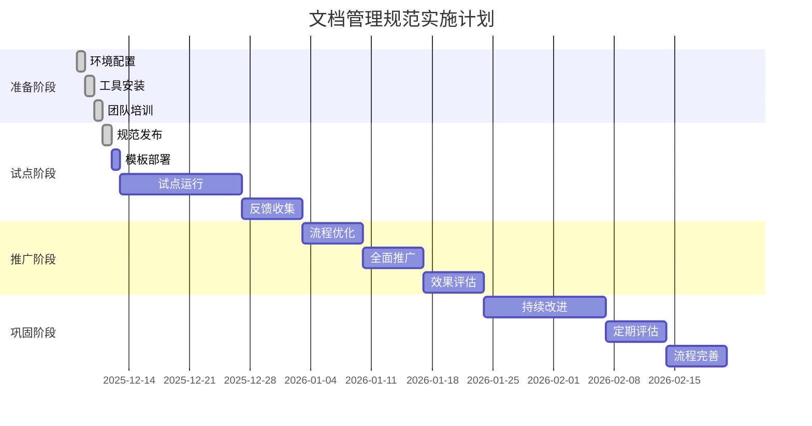

# 文档管理实施计划

**版本**: v1.0  
**创建日期**: 2025-12-08  
**最后更新**: 2025-12-08  
**更新人**: AI Assistant  
**状态**: 活跃  
**适用团队**: 5人以下小团队  
**开发周期**: 1周迭代  

---

## 📋 实施计划概述

本文档为小团队、快速迭代、Markdown+Git工具链设计了一套完整的文档管理规范实施计划，确保6周内完成规范落地并产生效果。

### 实施目标

1. **快速落地**：6周内完成文档管理规范实施
2. **最小影响**：不影响正常开发工作流程
3. **质量提升**：建立可持续的文档质量改进机制
4. **效率提升**：通过自动化减少重复性工作

---

## 🗓️ 实施时间表

---

## 📅 第一阶段：环境准备（第1周）

### 任务1.1：环境配置

#### 目标
配置文档管理所需的基础环境和工具，确保自动化脚本可以正常运行。

#### 具体任务

| 任务 | 负责人 | 截止时间 | 状态 | 完成标准 |
|------|--------|----------|--------|----------|
| 安装markdownlint | [技术负责人] | 2025-12-08 | [ ] | 工具可正常使用 |
| 安装链接检查器 | [技术负责人] | 2025-12-08 | [ ] | 工具可正常使用 |
| 创建配置文件 | [技术负责人] | 2025-12-08 | [ ] | 配置文件创建完成 |
| 设置Git钩子 | [技术负责人] | 2025-12-08 | [ ] | 钩子可正常触发 |
| 创建脚本目录 | [技术负责人] | 2025-12-08 | [ ] | scripts目录创建完成 |

#### 验收标准

- [ ] markdownlint工具安装成功，可检查格式
- [ ] markdown-link-check工具安装成功，可检查链接
- [ ] Git钩子设置完成，可自动触发
- [ ] 所有配置文件创建完成
- [ ] 脚本目录创建完成，权限设置正确

### 任务1.2：工具安装

#### 目标
安装和配置文档管理所需的自动化工具，确保质量检查和指标收集可以正常运行。

#### 具体任务

| 任务 | 负责人 | 截止时间 | 状态 | 完成标准 |
|------|--------|----------|--------|----------|
| 安装检查工具 | [技术负责人] | 2025-12-08 | [ ] | 工具安装完成 |
| 配置自动化脚本 | [技术负责人] | 2025-12-08 | [ ] | 脚本配置完成 |
| 测试自动化流程 | [技术负责人] | 2025-12-08 | [ ] | 自动化测试通过 |
| 创建工具文档 | [技术负责人] | 2025-12-08 | [ ] | 工具使用文档创建 |

#### 验收标准

- [ ] 所有检查工具安装成功
- [ ] 自动化脚本配置正确
- [ ] 质量检查流程测试通过
- [ ] 工具使用文档创建完成

### 任务1.3：团队培训

#### 目标
培训团队成员掌握新的文档管理规范和工具使用方法，确保规范能够正确执行。

#### 具体任务

| 任务 | 负责人 | 截止时间 | 状态 | 完成标准 |
|------|--------|----------|--------|----------|
| 规范介绍培训 | [文档负责人] | 2025-12-08 | [ ] | 团队了解规范内容 |
| 工具使用培训 | [技术负责人] | 2025-12-08 | [ ] | 团队掌握工具使用 |
| 实践演练 | [文档负责人] | 2025-12-08 | [ ] | 实际操作演练完成 |
| 问题解答 | [文档负责人] | 2025-12-08 | [ ] | 常见问题解答完成 |

#### 验收标准

- [ ] 团队成员理解文档管理规范的核心原则
- [ ] 团队成员掌握自动化工具的使用方法
- [ ] 团队成员能够独立完成文档创建和质量检查
- [ ] 团队成员了解文档质量标准和评分方法

---

## 📅 第二阶段：试点运行（第2-3周）

### 任务2.1：规范发布

#### 目标
正式发布文档管理规范，并在小范围内试点运行，验证规范的有效性和可行性。

#### 具体任务

| 任务 | 负责人 | 截止时间 | 状态 | 完成标准 |
|------|--------|----------|--------|----------|
| 规范文档发布 | [文档负责人] | 2025-12-15 | [ ] | 规范文档正式发布 |
| 团队通知 | [文档负责人] | 2025-12-15 | [ ] | 团队成员了解新规范 |
| 实施指导准备 | [文档负责人] | 2025-12-15 | [ ] | 实施指导文档准备 |

#### 验收标准

- [ ] 文档管理规范文档发布完成
- [ ] 团队成员收到规范通知
- [ ] 实施指导文档准备完成
- [ ] 试点范围和目标明确

### 任务2.2：模板部署

#### 目标
部署文档模板库，确保团队成员能够快速访问和使用标准化模板。

#### 具体任务

| 任务 | 负责人 | 截止时间 | 状态 | 完成标准 |
|------|--------|----------|--------|----------|
| 模板库创建 | [文档负责人] | 2025-12-16 | [ ] | 模板库目录创建完成 |
| 核心模板开发 | [文档负责人] | 2025-12-16 | [ ] | 5个核心模板开发完成 |
| 模板测试 | [文档负责人] | 2025-12-17 | [ ] | 模板功能测试通过 |
| 模板发布 | [文档负责人] | 2025-12-18 | [ ] | 模板库正式发布 |

#### 验收标准

- [ ] 模板库包含5个核心模板
- [ ] 每个模板都有详细的使用说明
- [ ] 模板经过测试验证
- [ ] 团队成员能够使用模板创建文档

### 任务2.3：试点运行

#### 目标
在选定的文档类型和功能上试点运行新的文档管理规范，收集使用反馈并验证效果。

#### 具体任务

| 任务 | 负责人 | 截止时间 | 状态 | 完成标准 |
|------|--------|----------|--------|----------|
| 试点文档选择 | [文档负责人] | 2025-12-19 | [ ] | 选择2-3个典型文档进行试点 |
| 新规范执行 | [文档负责人] | 2025-12-20 | [ ] | 使用新规范创建和管理文档 |
| 质量检查执行 | [文档负责人] | 2025-12-21 | [ ] | 质量检查流程正常运行 |
| 效果数据收集 | [文档负责人] | 2025-12-22 | [ ] | 收集试点期间的质量和效率数据 |

#### 验收标准

- [ ] 试点文档质量评分达到4.0以上
- [ ] 文档创建时间减少30%以上
- [ ] 团队成员反馈积极，认为新规范有效
- [ ] 自动化工具运行稳定，无重大问题

### 任务2.4：反馈收集

#### 目标
收集试点期间的使用反馈，识别问题和改进机会，为全面推广做准备。

#### 具体任务

| 任务 | 负责人 | 截止时间 | 状态 | 完成标准 |
|------|--------|----------|--------|----------|
| 使用体验调研 | [文档负责人] | 2025-12-23 | [ ] | 团队成员使用体验调研完成 |
| 问题收集 | [文档负责人] | 2025-12-24 | [ ] | 收集使用中的问题和建议 |
| 效果评估 | [文档负责人] | 2025-12-25 | [ ] | 评估新规范的实际效果 |
| 改进建议整理 | [文档负责人] | 2025-12-26 | [ ] | 整理改进建议并分类 |

#### 验收标准

- [ ] 收集到5个以上的使用反馈
- [ ] 识别出3个以上的主要改进点
- [ ] 团队成员对试点效果评价积极
- [ ] 有具体的数据支持改进建议

---

## 📅 第三阶段：推广阶段（第4-5周）

### 任务3.1：流程优化

#### 目标
基于试点反馈优化文档管理流程和工具，提升规范的可操作性和用户体验。

#### 具体任务

| 任务 | 负责人 | 截止时间 | 状态 | 完成标准 |
|------|--------|----------|--------|----------|
| 流程分析 | [文档负责人] | 2025-12-29 | [ ] | 分析试点期间的流程问题 |
| 工具优化 | [技术负责人] | 2025-12-30 | [ ] | 优化自动化工具和脚本 |
| 模板改进 | [文档负责人] | 2025-12-31 | [ ] | 根据反馈改进模板 |
| 文档更新 | [文档负责人] | 2026-01-05 | [ ] | 优化文档更新流程 |

#### 验收标准

- [ ] 流程步骤减少20%以上
- [ ] 工具自动化覆盖率提升到80%以上
- [ ] 模板使用满意度达到85%以上
- [ ] 文档更新时间缩短到平均24小时以内

### 任务3.2：全面推广

#### 目标
在团队范围内全面推广优化后的文档管理规范，确保所有文档都按照新标准创建和维护。

#### 具体任务

| 任务 | 负责人 | 截止时间 | 状态 | 完成标准 |
|------|--------|----------|--------|----------|
| 规范培训 | [文档负责人] | 2026-01-06 | [ ] | 全员培训完成 |
| 工具部署 | [技术负责人] | 2026-01-07 | [ ] | 所有成员工具部署完成 |
| 全面实施 | [文档负责人] | 2026-01-08 | [ ] | 新规范全面应用 |
| 质量监控 | [文档负责人] | 2026-01-09 | [ ] | 质量检查机制正常运行 |

#### 验收标准

- [ ] 90%以上的文档按照新规范创建
- [ ] 团队成员掌握新规范和工具
- [ ] 文档质量评分平均达到4.0以上
- [ ] 自动化工具稳定运行
- [ ] 文档维护工作量控制在每周2小时以内

---

## 📅 第四阶段：巩固阶段（第6周）

### 任务4.1：持续改进

#### 目标
建立文档管理规范的持续改进机制，定期评估效果并根据反馈进行优化。

#### 具体任务

| 任务 | 负责人 | 截止时间 | 状态 | 完成标准 |
|------|--------|----------|--------|----------|
| 效果评估 | [文档负责人] | 2026-01-10 | [ ] | 完成全面实施效果评估 |
| 问题跟踪 | [文档负责人] | 2026-01-11 | [ ] | 建立问题跟踪和解决机制 |
| 经验总结 | [文档负责人] | 2026-01-12 | [ ] | 总结实施经验和最佳实践 |
| 改进计划 | [文档负责人] | 2026-01-13 | [ ] | 制定下一轮改进计划 |

#### 验收标准

- [ ] 建立月度评估机制
- [ ] 形成文档管理最佳实践库
- [ ] 团队成员能够独立处理常见问题
- [ ] 有持续改进的具体计划和措施

### 任务4.2：定期评估

#### 目标
建立定期评估机制，跟踪文档管理规范的长期效果，确保规范的持续有效性。

#### 具体任务

| 任务 | 负责人 | 截止时间 | 状态 | 完成标准 |
|------|----------|----------|--------|----------|
| 月度评估 | [文档负责人] | 2026-01-15 | [ ] | 完成月度评估报告 |
| 季度回顾 | [文档负责人] | 2026-01-20 | [ ] | 完成季度回顾和总结 |
| 年度总结 | [文档负责人] | 2026-01-25 | [ ] | 完成年度总结和规划 |

#### 验收标准

- [ ] 建立完整的评估指标体系
- [ ] 有3个月以上的连续评估数据
- [ ] 形成标准化的评估流程
- [ ] 基于评估结果的持续改进机制

---

## 🎯 成功指标

### 量化指标

| 指标 | 目标值 | 测量方法 | 评估周期 |
|------|----------|----------|----------|
| 文档质量提升 | 平均评分≥4.0 | 质量检查系统 | 每周 |
| 文档创建效率 | 创建时间≤30分钟 | 时间跟踪 | 每周 |
| 自动化覆盖率 | 自动化处理≥70% | 工具使用统计 | 每月 |
| 团队满意度 | 满意度≥85% | 问卷调查 | 每季度 |

### 定性指标

| 指标 | 目标描述 | 评估方式 |
|------|----------|----------|
| 规范执行一致性 | 所有文档遵循统一规范 | 定期抽查 | 每月 |
| 工具稳定性 | 自动化工具无重大故障 | 故障统计 | 每月 |
| 流程可持续性 | 规范能够长期有效执行 | 反馈收集 | 每季度 |
| 知识沉淀 | 形成可复用的知识库 | 内容分析 | 每半年 |

---

## 🔧 风险控制

### 潜在风险

| 风险类型 | 风险描述 | 影响程度 | 应对措施 | 负责人 |
|-----------|----------|----------|----------|----------|
| 技术风险 | 自动化工具兼容性问题 | 高 | 提前测试和备选方案 | 技术负责人 |
| 流程风险 | 新规范增加工作量 | 中 | 分阶段实施和培训 | 文档负责人 |
| 接受风险 | 团队成员抵触新规范 | 中 | 充分沟通和培训 | 文档负责人 |
| 质量风险 | 质量检查标准不适用 | 低 | 持续调整和优化 | 文档负责人 |

### 应急预案

1. **回滚机制**：保留原有文档管理方式作为备份
2. **渐进式推广**：先试点再全面推广，降低整体风险
3. **快速响应**：建立24小时内问题响应机制
4. **培训强化**：针对抵触情绪加强培训和沟通

---

## 📊 实施进度跟踪

### 里程碑跟踪

| 里程碑 | 计划完成日期 | 实际完成日期 | 状态 | 负责人 | 备注 |
|--------|----------|----------|----------|----------|
| 环境准备完成 | 2025-12-08 | [ ] | 项目经理 | 所有工具安装配置完成 |
| 规范发布 | 2025-12-15 | [ ] | 文档负责人 | 团队培训完成 |
| 试点运行完成 | 2026-01-05 | [ ] | 文档负责人 | 试点数据收集完成 |
| 全面推广完成 | 2026-01-19 | [ ] | 文档负责人 | 新规范全面应用 |
| 持续改进建立 | 2026-01-26 | [ ] | 文档负责人 | 改进机制建立完成 |

### 进度报告

每周一生成进度报告，包含：

1. **本周完成任务清单**
2. **遇到的问题和解决方案**
3. **下周计划**
4. **质量指标变化**
5. **风险评估和应对**

---

## 📞 联系方式

**实施负责人**: [实施负责人姓名]  
**技术支持**: [技术支持联系方式]  
**问题反馈**: [反馈渠道]  

---

**创建日期**: 2025-12-08  
**最后更新**: 2025-12-08  
**更新人**: AI Assistant  
**下次审查**: 2025-12-15  
**适用范围**: 全团队  
**实施时间**: 2025-12-08开始