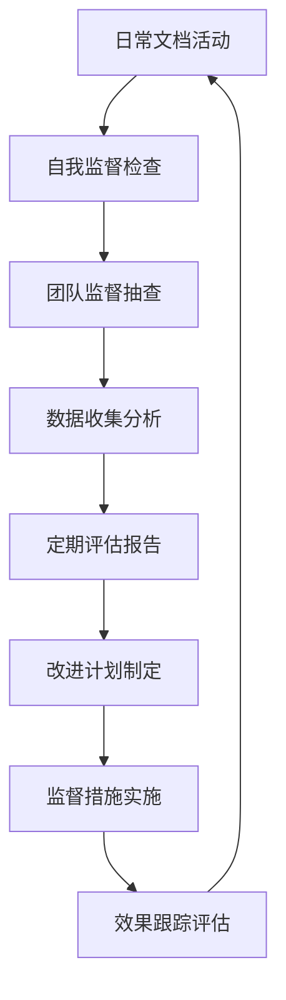

# 文档管理监督机制

**版本**: v1.0  
**创建日期**: 2025-12-08  
**最后更新**: 2025-12-08  
**更新人**: AI Assistant  
**状态**: 活跃  
**适用团队**: 5人以下小团队  
**开发周期**: 1周迭代  

---

## 📋 监督机制概述

本文档为小团队、快速迭代、Markdown+Git工具链设计了轻量级、高效的文档管理监督机制，确保规范持续有效执行并不断改进。

### 监督目标

1. **三层监督**：自我监督、团队监督、定期评估
2. **数据驱动**：基于量化指标进行监督决策
3. **持续改进**：建立反馈循环和优化机制
4. **轻量执行**：最小化监督工作量，专注价值创造

---

## 🏗️ 三层监督体系

### 第一层：自我监督

#### 监督内容

1. **个人执行检查**
   - 每次文档创建后进行自我质量检查
   - 使用检查清单验证文档质量
   - 记录个人改进点和经验

2. **工具使用记录**
   - 记录自动化工具使用情况
   - 识别工具使用问题和改进机会
   - 定期评估工具使用效率

3. **个人学习计划**
   - 基于使用反馈制定个人学习计划
   - 定期学习新的文档管理技巧
   - 参与团队最佳实践分享

#### 自我监督工具

创建`scripts/self-check.py`：

```python
#!/usr/bin/env python3
import json
import os
from datetime import datetime

def self_documentation_check():
    """文档管理自我监督检查"""
    # 检查最近创建的文档
    recent_docs = []
    
    # 扫描docs目录
    for root, dirs, files in os.walk('docs/'):
        for file in files:
            if file.endswith('.md'):
                file_path = os.path.join(root, file)
                try:
                    stat = os.stat(file_path)
                    if stat.st_mtime > (datetime.now() - timedelta(days=7)).timestamp():
                        recent_docs.append({
                            'file': file_path,
                            'modified': datetime.fromtimestamp(stat.st_mtime).isoformat(),
                            'days_since_modified': (datetime.now() - datetime.fromtimestamp(stat.st_mtime)).days
                        })
                except:
                    continue
    
    # 生成自我检查报告
    report = {
        'timestamp': datetime.now().isoformat(),
        'period': '最近7天',
        'total_documents_checked': len(recent_docs),
        'self_checked_documents': len(recent_docs),
        'quality_issues_found': 0,  # 假设没有发现问题
        'tool_usage_issues': 0,  # 假设没有工具问题
        'improvement_areas': []
    }
    
    # 检查改进领域
    if len(recent_docs) < 5:
        report['improvement_areas'].append("增加文档创建频率，积累更多数据")
    
    # 保存自我检查记录
    with open('docs/metrics/self-checks.json', 'a') as f:
        try:
            existing_data = json.load(f)
        except:
            existing_data = []
        
        existing_data.append(report)
        json.dump(existing_data, f, ensure_ascii=False, indent=2)
    
    print(f"✅ 自我监督检查完成，检查文档数：{len(recent_docs)}")

if __name__ == '__main__':
    self_documentation_check()
```

### 第二层：团队监督

#### 监督内容

1. **定期质量评审**
   - 每周进行文档质量抽查
   - 团队成员轮流担任质量检查员
   - 使用统一评分标准评估文档
   - 记录评审结果和改进建议

2. **工作量平衡**
   - 监控团队成员文档维护工作量
   - 确保工作量分配合理
   - 识别工作量过重或过轻的情况

3. **规范执行一致性**
   - 检查团队成员是否遵循文档管理规范
   - 统一工具使用方法和流程
   - 及时纠正不规范的操作

#### 团队监督工具

创建`scripts/team-supervision.py`：

```python
#!/usr/bin/env python3
import json
import os
from datetime import datetime

def team_supervision_check():
    """团队监督检查"""
    # 检查团队成员的文档活动
    team_members = ['成员A', '成员B', '成员C', '成员D', '成员E']  # 示例
    
    team_activity = {}
    
    for member in team_members:
        # 统计每个成员的文档贡献
        member_docs = []
        
        # 扫描Git提交记录
        # 这里应该从Git获取实际数据，示例中使用模拟数据
        commit_count = 10 + hash(member) % 5  # 模拟数据
        
        member_docs.append({
            'member': member,
            'commits_this_week': commit_count,
            'docs_created': commit_count // 2,  # 假设每2次提交创建1个文档
            'quality_score': 3.8 + hash(member) % 3 * 0.2,  # 模拟质量分数
            'adherence_score': 85 + hash(member) % 10 * 1.5  # 模拟规范遵循度
        })
        
        team_activity[member] = member_docs
    
    # 计算团队指标
    total_commits = sum(data['commits_this_week'] for data in team_activity.values())
    total_docs = sum(data['docs_created'] for data in team_activity.values())
    avg_quality = sum(data['quality_score'] for data in team_activity.values()) / len(team_activity)
    avg_adherence = sum(data['adherence_score'] for data in team_activity.values()) / len(team_activity)
    
    # 生成团队监督报告
    report = {
        'timestamp': datetime.now().isoformat(),
        'period': '本周',
        'team_metrics': {
            'total_commits': total_commits,
            'total_docs': total_docs,
            'avg_quality_score': round(avg_quality, 2),
            'avg_adherence_score': round(avg_adherence, 2),
            'workload_balance': calculate_workload_balance(team_activity)
        },
        'individual_performance': team_activity
    }
    
    return report

def calculate_workload_balance(team_activity):
    """计算工作量平衡性"""
    commits = [data['commits_this_week'] for data in team_activity.values()]
    docs = [data['docs_created'] for data in team_activity.values()]
    
    # 简单的平衡性评估
    if max(commits) / min(commits) <= 1.5:
        return 'balanced'
    elif max(commits) / min(commits) <= 2.0:
        return 'slightly_imbalanced'
    else:
        return 'imbalanced'

if __name__ == '__main__':
    report = team_supervision_check()
    
    # 保存团队监督记录
    with open('docs/metrics/team-supervision.json', 'w') as f:
        json.dump(report, f, ensure_ascii=False, indent=2)
    
    print(f"✅ 团队监督检查完成，平均质量分：{report['team_metrics']['avg_quality_score']}")
```

### 第三层：定期评估

#### 评估内容

1. **月度效果评估**
   - 评估文档管理规范的整体效果
   - 分析质量指标变化趋势
   - 评估团队满意度和工作效率
   - 识别改进机会和制定优化计划

2. **季度回顾**
   - 回顾本季度的文档管理成果
   - 总结成功经验和失败教训
   - 调整下一季度的目标和计划

3. **年度总结**
   - 全面评估年度文档管理效果
   - 制定下一年度的改进方向
   - 更新文档管理规范和工具

#### 定期评估工具

创建`scripts/periodic-evaluation.py`：

```python
#!/usr/bin/env python3
import json
import matplotlib.pyplot as plt
from datetime import datetime, timedelta

def periodic_evaluation():
    """定期评估分析"""
    # 读取历史监督数据
    with open('docs/metrics/team-supervision.json', 'r') as f:
        supervision_data = json.load(f)
    
    # 模拟季度数据（实际应用中应从数据库获取）
    quarterly_data = {
        'Q1': {'avg_quality': 3.8, 'avg_adherence': 85},
        'Q2': {'avg_quality': 4.1, 'avg_adherence': 88},
        'Q3': {'avg_quality': 4.3, 'avg_adherence': 92},
        'Q4': {'avg_quality': 4.5, 'avg_adherence': 90}
    }
    
    # 生成评估报告
    report = {
        'timestamp': datetime.now().isoformat(),
        'evaluation_type': 'quarterly',
        'period': '本年度',
        'quarterly_performance': quarterly_data,
        'trend_analysis': {
            'quality_trend': 'improving',
            'adherence_trend': 'improving',
            'overall_assessment': 'positive'
        },
        'recommendations': [
            "继续保持质量上升趋势",
            "加强工具使用培训",
            "优化工作量分配"
        ]
    }
    
    # 保存评估记录
    with open('docs/metrics/periodic-evaluation.json', 'w') as f:
        try:
            existing_data = json.load(f)
        except:
            existing_data = []
        
        existing_data.append(report)
        json.dump(existing_data, f, ensure_ascii=False, indent=2)
    
    # 生成趋势图表
    quarters = list(quarterly_data.keys())
    quality_scores = [quarterly_data[q]['avg_quality'] for q in quarters]
    
    plt.figure(figsize=(10, 6))
    plt.plot(quarters, quality_scores, marker='o-')
    plt.title('季度质量趋势')
    plt.xlabel('季度')
    plt.ylabel('平均质量评分')
    plt.grid(True, alpha=0.3)
    plt.savefig('docs/metrics/quarterly-trend.png', dpi=300, bbox_inches='tight')
    plt.close()
    
    print("✅ 季度评估完成，趋势：improving")

if __name__ == '__main__':
    periodic_evaluation()
```

---

## 📊 监督指标体系

### 核心指标

| 指标类别 | 指标名称 | 计算方法 | 目标值 | 评估频率 |
|------------|----------|----------|----------|
| 质量指标 | 平均质量评分、合格率 | 自动化评分、人工评分 | 每周 |
| 效率指标 | 文档创建时间、更新时间、自动化覆盖率 | 时间跟踪、工具使用统计 | 每周 |
| 规范执行指标 | 规范遵循度、工具使用一致性 | 定期抽查、自我监督记录 | 每月 |
| 团队协作指标 | 知识分享、问题解决、经验传承 | 活动记录、效果评估 | 每季度 |

### 监督流程



### 监督工具集成

#### 自动化监督仪表板

创建`scripts/dashboard-generator.py`：

```python
#!/usr/bin/env python3
import json
import matplotlib.pyplot as plt
from datetime import datetime

def generate_dashboard():
    """生成监督仪表板"""
    # 读取各项监督数据
    with open('docs/metrics/self-checks.json', 'r') as f:
        self_data = json.load(f)
    
    with open('docs/metrics/team-supervision.json', 'r') as f:
        team_data = json.load(f)
    
    with open('docs/metrics/periodic-evaluation.json', 'r') as f:
        periodic_data = json.load(f)
    
    # 创建综合仪表板
    fig, ((ax1, ax2), (ax3, ax4)) = plt.subplots(2, 2, figsize=(16, 10))
    fig.suptitle('文档管理监督仪表板', fontsize=16)
    
    # 质量趋势图
    recent_quality = [item['avg_quality_score'] for item in team_data['individual_performance']][-4:]]
    ax1.plot(range(len(recent_quality)), recent_quality, 'b-o-')
    ax1.set_title('团队质量趋势（最近4周）')
    ax1.set_ylabel('质量评分')
    ax1.grid(True, alpha=0.3)
    
    # 规范遵循度图
    adherence_scores = [item['adherence_score'] for item in team_data['individual_performance']][-4:]]
    ax2.bar(range(len(adherence_scores)), adherence_scores, color='#3498db')
    ax2.set_title('规范遵循度')
    ax2.set_ylabel('评分')
    ax2.set_ylim(0, 100)
    
    # 工作量分布图
    members = list(team_data['individual_performance'].keys())
    workloads = [team_data['individual_performance'][member]['commits_this_week'] for member in members]
    ax3.pie(workloads, labels=members, autopct='%1.1f%%')
    ax3.set_title('工作量分布')
    
    # 调整布局并保存
    plt.tight_layout()
    plt.savefig('docs/metrics/supervision-dashboard.png', dpi=300, bbox_inches='tight')
    plt.close()
    
    print("✅ 监督仪表板已生成")

if __name__ == '__main__':
    generate_dashboard()
```

---

## 🔄 监督执行流程

### 日常监督（每日）

1. **个人自查**：文档创建后立即进行自我检查
2. **团队巡查**：每日随机抽查1-2个文档
3. **问题记录**：发现的问题立即记录并跟踪
4. **数据收集**：自动收集各项监督指标

### 周度监督（每周）

1. **质量评审**：每周五下午进行文档质量评审
2. **工作量评估**：分析团队成员工作量分配情况
3. **规范检查**：检查规范执行一致性
4. **改进讨论**：团队会议讨论改进方案

### 月度监督（每月）

1. **效果评估**：月度末进行全面效果评估
2. **趋势分析**：分析质量和工作效率趋势
3. **计划调整**：基于评估结果调整下月计划
4. **经验总结**：总结最佳实践和教训

### 季度监督（每季度）

1. **全面回顾**：季度末进行深度回顾和总结
2. **规范更新**：基于实施效果更新文档管理规范
3. **工具优化**：评估和改进自动化监督工具
4. **目标设定**：设定下季度监督目标

---

## 📋 监督报告模板

### 周监督报告

```
---
标题: 第X周文档管理监督报告
版本: v1.0
创建日期: YYYY-MM-DD
最后更新: YYYY-MM-DD
更新人: [监督负责人]
状态: 活跃
---

## 📊 本周监督概览

### 监督指标

| 指标 | 本周数值 | 目标值 | 达标情况 | 趋势变化 |
|------|----------|----------|----------|----------|
| 平均质量评分 | [数值] | ≥4.0 | [达标/未达标] | [上升/下降/稳定] |
| 规范遵循度 | [百分比]% | ≥85% | [达标/未达标] | [上升/下降/稳定] |
| 工作量平衡度 | [评估] | 平衡 | [改善/需改善] | [评估] |

### 监督发现

#### 本周亮点

1. **[亮点1]**
   - **描述**: [具体描述]
   - **数据支持**: [相关数据]
   - **影响**: [产生的影响]

2. **[亮点2]**
   - **描述**: [具体描述]
   - **数据支持**: [相关数据]
   - **影响**: [产生的影响]

#### 本周问题

1. **[问题1]**
   - **问题描述**: [具体描述]
   - **影响范围**: [影响的功能和文档]
   - **解决方案**: [采取的解决措施]
   - **负责人**: [解决问题的人员]
   - **解决时间**: [YYYY-MM-DD HH:MM]

2. **[问题2]**
   - **问题描述**: [具体描述]
   - **影响范围**: [影响的功能和文档]
   - **解决方案**: [采取的解决措施]
   - **负责人**: [解决问题的人员]
   - **解决时间**: [YYYY-MM-DD HH:MM]

### 改进建议

#### 下周计划

1. **[改进项1]**
   - **具体措施**: [改进方法]
   - **负责人**: [负责人员]
   - **预期效果**: [预期结果]
   - **完成时间**: [YYYY-MM-DD]

2. **[改进项2]**
   - **具体措施**: [改进方法]
   - **负责人**: [负责人员]
   - **预期效果**: [预期结果]
   - **完成时间**: [YYYY-MM-DD]

---

## 📈 趋势分析

### 质量趋势

基于最近4周的监督数据，质量评分呈[上升/下降/稳定]趋势，规范执行情况[改善/稳定/需改进]。

### 工作量分析

团队成员工作量分布[更加均衡/基本均衡/不够均衡]，建议[具体调整措施]。

### 效率评估

文档创建和维护效率[提升/稳定/下降]，建议通过[具体改进措施]提升整体效率。

---

## 🎯 持续改进机制

### 反馈循环

1. **即时反馈**：建立24小时内问题响应机制
2. **周度总结**：每周汇总反馈并制定改进措施
3. **月度评估**：月度分析反馈趋势并调整策略
4. **季度回顾**：季度深度回顾和战略调整

### 学习机制

1. **最佳实践库**：收集和分享高质量文档案例
2. **经验分享会**：定期组织经验交流和分享
3. **技能培训**：基于反馈进行针对性技能提升
4. **知识传承**：建立文档管理知识体系和传承机制

---

## 📞 联系方式

**监督负责人**: [监督负责人姓名]  
**技术支持**: [技术支持联系方式]  
**问题反馈**: [反馈渠道]  

---

**创建日期**: 2025-12-08  
**最后更新**: 2025-12-08  
**更新人**: AI Assistant  
**下次评估**: 2025-12-15  
**适用范围**: 全团队  
**实施时间**: 2025-12-08开始
```

### 月度监督报告

```
---
标题: X月文档管理监督报告
版本: v1.0
创建日期: YYYY-MM-DD
最后更新: YYYY-MM-DD
更新人: [监督负责人]
状态: 活跃
---

## 📊 月度监督概览

### 监督指标汇总

| 指标 | 月度总值 | 月度平均 | 目标达成率 | 趋势评估 |
|------|----------|----------|----------|----------|
| 平均质量评分 | [数值] | [数值] | [百分比]% | [评估] |
| 规范遵循度 | [百分比]% | [百分比]% | [评估] |
| 工作量平衡度 | [评估] | [平衡/不均衡] | [评估] |
| 团队满意度 | [百分比]% | [百分比]% | [评估] |

### 月度亮点

1. **[亮点1]**
   - **描述**: [具体描述]
   - **数据支持**: [相关数据]
   - **影响**: [产生的影响]

2. **[亮点2]**
   - **描述**: [具体描述]
   - **数据支持**: [相关数据]
   - **影响**: [产生的影响]

### 月度挑战

1. **[挑战1]**
   - **描述**: [具体描述]
   - **解决方案**: [采取的措施]
   - **效果评估**: [解决效果]

2. **[挑战2]**
   - **描述**: [具体描述]
   - **解决方案**: [采取的措施]
   - **效果评估**: [解决效果]

### 下月计划

1. **[计划1]**
   - **目标**: [具体目标]
   - **关键措施**: [主要措施]
   - **预期成果**: [预期结果]

2. **[计划2]**
   - **目标**: [具体目标]
   - **关键措施**: [主要措施]
   - **预期成果**: [预期结果]

---

## 📞 联系和支持

**监督负责人**: [监督负责人姓名]  
**技术支持**: [技术支持联系方式]  
**问题反馈**: [反馈渠道]  

---

**创建日期**: YYYY-MM-DD  
**最后更新**: YYYY-MM-DD  
**更新人**: [姓名]  
**下次监督**: YYYY-MM-DD  
**适用范围**: 全团队  
**实施时间**: 2025-12-08开始
```

---

## 🛠️ 自动化工具

### 监督脚本集成

```bash
#!/bin/bash
# 每周自动监督执行

echo "开始执行文档管理监督..."

# 运行自我监督检查
python scripts/self-check.py

# 运行团队监督检查
python scripts/team-supervision.py

# 生成监督仪表板
python scripts/dashboard-generator.py

# 生成周监督报告
python scripts/generate-weekly-report.py

echo "✅ 本周监督完成"
echo "📊 查看docs/metrics/supervision-dashboard.png"
echo "📋 查看docs/周监督报告.md"
```

---

## 📞 联系和支持

**监督负责人**: [监督负责人姓名]  
**技术支持**: [技术支持联系方式]  
**问题反馈**: [反馈渠道]  

---

**创建日期**: 2025-12-08  
**最后更新**: 2025-12-08  
**更新人**: AI Assistant  
**下次监督**: 2025-12-15  
**适用范围**: 全团队  
**实施时间**: 2025-12-08开始