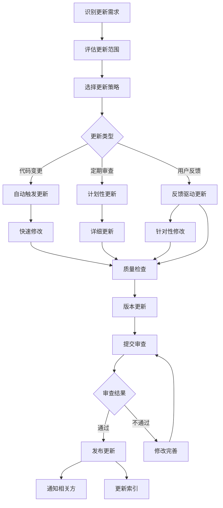
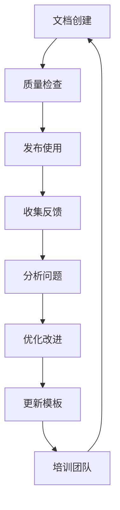

# 文档维护指南

**版本**: v1.0  
**创建日期**: 2025-12-08  
**最后更新**: 2025-12-08  
**更新人**: AI Assistant  
**状态**: 活跃  
**适用团队**: 5人以下小团队  
**开发周期**: 1周迭代  

---

## 📋 维护指南概述

本指南为1周快速迭代的小团队提供轻量级、高效的文档维护流程，确保文档与代码同步更新，同时最小化维护工作量。

### 维护目标

1. **快速响应**：24小时内响应文档更新需求
2. **质量保证**：确保所有文档符合质量标准
3. **自动化优先**：利用工具减少重复性工作
4. **持续改进**：基于使用反馈不断优化流程

---

## 🔄 快速更新机制

### 更新触发条件

#### 1. 代码变更触发

以下代码变更应自动触发文档更新：

1. **API变更**：接口新增、修改、删除
2. **功能变更**：新功能开发、功能重构、功能删除
3. **配置变更**：构建配置、部署配置、环境配置
4. **架构变更**：模块调整、依赖更新、设计模式变更

#### 2. 定期审查触发

每周定期检查以下文档：

1. **时效性检查**：检查文档是否与当前代码状态一致
2. **准确性检查**：验证技术描述和示例代码的正确性
3. **完整性检查**：确认是否遗漏重要更新

#### 3. 用户反馈触发

以下用户反馈应立即触发文档更新：

1. **错误报告**：文档内容错误、链接失效
2. **使用困难**：文档查找困难、理解不清
3. **改进建议**：文档结构优化、内容补充建议

### 更新优先级

| 优先级 | 响应时间 | 处理方式 | 典型场景 |
|--------|----------|----------|----------|
| P0-紧急 | 2小时内 | 立即处理 | 核心功能文档错误 |
| P1-高 | 24小时内 | 当日处理 | 重要功能文档过时 |
| P2-中 | 1周内 | 本周处理 | 一般功能文档更新 |
| P3-低 | 有时间再处理 | 下周处理 | 优化改进类更新 |

---

## 📝 更新执行流程

### 标准更新流程



### 批量更新处理

#### 每周集中处理时间

每周五下午为文档集中更新时间：

1. **14:00-14:30**：收集本周所有更新需求
2. **14:30-16:00**：批量执行文档更新
3. **16:00-16:30**：质量检查和问题修复
4. **16:30-17:00**：发布更新和通知

#### 批量更新清单

| 更新类型 | 处理方式 | 所需时间 | 负责人 |
|---------|----------|----------|--------|
| API文档更新 | 模板变量替换 | 15分钟 | API开发者 |
| 功能文档更新 | 内容补充修改 | 30分钟 | 功能开发者 |
| 配置文档更新 | 参数值更新 | 10分钟 | 运维人员 |
| 错误修复 | 内容修正 | 20分钟 | 文档作者 |

---

## 🔧 自动化工具集成

### Git集成自动化

#### 自动触发脚本

创建`scripts/auto-update-docs.sh`：

```bash
#!/bin/bash
# 自动文档更新触发脚本

echo "检测代码变更，触发文档更新..."

# 检测API变更
if git diff --name-only HEAD~1 HEAD | grep -E "\.(kt|java)$"; then
    echo "检测到代码变更，触发API文档更新"
    python scripts/update-api-docs.py
fi

# 检测配置变更
if git diff --name-only HEAD~1 HEAD | grep -E "\.(yml|yaml|properties)$"; then
    echo "检测到配置变更，触发配置文档更新"
    python scripts/update-config-docs.py
fi

# 检测功能变更
if git diff --name-only HEAD~1 HEAD | grep -E "src/main/"; then
    echo "检测到功能变更，触发功能文档更新"
    python scripts/update-feature-docs.py
fi

echo "✅ 自动更新完成"
```

#### 快速更新脚本

创建`scripts/quick-update.sh`：

```bash
#!/bin/bash
# 快速文档更新脚本

# 参数：文档类型 更新内容
DOC_TYPE=$1
UPDATE_CONTENT=$2

echo "快速更新 $DOC_TYPE 文档..."

# 选择对应模板
TEMPLATE="templates/${DOC_TYPE}.md"
if [ ! -f "$TEMPLATE" ]; then
    echo "❌ 模板文件不存在：$TEMPLATE"
    exit 1
fi

# 创建临时文档
TEMP_DOC="temp_${DOC_TYPE}_$(date +%Y%m%d_%H%M%S).md"
cp "$TEMPLATE" "$TEMP_DOC"

# 替换变量
python scripts/replace-variables.py "$TEMP_DOC" "$UPDATE_CONTENT"

# 质量检查
./scripts/check-docs.sh "$TEMP_DOC"
if [ $? -ne 0 ]; then
    echo "❌ 质量检查失败"
    exit 1
fi

# 移动到正确位置
mv "$TEMP_DOC" "docs/${DOC_TYPE}/"

echo "✅ $DOC_TYPE 文档更新完成"
```

### 模板变量替换

创建`scripts/replace-variables.py`：

```python
#!/usr/bin/env python3
import sys
import re
import json
from datetime import datetime

def replace_variables(file_path, updates):
    """替换模板变量"""
    with open(file_path, 'r', encoding='utf-8') as f:
        content = f.read()
    
    # 解析更新内容
    update_data = json.loads(updates)
    
    # 替换标准变量
    variables = {
        'DATE': datetime.now().strftime('%Y-%m-%d'),
        'VERSION': update_data.get('version', 'v1.0'),
        'AUTHOR': update_data.get('author', 'Unknown'),
        'TITLE': update_data.get('title', 'Untitled'),
        'DESCRIPTION': update_data.get('description', ''),
    }
    
    for var, value in variables.items():
        content = content.replace(f'{{{var}}}', value)
    
    with open(file_path, 'w', encoding='utf-8') as f:
        f.write(content)
    
    print(f"✅ 变量替换完成：{file_path}")

if __name__ == '__main__':
    if len(sys.argv) != 3:
        print("用法: python replace-variables.py <file_path> <updates_json>")
        sys.exit(1)
    
    replace_variables(sys.argv[1], sys.argv[2])
```

---

## 📊 质量保证流程

### 快速质量检查

#### 3分钟检查流程

1. **第1分钟：自动化检查**
   - 运行格式检查脚本
   - 验证链接有效性
   - 检查必要字段

2. **第2分钟：内容评估**
   - 快速浏览内容结构
   - 检查逻辑一致性
   - 验证技术准确性

3. **第3分钟：评分记录**
   - 计算质量评分
   - 记录检查结果
   - 生成改进建议

### 质量问题处理

#### 常见问题及解决方案

| 问题类型 | 具体表现 | 解决方案 | 预防措施 |
|---------|----------|----------|----------|
| 格式错误 | Markdown语法错误 | 使用格式化工具 | 使用模板和检查脚本 |
| 链接失效 | 内部链接404错误 | 使用相对路径 | 定期运行链接检查 |
| 内容过时 | 与当前代码不符 | 建立触发机制 | 设置自动更新触发 |
| 逻辑混乱 | 结构不清晰 | 重新组织内容 | 使用标准模板结构 |

### 质量改进循环



---

## 📋 维护计划模板

### 周维护计划模板

```markdown
# 周维护计划

**周期**: 第X周（YYYY-MM-DD至YYYY-MM-DD）  
**负责人**: [姓名]  
**创建日期**: YYYY-MM-DD  

---

## 📊 本周维护统计

| 维护项目 | 计划数量 | 完成数量 | 完成率 | 问题记录 |
|---------|----------|----------|--------|----------|
| 文档更新 | [数量] | [数量] | [百分比]% | [问题描述] |
| 质量检查 | [数量] | [数量] | [百分比]% | [问题描述] |
| 链接修复 | [数量] | [数量] | [百分比]% | [问题描述] |
| 模板优化 | [数量] | [数量] | [百分比]% | [问题描述] |

---

## 🎯 本周重点任务

### P0-紧急任务
- [ ] **[任务描述]**
  - **负责人**: [姓名]
  - **截止时间**: YYYY-MM-DD HH:MM
  - **当前状态**: [进行中/已完成/阻塞]

### P1-高优先级任务
- [ ] **[任务描述]**
  - **负责人**: [姓名]
  - **截止时间**: YYYY-MM-DD HH:MM
  - **当前状态**: [进行中/已完成/阻塞]

### P2-中优先级任务
- [ ] **[任务描述]**
  - **负责人**: [姓名]
  - **截止时间**: YYYY-MM-DD HH:MM
  - **当前状态**: [进行中/已完成/阻塞]

---

## 📝 经验总结

### 本周经验教训
1. **[经验教训1]**
   - **问题描述**: [具体描述]
   - **解决方案**: [解决方法]
   - **预防措施**: [预防方法]

2. **[经验教训2]**
   - **问题描述**: [具体描述]
   - **解决方案**: [解决方法]
   - **预防措施**: [预防方法]

### 下周改进计划
1. **[改进项1]**
   - **具体措施**: [改进方法]
   - **负责人**: [姓名]
   - **预期效果**: [预期结果]

2. **[改进项2]**
   - **具体措施**: [改进方法]
   - **负责人**: [姓名]
   - **预期效果**: [预期结果]

---

## 📞 联系方式

**维护负责人**: [姓名]  
**技术支持**: [联系方式]  
**问题反馈**: [反馈渠道]  

---

**创建日期**: YYYY-MM-DD  
**最后更新**: YYYY-MM-DD  
**更新人**: [姓名]  
**下次计划**: YYYY-MM-DD  