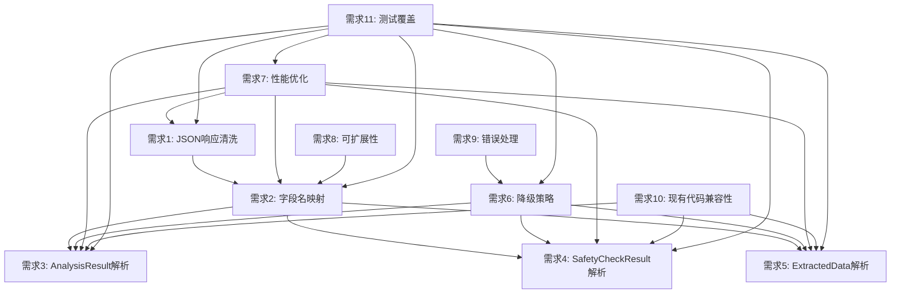

# AI响应解析器需求文档分析报告

## 概述

本报告对AI响应解析器需求文档（.kiro/specs/ai-response-parser/requirements.md）中的11个主要需求进行了深入分析，识别了潜在缺陷、风险点和改进建议。

## 需求文档整体结构分析

### 优点
1. **结构清晰**：采用标准的需求文档格式，包含用户故事和验收标准
2. **术语定义明确**：提供了详细的术语表，减少了理解歧义
3. **覆盖全面**：涵盖了JSON清洗、字段映射、解析、降级策略、性能、可扩展性、错误处理、兼容性和测试等关键方面

### 潜在问题
1. **缺乏优先级定义**：所有需求似乎同等重要，没有明确区分核心需求和增强需求
2. **验收标准不够量化**：多数验收标准是定性的，缺乏具体的量化指标
3. **依赖关系不明确**：需求之间的依赖关系没有明确说明

## 各需求详细分析

### 需求1: JSON响应清洗

#### 主要风险点
1. **边界情况处理不完整**：
   - 验收标准1.5提到"空响应或纯文本响应"的处理，但没有明确定义什么是"纯文本响应"
   - 没有考虑部分JSON格式（如只有左括号或右括号缺失）的情况
   - 缺乏对超大响应（如超过内存限制）的处理策略

2. **Unicode处理复杂性**：
   - 验收标准1.4要求正确解码Unicode字符，但没有考虑混合编码的情况
   - 没有明确处理BOM（字节顺序标记）的策略

3. **转义字符处理的歧义**：
   - 验收标准1.3要求正确处理转义字符，但没有明确处理范围
   - 没有考虑嵌套转义（如`\\n` vs `\n`）的处理逻辑

#### 模糊或不完整的部分
1. "识别并提取JSON对象部分"（验收标准1.2）没有明确定义识别算法
2. "正确处理转义字符"（验收标准1.3）没有指定具体的转义规则
3. "使用默认值"（验收标准1.5）没有定义默认值的具体内容和来源

#### 可能导致实现困难的技术挑战
1. **JSON提取算法的鲁棒性**：在非结构化文本中准确识别JSON边界
2. **性能与准确性的平衡**：复杂的清洗逻辑可能影响性能（与需求7冲突）
3. **错误恢复策略**：当清洗失败时如何回退到原始数据

### 需求2: 字段名映射

#### 主要风险点
1. **映射冲突**：
   - 没有考虑多个中文字段名映射到同一个英文字段名的情况
   - 缺乏对循环映射（A→B, B→C, C→A）的防护机制
   - 没有定义映射优先级规则

2. **配置文件管理风险**：
   - 验收标准2.5提到通过配置文件添加映射规则，但没有考虑配置文件损坏或丢失的情况
   - 没有定义配置文件版本控制和迁移策略

3. **递归处理的复杂性**：
   - 验收标准2.2要求递归处理所有层级的字段映射，但没有定义递归深度限制
   - 没有考虑循环引用的处理

#### 模糊或不完整的部分
1. "精确键值对映射"（验收标准2.1）没有定义匹配算法（精确匹配、模糊匹配、正则匹配）
2. "记录警告日志"（验收标准2.4）没有定义日志级别和内容格式
3. "允许通过配置文件添加映射规则"（验收标准2.5）没有说明配置文件格式和加载机制

#### 可能导致实现困难的技术挑战
1. **映射性能**：大量字段映射可能影响解析性能（与需求7冲突）
2. **映射一致性**：确保不同解析器使用相同的映射规则
3. **配置热更新**：运行时更新映射配置而不重启应用

### 需求3: AnalysisResult解析

#### 主要风险点
1. **智能推断的不确定性**：
   - 验收标准3.4要求智能推断风险等级，但没有定义推断规则和置信度阈值
   - 没有考虑推断错误时的后果和责任

2. **数组处理的复杂性**：
   - 验收标准3.5要求选择优先级最高的建议，但没有定义优先级规则
   - 没有考虑数组元素为空或格式错误的情况

3. **嵌套结构提取的歧义**：
   - 验收标准3.6和3.7涉及嵌套对象提取，但没有明确定义提取算法
   - 没有考虑字段名冲突时的处理策略

#### 模糊或不完整的部分
1. "提取关键信息并组合"（验收标准3.3）没有定义组合算法
2. "智能推断风险等级"（验收标准3.4）没有定义推断规则
3. "选择优先级最高的建议"（验收标准3.5）没有定义优先级规则

#### 可能导致实现困难的技术挑战
1. **智能推断算法**：实现可靠的风险等级推断逻辑
2. **嵌套结构解析**：处理复杂嵌套JSON的提取和组合
3. **数据一致性**：确保提取的数据符合业务规则

### 需求4: SafetyCheckResult解析

#### 主要风险点
1. **类型转换的安全性**：
   - 验收标准4.3要求将字符串转换为布尔类型，但没有定义转换规则
   - 没有考虑转换失败时的处理策略

2. **默认值的风险**：
   - 验收标准4.4和4.5使用默认值，但没有考虑默认值可能导致的安全风险
   - 特别是isSafe字段的默认值设为true可能带来安全隐患

#### 模糊或不完整的部分
1. "转换为布尔类型"（验收标准4.3）没有定义转换规则
2. "使用空列表作为默认值"（验收标准4.4）没有考虑列表元素类型
3. "使用默认提示文本"（验收标准4.5）没有定义默认文本内容

#### 可能导致实现困难的技术挑战
1. **类型安全**：确保类型转换不会导致运行时错误
2. **安全策略**：定义合理的默认值，避免安全漏洞
3. **上下文感知**：根据不同场景调整默认值

### 需求5: ExtractedData解析

#### 主要风险点
1. **扁平化处理的复杂性**：
   - 验收标准5.3要求将嵌套对象扁平化为Map结构，但没有定义扁平化规则
   - 没有考虑键名冲突的处理

2. **数据去重的逻辑**：
   - 验收标准5.5要求自动去重，但没有定义去重算法
   - 没有考虑大小写敏感性和相似性判断

#### 模糊或不完整的部分
1. "扁平化为Map结构"（验收标准5.3）没有定义扁平化规则
2. "自动去重"（验收标准5.5）没有定义去重算法
3. 没有定义facts字段的数据类型和格式要求

#### 可能导致实现困难的技术挑战
1. **扁平化算法**：处理复杂嵌套结构的扁平化
2. **数据一致性**：确保扁平化后的数据保持语义一致性
3. **性能优化**：大量数据的扁平化和去重可能影响性能

### 需求6: 降级策略

#### 主要风险点
1. **透明性的悖论**：
   - 验收标准6.5要求降级策略对用户透明，但这可能导致用户无法感知系统问题
   - 没有定义何时应该向用户暴露降级状态

2. **连续失败的处理**：
   - 验收标准6.3提到连续多次解析失败，但没有定义"多次"的具体阈值
   - 没有定义恢复机制和条件

#### 模糊或不完整的部分
1. "返回包含默认值的Domain_Model"（验收标准6.1）没有定义默认值来源
2. "使用默认值填充缺失字段"（验收标准6.2）没有定义默认值选择逻辑
3. "尝试多种解析策略"（验收标准6.4）没有定义策略列表和顺序

#### 可能导致实现困难的技术挑战
1. **降级决策**：定义何时触发降级策略
2. **恢复机制**：从降级状态恢复正常解析
3. **用户体验**：在透明性和可观测性之间找到平衡

### 需求7: 性能优化

#### 主要风险点
1. **性能目标的现实性**：
   - 设定的时间限制（100ms-1s）可能过于严格，特别是对于复杂响应
   - 没有考虑设备性能差异的影响

2. **性能与功能的冲突**：
   - 性能要求可能与功能要求（如字段映射、嵌套处理）冲突
   - 没有定义性能与准确性的权衡策略

#### 模糊或不完整的部分
1. 没有定义性能测试的环境和条件
2. 没有考虑并发场景下的性能要求
3. 没有定义性能监控和报告机制

#### 可能导致实现困难的技术挑战
1. **性能测量**：准确测量解析时间，排除网络等外部因素
2. **优化平衡**：在性能和功能之间找到最佳平衡点
3. **设备适配**：在不同性能的设备上满足性能要求

### 需求8: 可扩展性

#### 主要风险点
1. **扩展的复杂性**：
   - 没有定义扩展的边界和限制
   - 缺乏对扩展后性能影响的考虑

2. **配置管理的复杂性**：
   - 依赖配置文件进行扩展，但没有考虑配置管理的复杂性
   - 没有定义配置验证和错误处理机制

#### 模糊或不完整的部分
1. "允许通过创建新的解析方法扩展"（验收标准8.1）没有定义扩展接口
2. "允许在代码中修改默认值常量"（验收标准8.4）没有定义修改机制
3. "提供详细的日志输出"（验收标准8.5）没有定义日志格式和级别

#### 可能导致实现困难的技术挑战
1. **接口设计**：设计灵活且稳定的扩展接口
2. **向后兼容**：确保扩展不破坏现有功能
3. **配置验证**：验证扩展配置的正确性和一致性

### 需求9: 错误处理

#### 主要风险点
1. **错误信息的敏感性**：
   - 记录原始响应可能暴露敏感信息
   - 没有定义信息脱敏策略

2. **错误处理的完整性**：
   - 没有考虑所有可能的错误类型
   - 缺乏对错误恢复策略的定义

#### 模糊或不完整的部分
1. "记录原始响应和错误位置"（验收标准9.1）没有定义记录格式
2. "尝试多种编码方式"（验收标准9.5）没有定义编码列表和顺序
3. 没有定义错误报告和通知机制

#### 可能导致实现困难的技术挑战
1. **错误分类**：准确分类和处理各种错误类型
2. **信息脱敏**：在记录错误信息时保护敏感数据
3. **恢复策略**：定义从各种错误中恢复的策略

### 需求10: 现有代码兼容性

#### 主要风险点
1. **兼容性的范围**：
   - 没有明确定义"现有代码"的范围
   - 缺乏对第三方依赖兼容性的考虑

2. **接口演化的风险**：
   - 虽然要求保持接口不变，但内部实现变化可能影响行为
   - 没有定义行为兼容性的验证方法

#### 模糊或不完整的部分
1. "保持现有Domain_Model接口不变"（验收标准10.1）没有定义验证方法
2. "复用现有的preprocessJsonResponse方法"（验收标准10.3）没有定义复用程度
3. "增强现有的parseFallbackAnalysisResult方法"（验收标准10.4）没有定义增强范围

#### 可能导致实现困难的技术挑战
1. **行为兼容性**：确保新实现与旧实现行为一致
2. **测试覆盖**：验证所有现有场景的兼容性
3. **渐进迁移**：在不破坏现有功能的前提下逐步引入新功能

### 需求11: 测试覆盖

#### 主要风险点
1. **测试的完整性**：
   - 没有定义测试覆盖的具体指标和目标
   - 缺乏对边缘情况和异常场景的测试要求

2. **属性测试的复杂性**：
   - 验收标准11.2提到属性测试，但没有定义属性和测试范围
   - 属性测试可能难以实现和维护

#### 模糊或不完整的部分
1. "覆盖所有解析场景"（验收标准11.1）没有定义场景列表
2. "验证解析器对随机输入的鲁棒性"（验收标准11.2）没有定义测试范围
3. "验证与真实AI_Provider的兼容性"（验收标准11.3）没有定义测试方法

#### 可能导致实现困难的技术挑战
1. **测试数据生成**：生成具有代表性的测试数据
2. **属性定义**：定义可验证的属性和不变量
3. **真实环境测试**：与真实AI服务提供商进行集成测试

## 需求之间的依赖关系和潜在冲突点

### 依赖关系图

### 主要冲突点

1. **性能与功能的冲突**：
   - 需求7（性能优化）与需求2（字段名映射）、需求3-5（复杂解析）存在潜在冲突
   - 复杂的清洗和映射逻辑可能影响性能目标

2. **兼容性与扩展性的冲突**：
   - 需求10（现有代码兼容性）与需求8（可扩展性）可能冲突
   - 保持向后兼容可能限制扩展能力

3. **透明性与可观测性的冲突**：
   - 需求6.5（降级策略对用户透明）与需求9（错误处理）可能冲突
   - 完全透明的降级可能隐藏系统问题

4. **测试完整性与现实性的冲突**：
   - 需求11（测试覆盖）要求全面测试，但与真实AI提供商的测试可能受限于API调用成本和网络可用性

## 需求完整性和可测试性评估

### 完整性评估

#### 缺失的关键需求
1. **安全性需求**：没有明确的安全要求，如数据脱敏、访问控制等
2. **可观测性需求**：缺乏对监控、指标、追踪的要求
3. **国际化需求**：虽然提到中文字段，但没有考虑其他语言
4. **数据隐私需求**：没有明确隐私保护要求
5. **资源限制需求**：没有考虑内存、CPU等资源使用限制

#### 需求粒度问题
1. **过于宽泛**：如需求8（可扩展性）缺乏具体的扩展场景
2. **过于细节**：如需求3.5-3.7涉及具体的字段处理，可能限制了实现灵活性

### 可测试性评估

#### 验收标准的问题
1. **定性描述过多**：多数验收标准是定性的，难以量化验证
2. **缺乏测试数据**：没有提供测试用例和预期结果
3. **依赖外部系统**：如需求11.3需要与真实AI提供商测试，增加了测试复杂性

#### 测试环境要求
1. **环境依赖**：没有明确定义测试环境和条件
2. **数据准备**：缺乏测试数据的准备和管理策略
3. **性能基准**：缺乏性能测试的基准和环境要求

## 改进建议

### 需求文档改进
1. **添加优先级**：为每个需求定义优先级（P0/P1/P2）
2. **量化验收标准**：将定性描述转化为可量化的指标
3. **明确依赖关系**：在需求文档中明确标注依赖关系
4. **添加缺失需求**：补充安全性、可观测性等关键需求

### 实现建议
1. **分阶段实施**：按照依赖关系分阶段实施，降低风险
2. **性能监控**：在实现过程中持续监控性能，及时调整
3. **配置管理**：建立完善的配置管理机制，支持动态更新
4. **错误分类**：建立错误分类体系，指导错误处理实现

### 测试建议
1. **测试数据管理**：建立测试数据集，覆盖各种场景
2. **自动化测试**：实现自动化测试，包括单元测试、集成测试和性能测试
3. **属性测试**：使用属性测试验证系统不变量
4. **真实环境验证**：定期与真实AI提供商进行兼容性测试

## 结论

AI响应解析器需求文档整体结构清晰，覆盖了主要功能需求，但在需求完整性、验收标准的可量化性、依赖关系明确性等方面存在不足。主要风险点集中在性能与功能的平衡、错误处理的完整性、以及测试的可实现性等方面。建议在实施前进一步完善需求文档，特别是量化验收标准、明确依赖关系，并补充缺失的关键需求。