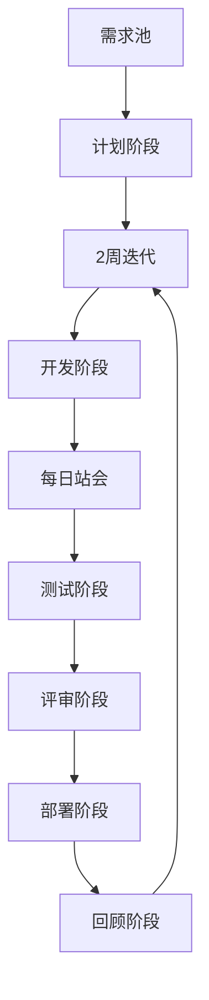
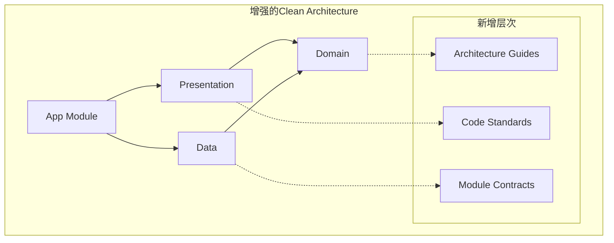
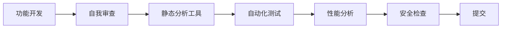
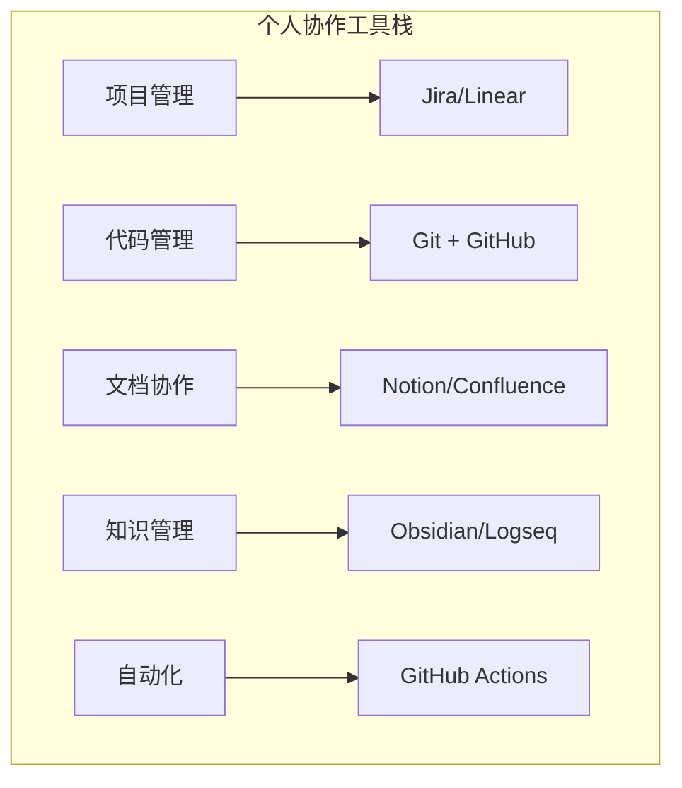
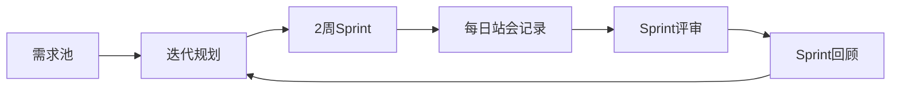
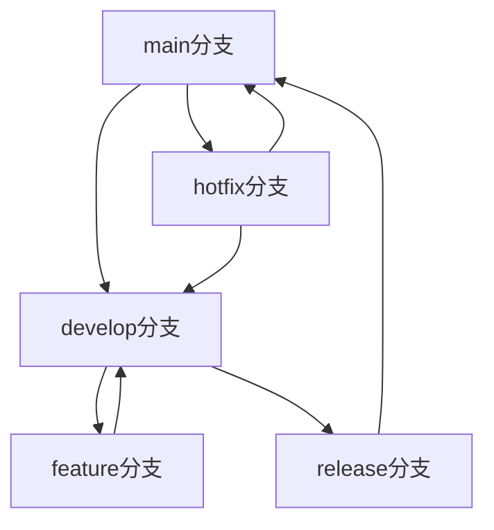
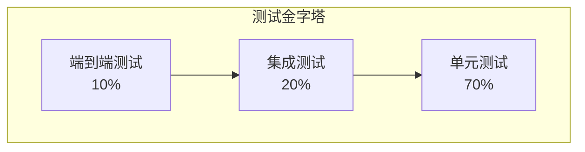
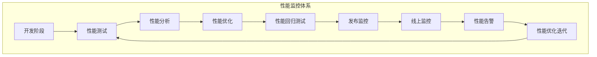
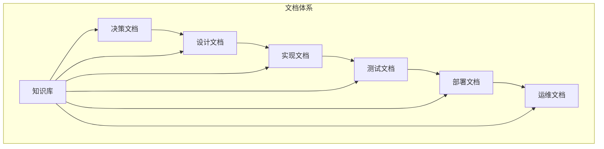
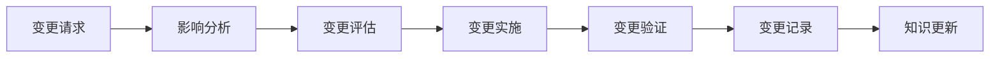

# 大型软件项目管理方法分析 - 适合单人开发中大型Android项目

## 项目概况分析

基于您提供的信息，这是一个约12.7万行代码的中大型Android项目，由单人开发。项目采用Clean Architecture架构，分为domain、data、presentation和app四个模块，整体架构合规性达到100%。项目已有较好的文档体系和基础测试框架，但测试覆盖率仅为33.5%，存在一些技术债务需要处理。

## 1. 大型软件项目管理方法分析

### 1.1 传统大型项目管理方法对比

| 方法 | 特点 | 适用场景 | 优势 | 劣势 |
|------|------|----------|------|------|
| 瀑布模型 | 线性顺序开发 | 需求明确的大型项目 | 计划清晰 | 不适应变化 |
| 敏捷开发 | 迭代增量开发 | 需求变化频繁的项目 | 灵活适应变化 | 需要团队协作 |
| Scrum | 固定迭代周期 | 中大型团队项目 | 角色明确，进度可控 | 仪式多，单人执行困难 |
| 看板方法 | 可视化工作流 | 任何规模项目 | 简单直观，灵活 | 缺乏时间规划 |
| 极限编程(XP) | 高频交付，代码质量 | 小型团队项目 | 代码质量高 | 对个人自律要求高 |

### 1.2 单人开发大型项目的特殊挑战

1. **认知负荷管理**：12.7万行代码超出个人短期认知范围
2. **上下文切换成本**：不同模块间切换导致效率下降
3. **质量保证难度**：缺乏代码审查和多样化测试视角
4. **技术债务积累**：单人开发容易优先功能而忽略重构
5. **知识传承风险**：缺乏文档和知识共享机制
6. **优先级管理**：功能开发与重构维护之间的平衡

## 2. 针对单人开发中大型项目的定制建议

### 2.1 适合单人开发的项目管理方法

#### 2.1.1 混合敏捷方法
结合看板和迭代开发的优点，适合单人开发：



**核心实践**：
- **2周迭代周期**：平衡开发速度和质量
- **每日站会**：自我记录进度和障碍
- **任务可视化**：使用电子看板跟踪状态
- **迭代回顾**：每2周进行自我评估和改进

#### 2.1.2 时间分块管理法
将一天划分为不同专注块：

| 时间段 | 活动类型 | 示例 |
|--------|----------|------|
| 上午9-12点 | 新功能开发 | 核心业务逻辑实现 |
| 下午1-3点 | 测试与修复 | 单元测试编写，bug修复 |
| 下午3-5点 | 重构与优化 | 代码质量提升，性能优化 |
| 下午5-6点 | 文档与计划 | 更新文档，规划次日工作 |

### 2.2 认知负荷管理策略

#### 2.2.1 模块化专注法
- **单周单模块**：每周专注一个主要模块
- **上下文保持**：减少频繁切换，保持思维连贯
- **知识固化**：每周结束记录模块关键决策

#### 2.2.2 外部记忆系统
- **决策日志**：记录重要技术决策和原因
- **问题解决方案库**：积累问题和解决方案
- **架构图更新**：保持架构文档与代码同步

## 3. 代码管理策略建议

### 3.1 代码组织和架构设计原则

#### 3.1.1 基于现有Clean Architecture的增强


**具体实施**：
1. **架构指南文档**：详细说明各层职责和交互规则
2. **编码标准**：统一的命名、注释、结构规范
3. **模块契约**：明确定义模块间接口和依赖关系

#### 3.1.2 模块化进一步细分
基于当前模块结构，建议进一步细分：

```
domain/
├── model/           // 当前76个文件，可按业务域分组
│   ├── contact/     // 联系人相关模型
│   ├── conversation/ // 对话相关模型
│   └── ai/         // AI相关模型
├── repository/      // 当前13个接口
├── usecase/         // 当前38个用例，可按功能分组
│   ├── contact/     // 联系人相关用例
│   ├── analysis/    // 分析相关用例
│   └── summary/    // 摘要相关用例
└── service/         // 当前4个服务
```

### 3.2 模块化管理和依赖控制

#### 3.2.1 依赖管理策略
1. **模块依赖图**：创建可视化依赖关系图
2. **循环依赖检测**：使用Gradle插件自动检测
3. **依赖版本管理**：使用Version Catalog统一管理

#### 3.2.2 代码所有权划分
即使单人开发，也可建立虚拟所有权：

| 模块 | 虚拟负责人 | 关注重点 |
|------|------------|----------|
| Domain | 架构师角色 | 业务逻辑正确性，模型设计 |
| Data | 后端工程师角色 | 数据访问效率，存储优化 |
| Presentation | 前端工程师角色 | UI体验，组件复用 |
| App | DevOps角色 | 集成，性能，发布 |

### 3.3 代码审查和质量保证流程

#### 3.3.1 自我代码审查流程


**具体实践**：
1. **24小时冷却期**：代码完成后等待24小时再审查
2. **角色切换审查**：切换不同"角色视角"审查代码
3. **工具辅助审查**：使用SonarQube、Detekt等工具
4. **历史对比审查**：与类似实现对比，选择最优方案

#### 3.3.2 质量门禁设置
```yaml
质量门禁:
  代码覆盖率: > 50%
  代码重复率: < 5%
  圈复杂度: < 10
  静态分析问题: 0个严重问题
  性能回归: < 5%
```

## 4. 单人团队协作模式优化方案

### 4.1 角色分离和时间管理

#### 4.1.1 时间分角色法
将不同时间段分配不同角色：

| 时间 | 角色 | 主要活动 | 产出物 |
|------|------|----------|--------|
| 周一上午 | 产品经理 | 需求分析，优先级排序 | 需求文档，迭代计划 |
| 周一下午-周三 | 开发工程师 | 功能实现，代码编写 | 功能代码，单元测试 |
| 周四 | 测试工程师 | 测试用例，质量检查 | 测试报告，问题列表 |
| 周五 | 架构师/DevOps | 代码审查，重构，部署 | 重构代码，发布版本 |

#### 4.1.2 决策记录和沟通机制
1. **架构决策记录(ADR)**：记录重要架构决策
2. **技术博客**：定期总结技术经验
3. **代码注释增强**：解释复杂逻辑和设计思路
4. **未来自己沟通**：通过文档与未来的自己沟通

### 4.2 协作工具和沟通机制

#### 4.2.1 个人协作工具栈


#### 4.2.2 自动化协作流程
1. **自动化代码审查**：设置PR模板和自动检查
2. **自动化测试**：提交触发全量测试
3. **自动化部署**：通过CI/CD自动部署测试版本
4. **自动化通知**：重要事件自动通知

## 5. 适合个人开发的项目管理流程

### 5.1 敏捷开发在单人项目中的应用

#### 5.1.1 个人Scrum流程


**具体实践**：
1. **迭代规划**：每2周选择可完成的功能点
2. **每日记录**：记录完成、阻塞和计划
3. **迭代评审**：演示完成的功能
4. **迭代回顾**：分析效率和改进点

#### 5.1.2 任务分解和管理
使用Epic -> Story -> Task三级分解：

```
Epic: 联系人管理优化
├── Story: 联系人列表性能优化
│   ├── Task: 实现分页加载
│   ├── Task: 添加搜索功能
│   └── Task: 优化列表渲染
└── Story: 联系人详情页重构
    ├── Task: 拆分ViewModel
    ├── Task: 优化UI组件
    └── Task: 添加单元测试
```

### 5.2 版本控制和分支策略

#### 5.2.1 简化Git Flow
适合单人开发的分支策略：



**分支使用规则**：
- **main**：生产环境代码，只接受release和hotfix合并
- **develop**：开发主线，功能开发的基础
- **feature/***：功能开发分支，从develop分出
- **release/***：发布准备分支，测试和修复
- **hotfix/***：紧急修复分支，从main分出

#### 5.2.2 提交信息规范
```
<type>(<scope>): <subject>

<body>

<footer>
```

类型定义：
- feat: 新功能
- fix: 修复bug
- docs: 文档更新
- style: 代码格式调整
- refactor: 重构
- test: 测试相关
- chore: 构建过程或辅助工具变动

### 5.3 发布管理和持续集成

#### 5.3.1 语义化版本控制
使用SemVer规范：MAJOR.MINOR.PATCH
- **MAJOR**：不兼容的API变更
- **MINOR**：向后兼容的功能新增
- **PATCH**：向后兼容的问题修正

#### 5.3.2 CI/CD流程设计
```yaml
name: CI/CD Pipeline
on:
  push:
    branches: [develop, main]
  pull_request:
    branches: [develop]

jobs:
  test:
    runs-on: ubuntu-latest
    steps:
      - uses: actions/checkout@v3
      - name: Set up JDK
        uses: actions/setup-java@v3
        with:
          java-version: '17'
          distribution: 'temurin'
      - name: Run tests
        run: ./gradlew test
      - name: Generate test report
        run: ./gradlew jacocoTestReport
        
  build:
    needs: test
    runs-on: ubuntu-latest
    steps:
      - name: Build APK
        run: ./gradlew assembleDebug
        
  deploy:
    needs: build
    runs-on: ubuntu-latest
    if: github.ref == 'refs/heads/main'
    steps:
      - name: Deploy to Testing
        run: # 部署到测试环境脚本
```

## 6. 质量保证体系实施方案

### 6.1 测试策略和自动化测试

#### 6.1.1 测试金字塔实施
基于当前33.5%的覆盖率，建立测试金字塔：



**具体目标**：
- **单元测试**：覆盖所有UseCase和Repository
- **集成测试**：覆盖关键业务流程
- **UI测试**：覆盖主要用户场景

#### 6.1.2 测试自动化流程
1. **本地测试**：提交前运行完整测试套件
2. **CI测试**：提交触发自动化测试
3. **定期测试**：每周运行完整测试套件
4. **性能测试**：每月进行性能基准测试

#### 6.1.3 测试覆盖率提升计划
基于当前各模块覆盖率，制定提升计划：

| 模块 | 当前覆盖率 | 目标覆盖率 | 关键测试点 |
|------|------------|------------|------------|
| Domain | 18.9% | 60% | 所有UseCase，PrivacyEngine |
| Data | 29.7% | 70% | 所有Repository，DAO |
| Presentation | 11.0% | 40% | 所有ViewModel，主要Screen |
| App | 636%* | 80% | 所有Service，Application |

*注：App模块覆盖率异常高是因为测试文件位置不当

### 6.2 代码质量监控和度量

#### 6.2.1 静态代码分析工具链
```yaml
静态分析工具:
  代码质量:
    - SonarQube: 整体代码质量
    - Detekt: Kotlin特定检查
  代码格式:
    - ktlint: 代码风格检查
    - spotless: 自动格式化
  依赖检查:
    - dependency-check: 依赖漏洞扫描
    - renovate: 依赖更新检查
```

#### 6.2.2 代码质量指标监控
建立关键指标监控仪表板：

| 指标 | 当前值 | 目标值 | 监控频率 |
|------|--------|--------|----------|
| 代码覆盖率 | 33.5% | 50%+ | 每次提交 |
| 圈复杂度 | 部分>20 | <10 | 每周 |
| 代码重复率 | ~10% | <5% | 每月 |
| 技术债务比率 | 未知 | <5% | 每月 |
| 安全漏洞 | 0 | 0 | 每次提交 |

### 6.3 性能监控和优化

#### 6.3.1 性能监控体系


#### 6.3.2 关键性能指标
基于Android项目特点，监控以下指标：

| 指标类型 | 具体指标 | 目标值 | 监控工具 |
|----------|----------|--------|----------|
| 启动性能 | 冷启动时间 | <2秒 | Android Profiler |
| UI性能 | 帧率 | >55fps | GPU Profiler |
| 内存性能 | 内存占用 | <150MB | Memory Profiler |
| 网络性能 | 请求响应时间 | <2秒 | OkHttp拦截器 |
| 电池性能 | 电池消耗 | 优化10% | Battery Historian |

## 7. 文档和知识管理优化建议

### 7.1 技术文档的组织和维护

#### 7.1.1 文档体系架构
建立分层文档体系：



**具体文档类型**：
1. **ADR(架构决策记录)**：记录重要架构决策
2. **API文档**：自动生成和维护
3. **代码注释**：解释复杂逻辑和设计意图
4. **部署指南**：详细的部署和配置说明

#### 7.1.2 文档自动化流程
1. **代码文档生成**：使用KDoc自动生成API文档
2. **文档版本控制**：与代码版本同步
3. **文档审查**：定期检查文档准确性
4. **文档更新提醒**：代码变更时自动提醒文档更新

### 7.2 知识分享和团队培训

#### 7.2.1 个人知识管理系统
建立适合单人开发的知识管理：

```
知识管理系统/
├── 技术决策/          # ADR文档
├── 问题解决方案库/      # 常见问题和解决方案
├── 代码模式库/        # 可复用的代码模式
├── 最佳实践/          # 个人开发最佳实践
├── 学习笔记/          # 技术学习记录
└── 项目总结/          # 定期项目总结
```

#### 7.2.2 知识传承机制
1. **代码注释增强**：详细解释设计思路和实现原理
2. **README完善**：每个模块有详细README
3. **示例代码**：提供使用示例和最佳实践
4. **外部博客**：定期总结技术经验

### 7.3 项目决策记录和变更管理

#### 7.3.1 架构决策记录(ADR)模板
```markdown
# ADR-001: 使用Room数据库替代SQLite

## 状态
已接受

## 背景
需要本地数据库存储联系人信息和对话历史，原计划直接使用SQLite。

## 决策
采用Room数据库框架作为数据持久化方案。

## 后果
- 正面：类型安全、编译时检查、简化数据库操作
- 负面：增加学习成本、框架依赖
- 风险：框架限制可能影响复杂查询
```

#### 7.3.2 变更管理流程


## 8. 整合实施方案

### 8.1 实施路线图

#### 第一阶段：基础建设(4周)
1. **项目管理流程建立**
   - 设置个人看板系统
   - 建立迭代规划流程
   - 实施每日记录习惯

2. **代码管理优化**
   - 实施Git分支策略
   - 建立提交信息规范
   - 设置基础CI/CD流程

3. **质量保证基础**
   - 配置静态分析工具
   - 建立测试覆盖率监控
   - 实施代码质量门禁

#### 第二阶段：流程完善(4周)
1. **测试体系提升**
   - 提升Domain层测试覆盖率至60%
   - 提升Data层测试覆盖率至70%
   - 建立集成测试框架

2. **文档体系建设**
   - 建立ADR文档体系
   - 完善代码注释
   - 建立知识管理系统

3. **性能监控建立**
   - 配置性能监控工具
   - 建立性能基准
   - 实施性能回归测试

#### 第三阶段：持续改进(长期)
1. **质量文化培养**
   - 定期代码审查
   - 持续重构优化
   - 技术债务管理

2. **知识积累**
   - 定期技术总结
   - 最佳实践提炼
   - 经验分享

3. **流程优化**
   - 定期流程回顾
   - 工具链优化
   - 自动化程度提升

### 8.2 成功指标

| 维度 | 指标 | 当前值 | 目标值 | 达成时间 |
|------|------|--------|--------|----------|
| 代码质量 | 测试覆盖率 | 33.5% | 50%+ | 8周 |
| 代码质量 | 代码重复率 | ~10% | <5% | 8周 |
| 开发效率 | 功能交付频率 | 不稳定 | 每2周 | 4周 |
| 项目健康 | 技术债务 | 未知 | 可控 | 8周 |
| 知识管理 | 文档覆盖率 | 部分 | 90%+ | 8周 |

### 8.3 风险缓解

| 风险 | 可能性 | 影响 | 缓解措施 |
|------|--------|------|----------|
| 认知过载 | 高 | 高 | 模块化专注，时间分块 |
| 技术债务积累 | 中 | 高 | 定期重构，质量门禁 |
| 知识孤岛 | 高 | 中 | 文档完善，知识管理 |
| 疲劳积累 | 中 | 高 | 工作节奏，定期休息 |
| 技术滞后 | 中 | 中 | 持续学习，技术调研 |

## 结论

对于单人开发的12.7万行代码Android项目，建议采用混合敏捷方法，结合时间分块管理和角色分离策略。重点在于建立适合个人的工作节奏，通过工具和流程弥补单人开发的局限性，确保代码质量和项目可持续发展。

核心成功因素：
1. **适合个人的工作节奏**：不盲目照搬团队方法
2. **工具辅助的质量保证**：利用自动化工具弥补缺乏人工审查
3. **系统化的知识管理**：建立个人知识传承机制
4. **持续改进的心态**：定期回顾和优化工作方法

通过以上系统化的管理方法，单人也能高效管理大型项目，确保代码质量和项目的长期健康发展。