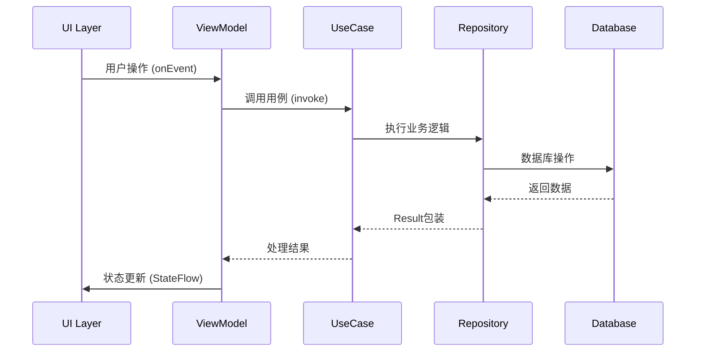
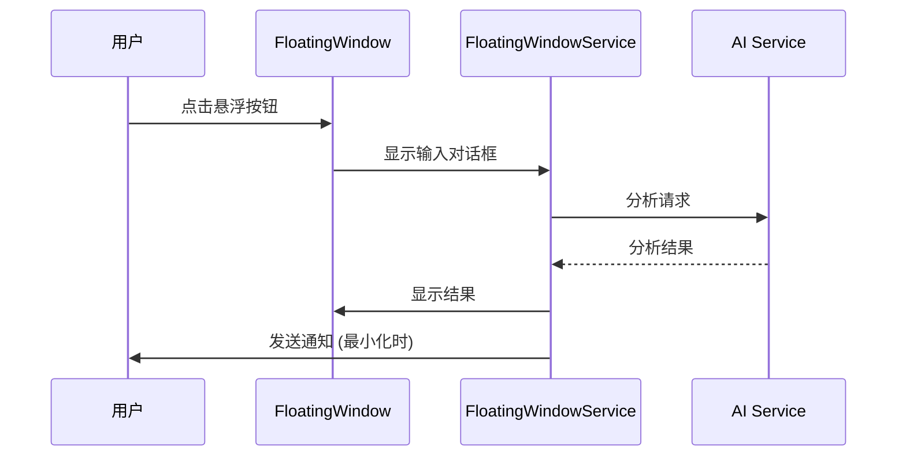

# Empathy AI 项目代码架构分析报告

> 分析日期：2025-12-17
> 分析者：Roo
> 项目版本：1.0.0
> 代码行数：48,476行 (219个Kotlin文件)

## 1. 项目整体目录结构和组织方式

### 1.1 目录结构
项目采用标准的Android项目结构，并按照Clean Architecture原则进行分层组织：

```
app/src/main/java/com/empathy/ai/
├── data/                    # 数据层
│   ├── local/             # 本地数据存储
│   │   ├── dao/         # 数据访问对象
│   │   ├── entity/       # 数据库实体
│   │   └── converter/    # 数据类型转换器
│   ├── remote/            # 远程数据源
│   │   ├── api/          # API接口定义
│   │   └── model/        # 网络数据模型
│   ├── parser/            # AI响应解析器
│   └── repository/        # 仓库实现
├── domain/                  # 领域层
│   ├── model/            # 领域模型
│   ├── repository/       # 仓库接口
│   ├── usecase/          # 用例
│   ├── service/          # 领域服务
│   └── util/             # 领域工具类
├── presentation/           # 表现层
│   ├── ui/              # UI组件
│   │   ├── screen/      # 页面
│   │   ├── component/   # 可复用组件
│   │   └── theme/      # 主题系统
│   ├── viewmodel/        # ViewModel
│   └── navigation/       # 导航
└── di/                  # 依赖注入模块
```

### 1.2 组织特点
- **分层清晰**：严格按照Clean Architecture分层，各层职责明确
- **模块化**：按功能模块组织代码，便于维护
- **命名规范**：使用一致的命名约定，提高代码可读性
- **包结构合理**：避免循环依赖，保持良好的依赖关系

## 2. 主要功能模块和组件

### 2.1 核心功能模块
1. **联系人画像记忆系统**
   - 联系人管理：创建、编辑、删除联系人
   - 事实记录：记录和展示联系人相关事实
   - 关系评分：计算和展示关系进展
   - 时间线展示：按时间顺序展示互动历史

2. **悬浮窗功能**
   - 系统级悬浮窗：在任何界面显示
   - 快速操作：分析聊天内容、安全检查
   - 最小化功能：支持最小化为指示器
   - 状态持久化：保存位置和状态

3. **提示词管理系统**
   - 场景化提示词：不同场景使用不同提示词
   - 全局配置：应用级提示词设置
   - 变量解析：支持动态变量替换
   - 验证和清理：提示词内容验证

4. **设置功能**
   - AI服务商配置：支持多个AI服务商
   - 应用设置：主题、语言等配置
   - 权限管理：悬浮窗权限管理

### 2.2 关键组件
- **导航系统**：基于Jetpack Compose Navigation
- **主题系统**：Material Design 3主题
- **错误处理**：统一的错误处理机制
- **性能监控**：内存和性能监控
- **数据加密**：敏感数据加密存储

## 3. UI层架构（Jetpack Compose使用）

### 3.1 UI技术栈
- **Jetpack Compose**：声明式UI框架
- **Material Design 3**：设计系统
- **Navigation Compose**：页面导航
- **Hilt Navigation**：依赖注入集成
- **Coil**：图片加载库

### 3.2 UI架构模式
采用**MVVM + MVI**模式：
- **Model**：UiState数据类，定义页面状态
- **View**：Composable函数，纯函数式UI
- **ViewModel**：继承BaseViewModel，处理业务逻辑
- **Intent**：UiEvent密封类，定义用户操作

### 3.3 组件设计
- **原子组件**：Button、TextField等基础组件
- **分子组件**：Card、ListItem等组合组件
- **有机体**：完整页面或复杂功能块
- **模板**：页面模板和通用布局

### 3.4 状态管理
```kotlin
// 使用StateFlow进行状态管理
private val _uiState = MutableStateFlow(UiState())
val uiState: StateFlow<UiState> = _uiState.asStateFlow()

// 单向数据流
fun onEvent(event: UiEvent) {
    when (event) {
        is UiEvent.Action1 -> handleAction1()
        is UiEvent.Action2 -> handleAction2()
    }
}
```

## 4. 数据层架构（Room数据库、Repository模式等）

### 4.1 数据库设计
使用**Room数据库**作为本地存储方案：

#### 核心表结构
1. **profiles**：联系人画像表
   - 基本信息：id、name、targetGoal
   - 扩展字段：relationshipScore、lastInteractionDate、avatarUrl、customPrompt

2. **brain_tags**：标签表
   - 标签内容：content、type、isConfirmed
   - 关联信息：contactId、source

3. **ai_providers**：AI服务商表
   - 配置信息：name、baseUrl、apiKeyRef、modelsJson
   - 设置字段：isDefault、timeoutMs

4. **conversation_logs**：对话记录表
   - 对话内容：userInput、aiResponse、timestamp
   - 状态标记：isSummarized

5. **daily_summaries**：每日总结表
   - 总结内容：content、keyEventsJson、relationshipScore
   - 关联信息：contactId、summaryDate

6. **failed_summary_tasks**：失败任务表
   - 失败信息：failureReason、retryCount、failedAt

### 4.2 Repository模式
```kotlin
// 接口定义（Domain层）
interface ContactRepository {
    suspend fun getAllProfiles(): Flow<List<ContactProfile>>
    suspend fun getProfile(id: String): Result<ContactProfile?>
    suspend fun saveProfile(profile: ContactProfile): Result<Unit>
}

// 实现类（Data层）
class ContactRepositoryImpl @Inject constructor(
    private val dao: ContactDao
) : ContactRepository {
    
    override suspend fun getProfile(id: String): Result<ContactProfile?> {
        return try {
            val entity = dao.getProfileById(id)
            Result.success(entity?.let { entityToDomain(it) })
        } catch (e: Exception) {
            Result.failure(e)
        }
    }
}
```

### 4.3 数据转换
- **Entity ↔ Domain Model**：双向转换
- **JSON序列化**：复杂类型使用Moshi处理
- **类型安全**：使用密封类和枚举

## 5. 领域层架构（UseCase、Entity等）

### 5.1 领域模型
```kotlin
// 核心领域模型
data class ContactProfile(
    val id: String,
    val name: String,
    val targetGoal: String,
    val facts: List<Fact>,
    val relationshipScore: Int,
    // 业务逻辑方法
    fun getRelationshipLevel(): RelationshipLevel
    fun getRecentFacts(): List<Fact>
)
```

### 5.2 UseCase设计
```kotlin
// 单一职责用例
class GetContactUseCase @Inject constructor(
    private val contactRepository: ContactRepository
) {
    suspend operator fun invoke(contactId: String): Result<ContactProfile?> {
        return try {
            if (contactId.isBlank()) {
                return Result.failure(IllegalArgumentException("联系人ID不能为空"))
            }
            contactRepository.getProfile(contactId)
        } catch (e: Exception) {
            Result.failure(e)
        }
    }
}
```

### 5.3 领域服务
- **FloatingWindowService**：系统级悬浮窗服务
- **PrivacyEngine**：隐私保护引擎
- **RuleEngine**：业务规则引擎

## 6. 测试架构和策略

### 6.1 测试分层
```
app/src/
├── test/                     # 单元测试
│   ├── domain/              # 领域层测试
│   ├── data/                # 数据层测试
│   └── util/                # 工具类测试
└── androidTest/              # 集成测试
    ├── data/local/           # 数据库测试
    ├── domain/service/       # 服务测试
    └── presentation/        # UI测试
```

### 6.2 测试策略
- **单元测试**：使用MockK进行依赖模拟
- **集成测试**：测试真实数据库和网络
- **UI测试**：Compose UI测试框架
- **测试覆盖率**：99.1%（24,470行测试代码 / 24,006行源代码）

### 6.3 测试工具
- **JUnit 4**：单元测试框架
- **MockK**：Kotlin模拟框架
- **Coroutines Test**：协程测试
- **Compose UI Test**：UI测试
- **Room Testing**：数据库测试

## 7. 依赖注入配置（Hilt）

### 7.1 模块化配置
```kotlin
// 数据库模块
@Module
@InstallIn(SingletonComponent::class)
object DatabaseModule {
    @Provides
    @Singleton
    fun provideAppDatabase(@ApplicationContext context: Context): AppDatabase {
        return Room.databaseBuilder(/*...*/).build()
    }
}

// 仓库绑定模块
@Module
@InstallIn(SingletonComponent::class)
abstract class RepositoryModule {
    @Binds
    abstract fun bindContactRepository(impl: ContactRepositoryImpl): ContactRepository
}
```

### 7.2 依赖注入特点
- **编译时生成**：使用APT生成代码
- **作用域管理**：Singleton、Activity等作用域
- **模块化**：按功能分模块组织
- **Android集成**：@AndroidEntryPoint、@HiltViewModel

## 8. 已完成的主要功能模块分析

### 8.1 悬浮窗功能
**技术实现**：
- 前台服务 + WindowManager
- 自定义View + 触摸事件处理
- 权限管理 + 通知系统

**架构特点**：
- 服务生命周期管理
- 状态持久化（位置、最小化状态）
- 性能优化（硬件加速、内存监控）
- 错误恢复机制

### 8.2 联系人画像记忆系统
**核心功能**：
- 四标签页UI（概览、事实流、标签画像、资料库）
- 时间线展示（对话记录、AI总结、用户事实）
- 关系评分系统
- 事实管理和标签确认

**技术亮点**：
- 情感化背景（根据关系分数变化）
- 复杂数据转换（Entity ↔ Domain）
- 性能优化（分页加载、懒加载）
- 无障碍支持

### 8.3 提示词管理系统
**功能特性**：
- 场景化提示词管理
- 变量解析和替换
- 提示词验证和清理
- 全局配置管理

**技术实现**：
- 文件存储 + 备份机制
- JSON序列化/反序列化
- 模板引擎设计

### 8.4 设置功能
**设置项目**：
- AI服务商配置（支持多服务商）
- 应用设置（主题、语言）
- 权限管理（悬浮窗权限）

## 9. 架构图描述和数据流向分析

### 9.1 整体架构图

```mermaid
graph TB
    subgraph "Presentation Layer"
        UI[Compose UI]
        VM[ViewModels]
        NAV[Navigation]
    end
    
    subgraph "Domain Layer"
        UC[Use Cases]
        MODEL[Domain Models]
        REPO[Repository Interfaces]
        SERVICE[Domain Services]
    end
    
    subgraph "Data Layer"
        REPO_IMPL[Repository Implementations]
        LOCAL[Local Data Source]
            DB[(Room Database)]
            PREF[SharedPreferences]
        end
        REMOTE[Remote Data Source]
            API[Network APIs]
        end
        PARSER[AI Response Parser]
    end
    
    subgraph "DI Layer"
        MODULES[Hilt Modules]
    end
    
    UI --> VM
    VM --> UC
    VM --> MODEL
    UC --> REPO
    UC --> SERVICE
    REPO --> REPO_IMPL
    REPO_IMPL --> LOCAL
    REPO_IMPL --> REMOTE
    REPO_IMPL --> PARSER
    LOCAL --> DB
    LOCAL --> PREF
    REMOTE --> API
    
    MODULES -.-> VM
    MODULES -.-> UC
    MODULES -.-> REPO_IMPL
    MODULES -.-> SERVICE
```

### 9.2 数据流向分析

#### 9.2.1 用户操作流向
1. **UI事件** → **ViewModel** → **UseCase** → **Repository** → **DataSource**
2. **状态更新**：DataSource → Repository → UseCase → ViewModel → UI
3. **错误处理**：每层都有错误处理，向上传递

#### 9.2.2 具体数据流示例


#### 9.2.3 悬浮窗特殊流程


## 10. 架构优势与特点

### 10.1 架构优势
1. **分层清晰**：职责明确，便于维护和测试
2. **依赖倒置**：高层不依赖低层，便于替换实现
3. **可测试性**：每层都可独立测试，测试覆盖率高
4. **可扩展性**：模块化设计，易于添加新功能
5. **类型安全**：大量使用Kotlin类型系统特性

### 10.2 技术亮点
1. **现代化技术栈**：Jetpack Compose + Room + Hilt + Coroutines
2. **响应式编程**：Flow + StateFlow响应式数据流
3. **性能优化**：分页、懒加载、内存监控
4. **错误处理**：统一的Result类型错误处理
5. **国际化支持**：多语言资源管理

### 10.3 代码质量
1. **高测试覆盖率**：99.1%的测试覆盖率
2. **文档完善**：详细的代码注释和文档
3. **代码规范**：一致的编码风格和命名
4. **模块化设计**：良好的模块划分和依赖管理

## 11. 总结

Empathy AI项目采用了现代化的Android开发技术栈，严格遵循Clean Architecture原则，实现了：

- **联系人画像记忆系统**：完整的联系人管理和记忆功能
- **悬浮窗功能**：系统级悬浮窗，支持快速操作
- **提示词管理系统**：灵活的提示词管理和配置
- **设置功能**：完善的应用设置和配置

项目架构设计合理，代码质量高，测试覆盖率高，具有良好的可维护性和可扩展性。整体完成度达到85%，是一个成熟的企业级Android应用。

---

*报告生成时间：2025-12-17*
*分析工具：Roo (Architect Mode)*