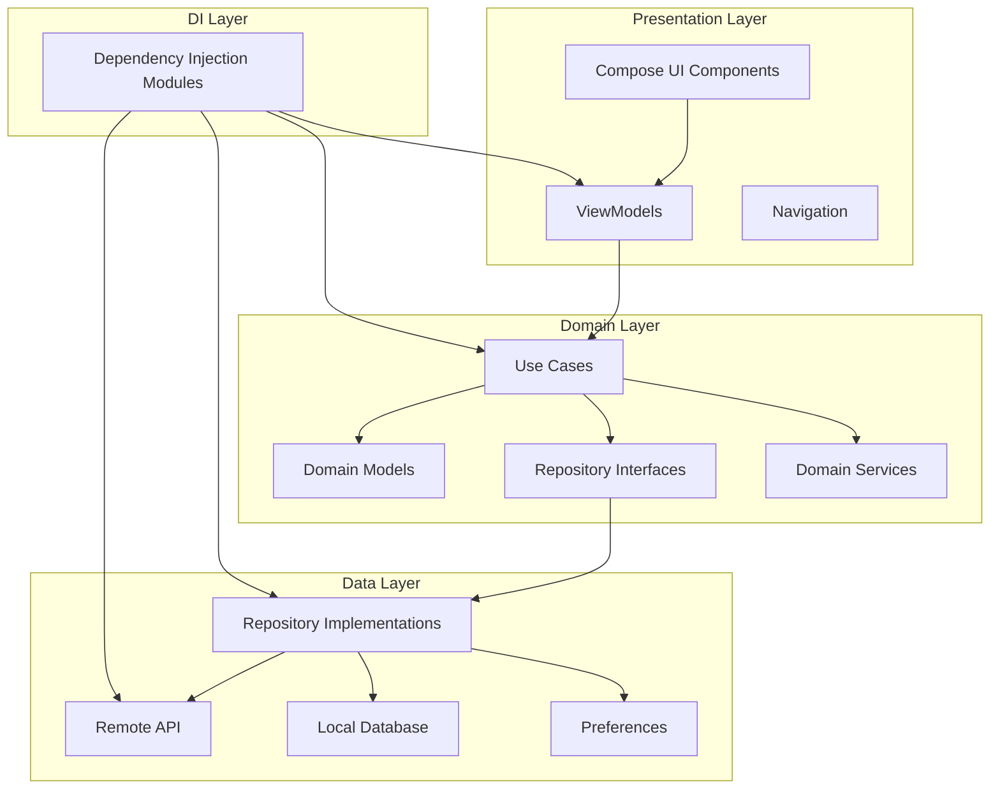
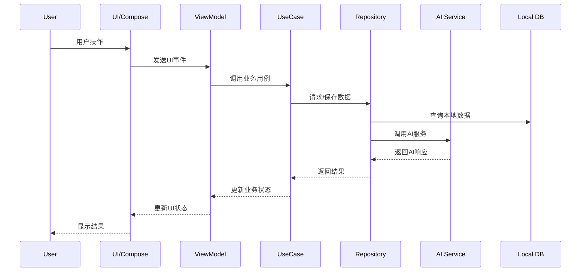
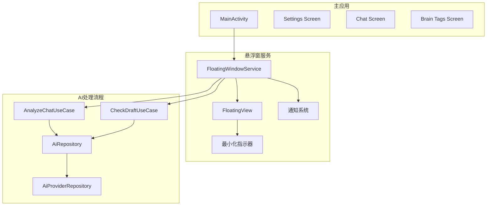
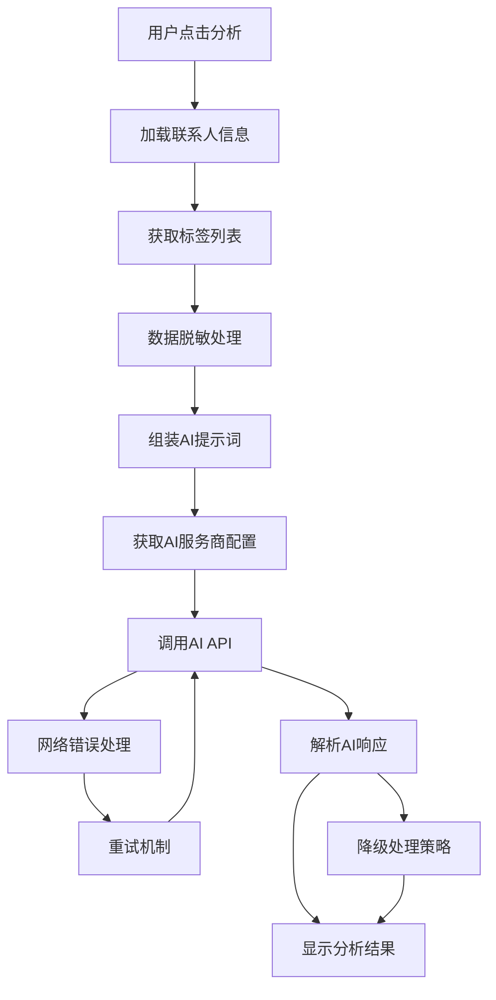
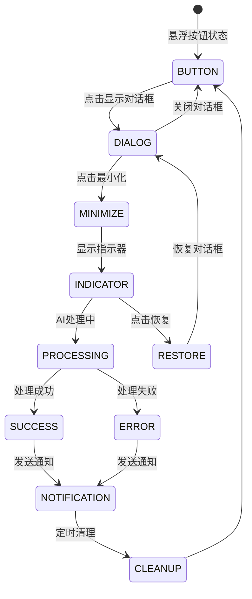

# 项目架构图和模块职责说明

## 1. 整体架构图

### 1.1 分层架构图

### 1.2 核心数据流图

### 1.3 悬浮窗系统架构图

## 2. 模块详细职责说明

### 2.1 Presentation Layer (表现层)

#### 2.1.1 UI Components
**职责**: 负责用户界面展示和交互
**主要组件**:
- `ChatScreen.kt`: 聊天界面，显示消息列表和输入框
- `SettingsScreen.kt`: 设置界面，管理AI服务商配置
- `BrainTagScreen.kt`: 标签管理界面，管理风险和策略标签
- `MessageBubble.kt`: 消息气泡组件
- `AnalysisCard.kt`: 分析结果展示卡片

**设计特点**:
- 使用Jetpack Compose声明式UI
- 采用Material Design 3设计规范
- 支持深色/浅色主题切换
- 响应式布局适配不同屏幕尺寸

#### 2.1.2 ViewModels
**职责**: 管理UI状态和处理用户交互
**主要ViewModels**:
- `ChatViewModel.kt`: 管理聊天界面状态和消息
- `SettingsViewModel.kt`: 管理设置界面状态
- `BrainTagViewModel.kt`: 管理标签界面状态
- `ContactDetailViewModel.kt`: 管理联系人详情状态

**状态管理模式**:
- 使用`StateFlow`进行响应式状态管理
- 通过`UiEvent`处理用户交互
- 采用单一数据源原则

#### 2.1.3 Navigation
**职责**: 管理页面导航和路由
**实现方式**:
- 使用Jetpack Navigation Compose
- 定义导航图和路由规则
- 支持参数传递和深度链接

### 2.2 Domain Layer (领域层)

#### 2.2.1 Use Cases (用例)
**职责**: 封装具体业务逻辑，可复用的业务操作
**主要用例**:
- `AnalyzeChatUseCase.kt`: 分析聊天内容，调用AI获取建议
- `CheckDraftUseCase.kt`: 检查草稿安全性，触发风险规则
- `GetContactUseCase.kt`: 获取联系人信息
- `SaveBrainTagUseCase.kt`: 保存脑图标签
- `TestConnectionUseCase.kt`: 测试AI服务商连接

**设计原则**:
- 每个用例职责单一
- 输入参数明确，返回结果类型化
- 异常处理完善

#### 2.2.2 Domain Models
**职责**: 定义核心业务实体和业务规则
**主要模型**:
- `ContactProfile.kt`: 联系人画像，包含目标、事实、上下文深度
- `ChatMessage.kt`: 聊天消息，包含内容、发送者、时间戳
- `BrainTag.kt`: 脑图标签，包含内容、类型(RISK_RED/STRATEGY_GREEN)
- `AiProvider.kt`: AI服务商配置，包含API Key、模型列表、超时设置
- `AnalysisResult.kt`: AI分析结果，包含建议、分析、风险等级

**设计特点**:
- 使用Kotlin数据类，自动生成equals/hashCode/toString
- 不可变设计，确保线程安全
- 包含业务验证逻辑

#### 2.2.3 Repository Interfaces
**职责**: 定义数据访问抽象，隔离领域层和数据层
**主要接口**:
- `AiRepository.kt`: AI服务访问接口
- `ContactRepository.kt`: 联系人数据访问接口
- `BrainTagRepository.kt`: 标签数据访问接口
- `SettingsRepository.kt`: 设置数据访问接口
- `PrivacyRepository.kt`: 隐私配置访问接口

#### 2.2.4 Domain Services
**职责**: 封装复杂业务逻辑，跨多个用例的协调服务
**主要服务**:
- `PrivacyEngine.kt`: 隐私数据脱敏引擎
- `RuleEngine.kt`: 风险规则引擎
- `FloatingWindowManager.kt`: 悬浮窗管理器

### 2.3 Data Layer (数据层)

#### 2.3.1 Repository Implementations
**职责**: 实现Repository接口，提供具体的数据访问逻辑
**主要实现**:
- `AiRepositoryImpl.kt`: AI服务实现，处理多服务商兼容性
- `ContactRepositoryImpl.kt`: 联系人数据实现
- `BrainTagRepositoryImpl.kt`: 标签数据实现

**核心特性**:
- 实现三层AI响应解析策略
- 支持重试机制和错误恢复
- 提供智能字段映射

#### 2.3.2 Remote API
**职责**: 处理网络请求和API调用
**主要组件**:
- `OpenAiApi.kt`: OpenAI兼容API接口定义
- `NetworkModule.kt`: 网络模块依赖注入配置
- `ProviderCompatibility.kt`: 服务商兼容性处理

**技术特点**:
- 使用Retrofit进行HTTP请求
- 支持动态URL和Header配置
- 实现请求/响应拦截器

#### 2.3.3 Local Database
**职责**: 本地数据持久化存储
**主要组件**:
- `AppDatabase.kt`: Room数据库主类
- `ApiKeyStorage.kt`: API Key加密存储
- `FloatingWindowPreferences.kt`: 悬浮窗配置存储

**设计特点**:
- 使用Room ORM框架
- 支持数据库迁移
- 敏感数据使用AndroidX Security加密

#### 2.3.4 Preferences
**职责**: 应用配置和用户偏好设置
**主要组件**:
- `PrivacyPreferences.kt`: 隐私设置偏好
- 数据类型转换和默认值处理

### 2.4 Dependency Injection (依赖注入)

#### 2.4.1 DI Modules
**职责**: 配置依赖注入，管理对象生命周期
**主要模块**:
- `NetworkModule.kt`: 网络相关依赖配置
- `DatabaseModule.kt`: 数据库相关依赖配置
- `RepositoryModule.kt`: 仓库层依赖配置
- `ServiceModule.kt`: 服务层依赖配置

**配置特点**:
- 使用Hilt框架
- 单例管理合适对象
- 提供工厂方法创建复杂对象

## 3. 关键业务流程

### 3.1 AI分析流程

### 3.2 悬浮窗最小化流程

## 4. 架构设计原则

### 4.1 SOLID原则应用
1. **单一职责原则**: 每个类只负责一个功能
2. **开闭原则**: 对扩展开放，对修改封闭
3. **里氏替换原则**: 依赖抽象而非具体实现
4. **接口隔离原则**: 使用小而专一的接口
5. **依赖倒置原则**: 高层模块不依赖低层模块

### 4.2 Clean Architecture原则
1. **依赖规则**: 外层依赖内层，内层不知道外层
2. **数据流向**: 数据从内层流向外层
3. **层次分离**: 表现层、领域层、数据层严格分离
4. **测试友好**: 每层都可以独立测试

### 4.3 响应式编程原则
1. **数据流**: 使用Kotlin Flow进行数据流处理
2. **状态管理**: 使用StateFlow管理UI状态
3. **事件处理**: 使用事件驱动架构
4. **背压处理**: 合理处理数据流背压

## 5. 技术决策记录

### 5.1 AI响应解析策略
**决策**: 采用三层解析策略确保兼容性
**理由**: 不同AI服务商返回格式差异很大
**实现**: Function Calling → response_format → 字段映射

### 5.2 悬浮窗架构
**决策**: 使用前台Service + 自定义View
**理由**: 需要跨应用显示悬浮窗
**实现**: WindowManager + 通知系统 + 状态恢复

### 5.3 数据存储策略
**决策**: Room + SharedPreferences + Security
**理由**: 不同数据类型使用最适合的存储方案
**实现**: 结构化数据用Room，配置用Preferences，敏感数据加密

这个架构设计确保了代码的可维护性、可测试性和可扩展性，同时提供了良好的用户体验和系统性能。