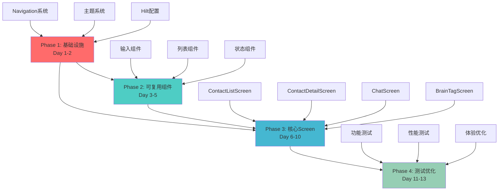
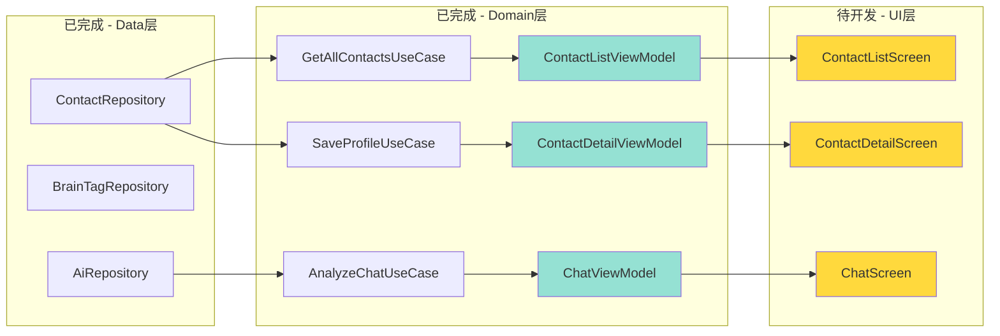
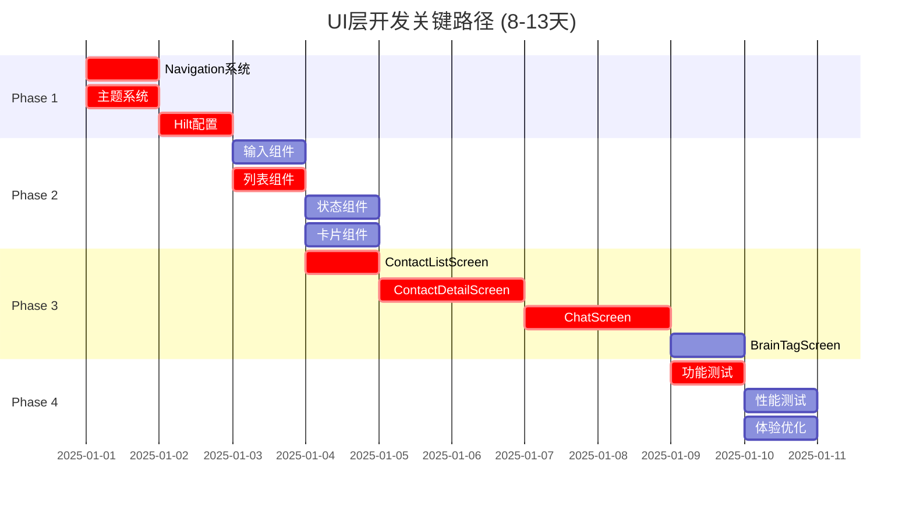

# UI层开发总体协调计划 - 完整版

> **文档版本**: v1.0  
> **创建日期**: 2025-12-05  
> **适用场景**: 单人开发，严格8-13天交付，所有功能MVP必须  
> **文档性质**: 项目管理与进度跟踪文档
> 
> **说明**: 由于文档较长,已拆分为3个文件:
> - 主文档 (Phase 1-3)
> - 续文档 (Phase 4 + 资源分配 + 风险管理 + 质量保证)
> - 本文档 (依赖关系图 + 每日检查清单 + 验收标准 + 参考资料)

---

## 6. 依赖关系图

### 6.1 阶段依赖关系

### 6.2 与现有代码的对接关系

### 6.3 关键路径分析

**关键路径说明**:
- 🔴 **关键路径**: Phase 1 → Phase 2(列表组件) → Phase 3(联系人+聊天) → Phase 4(功能测试)
- ⚠️ 关键路径上的任何延误都会直接影响交付日期
- 💡 BrainTagScreen、性能测试、体验优化不在关键路径上,可作为缓冲调整

---

## 7. 每日检查清单

### 7.1 Phase 1 每日检查点 (Day 1-2)

#### Day 1 结束检查
- [ ] **导航系统**: 创建了`nav_graph.xml`
- [ ] **导航系统**: 定义了3个destination(联系人、聊天、标签)
- [ ] **主题系统**: 创建了`Theme.kt`和`Color.kt`
- [ ] **主题系统**: 应用启动显示正确的主题颜色
- [ ] **编译状态**: 无编译错误
- [ ] **进度评估**: 如果上述任务未完成,Day 2需加速

#### Day 2 结束检查
- [ ] **MainActivity**: 集成了NavHost
- [ ] **MainActivity**: 可以在3个空白页面间导航
- [ ] **Hilt**: 创建了`ViewModelModule`
- [ ] **Hilt**: 3个ViewModel可以正常注入
- [ ] **里程碑**: M1基础设施就绪 ✅
- [ ] **准备度**: 可以开始Phase 2

### 7.2 Phase 2 每日检查点 (Day 3-5)

#### Day 3 结束检查
- [ ] **输入组件**: CustomTextField完成并有Preview
- [ ] **按钮组件**: PrimaryButton完成并有Preview
- [ ] **状态组件**: LoadingIndicator完成并有Preview
- [ ] **质量**: 所有组件支持深色模式
- [ ] **进度**: 完成约30%组件

#### Day 4 结束检查
- [ ] **列表组件**: ContactListItem完成
- [ ] **列表组件**: TagListItem完成
- [ ] **卡片组件**: AnalysisCard完成
- [ ] **状态组件**: ErrorView和EmptyView完成
- [ ] **进度**: 完成约70%组件

#### Day 5 结束检查
- [ ] **所有P0组件**: 全部完成并测试
- [ ] **Preview测试**: 每个组件Preview正常显示
- [ ] **主题测试**: 亮色/暗色模式都正常
- [ ] **里程碑**: M2组件库完成 ✅
- [ ] **准备度**: 可以开始Phase 3

### 7.3 Phase 3 每日检查点 (Day 6-10)

#### Day 6 结束检查 (ContactListScreen)
- [ ] **Screen创建**: ContactListScreen.kt文件创建
- [ ] **导航集成**: 可以从MainActivity导航到此Screen
- [ ] **ViewModel绑定**: 状态正确绑定
- [ ] **列表显示**: 可以显示联系人列表(即使是mock数据)
- [ ] **基本交互**: 点击列表项可以响应

#### Day 7 结束检查 (ContactDetailScreen - 第1天)
- [ ] **Screen创建**: ContactDetailScreen.kt文件创建
- [ ] **导航传参**: 可以从列表页导航到详情页并传递contactId
- [ ] **信息展示**: 可以显示联系人基本信息
- [ ] **编辑模式**: 可以切换到编辑模式
- [ ] **进度**: 完成约50%功能

#### Day 8 结束检查 (ContactDetailScreen - 第2天)
- [ ] **保存功能**: 可以保存编辑后的数据
- [ ] **删除功能**: 可以删除联系人
- [ ] **状态处理**: 加载/错误/成功状态都正常
- [ ] **里程碑**: M3联系人功能完成 ✅
- [ ] **测试**: 联系人全流程手动测试通过

#### Day 9 结束检查 (ChatScreen - 第1天)
- [ ] **Screen创建**: ChatScreen.kt文件创建
- [ ] **联系人选择**: 可以选择要分析的联系人
- [ ] **消息输入**: 可以输入待发送的消息
- [ ] **基本UI**: 所有组件布局正确
- [ ] **进度**: 完成约50%功能

#### Day 10 结束检查 (ChatScreen + BrainTagScreen)
- [ ] **ChatScreen**: AI分析功能完整
- [ ] **ChatScreen**: 安全检查结果显示
- [ ] **里程碑**: M4聊天功能完成 ✅
- [ ] **BrainTagScreen**: 基本CRUD功能完成
- [ ] **里程碑**: M5标签功能完成 ✅
- [ ] **准备度**: 可以开始Phase 4

### 7.4 Phase 4 每日检查点 (Day 11-13)

#### Day 11 结束检查
- [ ] **功能测试**: 3个核心功能全流程测试
- [ ] **Bug修复**: P0 Bug全部修复
- [ ] **Preview测试**: 所有Screen的Preview正常
- [ ] **Lint检查**: 无错误和警告

#### Day 12 结束检查
- [ ] **性能测试**: 启动时间<3秒
- [ ] **性能测试**: 列表滚动流畅
- [ ] **体验优化**: 错误提示优化完成
- [ ] **P1 Bug**: 至少修复80%

#### Day 13 结束检查
- [ ] **所有测试**: 全部通过
- [ ] **所有Bug**: P0/P1全部修复
- [ ] **代码注释**: 核心代码有注释
- [ ] **里程碑**: M6测试通过 ✅
- [ ] **交付状态**: 达到MVP可交付标准

---

## 8. 最终验收标准

### 8.1 功能完整性检查

#### 联系人管理模块
- [ ] **列表功能**: 可以查看所有联系人
- [ ] **列表功能**: 下拉刷新正常工作
- [ ] **列表功能**: 空状态正确显示
- [ ] **详情功能**: 可以查看联系人详细信息
- [ ] **详情功能**: 可以编辑档案(姓名、关系、标签等)
- [ ] **详情功能**: 可以保存修改
- [ ] **详情功能**: 可以删除联系人
- [ ] **数据持久化**: 编辑的数据正确保存到数据库

#### 聊天分析模块
- [ ] **联系人选择**: 可以选择要分析的联系人
- [ ] **消息输入**: 可以输入待发送的消息
- [ ] **AI分析**: 点击分析按钮后调用UseCase
- [ ] **结果展示**: AI分析结果正确显示
- [ ] **安全检查**: 风险提示正确显示
- [ ] **状态处理**: 加载状态有Loading提示
- [ ] **错误处理**: 网络错误有提示

#### 大脑标签模块
- [ ] **列表功能**: 可以查看所有标签
- [ ] **添加功能**: 可以添加新标签
- [ ] **编辑功能**: 可以编辑现有标签
- [ ] **删除功能**: 可以删除标签
- [ ] **搜索功能**: 可以搜索过滤标签
- [ ] **数据同步**: 标签变更实时反映

### 8.2 代码质量标准

#### 代码规范
- [ ] 遵循Kotlin编码规范
- [ ] 使用统一的命名约定
- [ ] 无未使用的import
- [ ] 无未使用的变量和函数

#### 代码结构
- [ ] Screen文件在正确的包结构中
- [ ] 组件代码在`components/`目录下
- [ ] ViewModel已经存在并正确使用
- [ ] Navigation配置清晰

#### 代码文档
- [ ] 所有public函数有KDoc注释
- [ ] 复杂逻辑有行内注释
- [ ] 每个Screen文件有文件头注释
- [ ] README文档更新

#### Compose最佳实践
- [ ] 使用`remember`管理状态
- [ ] 使用`LaunchedEffect`处理副作用
- [ ] 避免在Composable中直接调用ViewModel方法
- [ ] 使用`@Preview`进行预览测试

### 8.3 测试覆盖率要求

#### UI测试 (必须)
- [ ] 100% Screen可以正常打开
- [ ] 100% 核心功能流程测试通过
- [ ] 80% 边界情况测试(空数据、错误等)

#### Preview测试 (必须)
- [ ] 100% 可复用组件有@Preview
- [ ] 100% Screen有基本@Preview
- [ ] 所有Preview可以正常渲染

#### 集成测试 (可选)
- [ ] 30% 