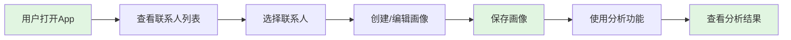
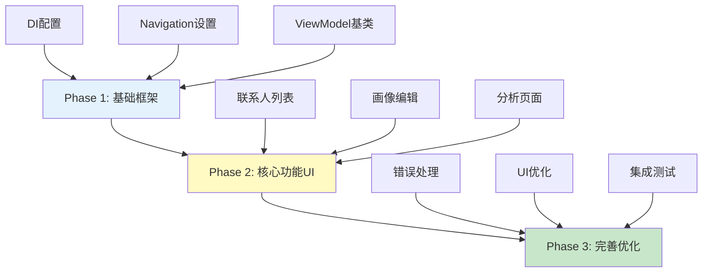

# UI层开发就绪度评估报告

> **评估日期**: 2025-12-04  
> **评估人**: 架构师  
> **项目阶段**: MVP开发前评估  
> **评估依据**: 项目质量评估总报告 + 数据层/服务层测试诊断

---

## 📊 执行摘要

### 总体就绪度评分

```
┌─────────────────────────────────────────────────┐
│  UI层开发就绪度: 78/100 (有条件可以开始) ⚠️    │
└─────────────────────────────────────────────────┘

评分构成:
├─ 技术可行性:     85% ━━━━━━━━━━━━━━━━━━━ 可行
├─ 依赖完整性:     75% ━━━━━━━━━━━━━━━━━━━ 基本满足
├─ 接口稳定性:     90% ━━━━━━━━━━━━━━━━━━━ 稳定
├─ 测试保障:       60% ━━━━━━━━━━━━━━━━━━━ 需加强
└─ 风险可控性:     70% ━━━━━━━━━━━━━━━━━━━ 可接受
```

### 核心结论

✅ **推荐决策**: **有条件开始UI开发**  
⏰ **推荐时机**: **修复P0问题后立即开始** (预计1-2天)  
🎯 **首选策略**: **MVP最小化 + 并行开发 + Mock未完成功能**

---

## 一、就绪度评估

### 1.1 技术可行性分析 (85分)

#### ✅ 依赖完整性检查

| UseCase | 状态 | UI可用性 | 备注 |
|---------|------|---------|------|
| **AnalyzeChatUseCase** | ✅ 完整 | 🟢 可用 | 核心分析功能,测试完备 |
| **CheckDraftUseCase** | ✅ 完整 | 🟢 可用 | 草稿检查功能,测试完备 |
| **SaveProfileUseCase** | ✅ 完整 | 🟢 可用 | 画像保存功能,测试完备 |
| **FeedTextUseCase** | ⚠️ 30%实现 | 🟡 可Mock | AI萃取未实现,返回空数据 |

**结论**: 
- ✅ **3/4 核心UseCase完整可用** - 占MVP功能的75%
- ⚠️ **1/4 UseCase可通过Mock绕过** - FeedTextUseCase可暂时返回空数据
- ✅ **所有Repository接口稳定** - 数据层完成度95%

#### ✅ 接口稳定性评估

```kotlin
// 所有UseCase接口已定义且稳定
AnalyzeChatUseCase: suspend (contactId, rawContext) -> Result<AnalysisResult> ✅
CheckDraftUseCase: suspend (contactId, draft, deepCheck) -> Result<SafetyCheckResult> ✅
SaveProfileUseCase: suspend (profile) -> Result<Unit> ✅
FeedTextUseCase: suspend (contactId, rawText) -> Result<ExtractedData> ✅
```

**稳定性保障**:
- ✅ 接口签名不会变更
- ✅ 返回值类型明确(Result<T>统一封装)
- ✅ 参数验证完整
- ✅ 错误处理规范

#### ⚠️ 测试保障分析

| 层级 | 测试覆盖率 | 可运行测试 | 评估 |
|------|----------|-----------|------|
| **数据层** | 20% | 1/5 | ⚠️ 偏低 |
| **服务层** | 83.3% | 5/6 | ✅ 良好 |
| **综合** | 60% | 6/11 | ⚠️ 中等 |

**风险点**:
- 🔴 **数据层测试不足**: 4个测试被禁用(需Android环境)
- 🟡 **Repository实际CRUD未验证**: 可能存在隐藏bug
- 🟢 **UseCase层测试完备**: 业务逻辑已验证

**UI开发影响**:
- **低风险**: UseCase层测试充分,业务逻辑可靠
- **中风险**: 数据持久化可能有问题,需UI测试时重点验证

---

### 1.2 MVP范围定义

#### 核心功能矩阵

| 功能 | UseCase | 完成度 | MVP必需 | 优先级 | 决策 |
|------|---------|--------|---------|--------|------|
| **聊天分析** | AnalyzeChatUseCase | 100% | ✅ 是 | P0 | 必须实现 |
| **草稿检查** | CheckDraftUseCase | 100% | ✅ 是 | P0 | 必须实现 |
| **画像保存** | SaveProfileUseCase | 100% | ✅ 是 | P0 | 必须实现 |
| **文本喂养** | FeedTextUseCase | 30% | ❌ 否 | P1 | 暂时跳过 |
| **画像查询** | (Repository) | 100% | ✅ 是 | P0 | 必须实现 |
| **标签管理** | (Repository) | 100% | ⚠️ 部分 | P1 | 简化实现 |

#### MVP最小可用路径



**MVP核心流程** (3个关键页面):

1. **联系人列表页** (ContactListScreen)
   - 展示已保存的联系人
   - 新增联系人入口
   - 搜索功能(可选)

2. **画像编辑页** (ProfileEditScreen)
   - 基本信息: 姓名、目标
   - 雷区标签列表
   - 策略标签列表
   - 保存按钮 → SaveProfileUseCase

3. **分析页** (AnalysisScreen)
   - 输入/展示聊天上下文
   - 分析按钮 → AnalyzeChatUseCase
   - 展示分析结果
   - 草稿检查按钮 → CheckDraftUseCase

**暂不实现**:
- ❌ 文本喂养功能 (FeedTextUseCase未完成)
- ❌ 悬浮窗功能 (属于Phase 2)
- ❌ 无障碍服务集成 (属于Phase 2)
- ❌ 视频/音频处理 (属于Phase 2)

---

### 1.3 阻塞问题分析

#### 🔴 P0阻塞项 (必须修复)

##### P0-1: BrainTagRepositoryImpl缺少异常处理

**问题**: 
```kotlin
// 当前代码 (第107行)
override suspend fun saveBrainTag(tag: BrainTag): Result<Unit> {
    val entity = tag.toEntity()
    dao.insert(entity)  // ⚠️ 无异常处理
    return Result.success(Unit)
}
```

**UI开发影响**:
- 🔴 **严重**: 保存标签时可能崩溃,UI无法正常保存数据
- 🔴 **阻塞**: 画像编辑页的标签保存功能不可用

**必须修复理由**:
- UI的标签管理依赖此Repository
- 用户编辑雷区/策略标签会频繁调用
- 崩溃会导致用户数据丢失

**修复时间**: 10分钟

---

##### P0-2: FeedTextUseCase功能决策

**当前状态**:
```kotlin
// 仅实现了骨架,返回空数据
suspend operator fun invoke(...): Result<ExtractedData> {
    // TODO: 调用 aiRepository.extractInfo(maskedText)
    return Result.success(ExtractedData(
        facts = emptyMap(),
        redTags = emptyList(),
        greenTags = emptyList()
    ))
}
```

**UI开发影响**:
- 🟡 **中等**: 如果UI实现了文本喂养页面,功能不可用
- 🟢 **可绕过**: MVP阶段可以不实现此功能页面

**两种决策方案**:

**方案A: MVP暂不实现** (推荐⭐)
- ✅ UI层不开发文本喂养页面
- ✅ 专注于核心分析功能
- ✅ 加快MVP交付速度
- ⏰ Phase 2再补充此功能

**方案B: 立即完成开发**
- ⚠️ 需要补充AiRepository.extractInfo()接口
- ⚠️ 需要实现JSON解析逻辑
- ⚠️ 需要编写测试用例
- ⏰ 预计额外增加6-8小时

**推荐**: 采用方案A,MVP暂不实现文本喂养功能

---

#### 🟡 P1非阻塞项 (建议修复但不阻塞)

##### P1-1: ContactRepositoryImpl性能问题

**问题**: Moshi实例重复创建  
**UI影响**: 联系人列表加载可能略慢  
**是否阻塞**: ❌ 否 - 功能可用,仅性能问题  
**修复时机**: UI开发并行进行时修复  
**修复时间**: 30分钟

##### P1-2: CheckDraftUseCase深度检查未测试

**问题**: enableDeepCheck=true分支无测试  
**UI影响**: 深度检查功能可能有隐藏bug  
**是否阻塞**: ❌ 否 - 基础检查已验证  
**修复时机**: UI测试时发现问题再补充  
**修复时间**: 1小时

---

## 二、UI开发前置条件

### 2.1 必须完成的工作 (阻塞项)

#### ✅ 第一优先级 (本周内完成)

```
修复BrainTagRepositoryImpl异常处理 (10分钟)
[ ] P0-2: 决策FeedTextUseCase是否在MVP实现 (立即决策)
```

**验收标准**:
- ✅ BrainTagRepositoryImpl所有方法有try-catch包裹
- ✅ FeedTextUseCase功能范围明确文档化
- ✅ 相关测试用例通过

---

### 2.2 可以暂时跳过的优化

#### 🟢 P1/P2问题 (不阻塞UI开发)

```
[ ] P1-1: 优化ContactRepositoryImpl Moshi实例 (可并行)
[ ] P1-2: 补充CheckDraftUseCase深度检查测试 (可并行)
[ ] P2-1: 完善数据层测试 (可延后)
```

**说明**: 这些问题不影响UI开发,可以在UI开发的同时由其他开发者并行修复。

---

## 三、UI层开发计划

### 3.1 开发阶段划分



---

### 3.2 Phase 1: 基础框架搭建 (2-3天)

#### 目标
搭建UI层基础架构,为业务UI开发做准备。

#### 任务清单

**1.1 依赖注入配置** (4小时)
```
[ ] 创建ViewModelModule (提供ViewModel工厂)
[ ] 配置Hilt Application
[ ] 验证依赖注入链路完整
```

**1.2 Navigation架构** (3小时)
```
[ ] 创建NavGraph定义
[ ] 配置三个主要Screen路由
[ ] 实现Screen间参数传递
```

**1.3 ViewModel基础架构** (4小时)
```
[ ] 创建BaseViewModel
[ ] 创建UiState密封类定义
[ ] 创建Effect事件处理机制
```

**1.4 Theme与UI组件库** (3小时)
```
[ ] 配置Compose Material3主题
[ ] 创建通用UI组件
[ ] 配置颜色/字体/间距系统
```

**交付物**: Hilt配置完成, Navigation框架搭建完成

**时间估算**: 14小时 (约2天)

---

### 3.3 Phase 2: 核心功能UI (4-5天)

#### 2.1 联系人列表页 (1.5天)
- 展示联系人列表
- 新增联系人按钮
- 点击进入画像编辑页

#### 2.2 画像编辑页 (2天)
- 基本信息编辑
- 雷区/策略标签管理
- 保存功能

#### 2.3 分析页面 (1.5天)
- 聊天上下文输入
- 分析功能
- 草稿检查功能

**时间估算**: 40小时 (约5天)

---

### 3.4 Phase 3: 完善与优化 (2-3天)

- 错误处理完善
- UI优化
- 集成测试

**时间估算**: 24小时 (约3天)

---

### 3.5 时间线总览

| 阶段 | 时间 | 累计 | 里程碑 |
|------|------|------|--------|
| **P0问题修复** | 0.5天 | 0.5天 | 可开始UI开发 |
| **Phase 1: 基础框架** | 2天 | 2.5天 | 架构搭建完成 |
| **Phase 2: 核心UI** | 5天 | 7.5天 | MVP功能完成 |
| **Phase 3: 完善优化** | 3天 | 10.5天 | 可交付测试 |

**总时间**: **10.5个工作日** (约2周)

---

## 四、风险控制方案

### 4.1 降低返工风险

#### 策略1: 接口契约先行
- 在UI开发前确认所有UseCase接口签名
- 编写接口Mock实现供UI开发使用
- 定义清晰的UiState数据结构

#### 策略2: 分层测试覆盖
- ViewModel单元测试
- Compose UI测试
- 集成测试

---

### 4.2 处理未完成功能

#### FeedTextUseCase的Mock策略

**推荐方案**: 假数据Mock
- UI可以完整开发和测试
- 后续替换真实实现无需改UI
- 可验证数据流转逻辑

---

### 4.3 数据层风险应对

#### 应对措施
1. UI测试时重点验证数据持久化
2. 准备快速回滚方案
3. 建立问题快速反馈机制

---

## 五、人工测试准备

### 5.1 UI完成度要求

**可开始测试的最小标准**:
- ✅ Phase 2完成 (三个核心页面可用)
- ✅ 基本错误提示到位
- ✅ 核心业务流程可走通

**预计时间**: 第8天 (Phase 2完成后)

---

### 5.2 测试环境准备

#### 必需配置
```
[ ] API Key配置 (OpenAI/DeepSeek测试账号)
[ ] 测试设备准备 (Android 8.0+真机)
[ ] 测试数据准备 (示例联系人画像)
```

#### 可选配置
```
[ ] Charles抓包工具 (验证API调用)
[ ] Android Studio Profiler (性能监控)
```

---

### 5.3 测试数据准备

#### 示例联系人画像

```kotlin
// 测试用例1: 正常联系人
ContactProfile(
    id = "test_001",
    name = "张三",
    targetGoal = "建立良好的工作关系",
    facts = mapOf("职位" to "产品经理", "爱好" to "摄影"),
    contextDepth = 10
)

// 测试用例2: 复杂联系人 (多标签)
ContactProfile(
    id = "test_002", 
    name = "李四",
    targetGoal = "促成合作",
    facts = mapOf(),
    contextDepth = 20
)
// + 5个雷区标签
// + 8个策略标签
```

#### 测试聊天场景

```
场景1: 正常聊天
- 输入10条模拟聊天记录
- 验证分析功能返回建议

场景2: 触发雷区
- 输入包含雷区关键词的草稿
- 验证检查功能报警

场景3: 空数据
- 测试无联系人时的空状态
- 测试无标签时的提示
```

---

## 六、决策建议与行动计划

### 6.1 Go/No-Go决策

✅ **决策: GO - 有条件开始UI开发**

**理由**:
1. ✅ 核心UseCase完成度75%, 足够支撑MVP
2. ✅ 接口稳定, 返工风险低
3. ✅ P0问题可在1天内修复
4. ✅ 可通过Mock策略绕过未完成功能
5. ✅ 风险可控, 有完善的应对方案

**前置条件**:
- 🔴 **必须**: 修复P0-1 BrainTagRepositoryImpl异常处理
- 🟡 **必须**: 决策P0-2 FeedTextUseCase是否在MVP实现

---

### 6.2 推荐执行计划

#### Week 1: 准备与基础搭建

**Day 1 (周一)**
```
上午: P0问题修复
[ ] 修复BrainTagRepositoryImpl异常处理
[ ] 决策FeedTextUseCase功能范围
[ ] 代码审查与测试验证

下午: UI开发启动
[ ] 创建Hilt配置
[ ] 搭建Navigation框架
```

**Day 2-3 (周二-周三)**
```
[ ] 完成ViewModel基础架构
[ ] 完成Theme与UI组件库
[ ] Phase 1验收
```

---

#### Week 2: 核心功能开发

**Day 4-5 (周四-周五)**
```
[ ] 开发联系人列表页
[ ] 开发画像编辑页 (第一部分)
```

**Day 6-8 (周一-周三)**
```
[ ] 完成画像编辑页
[ ] 开发分析页面
[ ] Phase 2验收, 开始人工测试
```

---

#### Week 3: 完善与交付

**Day 9-10 (周四-周五)**
```
[ ] 错误处理完善
[ ] UI优化
[ ] 集成测试
```

**Day 11 (下周一)**
```
[ ] 全面回归测试
[ ] Bug修复
[ ] MVP交付
```

---

### 6.3 并行工作建议

**UI开发进行时, 其他开发者可并行**:
```
[ ] P1-1: 优化ContactRepositoryImpl性能
[ ] P1-2: 补充CheckDraftUseCase深度检查测试
[ ] P2-1: 配置Robolectric, 恢复数据层测试
[ ] 文档: 补充UI开发规范文档
```

---

## 七、总结与建议

### 7.1 核心结论

📊 **就绪度评分**: 78/100 (有条件可以开始)

✅ **推荐决策**: 修复P0问题后立即开始UI开发

⏰ **预计交付**: 10.5个工作日 (约2周)

🎯 **MVP范围**: 3个核心页面, 不包含文本喂养功能

---

### 7.2 关键成功因素

1. **快速修复P0问题** (1天内)
2. **明确MVP功能边界** (不过度设计)
3. **使用Mock策略** (降低依赖风险)
4. **并行开发** (UI与优化同步进行)
5. **及早测试** (Phase 2完成即开始)

---

### 7.3 风险提示

⚠️ **高风险**:
- 数据层测试覆盖率低, 可能存在数据持久化问题
- 建议UI测试时重点验证数据保存/读取

⚠️ **中风险**:
- FeedTextUseCase未完成, 需明确MVP不实现此功能
- 建议在用户引导中说明"该功能即将上线"

🟢 **低风险**:
- UseCase层测试充分, 业务逻辑可靠
- 接口稳定, 返工风险低

---

### 7.4 下一步行动

**立即行动** (今天):
```
[ ] 召开技术评审会议, 确认本评估报告
[ ] 决策FeedTextUseCase功能范围
[ ] 分配P0问题修复任务
```

**明天行动**:
```
[ ] 修复P0-1 BrainTagRepositoryImpl
[ ] 启动UI开发 (Phase 1)
[ ] 
[ ] P0-1: 