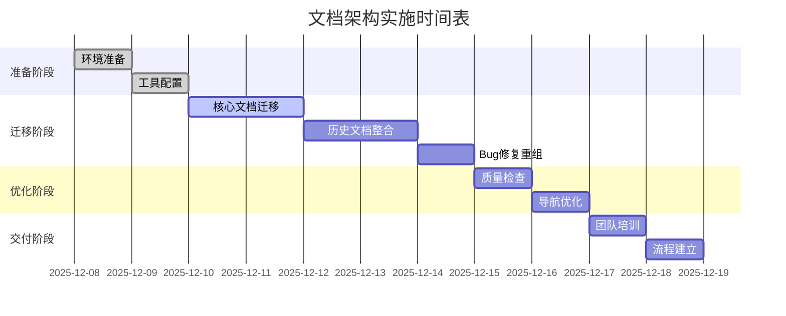

# 文档架构实施指南

**版本**: v1.0  
**创建日期**: 2025-12-08  
**最后更新**: 2025-12-08  
**更新人**: AI Architect Assistant  
**状态**: 草稿  
**预估工期**: 7个工作日

---

## 📋 实施概览

### 实施目标

1. **建立统一的文档架构**，解决当前文档管理混乱问题
2. **提供过期文档的存放机制**，保持主目录整洁
3. **建立项目整体架构文档**，便于新成员快速了解项目
4. **支持开发阶段的文档管理**，按功能模块组织开发计划
5. **建立Bug修复记录系统**，便于问题追踪和经验积累
6. **提供代码检查相关文档**，确保代码质量
7. **设置文档审查目录**，保证文档质量
8. **开发计划中只放正在进行的任务**，避免历史任务干扰

### 实施原则

1. **渐进式迁移**：分阶段实施，确保业务连续性
2. **最小化影响**：迁移过程中不影响正常开发工作
3. **质量优先**：确保迁移后的文档质量不降低
4. **团队参与**：让团队成员参与迁移过程，确保新架构适用

---

## 🗓️ 实施时间表



---

## 📂 阶段一：准备工作（2天）

### 任务1.1：环境准备（第1天上午）

#### 创建新目录结构

```bash
# 在docs目录下执行以下命令
mkdir -p "01-项目概述"
mkdir -p "02-架构设计/领域层设计"
mkdir -p "02-架构设计/数据层设计"
mkdir -p "02-架构设计/服务层设计"
mkdir -p "02-架构设计/表现层设计"
mkdir -p "02-架构设计/过期"
mkdir -p "03-开发指南/环境配置"
mkdir -p "03-开发指南/编码规范"
mkdir -p "03-开发指南/功能模块/联系人管理"
mkdir -p "03-开发指南/功能模块/聊天分析"
mkdir -p "03-开发指南/功能模块/悬浮窗服务"
mkdir -p "03-开发指南/功能模块/无障碍服务"
mkdir -p "03-开发指南/代码审查"
mkdir -p "03-开发指南/过期"
mkdir -p "04-测试文档/测试策略"
mkdir -p "04-测试文档/单元测试"
mkdir -p "04-测试文档/集成测试"
mkdir -p "04-测试文档/端到端测试"
mkdir -p "04-测试文档/兼容性测试"
mkdir -p "04-测试文档/过期"
mkdir -p "05-Bug修复/P0级修复"
mkdir -p "05-Bug修复/P1级修复"
mkdir -p "05-Bug修复/P2级修复"
mkdir -p "05-Bug修复/修复模板"
mkdir -p "05-Bug修复/过期"
mkdir -p "06-发布管理/版本历史"
mkdir -p "06-发布管理/发布检查清单"
mkdir -p "06-发布管理/部署指南"
mkdir -p "06-发布管理/过期"
mkdir -p "07-文档审查/审查标准"
mkdir -p "07-文档审查/审查记录"
mkdir -p "07-文档审查/改进建议"
mkdir -p "07-文档审查/模板库"
mkdir -p "08-项目管理/当前任务"
mkdir -p "08-项目管理/会议记录"
mkdir -p "08-项目管理/决策记录"
mkdir -p "08-项目管理/过期"
```

#### 创建各目录README文件

为每个主目录创建README.md文件，提供该目录的导航和说明。

### 任务1.2：工具配置（第1天下午）

#### 安装文档检查工具

```bash
# 安装markdown检查工具
npm install -g markdownlint
npm install -g markdown-link-check

# 创建配置文件
echo '{"default": true, "MD013": false}' > .markdownlint.json
```

#### 创建自动化脚本

创建`docs/scripts/`目录，添加以下脚本：

1. **check-links.sh** - 链接检查脚本
2. **validate-docs.sh** - 文档格式验证脚本
3. **update-index.sh** - 索引更新脚本

---

## 📂 阶段二：文档迁移（5天）

### 任务2.1：核心文档迁移（第2-3天）

#### 项目概述文档迁移

**源文档**: `docs/00-项目概述/OVERVIEW.md`  
**目标位置**: `01-项目概述/项目简介.md`

迁移步骤：
1. 复制原文档内容
2. 按照新模板重新组织内容
3. 拆分为多个专门文档：
   - `项目简介.md` - 项目基本信息
   - `技术栈.md` - 技术选型说明
   - `开发路线图.md` - 项目里程碑
   - `快速开始.md` - 新成员入门指南

#### 架构设计文档迁移

**源目录**: `docs/01-架构设计/`  
**目标目录**: `02-架构设计/`

迁移步骤：
1. 直接迁移现有文档
2. 按层级重新组织：
   - `整体架构.md` - 从`项目架构设计.md`提取
   - `领域层设计/` - 迁移现有内容
   - `数据层设计/` - 迁移现有内容
   - `服务层设计/` - 迁移现有内容
   - `表现层设计/` - 从UI层设计迁移

#### 开发指南文档重组

**源目录**: `docs/02-开发指南/`  
**目标目录**: `03-开发指南/`

重组步骤：
1. 环境配置文档迁移：
   - `依赖配置说明.md` → `环境配置/依赖管理.md`
   - `依赖快速参考.md` → `环境配置/快速参考.md`

2. 编码规范文档创建：
   - 基于现有代码审查提示词创建
   - `编码规范/Kotlin规范.md`
   - `编码规范/架构规范.md`

3. 功能模块文档重组：
   - 按功能分类现有开发文档
   - 创建各功能模块的子目录
   - 建立模块间的关联关系

### 任务2.2：历史文档整合（第4天）

#### Phase文档整合

**处理原则**：提取有价值信息，归档原始文档

1. **Phase1文档**：
   - 提取Domain Layer设计要点到`02-架构设计/领域层设计/`
   - 归档原始文档到`过期/`目录
   - 创建Phase总结文档记录关键决策

2. **Phase2-4文档**：
   - 提取各阶段的完成情况到相关模块文档
   - 整合测试报告到`04-测试文档/`
   - 归档阶段性文档

#### 开发计划重组

**处理原则**：按功能模块组织，只保留进行中任务

1. **按模块分类**：
   - 联系人管理相关任务 → `03-开发指南/功能模块/联系人管理/`
   - 聊天分析相关任务 → `03-开发指南/功能模块/聊天分析/`
   - UI开发任务 → `03-开发指南/功能模块/`相应模块

2. **当前任务聚焦**：
   - 只保留正在进行的任务在`08-项目管理/当前任务/`
   - 已完成任务移至`过期/`目录
   - 建立任务状态跟踪机制

### 任务2.3：Bug修复重组（第5天）

#### 按优先级分类

**源目录**: `docs/05-FixBug/`  
**目标目录**: `05-Bug修复/`

分类步骤：
1. **P0级修复**：阻塞性问题
   - `AI响应解析正则表达式错误修复报告.md`
   - `输入对话框严重Bug修复报告.md`

2. **P1级修复**：严重问题
   - `悬浮按钮拖动功能修复报告.md`
   - `微信兼容性Bug修复总结.md`

3. **P2级修复**：一般问题
   - `边缘吸附功能优化报告.md`

#### 创建修复模板

在`05-Bug修复/修复模板/`目录创建：
1. `模板-Bug修复报告.md`
2. `模板-快速验证指南.md`
3. `模板-修复总结.md`

---

## 📂 阶段三：质量提升（2天）

### 任务3.1：文档质量检查（第6天上午）

#### 格式标准化

1. **应用统一模板**
   - 检查所有文档是否包含必要元信息
   - 统一文档标题格式
   - 规范化代码块格式

2. **内容完整性检查**
   - 验证文档包含必要章节
   - 检查链接有效性
   - 确保术语使用一致

#### 质量检查清单

对每个重要文档执行以下检查：

```markdown
## 质量检查清单

### 基础信息
- [ ] 文档标题清晰明确
- [ ] 包含版本信息块
- [ ] 创建和更新日期正确
- [ ] 状态标记准确

### 内容质量
- [ ] 内容覆盖全面
- [ ] 逻辑结构清晰
- [ ] 技术描述准确
- [ ] 示例代码可运行

### 格式规范
- [ ] 遵循模板规范
- [ ] 标题层级正确
- [ ] 列表格式统一
- [ ] 代码块语法高亮

### 可维护性
- [ ] 包含更新历史
- [ ] 标记相关文档
- [ ] 设置过期机制
- [ ] 便于后续更新
```

### 任务3.2：导航优化（第6天下午）

#### 创建导航系统

1. **主导航更新**
   - 更新`docs/README.md`为新的文档导航中心
   - 建立清晰的文档分类说明
   - 提供快速查找路径

2. **目录导航完善**
   - 为每个目录创建README.md
   - 建立文档间的交叉引用
   - 添加"相关文档"链接

#### 创建查找索引

1. **按功能索引**
   - 创建功能模块到文档的映射
   - 提供多维度查找方式

2. **按角色索引**
   - 新成员入门路径
   - 开发人员查阅路径
   - 测试人员查阅路径
   - 项目管理人员查阅路径

---

## 📂 阶段四：流程建立（2天）

### 任务4.1：维护流程建立（第7天上午）

#### 制定文档维护规范

创建`07-文档审查/维护流程.md`：

1. **文档创建流程**
   - 需求确认 → 模板选择 → 内容编写 → 自我审查 → 提交审查 → 发布

2. **文档更新流程**
   - 变更识别 → 影响评估 → 内容修改 → 版本更新 → 重新发布

3. **文档过期流程**
   - 过期识别 → 价值评估 → 过期标记 → 归档处理 → 链接更新

#### 建立审查机制

1. **审查角色定义**
   - 作者：内容准确性
   - 审查者：技术正确性
   - 维护者：格式规范性

2. **审查标准制定**
   - 技术审查标准
   - 格式审查标准
   - 内容审查标准

### 任务4.2：团队培训（第7天下午）

#### 培训计划

1. **新架构介绍**（1小时）
   - 文档结构说明
   - 命名规范介绍
   - 查找方法演示

2. **模板使用培训**（1小时）
   - 各类模板介绍
   - 模板填写演示
   - 常见问题解答

3. **维护流程培训**（1小时）
   - 维护流程说明
   - 工具使用演示
   - 责任分工明确

#### 创建培训材料

1. **快速参考卡**
   - 文档命名规范
   - 常用模板链接
   - 维护检查清单

2. **视频教程**
   - 文档创建流程
   - 模板使用方法
   - 维护工具操作

---

## 📊 迁移检查清单

### 阶段一检查清单

#### 环境准备
- [ ] 新目录结构创建完成
- [ ] 各目录README文件创建
- [ ] 文档检查工具安装
- [ ] 自动化脚本准备

#### 工具配置
- [ ] markdownlint配置完成
- [ ] 链接检查工具配置
- [ ] 验证脚本测试通过
- [ ] 自动化流程测试

### 阶段二检查清单

#### 核心文档迁移
- [ ] 项目概述文档迁移完成
- [ ] 架构设计文档重组完成
- [ ] 开发指南文档重组完成
- [ ] 测试文档迁移完成

#### 历史文档整合
- [ ] Phase文档整合完成
- [ ] 开发计划重组完成
- [ ] 历史文档归档完成
- [ ] 重复内容清理完成

#### Bug修复重组
- [ ] Bug按优先级分类完成
- [ ] 修复模板创建完成
- [ ] 修复记录整理完成
- [ ] 过期记录归档完成

### 阶段三检查清单

#### 文档质量检查
- [ ] 格式标准化完成
- [ ] 内容完整性验证
- [ ] 质量检查清单执行
- [ ] 问题文档修复完成

#### 导航优化
- [ ] 主导航更新完成
- [ ] 目录导航完善
- [ ] 查找索引创建
- [ ] 交叉引用建立

### 阶段四检查清单

#### 维护流程建立
- [ ] 维护规范制定完成
- [ ] 审查机制建立
- [ ] 自动化工具集成
- [ ] 责任分工明确

#### 团队培训
- [ ] 培训计划执行完成
- [ ] 培训材料准备完成
- [ ] 团队成员培训完成
- [ ] 反馈收集处理完成

---

## 🔧 迁移脚本

### 自动化迁移脚本

创建`scripts/migrate-docs.sh`：

```bash
#!/bin/bash

# 文档架构迁移脚本
# 使用方法: ./migrate-docs.sh

echo "开始文档架构迁移..."

# 创建备份
echo "创建当前文档备份..."
cp -r docs docs-backup-$(date +%Y%m%d)

# 创建新目录结构
echo "创建新目录结构..."
./scripts/create-structure.sh

# 迁移核心文档
echo "迁移核心文档..."
./scripts/migrate-core.sh

# 整合历史文档
echo "整合历史文档..."
./scripts/integrate-history.sh

# 重组Bug修复记录
echo "重组Bug修复记录..."
./scripts/reorganize-bugs.sh

# 质量检查
echo "执行质量检查..."
./scripts/quality-check.sh

# 更新导航
echo "更新导航系统..."
./scripts/update-navigation.sh

echo "文档架构迁移完成！"
```

### 质量检查脚本

创建`scripts/quality-check.sh`：

```bash
#!/bin/bash

# 文档质量检查脚本

echo "执行文档质量检查..."

# 检查markdown格式
echo "检查Markdown格式..."
find docs -name "*.md" -exec markdownlint {} \;

# 检查链接有效性
echo "检查链接有效性..."
find docs -name "*.md" -exec markdown-link-check {} \;

# 检查必要字段
echo "检查文档元信息..."
python scripts/check-metadata.py

echo "质量检查完成！"
```

---

## 📞 支持和反馈

### 迁移期间支持

1. **每日站会**
   - 同步迁移进度
   - 讨论遇到的问题
   - 调整次日计划

2. **问题记录**
   - 记录迁移中的问题
   - 收集改进建议
   - 及时调整方案

3. **紧急支持**
   - 提供技术支持
   - 解决迁移阻塞问题
   - 确保进度不受影响

### 迁移后反馈

1. **使用体验收集**
   - 新架构使用体验
   - 查找效率变化
   - 维护便利性评价

2. **持续改进**
   - 根据反馈调整
   - 优化流程工具
   - 完善文档模板

---

## 📈 成功指标

### 定量指标

1. **文档查找时间**
   - 目标：平均查找时间减少50%
   - 测量：随机查找任务的时间对比

2. **文档维护成本**
   - 目标：维护工作量减少30%
   - 测量：维护工时统计对比

3. **文档质量评分**
   - 目标：质量评分达到85分以上
   - 测量：质量检查清单得分

### 定性指标

1. **新人上手速度**
   - 新成员了解项目的时间
   - 文档理解的准确性
   - 独立工作的能力

2. **团队协作效率**
   - 跨团队沟通频率
   - 重复问题减少情况
   - 知识传承效果

3. **项目质量保障**
   - 设计决策的完整性
   - 问题追踪的及时性
   - 经验积累的系统性

---

## 🎯 后续优化计划

### 短期优化（1个月内）

1. **工具完善**
   - 开发文档管理系统
   - 集成自动化检查
   - 提供搜索功能

2. **流程优化**
   - 简化维护流程
   - 提高审查效率
   - 减少重复工作

3. **模板完善**
   - 根据使用反馈优化模板
   - 增加新类型模板
   - 提供模板使用指南

### 长期规划（3个月内）

1. **智能化管理**
   - 引入AI辅助文档编写
   - 自动化内容更新
   - 智能推荐相关文档

2. **知识图谱**
   - 建立文档知识图谱
   - 提供智能导航
   - 支持语义搜索

3. **生态集成**
   - 与开发工具集成
   - 支持自动化生成
   - 建立文档生态系统

---

**文档版本**: v1.0  
**创建日期**: 2025-12-08  
**最后更新**: 2025-12-08  
**更新人**: AI Architect Assistant  
**状态**: 草稿  
**预计开始**: 2025-12-09  
**预计完成**: 2025-12-17