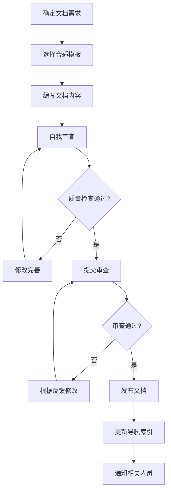
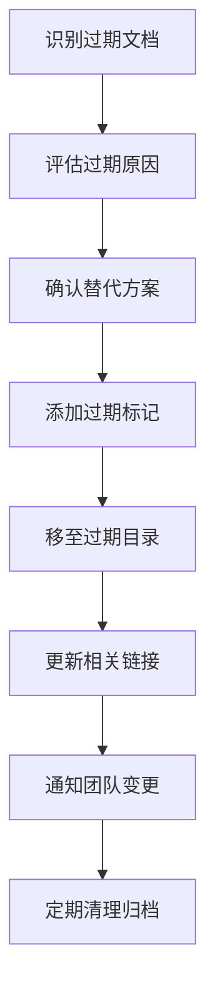

# 文档架构设计方案

**版本**: v1.0  
**设计日期**: 2025-12-08  
**设计人**: AI Architect Assistant  
**适用项目**: 共情AI助手 (Empathy AI Assistant)

---

## 📋 设计背景与目标

### 当前文档结构问题分析

基于对现有文档结构的全面分析，发现以下主要问题：

1. **目录命名不一致**
   - 混合使用中英文和数字（如"00-项目概述"、"05-FixBug"、"历史文档"）
   - 缺乏统一的命名规范

2. **文档分类边界模糊**
   - 开发指南与架构设计文档内容重叠
   - Bug修复记录分散在多个目录
   - 缺乏明确的分类标准

3. **文档层级过深**
   - 部分文档路径过长，不利于快速查找
   - 相关文档分布在不同层级，增加查找难度

4. **重复内容多**
   - 多个文档包含相似内容
   - 缺乏内容去重机制

5. **版本管理混乱**
   - 部分文档未标注版本
   - 历史版本与当前版本混杂
   - 缺乏统一的版本控制策略

6. **文档质量参差不齐**
   - 格式不统一
   - 缺乏标准模板
   - 更新频率不一致

### 设计目标

1. **建立统一的文档架构**，为后续所有文档编写打下基础
2. **提供过期文档的存放机制**，保持主目录整洁
3. **包含项目整体架构文档**，便于新成员快速了解项目
4. **支持开发阶段的文档管理**，按功能模块组织开发计划
5. **建立Bug修复记录系统**，便于问题追踪和经验积累
6. **提供代码检查相关文档**，确保代码质量
7. **设置文档审查目录**，保证文档质量
8. **开发计划中只放正在进行的任务**，避免历史任务干扰

---

## 🏗️ 新文档架构设计

### 目录结构设计

```
docs/
├── README.md                           # 文档导航中心
├── 01-项目概述/                        # 项目基本信息和概览
│   ├── README.md                        # 项目概述导航
│   ├── 项目简介.md                      # 项目详细介绍
│   ├── 技术栈.md                       # 技术选型说明
│   ├── 开发路线图.md                    # 项目里程碑规划
│   └── 快速开始.md                      # 新成员入门指南
│
├── 02-架构设计/                        # 系统架构和技术设计
│   ├── README.md                        # 架构设计导航
│   ├── 整体架构.md                      # 系统架构总览
│   ├── 领域层设计/                      # Domain Layer设计
│   ├── 数据层设计/                      # Data Layer设计
│   ├── 服务层设计/                      # Service Layer设计
│   ├── 表现层设计/                      # Presentation Layer设计
│   └── 过期/                          # 过期的架构设计文档
│
├── 03-开发指南/                        # 开发过程中的参考文档
│   ├── README.md                        # 开发指南导航
│   ├── 环境配置/                       # 开发环境搭建
│   ├── 编码规范/                       # 代码风格和规范
│   ├── 功能模块/                        # 按功能模块组织的开发文档
│   │   ├── 联系人管理/                  # 联系人功能相关文档
│   │   ├── 聊天分析/                    # 聊天分析功能相关文档
│   │   ├── 悬浮窗服务/                  # 悬浮窗功能相关文档
│   │   └── 无障碍服务/                  # 无障碍服务相关文档
│   ├── 代码审查/                        # 代码检查相关文档
│   └── 过期/                          # 过期的开发指南文档
│
├── 04-测试文档/                        # 测试相关文档
│   ├── README.md                        # 测试文档导航
│   ├── 测试策略/                        # 测试策略和方法
│   ├── 单元测试/                        # 单元测试文档
│   ├── 集成测试/                        # 集成测试文档
│   ├── 端到端测试/                      # 端到端测试文档
│   ├── 兼容性测试/                      # 兼容性测试文档
│   └── 过期/                          # 过期的测试文档
│
├── 05-Bug修复/                         # Bug修复记录和追踪
│   ├── README.md                        # Bug修复导航
│   ├── P0级修复/                        # 阻塞性问题修复
│   ├── P1级修复/                        # 严重问题修复
│   ├── P2级修复/                        # 一般问题修复
│   ├── 修复模板/                        # Bug修复报告模板
│   └── 过期/                          # 已关闭的Bug修复记录
│
├── 06-发布管理/                        # 版本发布和部署相关
│   ├── README.md                        # 发布管理导航
│   ├── 版本历史/                        # 版本发布记录
│   ├── 发布检查清单/                      # 发布前检查项
│   ├── 部署指南/                        # 部署操作指南
│   └── 过期/                          # 过期的发布文档
│
├── 07-文档审查/                        # 文档质量保证
│   ├── README.md                        # 文档审查导航
│   ├── 审查标准/                        # 文档质量标准
│   ├── 审查记录/                        # 历史审查记录
│   ├── 改进建议/                        # 文档改进建议
│   └── 模板库/                         # 文档模板集合
│
└── 08-项目管理/                        # 项目管理相关文档
    ├── README.md                        # 项目管理导航
    ├── 当前任务/                        # 正在进行的开发任务
    ├── 会议记录/                        # 项目会议记录
    ├── 决策记录/                        # 重要决策记录
    └── 过期/                          # 已完成的项目管理文档
```

### 命名规范

#### 目录命名规范

1. **主目录**: 采用"数字-功能分类"格式
   - 数字表示优先级和阅读顺序（01-08）
   - 功能分类使用中文，清晰表达目录用途
   - 示例：`01-项目概述`、`02-架构设计`

2. **子目录**: 采用功能描述性名称
   - 使用中文，便于理解
   - 避免使用数字前缀
   - 示例：`环境配置`、`功能模块`

3. **过期目录**: 统一命名为"过期"
   - 每个主目录下都可设置过期子目录
   - 用于存放不再维护的文档

#### 文件命名规范

1. **普通文档**: 采用"功能描述.md"格式
   - 使用中文，简洁明了
   - 示例：`项目简介.md`、`编码规范.md`

2. **日期相关文档**: 采用"功能描述-YYYYMMDD.md"格式
   - 仅在必要时使用日期
   - 示例：`项目进度评估-20251208.md`

3. **模板文件**: 采用"模板-功能描述.md"格式
   - 明确标识为模板文件
   - 示例：`模板-Bug修复报告.md`

---

## 📊 文档分类体系

### 分类标准

#### 按文档性质分类

1. **概述类文档** (01-项目概述)
   - 项目简介、技术栈、路线图等
   - 面向新成员和外部人员

2. **设计类文档** (02-架构设计)
   - 系统架构、模块设计、接口设计等
   - 面向开发人员

3. **实施类文档** (03-开发指南)
   - 开发规范、环境配置、功能实现等
   - 面向开发人员

4. **验证类文档** (04-测试文档)
   - 测试策略、测试用例、测试报告等
   - 面向测试人员和开发人员

5. **问题类文档** (05-Bug修复)
   - Bug报告、修复方案、验证结果等
   - 面向开发人员和项目管理人员

6. **发布类文档** (06-发布管理)
   - 版本历史、发布检查、部署指南等
   - 面向运维人员和项目管理人员

7. **质量类文档** (07-文档审查)
   - 审查标准、审查记录、模板库等
   - 面向文档维护人员

8. **管理类文档** (08-项目管理)
   - 任务管理、会议记录、决策记录等
   - 面向项目管理人员

#### 按文档生命周期分类

1. **活跃文档**: 主目录中的文档，正在维护和更新
2. **过期文档**: 各目录下的"过期"子目录中的文档，不再维护但保留参考
3. **模板文档**: "07-文档审查/模板库"中的文档，用于创建新文档

### 内容范围定义

#### 01-项目概述
- **包含内容**: 项目简介、技术栈、开发路线图、快速开始指南
- **不包含内容**: 具体技术实现、详细代码示例
- **更新频率**: 低（项目重大变更时更新）

#### 02-架构设计
- **包含内容**: 系统架构图、模块设计、接口定义、数据流设计
- **不包含内容**: 具体实现代码、环境配置
- **更新频率**: 中（架构变更时更新）

#### 03-开发指南
- **包含内容**: 环境配置、编码规范、功能实现指南、代码审查标准
- **不包含内容**: 架构设计、测试策略
- **更新频率**: 高（开发过程中持续更新）

#### 04-测试文档
- **包含内容**: 测试策略、测试用例、测试报告、兼容性测试
- **不包含内容**: 开发指南、Bug修复详情
- **更新频率**: 中（测试阶段和版本发布前更新）

#### 05-Bug修复
- **包含内容**: Bug报告、修复方案、验证结果、经验总结
- **不包含内容**: 功能开发文档、架构设计
- **更新频率**: 高（发现问题及时记录）

#### 06-发布管理
- **包含内容**: 版本历史、发布检查清单、部署指南
- **不包含内容**: 开发过程、测试详情
- **更新频率**: 中（版本发布时更新）

#### 07-文档审查
- **包含内容**: 文档质量标准、审查记录、改进建议、文档模板
- **不包含内容**: 具体业务文档
- **更新频率**: 低（标准变更时更新）

#### 08-项目管理
- **包含内容**: 当前任务、会议记录、决策记录
- **不包含内容**: 技术实现、测试详情
- **更新频率**: 高（项目管理持续更新）

---

## 🔄 版本管理机制

### 文档版本控制

#### 版本号规范

1. **文档版本**: 采用"vX.Y"格式
   - X: 主版本号（重大更新）
   - Y: 次版本号（一般更新）
   - 示例：v1.0、v1.1、v2.0

2. **项目版本**: 与代码版本保持一致
   - 示例：v1.0.0-dev、v1.0.0-release

#### 版本信息记录

每个文档必须包含版本信息块：

```markdown
---
版本: v1.2
创建日期: 2025-12-08
最后更新: 2025-12-08
更新人: [姓名]
状态: [活跃/过期/草稿]
---
```

#### 更新历史记录

重要文档需要维护更新历史：

```markdown
## 更新历史

| 版本 | 日期 | 更新内容 | 更新人 |
|------|------|----------|--------|
| v1.0 | 2025-12-01 | 初始版本 | 张三 |
| v1.1 | 2025-12-05 | 添加API文档 | 李四 |
| v1.2 | 2025-12-08 | 修复错误示例 | 王五 |
```

### 过期文档管理

#### 过期标准

文档符合以下条件之一时应移至过期目录：

1. **内容完全被新文档替代**
2. **功能已废弃或重构**
3. **信息已过时且无参考价值**
4. **项目阶段结束的临时文档**

#### 过期流程

1. **评估**: 确认文档是否真的过期
2. **记录**: 在文档中添加过期说明
3. **移动**: 将文档移至对应目录的"过期"子目录
4. **更新**: 更新相关导航和索引文档
5. **通知**: 通知团队成员文档已过期

#### 过期文档标记

```markdown
---
版本: v1.0
创建日期: 2025-12-01
过期日期: 2025-12-08
过期原因: 被新架构设计文档替代
替代文档: ../整体架构.md
---
```

### 历史记录整合

#### Phase文档整合

将现有的Phase1、Phase2等阶段性文档整合到版本管理系统中：

1. **提取有价值信息**: 从阶段性文档中提取永久性信息
2. **创建版本记录**: 将阶段性成果记录到相关文档的更新历史中
3. **归档原始文档**: 将原始阶段性文档移至过期目录
4. **创建总结文档**: 创建阶段性总结文档，记录关键决策和经验

#### 开发计划整合

按功能模块重新组织开发计划：

1. **按模块分类**: 将开发计划按功能模块重新组织
2. **当前任务聚焦**: 只保留正在进行的任务
3. **历史任务归档**: 已完成的任务移至过期目录
4. **建立任务模板**: 创建标准化的任务文档模板

---

## 📝 文档模板规范

### 模板分类

#### 1. 基础信息模板

所有文档都应包含以下基础信息：

```markdown
---
标题: [文档标题]
版本: v1.0
创建日期: YYYY-MM-DD
最后更新: YYYY-MM-DD
更新人: [姓名]
状态: [活跃/过期/草稿]
标签: [标签1, 标签2, 标签3]
相关文档: [文档链接]
---

# [文档标题]

## 概述
[简要说明文档目的和范围]

## 目录
[自动生成或手动维护的目录]

---
```

#### 2. 功能设计文档模板

```markdown
---
标题: [功能名称]设计文档
版本: v1.0
创建日期: YYYY-MM-DD
最后更新: YYYY-MM-DD
更新人: [姓名]
状态: 活跃
标签: [设计, 功能]
相关文档: [相关文档链接]
---

# [功能名称]设计文档

## 1. 功能概述

### 1.1 功能背景
[说明功能产生的背景和原因]

### 1.2 功能目标
[明确功能要达成的目标]

### 1.3 用户场景
[描述主要使用场景]

## 2. 功能设计

### 2.1 功能流程
[描述功能的完整流程]

### 2.2 界面设计
[描述界面布局和交互]

### 2.3 数据设计
[描述数据结构和存储]

## 3. 技术实现

### 3.1 技术方案
[说明采用的技术方案]

### 3.2 关键算法
[描述核心算法逻辑]

### 3.3 接口设计
[定义相关接口]

## 4. 测试计划

### 4.1 测试用例
[列出主要测试用例]

### 4.2 验收标准
[定义功能验收标准]

## 5. 风险评估

### 5.1 技术风险
[识别技术风险]

### 5.2 缓解措施
[提出风险缓解措施]

## 6. 实施计划

### 6.1 开发阶段
[分解开发阶段]

### 6.2 时间安排
[制定时间计划]

## 7. 更新历史

| 版本 | 日期 | 更新内容 | 更新人 |
|------|------|----------|--------|
| v1.0 | YYYY-MM-DD | 初始版本 | [姓名] |
```

#### 3. Bug修复文档模板

```markdown
---
标题: [Bug标题]修复报告
版本: v1.0
创建日期: YYYY-MM-DD
最后更新: YYYY-MM-DD
更新人: [姓名]
状态: 活跃
标签: [Bug, 修复, P0/P1/P2]
相关文档: [相关文档链接]
---

# [Bug标题]修复报告

## 1. Bug概述

### 1.1 Bug描述
[详细描述Bug现象]

### 1.2 影响范围
[说明Bug影响的功能和用户]

### 1.3 优先级
[P0/P1/P2/P3]

### 1.4 复现步骤
1. [步骤1]
2. [步骤2]
3. [步骤3]

### 1.5 期望结果
[描述正确的预期行为]

### 1.6 实际结果
[描述错误的实际行为]

## 2. 问题分析

### 2.1 根本原因
[分析问题的根本原因]

### 2.2 技术分析
[详细的技术分析]

### 2.3 相关代码
[涉及的关键代码片段]

## 3. 修复方案

### 3.1 解决思路
[说明解决问题的思路]

### 3.2 具体修改
[详细说明代码修改内容]

### 3.3 修复验证
[说明如何验证修复效果]

## 4. 测试验证

### 4.1 测试用例
[用于验证的测试用例]

### 4.2 测试结果
[测试执行结果]

### 4.3 回归测试
[相关功能的回归测试情况]

## 5. 经验总结

### 5.1 预防措施
[如何预防类似问题]

### 5.2 改进建议
[对代码或流程的改进建议]

## 6. 更新历史

| 版本 | 日期 | 更新内容 | 更新人 |
|------|------|----------|--------|
| v1.0 | YYYY-MM-DD | 初始版本 | [姓名] |
```

### 质量评估标准

#### 文档质量检查清单

1. **内容完整性**
   - [ ] 文档标题清晰明确
   - [ ] 包含必要的版本信息
   - [ ] 内容覆盖全面，无重要遗漏
   - [ ] 逻辑结构清晰，层次分明

2. **格式规范性**
   - [ ] 遵循模板规范
   - [ ] 标题层级正确
   - [ ] 代码块格式正确
   - [ ] 链接有效可访问

3. **内容准确性**
   - [ ] 技术描述准确
   - [ ] 示例代码可运行
   - [ ] 版本信息最新
   - [ ] 相关文档链接正确

4. **可读性**
   - [ ] 语言简洁明了
   - [ ] 术语使用一致
   - [ ] 图表清晰易懂
   - [ ] 目录结构合理

5. **维护性**
   - [ ] 包含更新历史
   - [ ] 标记相关文档
   - [ ] 设置过期机制
   - [ ] 便于后续更新

---

## 🔧 维护流程设计

### 文档生命周期管理

#### 创建流程



#### 更新流程

1. **更新触发**
   - 功能变更导致文档过时
   - 发现文档错误或不完整
   - 项目阶段进展需要更新
   - 用户反馈需要改进

2. **更新执行**
   - 评估更新范围和影响
   - 修改文档内容
   - 更新版本信息和历史
   - 重新进行质量检查

3. **更新发布**
   - 提交审查（如需要）
   - 发布更新版本
   - 通知相关人员
   - 更新相关索引

#### 过期处理流程



### 文档审查机制

#### 审查角色

1. **作者**: 文档编写者，负责内容准确性
2. **审查者**: 技术专家，负责技术正确性
3. **维护者**: 文档管理员，负责格式规范性

#### 审查标准

1. **技术审查**
   - 技术内容准确性
   - 实现方案可行性
   - 代码示例正确性

2. **格式审查**
   - 模板规范遵循
   - 格式统一性
   - 链接有效性

3. **内容审查**
   - 内容完整性
   - 逻辑清晰性
   - 表达准确性

#### 审查流程

1. **提交审查**: 作者完成文档后提交审查
2. **指派审查**: 维护者指派合适的审查者
3. **执行审查**: 审查者按照标准进行检查
4. **反馈意见**: 审查者提供具体的修改意见
5. **修改完善**: 作者根据意见进行修改
6. **审查通过**: 审查者确认修改后通过
7. **发布文档**: 维护者发布通过审查的文档

### 自动化工具集成

#### 文档检查工具

1. **链接检查器**
   - 自动检查文档中的链接有效性
   - 定期运行并生成报告
   - 标记失效链接

2. **格式检查器**
   - 检查文档格式是否符合模板
   - 验证必要字段是否填写
   - 检查标题层级是否正确

3. **内容检查器**
   - 检查文档是否包含必要章节
   - 验证代码块语法正确性
   - 检查术语使用一致性

#### 文档生成工具

1. **目录自动生成**
   - 根据文档结构自动生成目录
   - 支持多级目录
   - 自动更新页码链接

2. **索引自动更新**
   - 自动扫描新增文档
   - 更新相关导航页面
   - 生成文档统计信息

3. **版本自动标记**
   - 根据修改时间自动更新版本信息
   - 生成更新历史记录
   - 标记过期文档

---

## 📋 实施步骤

### 阶段一：准备工作（1天）

1. **创建新目录结构**
   - 按照设计创建完整的目录结构
   - 设置各目录的README文件
   - 建立模板库

2. **制定迁移计划**
   - 分析现有文档的分类归属
   - 制定文档迁移清单
   - 确定迁移优先级

### 阶段二：文档迁移（3天）

1. **核心文档迁移**
   - 迁移项目概述和架构设计文档
   - 整合开发指南和测试文档
   - 重组Bug修复记录

2. **历史文档处理**
   - 整合Phase文档到版本管理系统
   - 按功能模块重组开发计划
   - 归档过期文档

3. **模板应用**
   - 使用新模板更新重要文档
   - 统一文档格式和版本信息
   - 建立文档间的关联关系

### 阶段三：质量提升（2天）

1. **文档审查**
   - 按照新标准审查核心文档
   - 修复发现的问题
   - 完善文档内容

2. **导航优化**
   - 完善各目录的README文件
   - 建立文档间的交叉引用
   - 优化文档查找体验

### 阶段四：流程建立（1天）

1. **维护流程建立**
   - 制定文档维护规范
   - 建立审查机制
   - 设置自动化工具

2. **团队培训**
   - 介绍新的文档架构
   - 培训文档编写规范
   - 建立维护责任制

### 迁移清单

#### 必须迁移的文档

| 当前位置 | 目标位置 | 处理方式 |
|---------|---------|---------|
| docs/00-项目概述/OVERVIEW.md | 01-项目概述/项目简介.md | 内容整合 |
| docs/01-架构设计/ | 02-架构设计/ | 直接迁移 |
| docs/02-开发指南/ | 03-开发指南/ | 按模块重组 |
| docs/03-测试文档/ | 04-测试文档/ | 直接迁移 |
| docs/05-FixBug/ | 05-Bug修复/ | 按优先级分类 |
| docs/历史文档/ | 各目录/过期/ | 分散归档 |

#### 需要整合的文档

| 文档类型 | 整合方式 | 目标文档 |
|---------|---------|---------|
| Phase文档 | 提取关键信息 | 相关模块文档 |
| 进度报告 | 按模块分类 | 08-项目管理/当前任务/ |
| 重复内容 | 去重合并 | 单一权威文档 |

#### 需要创建的新文档

| 文档类型 | 模板 | 优先级 |
|---------|------|--------|
| 各目录README | 目录导航模板 | 高 |
| 文档模板 | 模板规范 | 高 |
| 维护流程 | 流程文档模板 | 中 |
| 质量标准 | 标准文档模板 | 中 |

---

## 🎯 预期效果

### 短期效果（1个月内）

1. **查找效率提升50%**
   - 清晰的分类体系
   - 统一的命名规范
   - 完善的导航系统

2. **文档质量显著提升**
   - 标准化模板应用
   - 质量检查机制
   - 统一的格式规范

3. **维护成本降低30%**
   - 明确的维护流程
   - 自动化工具支持
   - 责任制管理

### 长期效果（3个月内）

1. **知识沉淀体系化**
   - 完整的版本历史
   - 经验总结机制
   - 知识传承保障

2. **团队协作效率提升**
   - 统一的文档理解
   - 快速的新人上手
   - 减少重复沟通

3. **项目质量保障**
   - 完整的设计记录
   - 系统的测试覆盖
   - 规范的发布流程

---

## 📞 维护和支持

### 责任分工

1. **文档管理员**
   - 维护文档架构
   - 管理模板库
   - 监督文档质量

2. **技术负责人**
   - 审核技术文档
   - 更新架构设计
   - 维护开发指南

3. **测试负责人**
   - 维护测试文档
   - 更新测试用例
   - 记录测试结果

4. **项目经理**
   - 维护项目文档
   - 更新任务状态
   - 记录决策过程

### 持续改进

1. **定期评估**
   - 每月评估文档使用情况
   - 收集用户反馈
   - 分析改进空间

2. **流程优化**
   - 根据反馈优化流程
   - 更新模板和标准
   - 改进工具支持

3. **培训更新**
   - 定期培训新规范
   - 分享最佳实践
   - 提升文档意识

---

**文档版本**: v1.0  
**创建日期**: 2025-12-08  
**最后更新**: 2025-12-08  
**更新人**: AI Architect Assistant  
**状态**: 草稿  
**下次审查**: 2025-12-15