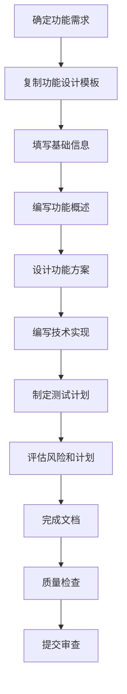
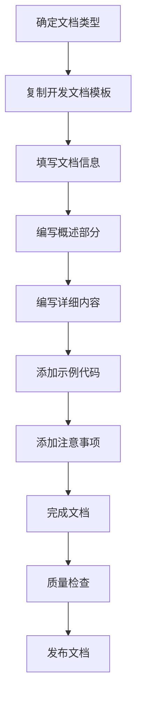
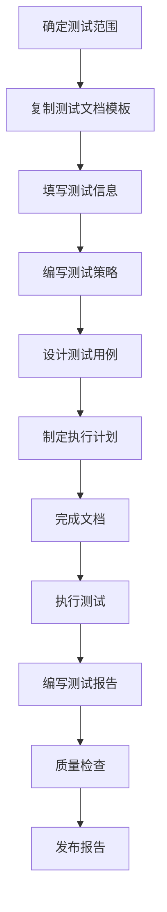
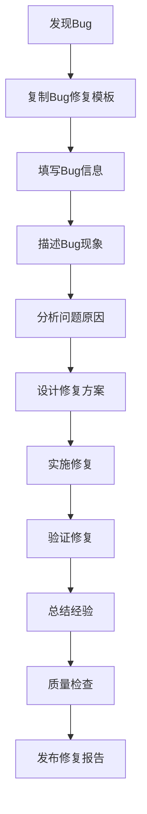
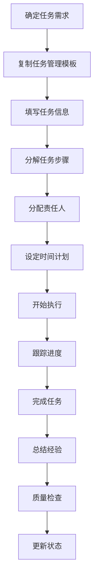
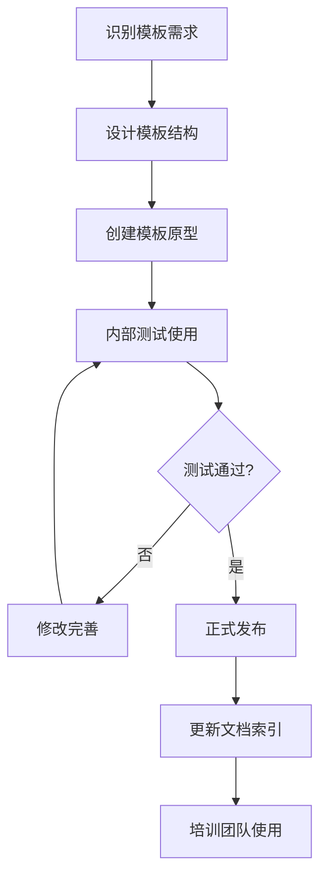

# 文档模板使用指南

**版本**: v1.0  
**创建日期**: 2025-12-08  
**最后更新**: 2025-12-08  
**更新人**: AI Assistant  
**状态**: 活跃  
**适用团队**: 5人以下小团队  
**开发周期**: 1周迭代  

---

## 📋 模板指南概述

本指南为小团队提供轻量级文档模板使用方法，通过标准化模板确保文档一致性，同时提高文档编写效率。

### 模板体系目标

1. **快速创建**：5分钟内完成文档初稿
2. **质量保证**：确保所有文档符合基础质量标准
3. **一致性维护**：统一文档格式和结构
4. **效率提升**：减少重复性工作，专注内容价值

---

## 📝 模板分类和使用

### 核心模板库

#### 1. 功能设计文档模板

**适用场景**：新功能设计、功能重构、架构设计

**模板位置**：`templates/功能设计.md`

**使用流程**：


**关键变量**：
- `{{功能名称}}`：功能的具体名称
- `{{版本}}`：文档版本号
- `{{创建日期}}`：文档创建日期
- `{{作者}}`：文档作者
- `{{优先级}}`：功能优先级（P0/P1/P2/P3）

#### 2. 开发文档模板

**适用场景**：开发指南、API文档、配置说明

**模板位置**：`templates/开发文档.md`

**使用流程**：


**关键变量**：
- `{{文档类型}}`：文档类型（指南/API/配置）
- `{{技术栈}}`：相关技术栈
- `{{目标读者}}`：目标读者群体
- `{{复杂度}}`：内容复杂度（初级/中级/高级）

#### 3. 测试文档模板

**适用场景**：测试计划、测试用例、测试报告

**模板位置**：`templates/测试文档.md`

**使用流程**：


**关键变量**：
- `{{测试类型}}`：测试类型（单元/集成/性能）
- `{{测试范围}}`：测试功能范围
- `{{测试环境}}`：测试环境描述
- `{{通过标准}}`：测试通过标准

#### 4. Bug修复文档模板

**适用场景**：Bug报告、问题分析、修复总结

**模板位置**：`templates/Bug修复.md`

**使用流程**：


**关键变量**：
- `{{Bug标题}}`：Bug的简短描述
- `{{严重程度}}`：Bug严重级别（P0/P1/P2/P3）
- `{{影响范围}}`：Bug影响的功能范围
- `{{复现步骤}}`：Bug复现的具体步骤

#### 5. 任务管理文档模板

**适用场景**：任务计划、进度跟踪、会议记录

**模板位置**：`templates/任务管理.md`

**使用流程**：


**关键变量**：
- `{{任务名称}}`：任务的具体名称
- `{{负责人}}`：任务负责人
- `{{截止日期}}`：任务截止日期
- `{{任务状态}}`：任务当前状态

---

## 🔧 快速使用方法

### 变量替换工具

#### create-doc.sh脚本

```bash
#!/bin/bash
# 快速文档创建脚本

# 参数：模板类型 文档标题
TEMPLATE_TYPE=$1
DOC_TITLE=$2

echo "创建 $DOC_TITLE 文档..."

# 选择模板
TEMPLATE_FILE="templates/${TEMPLATE_TYPE}.md"
if [ ! -f "$TEMPLATE_FILE" ]; then
    echo "❌ 模板文件不存在：$TEMPLATE_FILE"
    echo "可用模板："
    ls templates/
    exit 1
fi

# 创建文档目录
DOC_DIR="docs/$(date +%Y)/$(date +%m)/$(date +%d)"
mkdir -p "$DOC_DIR"

# 生成文档文件
DOC_FILE="${DOC_DIR}/${DOC_TITLE}.md"
cp "$TEMPLATE_FILE" "$DOC_FILE"

# 替换基础变量
sed -i "s/{{创建日期}}/$(date +%Y-%m-%d)/g" "$DOC_FILE"
sed -i "s/{{版本}}/v1.0/g" "$DOC_FILE"
sed -i "s/{{作者}}/$USER/g" "$DOC_FILE"

echo "✅ $DOC_FILE 创建完成"
echo "请填写具体内容后运行质量检查"
```

#### replace-vars.py脚本

```python
#!/usr/bin/env python3
import sys
import json
import re
from datetime import datetime

def replace_variables(file_path, variables):
    """替换模板变量"""
    with open(file_path, 'r', encoding='utf-8') as f:
        content = f.read()
    
    # 解析变量JSON
    try:
        vars_data = json.loads(variables)
    except:
        print("❌ 变量数据格式错误，应为JSON")
        return False
    
    # 替换所有变量
    for var, value in vars_data.items():
        pattern = r'\{\{' + re.escape(var) + r'\}\}'
        content = re.sub(pattern, str(value), content)
    
    # 保存文件
    with open(file_path, 'w', encoding='utf-8') as f:
        f.write(content)
    
    print(f"✅ 变量替换完成：{file_path}")
    return True

if __name__ == '__main__':
    if len(sys.argv) != 3:
        print("用法: python replace-vars.py <file_path> <variables.json>")
        sys.exit(1)
    
    file_path = sys.argv[1]
    variables_file = sys.argv[2]
    
    with open(variables_file, 'r', encoding='utf-8') as f:
        variables = f.read()
    
    success = replace_variables(file_path, variables)
    if not success:
        sys.exit(1)
```

---

## 📋 模板最佳实践

### 选择合适模板

1. **明确文档目的**
   - 新功能开发 → 功能设计模板
   - 问题解决 → Bug修复模板
   - 知识分享 → 开发文档模板

2. **考虑读者群体**
   - 技术团队 → 技术细节模板
   - 产品团队 → 功能概述模板
   - 新成员 → 快速入门模板

3. **评估内容复杂度**
   - 简单功能 → 基础模板
   - 复杂功能 → 详细模板
   - 系统设计 → 架构模板

### 高效填写技巧

#### 1. 快速起草

- **先填框架**：按照模板结构填写主要章节
- **后填细节**：在框架基础上补充具体内容
- **留空待填**：不确定的内容先留空，后续补充

#### 2. 内容组织

- **概述先行**：先写概述，让读者快速了解内容
- **逻辑递进**：从背景到实现，从简单到复杂
- **重点突出**：重要信息使用标题、列表、表格突出

#### 3. 示例添加

- **代码示例**：提供可运行的完整代码片段
- **配置示例**：提供实际的配置文件示例
- **使用示例**：提供具体的使用步骤和命令

### 质量检查要点

#### 使用前检查

1. **模板完整性**：确认模板包含所有必要章节
2. **变量替换**：检查所有变量都已正确替换
3. **格式规范**：确认Markdown格式正确
4. **链接有效**：检查内部和外部链接可访问

#### 使用后检查

1. **内容完整性**：确认所有章节都有实际内容
2. **逻辑一致性**：检查内容逻辑是否自洽
3. **技术准确性**：验证技术描述和示例的正确性

---

## 🛠️ 模板维护和优化

### 模板版本管理

#### 版本控制

- **模板版本**：采用语义化版本号（v1.0, v1.1等）
- **变更记录**：记录模板修改历史
- **兼容性检查**：确保新版本向后兼容

#### 模板优化

1. **使用反馈**：收集用户使用模板的反馈
2. **定期评估**：每季度评估模板使用效果
3. **持续改进**：基于反馈优化模板结构

### 新模板创建

#### 需求分析

当需要新模板时：

1. **分析使用场景**：确定模板的使用频率和场景
2. **设计结构**：基于现有模板设计新模板结构
3. **创建原型**：先创建模板原型，测试使用效果

#### 创建流程



---

## 📚 模板库结构

### 目录组织

```
templates/
├── 功能设计.md
├── 开发文档.md
├── 测试文档.md
├── bug修复.md
├── 任务管理.md
├── 会议记录.md
├── 项目计划.md
└── README.md
```

### 模板索引

创建`templates/README.md`作为模板库索引：

```markdown
# 模板库索引

## 模板列表

| 模板名称 | 适用场景 | 复杂度 | 使用频率 |
|-----------|----------|----------|----------|
| 功能设计 | 新功能开发、架构设计 | 中等 | 高 |
| 开发文档 | API文档、开发指南 | 简单 | 高 |
| 测试文档 | 测试计划、测试报告 | 中等 | 中 |
| bug修复 | 问题分析、修复报告 | 简单 | 高 |
| 任务管理 | 任务计划、进度跟踪 | 简单 | 高 |
| 会议记录 | 会议纪要、决策记录 | 简单 | 低 |
| 项目计划 | 项目规划、里程碑管理 | 复杂 | 低 |

## 使用指南

详细使用方法请参考各模板文件中的说明。
```

---

## 🎯 培训和推广

### 团队培训

#### 培训内容

1. **模板介绍**：介绍模板库的结构和使用方法
2. **实际操作**：现场演示模板使用过程
3. **问题解答**：解答模板使用中的常见问题

#### 培训材料

- **快速参考卡**：一页纸的模板使用指南
- **视频教程**：5分钟内的模板使用演示
- **最佳实践案例**：展示高质量文档示例

### 持续推广

#### 推广策略

1. **示范引导**：团队核心成员带头使用模板
2. **效果展示**：展示使用模板前后的效率对比
3. **激励机制**：鼓励使用模板并分享改进建议

---

## 📞 联系和支持

**模板维护人**: [模板负责人姓名]  
**技术支持**: [技术支持联系方式]  
**使用反馈**: [反馈渠道]  

---

**创建日期**: 2025-12-08  
**最后更新**: 2025-12-08  
**更新人**: AI Assistant  
**下次审查**: 2025-12-15  
**适用范围**: 全团队  
**实施时间**: 2025-12-08开始