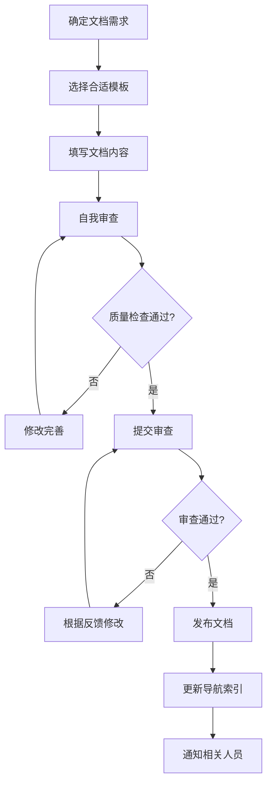
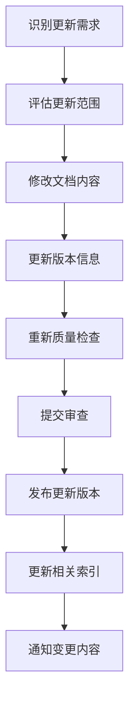
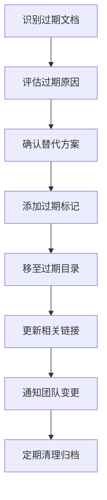

# 文档管理规范

**版本**: v1.0  
**创建日期**: 2025-12-08  
**最后更新**: 2025-12-08  
**更新人**: AI Assistant  
**状态**: 活跃  
**适用团队**: 5人以下小团队  
**开发周期**: 1周迭代  

---

## 📋 规范概述

### 设计目标

为5人以下小团队、1周快速迭代周期、纯Markdown+Git工具链设计一套轻量级、高效的文档管理规范，确保文档质量的同时最小化维护成本。

### 核心原则

1. **极简高效**：最小化文档工作量，最大化价值
2. **迭代友好**：支持1周迭代周期的快速更新
3. **自动化优先**：利用Git钩子和脚本自动化
4. **轻量协作**：适合小团队的简单协作机制

---

## 🏗️ 1-2-3规则体系

### 1个核心规范

本规范文档是唯一的文档管理核心规范，所有文档管理活动都应遵循本规范。

### 2个关键流程

1. **文档创建流程**
2. **文档更新流程**

### 3个质量检查点

1. **创建时检查**
2. **更新时检查**
3. **发布前检查**

---

## 🔄 文档创建流程

### 创建触发条件

以下情况需要创建新文档：

1. **新功能开发**：功能设计、API设计、架构设计
2. **重要决策**：技术选型、架构变更、流程调整
3. **问题解决**：Bug修复、问题分析、解决方案
4. **流程建立**：开发规范、测试策略、发布流程

### 创建步骤



### 模板使用

1. **选择模板**：根据文档类型从模板库选择合适模板
2. **变量替换**：使用项目特定信息替换模板变量
3. **内容填写**：填写具体内容，删除模板说明文字
4. **快速检查**：使用自动化脚本进行基础检查

### 审查机制

#### 审查角色

1. **作者**：文档编写者，负责内容准确性
2. **审查者**：技术专家，负责技术正确性
3. **维护者**：文档管理员，负责格式规范性

#### 审查标准

1. **技术审查**
   - 技术内容准确性
   - 实现方案可行性
   - 代码示例正确性

2. **格式审查**
   - 模板规范遵循
   - 格式统一性
   - 链接有效性

3. **内容审查**
   - 内容完整性
   - 逻辑清晰性
   - 表达准确性

---

## 🔄 文档更新流程

### 更新触发机制

1. **代码变更触发**：代码提交自动触发相关文档更新
2. **定期审查触发**：每周定期检查文档时效性
3. **用户反馈触发**：基于用户反馈触发文档改进
4. **版本发布触发**：新版本发布前更新相关文档

### 更新执行流程



### 版本管理

#### 版本号规范

采用语义化版本号：**vX.Y**

- **X**：主版本号（重大更新）
- **Y**：次版本号（一般更新）

示例：v1.0、v1.1、v2.0

#### 版本信息记录

每个文档必须包含版本信息块：

```markdown
---
版本: v1.2
创建日期: 2025-12-08
最后更新: 2025-12-08
更新人: [姓名]
状态: [活跃/过期/草稿]
---
```

#### 更新历史表

重要文档需要维护更新历史：

```markdown
## 更新历史

| 版本 | 日期 | 更新内容 | 更新人 |
|------|------|----------|--------|
| v1.0 | 2025-12-01 | 初始版本 | 张三 |
| v1.1 | 2025-12-05 | 添加API文档 | 李四 |
| v1.2 | 2025-12-08 | 修复错误示例 | 王五 |
```

---

## ✅ 质量检查机制

### 3分钟快速检查

#### 自动化检查（1分钟）

使用自动化脚本进行以下检查：

1. **格式检查**
   - Markdown语法正确性
   - 模板规范遵循度
   - 标题层级正确性

2. **链接检查**
   - 内部链接有效性
   - 外部链接可访问性
   - 图片资源存在性

3. **元信息检查**
   - 必要字段完整性
   - 版本信息规范性
   - 标签信息准确性

#### 人工快速评估（2分钟）

1. **内容准确性**
   - 技术描述正确性
   - 示例代码可运行性
   - 数据和配置准确性

2. **逻辑清晰性**
   - 结构组织合理性
   - 内容逻辑连贯性
   - 表达清晰易懂性

### 质量评分系统

#### 评分标准

| 检查项 | 权重 | 评分标准 |
|---------|--------|----------|
| 格式规范 | 30% | 完全符合模板格式 |
| 内容完整 | 25% | 包含所有必要章节 |
| 逻辑清晰 | 20% | 结构清晰，易于理解 |
| 链接有效 | 15% | 所有链接可访问 |
| 版本信息 | 10% | 版本信息完整准确 |

#### 评分计算

总分 = (格式得分×0.3) + (内容得分×0.25) + (逻辑得分×0.2) + (链接得分×0.15) + (版本得分×0.1)

#### 质量等级

- **优秀**：4.5-5.0分
- **良好**：4.0-4.4分
- **合格**：3.5-3.9分
- **需改进**：3.0-3.4分
- **不合格**：<3.0分

---

## 🛠️ Git集成自动化

### Pre-commit钩子

创建`.git/hooks/pre-commit`文件：

```bash
#!/bin/bash
# 文档预提交检查脚本

echo "执行文档预提交检查..."

# 检查Markdown格式
find docs -name "*.md" -exec markdownlint {} \;
if [ $? -ne 0 ]; then
    echo "❌ Markdown格式检查失败"
    exit 1
fi

# 检查链接有效性
find docs -name "*.md" -exec markdown-link-check {} \;
if [ $? -ne 0 ]; then
    echo "❌ 链接检查失败"
    exit 1
fi

# 检查必要字段
python scripts/check-metadata.py docs/
if [ $? -ne 0 ]; then
    echo "❌ 元信息检查失败"
    exit 1
fi

echo "✅ 所有检查通过"
exit 0
```

### Post-commit钩子

创建`.git/hooks/post-commit`文件：

```bash
#!/bin/bash
# 文档提交后自动更新脚本

echo "更新文档索引..."

# 更新主README索引
python scripts/update-index.py

# 生成质量报告
python scripts/generate-quality-report.py

# 发送通知
python scripts/send-notification.py "文档已更新"

echo "✅ 文档索引已更新"
```

### 自动化脚本

#### check-docs.sh - 文档检查脚本

```bash
#!/bin/bash
# 文档质量检查脚本

echo "开始文档质量检查..."

# 执行各项检查
echo "1. 检查Markdown格式..."
find docs -name "*.md" -exec markdownlint {} \;

echo "2. 检查链接有效性..."
find docs -name "*.md" -exec markdown-link-check {} \;

echo "3. 检查元信息..."
python scripts/check-metadata.py docs/

echo "4. 生成质量报告..."
python scripts/generate-quality-report.py

echo "✅ 检查完成"
```

#### update-index.sh - 索引更新脚本

```bash
#!/bin/bash
# 文档索引自动更新脚本

echo "更新文档索引..."

# 扫描文档目录结构
python scripts/scan-docs.py > docs/index.json

# 更新各目录README
python scripts/update-readme.py

echo "✅ 索引更新完成"
```

---

## 👥 团队协作机制

### 角色定义

#### 3个核心角色

1. **文档作者**
   - **职责**：负责文档内容编写和准确性
   - **权限**：创建和修改文档内容
   - **要求**：具备相关技术知识和写作能力

2. **文档审查者**
   - **职责**：负责文档质量把关和技术正确性
   - **权限**：审查文档并提出修改建议
   - **要求**：具备丰富技术经验和审查能力

3. **文档维护者**
   - **职责**：负责流程执行和格式规范性
   - **权限**：管理文档结构和维护流程
   - **要求**：具备项目管理能力和细致性

### 协作流程

#### 2步简化流程

1. **创建流程**
   - 模板选择 → 内容填写 → 自动检查 → 提交审查
   - 审查通过 → 发布文档 → 更新索引 → 通知团队

2. **更新流程**
   - 触发识别 → 内容修改 → 版本更新 → 重新发布
   - 自动通知相关人员更新内容

### 反馈机制

#### 即时反馈系统

1. **快速反馈**：发现问题立即反馈，24小时内响应
2. **问题跟踪**：建立问题记录和解决跟踪
3. **经验分享**：定期分享文档编写和维护经验

---

## 📊 文档生命周期管理

### 文档状态定义

1. **活跃**：正在维护和更新的文档
2. **草稿**：正在编写中的文档
3. **过期**：不再维护但保留参考的文档

### 过期处理流程



#### 过期标准

文档符合以下条件之一时应移至过期目录：

1. **内容完全被新文档替代**
2. **功能已废弃或重构**
3. **信息已过时且无参考价值**
4. **项目阶段结束的临时文档**

#### 过期文档标记

```markdown
---
版本: v1.0
创建日期: 2025-12-01
过期日期: 2025-12-08
过期原因: 被新架构设计文档替代
替代文档: ../新架构设计.md
---
```

---

## 🎯 实施指南

### 第一阶段：环境准备（第1周）

1. **安装工具**
   - 安装markdownlint：`npm install -g markdownlint`
   - 安装链接检查器：`npm install -g markdown-link-check`
   - 创建配置文件：`.markdownlint.json`

2. **配置Git钩子**
   - 创建`.git/hooks/`目录
   - 设置钩子执行权限：`chmod +x .git/hooks/*`
   - 测试钩子功能

3. **创建脚本目录**
   - 创建`scripts/`目录
   - 放置自动化脚本文件
   - 设置执行权限

### 第二阶段：试点运行（第2周）

1. **选择试点文档**
   - 选择2-3个典型文档
   - 应用新流程和规范
   - 收集使用反馈

2. **流程验证**
   - 验证创建流程有效性
   - 验证质量检查准确性
   - 验证协作流程顺畅性

3. **问题修复**
   - 记录遇到的问题
   - 调整流程和工具
   - 优化脚本和模板

### 第三阶段：全面推广（第3周）

1. **团队培训**
   - 培训文档管理规范
   - 培训工具使用方法
   - 培训协作流程

2. **全面应用**
   - 所有新文档应用新规范
   - 现有文档逐步迁移
   - 建立质量监控

3. **持续优化**
   - 收集使用反馈
   - 优化流程和工具
   - 完善规范文档

---

## 📞 联系信息

**规范维护人**: 文档管理员  
**创建日期**: 2025-12-08  
**最后更新**: 2025-12-08  
**下次审查**: 2025-12-15  
**问题反馈**: [联系方式]  

---

## 🏆 总结

本文档管理规范专门为小团队、快速迭代、轻量工具的特点设计，具有以下核心优势：

1. **极简高效**：1-2-3规则体系，简单易记
2. **快速迭代**：支持1周迭代周期的文档更新需求
3. **自动化优先**：Git集成，减少人工工作量
4. **质量保证**：3分钟快速检查，量化评分
5. **轻量协作**：3个角色，2步流程，适合小团队

通过实施本规范，团队可以实现文档质量的标准化，同时保持高效的文档维护流程，支持项目的快速迭代发展。

---

**规范版本**: v1.0  
**创建日期**: 2025-12-08  
**最后更新**: 2025-12-08  
**更新人**: AI Assistant  
**状态**: 活跃  
**适用范围**: 全团队  
**实施时间**: 2025-12-08开始