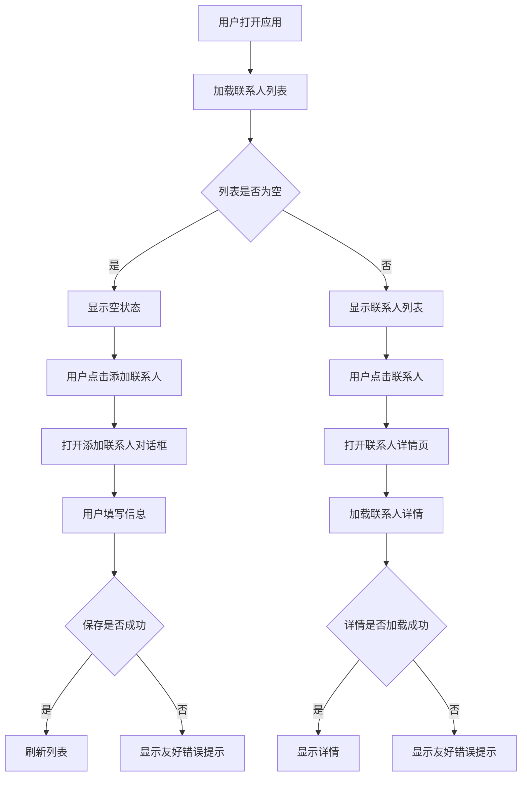
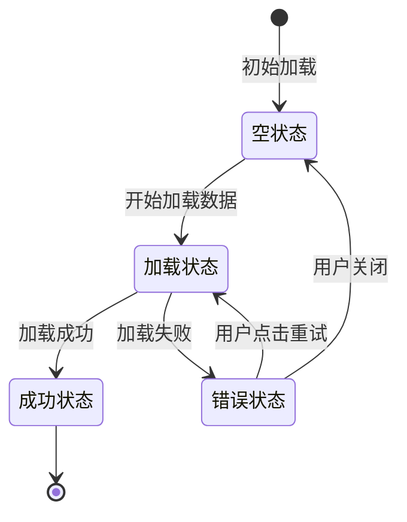

# DR-00028: FD00017文档审查报告

## 📄 文档信息

| 项目 | 内容 |
|------|------|
| 文档类型 | 功能设计文档 (FD) |
| 文档编号 | FD-00017 |
| 文档标题 | UI/UX系统化改进功能设计 |
| 存放路径 | 文档/开发文档/FD/FD-00017-UI-UX系统化改进功能设计.md |
| 版本 | 1.1 |
| 创建日期 | 2025-12-24 |
| 负责人 | Kiro |
| 状态 | ✅ 已审查通过 |

### 关联的前置文档列表

| 文档类型 | 文档编号 | 文档名称 | 状态 |
|----------|----------|----------|------|
| PRD | PRD-00017 | UI-UX系统化改进需求 | 📋 待评审 |
| RE | RESEARCH-00036 | UI-UX系统化改进调研报告 | ✅ 调研完成 |

---

## 📊 质量评分

| 评分维度 | 得分 | 说明 |
|----------|------|------|
| 格式规范性 | 8/10 | 命名格式正确，但PRD编号不一致 |
| 内容完整性 | 7/10 | 功能说明清晰，但缺少业务流程图 |
| 开发可行性 | 8/10 | 技术方案可行，但需要大量修改 |
| 架构符合性 | 9/10 | 完全符合Clean Architecture规范 |
| 功能集成性 | 7/10 | 部分集成不明确 |
| **整体评分** | **7.8/10** | 文档质量良好，需要改进 |

---

## ✅ 优点

1. **文档结构清晰** - 按功能模块组织，层次分明，易于阅读
2. **代码示例完整** - 每个模块都有详细的代码示例，便于开发人员理解
3. **设计规范明确** - 间距、动画、错误处理等规范定义清晰
4. **与现有代码兼容性好** - 复用现有AnimationSpec常量，扩展现有Dimensions对象
5. **增强现有组件** - 基于现有EmptyView和ErrorView进行增强，而非完全重写
6. **测试用例设计** - 提供了单元测试和UI测试的示例代码
7. **实施计划详细** - 阶段划分清晰，任务分解明确
8. **验收标准明确** - 功能、性能、代码质量验收标准清晰

---

## ⚠️ 需要改进项

### 格式问题

1. **PRD文档编号不一致** - PRD文档标题显示为`PRD-00018: UI/UX系统化改进需求`，与FD-00017编号不一致
   - 建议统一编号为PRD-00017

### 内容不完整

2. **缺少业务流程图** - 没有完整的用户交互流程图和状态转换图
   - 建议添加Mermaid图展示用户交互流程
   - 建议添加状态转换图展示空状态、加载状态、错误状态的转换

3. **缺少架构图** - 没有展示新组件如何集成到现有架构的图示
   - 建议添加组件依赖关系图
   - 建议添加数据流图

### 描述不清晰

4. **导航集成不完整** - 未说明如何集成到现有NavGraph.kt
   - 建议明确说明NavHost的enterTransition和exitTransition配置位置
   - 建议说明是否需要修改现有路由配置

5. **资源文件集成不明确** - 未说明是否需要新增字符串资源和图标资源
   - 建议明确是否需要新增错误提示的字符串资源
   - 建议明确是否需要新增空状态的图标资源

### 可能存在过度设计的地方

6. **悬浮窗迁移优先级** - 悬浮窗Compose迁移标记为长期优化，但工作量较大（5-7天）
   - 建议评估是否真的需要迁移，或考虑分阶段实施

---

## ❌ 严重问题

### 1. PRD文档编号不一致

**问题描述**: PRD文档标题显示为`PRD-00018: UI/UX系统化改进需求`，与FD-00017编号不一致

**影响**: 文档追溯困难，可能导致文档关联混乱

**建议**: 将PRD文档编号统一为PRD-00017

### 2. 缺少业务流程图

**问题描述**: 文档中没有完整的用户交互流程图和状态转换图

**影响**: 开发人员难以理解完整的交互逻辑，可能导致实现不一致

**建议**: 添加以下流程图：
- 用户操作流程图（如添加联系人、搜索等）
- 状态转换图（空状态→加载状态→成功状态/错误状态）
- 组件依赖关系图

### 3. 导航集成不完整

**问题描述**: 未说明如何集成到现有NavGraph.kt

**影响**: 开发人员可能不清楚如何配置页面转场动画

**建议**: 明确说明以下内容：
- NavHost的enterTransition和exitTransition配置位置
- 是否需要修改现有路由配置
- 如何处理不同页面的转场动画差异

---

## 🔗 前置文档一致性

### 与PRD-00017的一致性检查

| 检查项 | PRD-00017 | FD-00017 | 一致性 |
|----------|-----------|----------|--------|
| 设计目标 | 统一、现代、情感化UI/UX | 统一、现代、情感化UI/UX | ✅ 一致 |
| 功能模块 | 5大模块 | 5大模块 | ✅ 一致 |
| 间距规范 | AppSpacing (xs/sm/md/lg/xl/xxl) | AppSpacing (xs/sm/md/lg/xl/xxl) | ✅ 一致 |
| 动画规范 | AppAnimation | AnimationSpec复用 | ✅ 一致 |
| 实施范围 | 核心界面优先 | 核心界面优先 | ✅ 一致 |
| 验收标准 | 功能、性能、代码质量 | 功能、性能、代码质量 | ✅ 一致 |
| 文档编号 | PRD-00018 | FD-00017 | ❌ 不一致 |

### 与RESEARCH-00036的一致性检查

| 检查项 | RESEARCH-00036 | FD-00017 | 一致性 |
|----------|---------------|----------|--------|
| 现状分析 | Dimensions缺少12dp，动画应用不足 | 扩展Dimensions添加12dp，添加动画组件 | ✅ 一致 |
| 问题识别 | 间距不统一、动画缺失、错误不友好 | 统一间距、添加动画、友好错误 | ✅ 一致 |
| 技术栈 | Jetpack Compose、Material 3 | Jetpack Compose、Material 3 | ✅ 一致 |
| 架构合规性 | Presentation层组件 | Presentation层组件 | ✅ 一致 |
| 推荐顺序 | 间距→动画→错误→空状态 | 间距→动画→错误→空状态 | ✅ 一致 |

---

## 🔗 功能集成完整性

### 导航集成状态

| 组件 | 集成状态 | 说明 |
|------|----------|------|
| NavGraph.kt | ⚠️ 部分明确 | 提供了转场动画代码，但未说明如何集成到现有导航结构 |
| 页面转场动画 | ✅ 明确 | 提供了完整的enterTransition和exitTransition配置代码 |

### Theme系统集成状态

| 组件 | 集成状态 | 说明 |
|------|----------|------|
| Dimensions.kt | ✅ 明确 | 扩展现有对象，添加SpacingMediumSmall = 12.dp |
| AnimationSpec.kt | ✅ 明确 | 复用现有常量，DurationBreathing已存在 |
| AppSpacing | ✅ 明确 | 新建Spacing.kt，提供类型别名 |

### 资源文件集成状态

| 资源类型 | 集成状态 | 说明 |
|----------|----------|------|
| 字符串资源 | ⚠️ 不明确 | 未说明是否需要新增错误提示和空状态的字符串资源 |
| 图标资源 | ⚠️ 不明确 | 未说明是否需要新增图标（如CloudOff、HourglassEmpty等） |

---

## 📋 改进建议

### 优先级P0（必须修复）

1. **统一PRD文档编号**
   - 将PRD文档编号从PRD-00018统一为PRD-00017
   - 确保文档关联一致性

2. **添加业务流程图**
   - 添加用户操作流程图（使用Mermaid）
   - 添加状态转换图（空状态→加载状态→成功状态/错误状态）
   - 添加组件依赖关系图

3. **完善导航集成说明**
   - 明确说明NavHost的enterTransition和exitTransition配置位置
   - 说明是否需要修改现有路由配置
   - 提供完整的NavGraph.kt修改示例

### 优先级P1（建议修复）

4. **明确资源文件需求**
   - 列出需要新增的字符串资源清单
   - 列出需要新增的图标资源清单
   - 提供资源文件的组织结构

5. **补充架构图**
   - 添加新组件的架构位置图
   - 添加数据流图（ViewModel→UiState→UI）
   - 添加组件依赖关系图

6. **优化实施计划**
   - 考虑分阶段实施，优先核心功能
   - 明确每个阶段的依赖关系
   - 提供更详细的任务分解

### 优先级P2（可选优化）

7. **简化悬浮窗迁移**
   - 评估是否真的需要迁移到Compose
   - 考虑保留现有View实现，仅增强动画效果
   - 如果必须迁移，提供更详细的迁移方案

8. **补充性能测试方案**
   - 明确动画性能测试方法
   - 提供性能基准（如60fps）
   - 说明如何监控和优化性能

---

## 附录：建议添加的Mermaid流程图

### 用户操作流程示例

### 状态转换图示例

---

**文档版本**: 1.0  
**审查日期**: 2025-12-24  
**审查人**: Roo (Orchestrator Mode)  
**下一步**: 根据审查结果修改FD-00017文档