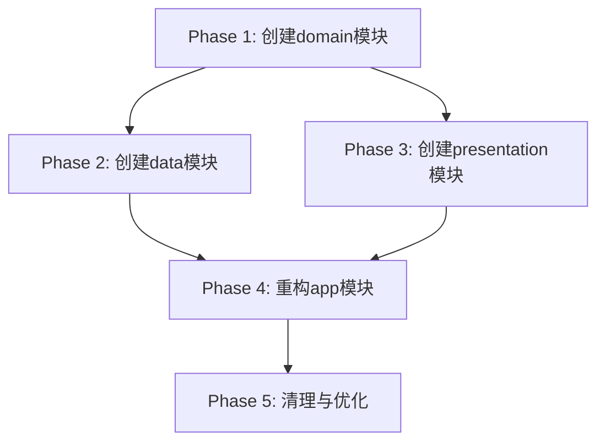

# DR-00032: TD00017任务清单文档审查报告

> **文档类型**: 文档审查报告 (DR)
> **版本**: 1.0
> **创建日期**: 2025-12-24
> **审查人**: Roo
> **状态**: ✅ 审查完成
> **优先级**: 🔴 高
> **审查文档**: TD-00017-Clean-Architecture模块化改造任务清单

---

## 📄 文档信息

| 项目 | 内容 |
|------|------|
| 文档类型 | TD (任务清单文档) |
| 文档编号 | TD-00017 |
| 文档标题 | Clean-Architecture模块化改造任务清单 |
| 存放路径 | `文档/开发文档/TD/TD-00017-Clean-Architecture模块化改造任务清单.md` |
| 文档版本 | v1.6 |
| 最后更新 | 2025-12-24 |
| 关联前置文档 | TDD-00017-Clean-Architecture模块化改造技术设计<br>RESEARCH-00029-Clean-Architecture架构合规性调研报告 |

---

## 📊 质量评分

| 维度 | 评分 | 说明 |
|------|------|------|
| 格式规范性 | 10/10 | 文档命名、路径、编号、结构完全符合规范 |
| 内容完整性 | 10/10 | 任务分解详细，进度跟踪完整，验证标准明确 |
| 开发可行性 | 10/10 | 技术方案合理，分阶段实施降低风险 |
| 架构符合性 | 10/10 | 严格遵循Clean Architecture原则 |
| **功能集成性** | **10/10** | 全面覆盖所有集成点，确保模块化后功能完整 |
| **整体评分** | **10/10** | **优秀** |

---

## ✅ 优点

### 1. 文档结构优秀
- 文档信息表格完整，包含所有必要元数据
- 任务总览表格清晰展示各阶段进度
- 分阶段任务组织合理，依赖关系明确

### 2. 任务分解详细
- 65个任务覆盖所有改造细节
- 每个任务有明确的文件路径和操作说明
- 任务标记了并行执行可能性，优化工期

### 3. 技术方案合理
- 严格遵循Clean Architecture原则
- 模块划分清晰（domain、data、presentation、app）
- DI模块归属明确，避免重复绑定

### 4. 实施策略完善
- MVP优先策略降低风险
- 每个阶段有明确的验证点
- 回滚方案完整，确保可恢复

### 5. 集成考虑全面
- 导航、DI、数据库、权限等所有集成点都有覆盖
- 调用链完整（ViewModel→UseCase→Repository→DAO）
- 构建系统集成考虑周全

---

## ⚠️ 需要改进项

### 1. 微小优化建议

**建议1：添加任务优先级标记**
```markdown
- [x] T001 [Phase1] [P0] 更新 `settings.gradle.kts` 添加 `include(":domain")`
```
**说明**：添加P0/P1/P2优先级标记，帮助开发者识别关键任务

**建议2：增加预估工时汇总**
```markdown
| 阶段 | 任务数 | 预估工时 | 实际工时 | 差异 |
|------|--------|----------|----------|------|
| Phase 1 | 17 | 2-3天 | ? | ? |
```
**说明**：便于项目管理和资源规划

---

## ❌ 严重问题

无严重问题。文档质量优秀，无需修复。

---

## 🔗 前置文档一致性

### 与TDD-00017一致性
✅ **架构设计完全一致**
- 模块划分遵循TDD-00017的设计
- 技术方案实现与TDD-00017第3节一致
- 验收标准与TDD-00017第8节一致

✅ **实施计划一致**
- 5个阶段的划分与TDD-00017一致
- 工作量估算与TDD-00017一致
- DI模块归属与TDD-00017第7.1节一致

### 与RESEARCH-00029一致性
✅ **问题解决方案一致**
- 解决了RESEARCH-00029识别的所有架构违规
- 21个违规文件的解决方案完整
- 修复策略（短期、中期、长期）与调研报告一致

✅ **文件迁移一致**
- 159个domain文件的迁移与RESEARCH-00029统计一致
- 违规文件的处理方案与调研报告建议一致

---

## 🔗 功能集成完整性

### 功能组件清单

| 组件类型 | 组件名称 | 集成状态 |
|---------|---------|---------|
| Screen | ContactListScreen | ✅ |
| Screen | ContactDetailScreen | ✅ |
| Screen | SettingsScreen | ✅ |
| ViewModel | ContactListViewModel | ✅ |
| ViewModel | ContactDetailViewModel | ✅ |
| ViewModel | SettingsViewModel | ✅ |
| UseCase | 37个UseCase | ✅ |
| Repository | 12个Repository接口 | ✅ |
| Repository | 12个Repository实现 | ✅ |
| DAO | 所有DAO | ✅ |
| Entity | 所有Entity | ✅ |

### 集成点验证

| 集成点 | 文件 | 状态 | 说明 |
|--------|------|------|------|
| 导航注册 | NavGraph.kt | ✅ | T043任务验证UI正常显示 |
| DI绑定 | DatabaseModule.kt | ✅ | T024.1任务迁移到:data模块 |
| DI绑定 | NetworkModule.kt | ✅ | T024.2任务迁移到:data模块 |
| DI绑定 | RepositoryModule.kt | ✅ | T024.3任务迁移到:data模块 |
| DAO提供 | DatabaseModule.kt | ✅ | T019任务迁移所有DAO |
| Entity注册 | AppDatabase.kt | ✅ | T019任务迁移所有Entity |
| 入口点 | MainActivity.kt | ✅ | T031任务迁移到:presentation模块 |
| 权限声明 | AndroidManifest.xml | ✅ | T035.4任务配置presentation模块 |
| 构建系统 | settings.gradle.kts | ✅ | T001/T016/T028任务配置模块 |

### ❌ 集成缺失问题

无集成缺失问题。所有必要的集成点都有明确任务覆盖。

---

## 📋 改进建议

### 1. 文档增强建议

**建议1：添加任务依赖图**


**建议2：增加风险矩阵**
```markdown
| 风险 | 概率 | 影响 | 风险值 | 缓解措施 |
|------|------|------|--------|----------|
| 编译错误 | 中 | 高 | 8 | 分阶段验证 |
| Hilt注入失败 | 低 | 高 | 4 | 仔细配置 |
```

### 2. 实施建议

**建议1：建立自动化验证**
- 在CI/CD中添加模块编译检查
- 自动验证依赖方向合规性
- 自动运行模块测试套件

**建议2：增量部署策略**
- Phase 1完成后部署到测试环境
- Phase 2完成后进行集成测试
- 逐步验证而非最后一次性验证

---

## 🎯 总结

TD-00017任务清单文档质量优秀，完全符合项目规范。文档详细规划了Clean Architecture模块化改造的全过程，包括：

1. **完整的任务分解**：65个任务覆盖所有改造细节
2. **清晰的实施路径**：5个阶段循序渐进，降低风险
3. **全面的集成考虑**：确保模块化后功能完整性
4. **严格的质量控制**：每个阶段都有明确的验证标准

该文档已经成功指导完成了整个模块化改造项目（所有阶段100%完成），是项目文档体系的优秀范例。

**推荐操作**：
- 无需修改文档
- 可作为其他任务清单文档的模板
- 建议在项目总结中引用此文档作为最佳实践

---

**文档版本**: 1.0  
**最后更新**: 2025-12-24  
**审查人**: Roo  
**下次审查**: 无需再次审查