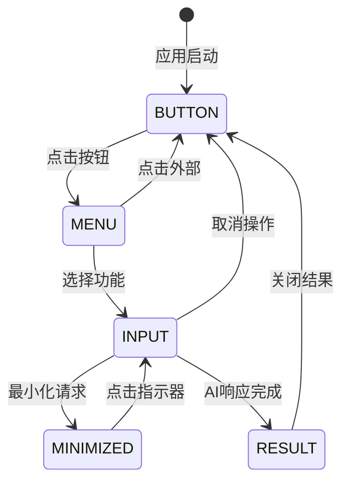

# FD-00001-悬浮窗功能设计

## 1. 文档信息

| 项目 | 内容 |
|------|------|
| 文档类型 | FD (Functional Document) |
| 文档编号 | FD-00001 |
| 功能名称 | 悬浮窗功能 |
| 版本 | 1.0 |
| 创建日期 | 2025-12-12 |
| 作者 | Roo |
| 审核人 | 待定 |

## 2. 功能概述

### 2.1 功能定位
悬浮窗功能是共情AI助手的核心交互入口，通过系统级悬浮窗提供随时可用的AI服务，支持用户在任何应用界面快速访问AI分析和安全检查功能。

### 2.2 设计原则
- **简洁优先**: 最小化视觉干扰，专注核心功能
- **操作便捷**: 减少操作步骤，提升使用效率
- **状态清晰**: 明确的视觉反馈和状态指示
- **响应迅速**: 即时的交互反馈和流畅的动画
- **适配灵活**: 适应不同使用场景和设备环境

## 3. 功能详细设计

### 3.1 悬浮按钮设计

#### 3.1.1 视觉设计
```
尺寸: 56dp 直径
颜色: 主色调 #1976D2
图标: 24dp 白色AI助手图标
阴影: 6dp elevation
圆角: 完全圆形 (28dp radius)
```

#### 3.1.2 交互设计
- **点击**: 展开功能菜单，150ms淡入动画
- **长按**: 显示功能说明tooltip，300ms延迟
- **拖动**: 即时跟随手指移动，16ms响应间隔
- **释放**: 保存当前位置，触觉反馈

#### 3.1.3 状态设计
- **默认状态**: 正常显示，半透明背景
- **悬停状态**: 轻微放大(1.05x)，增强阴影
- **按下状态**: 缩小(0.95x)，加深阴影
- **拖动状态**: 保持大小，增强阴影效果

### 3.2 功能菜单设计

#### 3.2.1 布局结构
```
┌─────────────────┐
│  💡 帮我分析  │
├─────────────────┤
│  🛡️ 帮我检查  │
└─────────────────┘
```

#### 3.2.2 视觉规格
- **宽度**: 最小160dp，最大280dp
- **高度**: 包装内容，最小112dp
- **背景**: 白色 (#FFFFFF)
- **圆角**: 16dp
- **间距**: 16dp内边距，8dp按钮间距
- **阴影**: 8dp elevation

#### 3.2.3 交互设计
- **展开**: 从按钮位置展开，200ms缩放动画
- **选择**: 按钮按下反馈，100ms响应时间
- **关闭**: 点击外部区域或ESC键，150ms收起动画
- **键盘**: 支持上下键导航，Enter确认

### 3.3 输入对话框设计

#### 3.3.1 整体布局
```
┌─────────────────────────┐
│  💭 标题区域          │
├─────────────────────────┤
│  👤 联系人选择器       │
├─────────────────────────┤
│  📝 文本输入区域        │
│  0/5000 字符计数      │
├─────────────────────────┤
│  [取消] [最小化] [确认] │
└─────────────────────────┘
```

#### 3.3.2 组件设计

**标题区域**:
- **高度**: 56dp
- **背景**: 主色调 #1976D2
- **文字**: 白色，16sp，Medium字重
- **图标**: 24dp，左侧对齐

**联系人选择器**:
- **高度**: 48dp
- **样式**: Material Design outlined spinner
- **提示文字**: "选择联系人"
- **选项**: 显示联系人头像和名称

**文本输入区域**:
- **高度**: 最小120dp，最大240dp
- **样式**: Material Design outlined text field
- **提示**: "请输入聊天内容..."
- **字符限制**: 5000字符

**字符计数**:
- **位置**: 输入框右下角
- **颜色**: 正常状态 #757575，超限 #F44336
- **格式**: "当前/最大" (如 "123/5000")

**操作按钮区域**:
- **高度**: 48dp
- **布局**: 水平分布，16dp间距
- **按钮样式**: Material Design outlined按钮
- **按钮规格**: 88dp宽度，36dp高度

#### 3.3.3 交互设计

**输入流程**:
1. 对话框显示时自动聚焦输入框
2. 延迟100ms显示软键盘
3. 输入时实时更新字符计数
4. 超限时计数变红，禁用确认按钮

**按钮交互**:
- **确认**: 验证输入，执行AI请求
- **取消**: 关闭对话框，清除输入内容
- **最小化**: 保存状态，显示指示器

### 3.4 最小化指示器设计

#### 3.4.1 视觉设计
```
尺寸: 56dp 直径 (与悬浮按钮一致)
颜色: 
  - 加载: #1976D2
  - 成功: #4CAF50
  - 错误: #F44336
图标: 24dp 白色状态图标
动画: 300ms 状态切换动画
```

#### 3.4.2 状态设计

**加载状态**:
- **外观**: 蓝色背景，旋转进度条
- **动画**: 进度条持续旋转
- **点击**: 显示"处理中，请稍候"提示

**成功状态**:
- **外观**: 绿色背景，对勾图标
- **动画**: 淡入效果，200ms
- **点击**: 恢复对话框，显示结果

**错误状态**:
- **外观**: 红色背景，警告图标
- **动画**: 淡入效果，200ms
- **点击**: 显示错误详情，提供重试选项

#### 3.4.3 交互设计
- **最小化**: 对话框缩小动画，300ms
- **恢复**: 指示器放大动画，300ms
- **拖动**: 支持指示器位置调整
- **通知**: 完成后发送系统通知

### 3.5 结果展示设计

#### 3.5.1 分析结果布局
```
┌─────────────────────────┐
│  💭 AI 分析结果        │
├─────────────────────────┤
│  【风险等级】           │
│  低风险                │
├─────────────────────────┤
│  【军师分析】           │
│  对方情绪稳定，可以...   │
├─────────────────────────┤
│  【建议回复】           │
│  建议采用温和的语气...   │
├─────────────────────────┤
│  [复制] [关闭]         │
└─────────────────────────┘
```

#### 3.5.2 检查结果布局
```
┌─────────────────────────┐
│  ✅ 检查通过           │
├─────────────────────────┤
│  未发现风险内容         │
├─────────────────────────┤
│  【建议】              │
│  内容安全，可以发送      │
├─────────────────────────┤
│  [关闭]               │
└─────────────────────────┘
```

#### 3.5.3 结果交互
- **复制**: 一键复制建议内容到剪贴板
- **关闭**: 关闭对话框，返回悬浮按钮
- **滚动**: 支持长内容的滚动查看
- **分享**: 支持结果内容分享到其他应用

## 4. 状态管理设计

### 4.1 状态流转图


### 4.2 状态定义

**BUTTON状态**:
- 显示悬浮按钮
- 隐藏菜单和对话框
- 响应按钮点击和拖动

**MENU状态**:
- 显示功能菜单
- 隐藏悬浮按钮
- 响应菜单选择和外部点击

**INPUT状态**:
- 显示输入对话框
- 隐藏其他UI元素
- 响应用户输入和操作

**MINIMIZED状态**:
- 显示最小化指示器
- 隐藏输入对话框
- 响应指示器点击和状态更新

**RESULT状态**:
- 显示AI处理结果
- 隐藏输入控件
- 响应结果操作

## 5. 异常处理设计

### 5.1 权限异常处理

**检测流程**:
1. 启动时检查悬浮窗权限
2. 权限不足时显示引导对话框
3. 提供跳转到系统设置的选项
4. 权限获取后自动启动悬浮窗

**引导设计**:
```
┌─────────────────────────┐
│  ⚠️ 需要悬浮窗权限    │
│                      │
│  为了在其他应用上显示AI助手 │
│  需要开启悬浮窗权限      │
│                      │
│  [取消] [去设置]       │
└─────────────────────────┘
```

### 5.2 网络异常处理

**异常检测**:
- API请求超时(>10秒)
- 网络连接失败
- 服务器响应错误

**处理策略**:
- 显示友好的错误提示
- 提供重试选项
- 保存用户输入内容
- 支持离线模式提示

### 5.3 系统兼容性处理

**兼容性检测**:
- Android版本适配(API 24+)
- 厂商ROM特殊处理
- 屏幕尺寸适配
- 系统主题变化监听

**降级策略**:
- 提供简化的UI方案
- 功能降级而非完全不可用
- 清晰的功能限制说明

## 6. 性能设计

### 6.1 响应性能
- **触摸响应**: <100ms检测，<300ms处理
- **动画帧率**: 目标60FPS，最低55FPS
- **状态切换**: <200ms完成状态转换
- **内存占用**: 峰值<5MB，平均<3MB

### 6.2 资源管理
- **视图复用**: 对话框组件复用机制
- **资源释放**: 最小化时及时释放UI资源
- **内存监控**: 实时监控内存使用情况
- **垃圾回收**: 适时的GC触发机制

### 6.3 电池优化
- **后台运行**: 使用前台服务减少被杀死
- **CPU使用**: 空闲时降低CPU使用率
- **网络请求**: 合并请求减少唤醒次数
- **硬件加速**: 启用GPU加速减少CPU负载

## 7. 可访问性设计

### 7.1 内容描述
- **悬浮按钮**: "AI助手悬浮按钮，点击显示功能菜单"
- **分析按钮**: "分析聊天内容，点击打开输入对话框"
- **检查按钮**: "检查内容安全，点击打开输入对话框"
- **最小化按钮**: "最小化对话框，AI处理完成后可点击恢复"

### 7.2 键盘导航
- **Tab顺序**: 按逻辑顺序导航所有可操作元素
- **方向键**: 支持上下左右键导航
- **焦点指示**: 2dp描边，主色调
- **快捷键**: Enter确认，Esc取消

### 7.3 辅助功能
- **TalkBack**: 完整的语音描述支持
- **字体缩放**: 支持系统字体大小设置
- **高对比度**: 适配系统高对比度模式
- **颜色盲**: 不仅依赖颜色传达信息

## 8. 主题设计

### 8.1 浅色主题
```xml
<color name="floating_primary">#1976D2</color>
<color name="floating_background">#FFFFFF</color>
<color name="text_primary">#212121</color>
<color name="text_secondary">#757575</color>
<color name="surface">#FFFFFF</color>
<color name="error">#F44336</color>
<color name="success">#4CAF50</color>
```

### 8.2 深色主题
```xml
<color name="floating_primary">#90CAF9</color>
<color name="floating_background">#121212</color>
<color name="text_primary">#FFFFFF</color>
<color name="text_secondary">#B3B3B3</color>
<color name="surface">#121212</color>
<color name="error">#CF6679</color>
<color name="success">#81C784</color>
```

### 8.3 主题切换
- **自动切换**: 跟随系统主题设置
- **手动切换**: 应用内主题选择器
- **动画过渡**: 300ms颜色过渡动画
- **状态保存**: 保存用户主题偏好