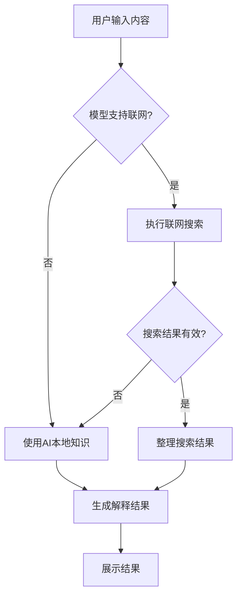
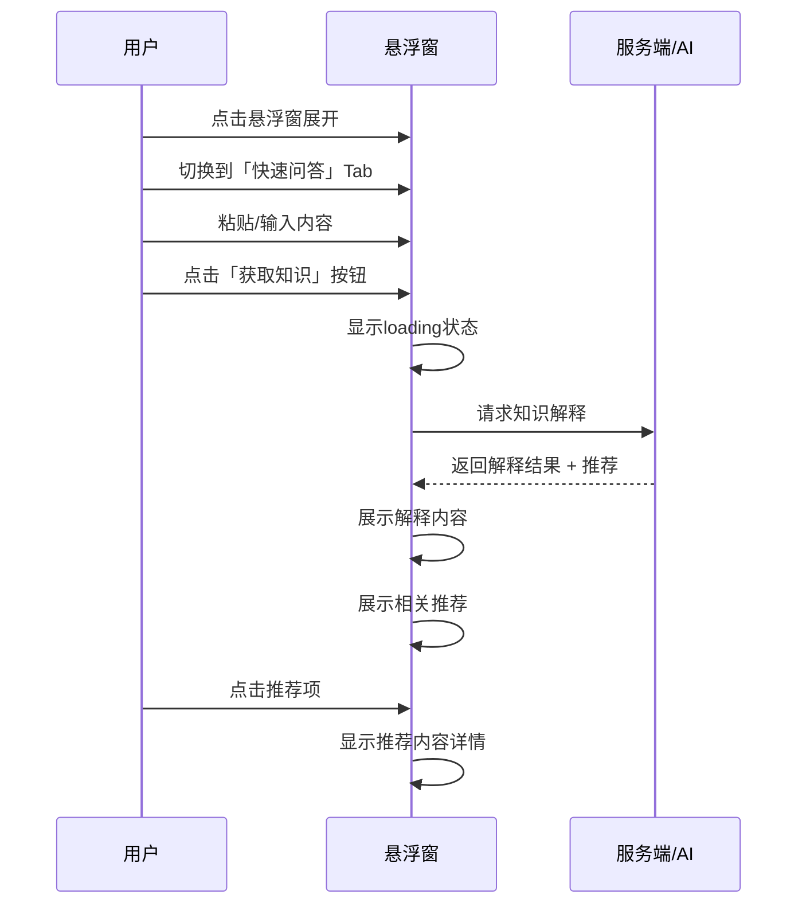
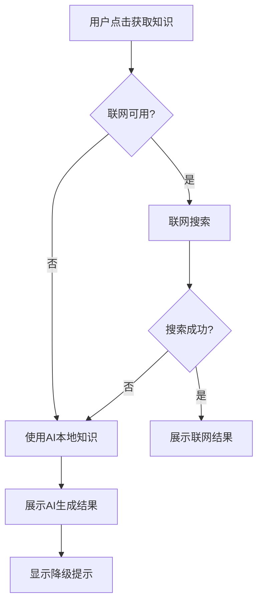

# PRD-00031: 悬浮窗快速知识回答功能需求

> **文档类型**: 产品需求文档 (PRD)
> **版本**: 1.0
> **文档编号**: PRD-00031
> **功能名称**: 悬浮窗快速知识回答功能
> **创建日期**: 2026-01-07
> **作者**: 产品团队
> **状态**: ✅ 已定稿
> **优先级**: 🔴 P1（高）

---

## 1. 需求概述

### 1.1 需求背景

在日常社交沟通中，用户经常会遇到联系人提及的领域知识、术语或话题是自己不熟悉的。传统的解决方案需要用户切换到搜索引擎或知识应用进行查询，这不仅打断对话节奏，还可能导致信息获取不及时、答案不够精准等问题。

本功能旨在为用户提供一个快速、准确的知识获取入口，帮助用户在对话过程中即时理解陌生概念、术语或话题，从而提升沟通效率和用户体验。

### 1.2 核心价值

- **提升沟通效率**：无需切换应用即可获取知识
- **确保信息准确**：联网获取权威信息，AI兜底保证可用性
- **降低认知负担**：快速理解陌生领域内容
- **增强对话体验**：持续沉浸式交流不被打断

### 1.3 目标用户

所有使用本应用进行社交沟通的用户，特别是：
- 跨领域沟通频繁的用户
- 经常接触新概念、新术语的用户
- 重视沟通效率和准确性的用户

---

## 2. 功能范围

### 2.1 包含功能

| 序号 | 功能模块 | 功能描述 | 优先级 |
|------|----------|----------|--------|
| F-031-01 | 悬浮窗Tab入口 | 在悬浮窗中新增第4个Tab作为"快速回答"入口 | P0 |
| F-031-02 | 内容输入 | 支持用户粘贴/输入需要查询的内容 | P0 |
| F-031-03 | 知识获取 | 联网优先获取知识，AI本地知识兜底 | P0 |
| F-031-04 | 解释展示 | 在悬浮窗内展示准确的知识解释 | P0 |
| F-031-05 | 相关推荐 | 推荐相关的知识话题或延伸阅读 | P1 |

### 2.2 不包含功能

- 自动识别对话内容并主动推送（需要用户主动触发）
- 复杂的多轮对话交互
- 知识库编辑或管理功能

---

## 3. 功能详细设计

### 3.1 悬浮窗Tab入口（F-031-01）

#### 3.1.1 UI设计

**位置**：悬浮窗底部Tab栏新增第4个Tab

**Tab名称**：「快速问答」或「知识速查」

**图标设计**：使用灯泡、问号或书籍类图标，表示知识获取

**交互状态**：
- 未选中态：灰色图标 + 灰色文字
- 选中态：品牌色图标 + 品牌色文字 + 下划线指示器

#### 3.1.2 复用现有设计

复用悬浮窗现有的Tab栏设计，包括：
- Tab切换动画
- 字体样式（参考PRD-00009）
- 间距规范（参考PRD-00018）
- 色彩规范（参考PRD-00019）

### 3.2 内容输入（F-031-02）

#### 3.2.1 输入区域

**设计**：
- 多行文本输入框，支持粘贴和手动输入
- 占位提示文字：「粘贴或输入想要了解的内容...」
- 最大输入长度限制：500字符（可配置）

**交互**：
- 支持复制粘贴操作
- 文本超出显示区域时自动滚动
- 支持清空按钮快速重置

#### 3.2.2 触发按钮

**设计**：
- 主按钮：「获取知识」或「解释」
- 位置：输入框右侧或下方
- 样式：品牌色填充按钮，圆角设计

**状态**：
- 默认态：可点击
- 输入为空：禁用
- 查询中：loading状态 + 禁用
- 完成态：可再次点击重新查询

### 3.3 知识获取（F-031-03）

#### 3.3.1 获取策略

**优先级顺序**：
1. **联网搜索优先**：当模型支持联网功能时，使用联网搜索获取最新、最准确的信息
2. **AI本地知识兜底**：当联网不可用时，使用AI模型的本地知识生成解释

#### 3.3.2 处理逻辑



#### 3.3.3 质量保证

- **准确性优先**：确保信息来源可靠
- **模糊兜底**：联网失败时，AI生成的解释需要明确标注为"基于AI理解，可能存在偏差"
- **时效性**：联网获取的信息需要标注来源和时间

### 3.4 解释展示（F-031-04）

#### 3.4.1 展示区域

**设计**：
- 卡片式布局，与悬浮窗风格一致
- 支持Markdown渲染（如粗体、列表、代码块等）
- 最大高度限制，超出可滚动

#### 3.4.2 内容结构

```
┌─────────────────────────────────────┐
│ 📖 解释标题（可选，自动提取或生成）  │
├─────────────────────────────────────┤
│                                     │
│     解释正文内容（Markdown格式）     │
│                                     │
├─────────────────────────────────────┤
│ 📅 来源/时间（联网获取时显示）       │
└─────────────────────────────────────┘
```

#### 3.4.3 错误处理

- **无结果**：显示友好提示「未找到相关信息，请尝试其他关键词」
- **联网失败**：显示提示「联网获取失败，已使用AI知识回答」+ 解释内容
- **格式错误**：显示「内容解析异常，请重新尝试」

### 3.5 相关推荐（F-031-05）

#### 3.5.1 推荐逻辑

基于用户查询的内容，推荐：
- 相关概念/术语
- 延伸阅读话题
- 实用资源链接

**数量限制**：3-5条推荐内容

#### 3.5.2 推荐展示

**设计**：
- 垂直列表展示
- 每条推荐包含：简短标题 + 简短描述
- 点击跳转到对应解释或联网搜索

---

## 4. 用户交互流程

### 4.1 完整交互流程



### 4.2 异常流程

#### 4.2.1 联网失败降级



#### 4.2.2 无结果处理

当查询内容无法获取有效结果时：
- 显示友好提示
- 建议用户调整关键词或尝试更具体的描述

---

## 5. 界面原型

### 5.1 快速问答Tab布局

```
┌─────────────────────────────────────────┐
│  💡 快速问答                              │
├─────────────────────────────────────────┤
│ ┌─────────────────────────────────────┐ │
│ │ 粘贴或输入想要了解的内容...           │ │
│ │ [500字符限制]                        │ │
│ └─────────────────────────────────────┤ │
│                                         │
│              [ 📥 获取知识 ]             │
│                                         │
├─────────────────────────────────────────┤
│ 📖 解释标题（可选）                       │
│ ━━━━━━━━━━━━━━━━━━━━━━━━━━━━━━━━━━━━━  │
│                                         │
│   这是内容的详细解释，支持Markdown格式，  │
│   可以包含粗体、列表、代码块等格式。      │
│                                         │
│   · 关键点1                             │
│   · 关键点2                             │
│   · 关键点3                             │
│                                         │
│ 📅 来源：Wikipedia • 2026-01-07         │
├─────────────────────────────────────────┤
│ 💡 相关推荐                              │
│ ━━━━━━━━━━━━━━━━━━━━━━━━━━━━━━━━━━━━━  │
│ • 推荐话题1                              │
│ • 推荐话题2                              │
│ • 推荐话题3                              │
└─────────────────────────────────────────┘
```

---

## 6. 技术要求

### 6.1 数据模型

#### 6.1.1 知识查询请求

```kotlin
data class KnowledgeQueryRequest(
    val content: String,           // 用户输入内容
    val maxLength: Int = 500,      // 最大长度限制
    val enableNetwork: Boolean = true,  // 是否启用联网
    val timestamp: Long = System.currentTimeMillis()
)
```

#### 6.1.2 知识查询响应

```kotlin
data class KnowledgeQueryResponse(
    val title: String?,            // 解释标题
    val content: String,           // 解释内容（Markdown格式）
    val source: String?,           // 信息来源
    val sourceTime: String?,       // 信息时间
    val isFromNetwork: Boolean,    // 是否来自联网
    val recommendations: List<Recommendation>  // 相关推荐
)

data class Recommendation(
    val id: String,
    val title: String,
    val description: String?,
    val query: String  // 用于重新查询
)
```

### 6.2 API设计

#### 6.2.1 知识查询接口

```
POST /api/v1/knowledge/query
Content-Type: application/json

{
    "content": "用户输入的内容",
    "enable_network": true
}
```

#### 6.2.2 响应格式

```json
{
    "code": 200,
    "message": "success",
    "data": {
        "title": "人工智能",
        "content": "## 人工智能介绍\n\n人工智能（AI）是...",
        "source": "Wikipedia",
        "source_time": "2026-01-07",
        "is_from_network": true,
        "recommendations": [
            {
                "id": "rec_1",
                "title": "机器学习",
                "description": "AI的子领域",
                "query": "机器学习"
            }
        ]
    }
}
```

### 6.3 性能要求

| 指标 | 要求 |
|------|------|
| 响应时间 | ≤ 3秒（联网），≤ 2秒（AI本地） |
| 成功率 | ≥ 95% |
| 并发支持 | ≥ 10 QPS |

### 6.4 兼容性要求

- **最低Android版本**: API 24
- **依赖项**: 复用现有悬浮窗模块（PRD-00009）

---

## 7. 验收标准

### 7.1 功能验收标准

| 验收项 | 标准 | 优先级 |
|--------|------|--------|
| Tab入口 | 悬浮窗底部正确显示第4个Tab，切换正常 | P0 |
| 内容输入 | 支持粘贴和输入，字符限制生效 | P0 |
| 触发按钮 | 按钮状态正确（启用/禁用/loading） | P0 |
| 知识获取 | 联网优先，AI兜底逻辑正确 | P0 |
| 解释展示 | Markdown正确渲染，显示完整 | P0 |
| 联网降级 | 联网失败时正确降级到AI | P0 |
| 相关推荐 | 推荐内容相关且可点击 | P1 |
| 错误处理 | 各种异常情况有友好提示 | P0 |

### 7.2 UI验收标准

| 验收项 | 标准 |
|--------|------|
| Tab样式 | 与现有Tab风格一致 |
| 卡片样式 | 与悬浮窗卡片风格一致 |
| 色彩规范 | 严格使用iOS系统色（PRD-00019） |
| 间距规范 | 符合PRD-00018间距系统 |
| 响应式适配 | 适配不同屏幕尺寸 |

### 7.3 性能验收标准

| 验收项 | 标准 |
|--------|------|
| 响应时间 | 联网≤3秒，本地≤2秒 |
| 内存占用 | 无内存泄漏 |
| ANR | 主线程无阻塞操作 |

---

## 8. 关联文档

### 8.1 前置文档

| 文档编号 | 文档名称 | 说明 |
|----------|----------|------|
| PRD-00009 | 悬浮窗功能重构需求 | 悬浮窗基础架构 |
| PRD-00018 | UI/UX系统化改进需求 | 间距、动画系统 |
| PRD-00019 | UI视觉美观化改造 | 色彩、主题规范 |

### 8.2 关联文档

| 文档类型 | 文档编号 | 说明 |
|----------|----------|------|
| 功能设计 | FD-00031 | 功能设计文档（待创建） |
| 技术设计 | TDD-00031 | 技术设计文档（待创建） |
| 任务清单 | TD-00031 | 任务清单（待创建） |

---

## 9. 版本规划

### 9.1 MVP版本（v1.0）

包含所有P0功能：
- Tab入口
- 内容输入
- 知识获取（联网优先 + AI兜底）
- 解释展示
- 错误处理

### 9.2 后续版本（v1.1+）

可能的增强功能：
- 语音输入支持
- 历史查询记录
- 收藏功能
- 分享功能

---

## 10. 风险与缓解

### 10.1 风险识别

| 风险 | 影响 | 可能性 |
|------|------|--------|
| 联网API不稳定 | 用户体验下降 | 中 |
| AI生成内容不准确 | 信息误导 | 中 |
| 性能不达标 | 用户流失 | 低 |

### 10.2 缓解措施

| 风险 | 缓解措施 |
|------|----------|
| 联网API不稳定 | 完善的降级策略 + 重试机制 |
| AI生成内容不准确 | 明确标注来源 + 提供多版本对比 |
| 性能不达标 | 前端loading优化 + 请求取消机制 |

---

## 11. 术语表

| 术语 | 说明 |
|------|------|
| 悬浮窗 | 应用内的可展开/收起的功能面板 |
| 联网搜索 | 调用搜索引擎获取实时信息 |
| AI本地知识 | 使用AI模型的预训练知识生成回答 |
| Markdown | 轻量级标记语言，用于格式化文本 |

---

## 12. 评审记录

| 版本 | 日期 | 评审人 | 变更说明 |
|------|------|--------|----------|
| 1.0 | 2026-01-07 | 产品团队 | 初始版本 |

---

**文档版本**: 1.0
**最后更新**: 2026-01-07
**维护团队**: 产品团队
