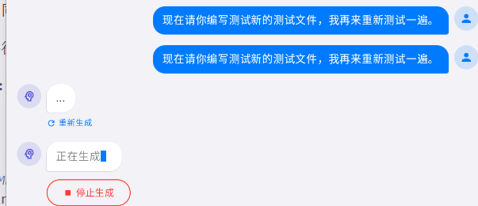
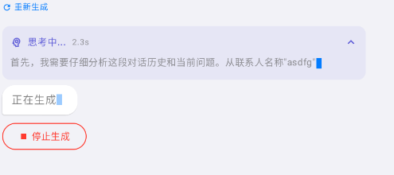
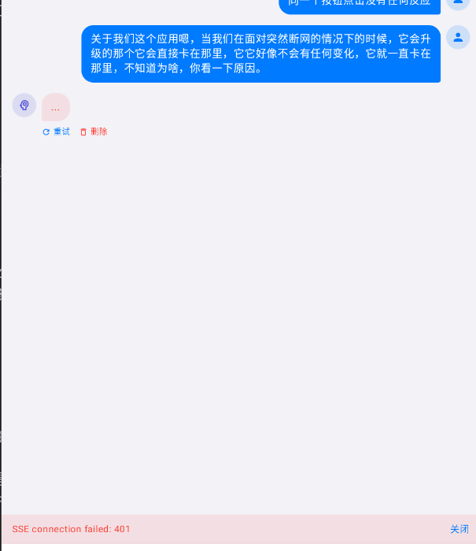

1 输出内容的格式问题,会携带大量的md的格式,而会携带大量的MD格式，它不会渲染出来，它会把那些格式字符也表现出来。

第二个问题就是说你可以看到他的思考过程和他在回复的时候不断输出文字的时候，你是可以看到的。但是它等它回复结束，你整个UI就刷新了一下，然后它就会只有三个省略号在那里。然后下面一个重新生成，你点击重新生成过后，它没有反应。当然你也可以停止重新生成。所以说这可能是我们的这个最后的结果展示上存在问题。

并且还有问题就是说呃你在输入的时候，它会自动的弹出三个省略号来表示重新生成，不知道为什么是不是我们的UI出码逻辑存在问题，会自动的弹出3个省略号是重新生成，。

并且我还发现在我们已经创建的对话里面，重新输入它不会有反应。不知道为什么就是说我们提问的它不会有思考，不会有反应，就一直卡在正在生成这个步骤当中。

并且我们在实际测试的时候，还有一个比较大的问题，就是说当我们的AI输出内容比较多的时候，你通过滚轮往下拉的时候，它会自动跳到最上面，这也是一个很严重的问题。你检查一下为什么。

然后还有我们的这个重试功能，我们这个重试功能按下了会没有反应，不知道有没有就是说没有反应，好吧，请你检查一下，就是说点击那个蓝色重试按钮，它没有任何反应。并且还有一个比较严重的问题，就是说当我们终止了AI的维度过后，好像又固定刷新了一条信息，然后是三个省略号，这个明显肯定不可以啊。正常的应该来说要么就终止到一万，要么就像机名来那样显示用户已经停止输入，反正肯定不是三个省略号。好吧。那这个问题你也注意一下。

关于我们这个应用嗯，当我们在面对突然断网的情况下的时候，它会升级的那个它会直接卡在那里，它它好像不会有任何变化，它就一直卡在那里，不知道为啥，你看一下原因。

这是appi错误的结果.

呃，不正常，就是说我们还有一个问题，就是说绘画切换的时候，你如果说在一个画画里面发送了一个呃一个请求的话，你会后面你再发送在切换绘画的时候，那个请求的那个发送请求用同样的迁移了过来。