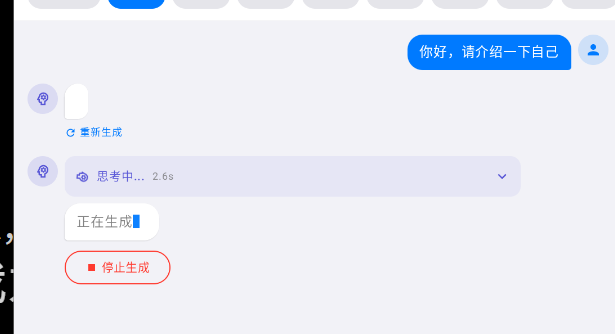
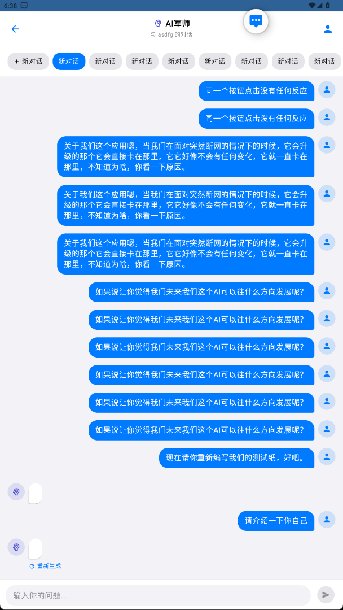

现在来回访我们的一个问题吧，就是说当我们的AI的恢复恢复完了之后，我们就会直接的跳转。不知道为什么就是说就是说他会直接的跳转到我们之前的一个第一个第一个对话当中，然后会去找那个对话AI的恢复已经消失了。不知道为什么。
|

并且第二个最严重的问题是我们的对话内容还会消失。我们在重新生成的时候会有两个AI的对话框。第一个对话框现在是没有识别好的，但是还是有个框在那儿。不知道为什么，请你结合我们的图片来看看，好吧。ss

现在我发现了，如果说我们发送了信息，它就会自动的调回我们第一个规划里面的，并且会保留一个白色的框在哪里，不知道为什么，你检查一下这个消息显示的UI逻辑吧。我怀疑是整个逻辑出了问题。
