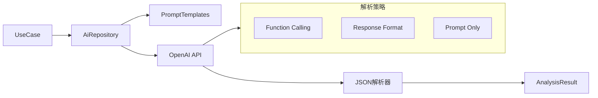

# 当前提示词实现分析

## 1. 现有实现概述

当前项目中提示词主要硬编码在以下两个文件中：
- [`PromptTemplates.kt`](app/src/main/java/com/empathy/ai/domain/util/PromptTemplates.kt) - 提示词模板常量
- [`AiRepositoryImpl.kt`](app/src/main/java/com/empathy/ai/data/repository/AiRepositoryImpl.kt) - AI服务仓库实现

## 2. 提示词使用场景

### 2.1 聊天分析 (Chat Analysis)
- **位置**: [`AiRepositoryImpl.analyzeChat()`](app/src/main/java/com/empathy/ai/data/repository/AiRepositoryImpl.kt:326)
- **系统指令**: [`SYSTEM_ANALYZE`](app/src/main/java/com/empathy/ai/data/repository/AiRepositoryImpl.kt:124)
- **JSON Schema**: 固定格式包含 `replySuggestion`, `strategyAnalysis`, `riskLevel`
- **适配策略**: Function Calling / Response Format / Prompt Only

### 2.2 安全检查 (Safety Check)
- **位置**: [`AiRepositoryImpl.checkDraftSafety()`](app/src/main/java/com/empathy/ai/data/repository/AiRepositoryImpl.kt:478)
- **系统指令**: [`SYSTEM_CHECK`](app/src/main/java/com/empathy/ai/data/repository/AiRepositoryImpl.kt:152)
- **JSON Schema**: 固定格式包含 `isSafe`, `triggeredRisks`, `suggestion`
- **用途**: 检查用户输入草稿是否触发风险规则

### 2.3 信息提取 (Info Extraction)
- **位置**: [`AiRepositoryImpl.extractTextInfo()`](app/src/main/java/com/empathy/ai/data/repository/AiRepositoryImpl.kt:588)
- **系统指令**: [`SYSTEM_EXTRACT`](app/src/main/java/com/empathy/ai/data/repository/AiRepositoryImpl.kt:176)
- **JSON Schema**: 固定格式包含 `facts`, `redTags`, `greenTags`
- **用途**: 从文本中提取关键信息

### 2.4 每日总结 (Daily Summary)
- **位置**: [`PromptTemplates.buildSummaryPrompt()`](app/src/main/java/com/empathy/ai/domain/util/PromptTemplates.kt:52)
- **系统指令**: [`SUMMARY_SYSTEM_INSTRUCTION`](app/src/main/java/com/empathy/ai/domain/util/PromptTemplates.kt:27)
- **JSON Schema**: [`SUMMARY_JSON_SCHEMA`](app/src/main/java/com/empathy/ai/domain/util/PromptTemplates.kt:13)
- **用途**: 生成每日互动总结

## 3. 当前实现特点

### 3.1 优点
1. **简单直接**: 硬编码方式实现简单，没有额外复杂性
2. **性能良好**: 无需数据库查询，直接使用常量
3. **类型安全**: 编译时确定，无运行时错误

### 3.2 缺点
1. **不可扩展**: 无法动态调整提示词内容
2. **维护困难**: 修改提示词需要重新编译发布
3. **缺乏个性化**: 无法根据用户需求定制
4. **版本管理缺失**: 无法追踪提示词变更历史
5. **A/B测试困难**: 无法测试不同提示词效果

## 4. AI服务商适配

当前已实现的服务商适配：
- **OpenAI**: 使用标准格式
- **DeepSeek**: 使用 `MODEL_DEEPSEEK` 模型标识
- **通用适配**: 通过 [`ProviderCompatibility`](app/src/main/java/com/empathy/ai/data/repository/AiRepositoryImpl.kt:351) 类处理

适配策略包括：
- **Function Calling**: 最可靠的结构化输出
- **Response Format**: 强制JSON格式
- **Prompt Only**: 仅使用提示词约束

## 5. JSON解析机制

当前实现了解析容错机制：
1. **EnhancedJsonCleaner**: 清洗AI返回的JSON
2. **字段映射**: 支持非标准字段名映射
3. **Fallback机制**: 解析失败时创建默认结果
4. **多级尝试**: Function Calling → 标准解析 → 字段映射 → Fallback

## 6. 集成点

提示词与现有系统的集成点：
- [`ContextBuilder.buildAnalysisPrompt()`](app/src/main/java/com/empathy/ai/domain/util/ContextBuilder.kt:101)
- [`AiSummaryProcessor`](app/src/main/java/com/empathy/ai/domain/util/AiSummaryProcessor.kt:34)
- [`AnalyzeChatUseCase`](app/src/main/java/com/empathy/ai/domain/usecase/AnalyzeChatUseCase.kt:196)
- [`CheckDraftUseCase`](app/src/main/java/com/empathy/ai/domain/usecase/CheckDraftUseCase.kt:22)

## 7. 当前数据流

## 8. 总结

当前提示词实现是一个基础但功能完整的解决方案，满足了基本的AI交互需求。主要限制在于缺乏灵活性和可管理性，这为引入提示词管理系统提供了明确的改进空间。

现有的硬编码实现可以作为新系统的默认值，确保向后兼容性和平滑迁移。