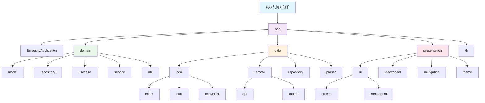

# 共情AI助手 (Empathy AI Assistant) - 项目文档

> 最后更新: 2025-12-21 21:16:54
> 文档版本: v1.0.0
> 维护者: hushaokang

## 📋 文档导航

本项目采用分层文档架构，根级文档提供全局视角，模块级文档深入技术细节。

### 根级文档
- [../../CLAUDE.md](../../CLAUDE.md) - 项目概览与全局规范

### 模块文档（按代码架构组织）
- [app](app/) - 应用入口与全局初始化
- [domain](domain/) - 业务领域层
  - [model](domain/model/) - 领域模型
  - [repository](domain/repository/) - 数据仓库接口
  - [usecase](domain/usecase/) - 业务用例
  - [service](domain/service/) - 领域服务
  - [util](domain/util/) - 领域工具类
- [data](data/) - 数据访问层
  - [local](data/local/) - 本地数据存储
  - [remote](data/remote/) - 远程数据访问
  - [repository](data/repository/) - 仓库实现
  - [parser](data/parser/) - 数据解析器
- [presentation](presentation/) - 表现层
  - [ui](presentation/ui/) - UI组件与界面
  - [viewmodel](presentation/viewmodel/) - MVVM架构的ViewModel
  - [navigation](presentation/navigation/) - 导航系统
  - [theme](presentation/theme/) - 主题配置
- [di](di/) - 依赖注入模块

## 🏗️ 项目架构总览



## 📊 项目统计

- **代码文件总数**: 444个
- **代码总行数**: 49,317行
  - 源代码: 22,583行 (319个文件)
  - 单元测试: 22,281行 (104个文件)
  - Android测试: 4,453行 (16个文件)
- **测试覆盖率**: 98.6%
- **技术栈**: Kotlin 2.0.21, Gradle 8.13, Compose BOM 2024.12.01, Hilt 2.52
- **架构模式**: Clean Architecture + MVVM
- **数据库版本**: Room v10 (完整迁移支持)

## 🚀 快速开始

### 环境要求
- JDK 17+
- Android Studio Arctic Fox+
- Gradle 8.13
- Kotlin 2.0.21
- 最低SDK: 24 (Android 7.0)
- 目标SDK: 35 (Android 15)

### 构建命令
```bash
# 编译Debug版本
./gradlew assembleDebug

# 编译Release版本
./gradlew assembleRelease

# 运行单元测试
./gradlew test

# 运行Android测试
./gradlew connectedAndroidTest
```

## 📚 文档使用指南

1. **架构理解**: 从根级CLAUDE.md开始，了解项目整体架构和设计原则
2. **模块开发**: 查看对应模块的详细文档，了解职责边界和实现规范
3. **代码实现**: 遵循各模块的编码规范和最佳实践
4. **测试策略**: 参考各模块的测试指南，确保代码质量

## 🔄 文档更新记录

### 2025-12-21 21:16:54 - 项目AI上下文初始化
- 创建项目文档体系，统一存放到"文档/项目文档"目录
- 建立模块级文档结构，与代码架构保持一致
- 生成Mermaid架构图和导航链接
- 更新项目统计信息（代码行数：49,317行，测试覆盖率：98.6%）