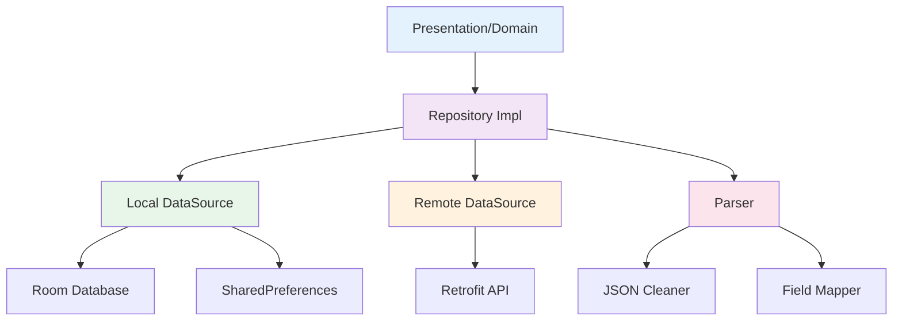

# Data 层文档

> [根目录](../../../CLAUDE.md) > [项目文档](../README.md) > **data**

## 层级职责

Data层负责数据的访问和管理，实现domain层定义的接口：
- **数据持久化**: 本地数据库存储
- **网络访问**: 远程API调用
- **数据转换**: 在外部数据模型和领域模型之间转换
- **缓存策略**: 提升数据访问性能

## 模块结构

### [local](local/)
- **职责**: 本地数据存储管理
- **技术**: Room数据库 + SharedPreferences
- **组件**:
  - entity - 数据库实体
  - dao - 数据访问对象
  - converter - 类型转换器
  - preferences - 配置存储

### [remote](remote/)
- **职责**: 远程数据访问
- **技术**: Retrofit + OkHttp
- **组件**:
  - api - API接口定义
  - model - 网络数据模型

### [repository](repository/)
- **职责**: 实现domain层仓库接口
- **特点**: 协调local和remote数据源
- **策略**: 缓存优先，网络更新

### [parser](parser/)
- **职责**: 数据解析和转换
- **功能**:
  - AI响应解析
  - JSON清洗
  - 字段映射
  - 错误恢复

## 架构图



## 数据流设计

### 1. 读取流程
```
请求 → Repository → 检查本地缓存 → 缓存命中？ → 否 → 网络请求 → 保存到本地 → 返回数据
                                     ↓ 是
                                   返回缓存数据
```

### 2. 写入流程
```
请求 → Repository → 本地写入 → 网络同步 → 成功？ → 是 → 更新本地状态
                                  ↓ 否
                              回滚本地更改
```

## 核心组件

### AppDatabase
- **文件**: `local/AppDatabase.kt`
- **版本**: v10
- **特性**:
  - 完整的迁移支持
  - 类型转换器集成
  - 数据库事务管理

### ApiKeyStorage
- **文件**: `local/ApiKeyStorage.kt`
- **安全**: EncryptedSharedPreferences
- **功能**: API密钥的安全存储和访问

### AiRepositoryImpl
- **文件**: `repository/AiRepositoryImpl.kt`
- **职责**: AI相关数据操作
- **特点**: 自动重试、错误恢复

## 设计原则

### 1. 单一数据源
- 每个Repository负责一种数据类型
- 协调多个数据源
- 提供统一的数据视图

### 2. 缓存策略
- Cache First策略
- 自动失效机制
- 离线优先支持

### 3. 错误处理
- 统一的错误类型转换
- 自动重试机制
- 降级策略

## 性能优化

### 1. 数据库优化
- 合理使用索引
- 分页加载大数据集
- 使用事务批量操作

### 2. 网络优化
- 请求去重
- 智能缓存
- 连接池复用

### 3. 内存管理
- 及时释放资源
- 使用弱引用避免内存泄漏
- 监控内存使用

## 测试策略

### 1. 单元测试
- Repository实现测试
- DAO操作测试
- Parser功能测试

### 2. 集成测试
- 数据库迁移测试
- API集成测试
- 端到端数据流测试

## 相关文件清单

### 核心实现
- `AppDatabase.kt` - 主数据库类
- `ApiKeyStorage.kt` - 密钥存储
- `ContactRepositoryImpl.kt` - 联系人仓库实现
- `AiRepositoryImpl.kt` - AI仓库实现

### 解析器
- `AiResponseParser.kt` - AI响应解析
- `JsonCleaner.kt` - JSON清洗
- `FieldMapper.kt` - 字段映射

## 变更记录

### 2025-12-21 - 初始创建
- 创建data层文档
- 定义模块架构和数据流
- 记录核心组件和设计原则