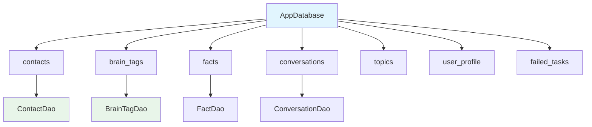

# Data Local 模块文档

> [根目录](../../../../CLAUDE.md) > [项目文档](../../README.md) > [data](../README.md) > **local**

## 模块职责

Data Local模块负责本地数据存储与管理：
- **Room数据库**: 结构化数据持久化
- **SharedPreferences**: 键值对配置存储
- **文件存储**: 提示词模板和备份
- **加密存储**: API密钥安全存储

## 核心组件

### 数据库

#### AppDatabase
- **文件**: `AppDatabase.kt`
- **版本**: v10
- **职责**: 主数据库类
- **表定义**:
  - contacts - 联系人表
  - brain_tags - 脑标签表
  - facts - 事实表
  - conversations - 对话表
  - topics - 主题表
  - user_profile - 用户画像表
  - failed_tasks - 失败任务表

### API密钥存储

#### ApiKeyStorage
- **文件**: `ApiKeyStorage.kt`
- **技术**: EncryptedSharedPreferences
- **职责**: AI服务API密钥安全存储
- **功能**:
  - 保存/获取API密钥
  - 密钥验证
  - 多服务商支持

### 提示词存储

#### PromptFileStorage
- **文件**: `PromptFileStorage.kt`
- **职责**: 提示词文件存储
- **功能**:
  - 保存/加载提示词
  - 场景分类
  - JSON序列化

#### PromptFileBackup
- **文件**: `PromptFileBackup.kt`
- **职责**: 提示词备份管理
- **功能**:
  - 自动备份
  - 恢复功能
  - 版本管理

### 用户偏好存储

#### UserProfilePreferences
- **文件**: `UserProfilePreferences.kt`
- **职责**: 用户画像偏好设置
- **功能**:
  - 画像配置存储
  - 自动备份设置

#### UserProfileCache
- **文件**: `UserProfileCache.kt`
- **职责**: 用户画像缓存
- **功能**:
  - 内存缓存
  - 快速访问

#### UserProfileBackupManager
- **文件**: `UserProfileBackupManager.kt`
- **职责**: 用户画像备份管理
- **功能**:
  - 导出/导入
  - 云端备份

### 隐私设置存储

#### PrivacyPreferences
- **文件**: `PrivacyPreferences.kt`
- **职责**: 隐私配置存储
- **功能**:
  - 脱敏规则配置
  - 敏感数据设置

### 对话设置存储

#### ConversationPreferences
- **文件**: `ConversationPreferences.kt`
- **职责**: 对话相关设置
- **功能**:
  - 上下文窗口大小
  - 自动总结设置

### 内存设置存储

#### MemoryPreferences
- **文件**: `MemoryPreferences.kt`
- **职责**: 内存管理设置
- **功能**:
  - 缓存大小配置
  - 清理策略

### 悬浮窗设置存储

#### FloatingWindowPreferences
- **文件**: `FloatingWindowPreferences.kt`
- **职责**: 悬浮窗配置
- **功能**:
  - 位置记忆
  - 样式设置
  - 行为配置

### 清理设置

#### CleanupPreferencesImpl
- **文件**: `CleanupPreferencesImpl.kt`
- **职责**: 数据清理配置
- **功能**:
  - 自动清理周期
  - 保留策略

### 默认配置

#### DefaultPrompts
- **文件**: `DefaultPrompts.kt`
- **职责**: 默认提示词配置
- **功能**:
  - 预置模板
  - 初始化数据

## 数据库架构



## 设计原则

### 1. 数据安全
- 敏感数据加密存储
- 使用EncryptedSharedPreferences
- 防止SQL注入

### 2. 性能优化
- 使用Room索引
- 分页加载大数据集
- 异步操作

### 3. 数据迁移
- 版本化迁移策略
- 向后兼容
- 测试迁移脚本

## 使用示例

### 数据库使用

```kotlin
@Singleton
class ContactRepositoryImpl @Inject constructor(
    database: AppDatabase
) {
    private val dao = database.contactDao()

    suspend fun getContact(id: String): ContactProfile? {
        return dao.getById(id)?.toDomainModel()
    }
}
```

### ApiKeyStorage使用

```kotlin
class SettingsViewModel @Inject constructor(
    private val apiKeyStorage: ApiKeyStorage
) : ViewModel() {

    fun saveApiKey(provider: String, key: String) {
        viewModelScope.launch {
            apiKeyStorage.saveApiKey(provider, key)
        }
    }
}
```

## 相关文件清单

### 核心组件
- `AppDatabase.kt` - 主数据库
- `ApiKeyStorage.kt` - API密钥存储

### 提示词存储
- `PromptFileStorage.kt` - 提示词文件存储
- `PromptFileBackup.kt` - 提示词备份

### 偏好设置
- `UserProfilePreferences.kt` - 用户画像设置
- `PrivacyPreferences.kt` - 隐私设置
- `ConversationPreferences.kt` - 对话设置
- `MemoryPreferences.kt` - 内存设置
- `FloatingWindowPreferences.kt` - 悬浮窗设置

### 辅助类
- `DefaultPrompts.kt` - 默认配置
- `CleanupPreferencesImpl.kt` - 清理配置

## 变更记录

### 2025-12-25 - 初始创建
- 创建data/local模块文档
- 记录所有本地存储组件
