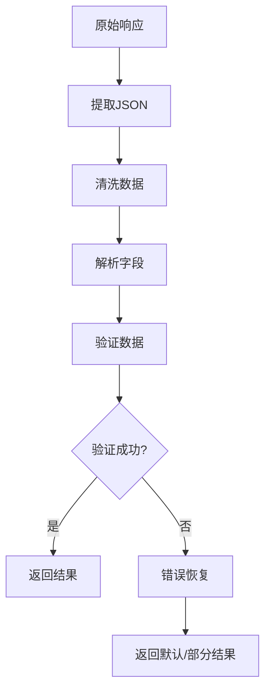

# Data Parser 模块文档

> [根目录](../../../../CLAUDE.md) > [项目文档](../../README.md) > [data](../README.md) > **parser**

## 模块职责

Data Parser模块负责AI响应数据的解析与处理：
- **JSON解析**: 将AI返回的JSON转换为结构化数据
- **数据清洗**: 清理和规范化AI响应
- **错误恢复**: 处理不完整或格式错误的响应
- **字段映射**: 将响应字段映射到领域模型

## 核心组件

### AiResponseParser
- **文件**: `AiResponseParser.kt`
- **职责**: AI响应统一解析
- **功能**:
  - 聊天完成响应解析
  - 分析结果解析
  - 回复建议解析
  - 错误响应处理

### JsonCleaner
- **文件**: `JsonCleaner.kt`
- **职责**: JSON数据清洗
- **功能**:
  - 移除Markdown代码块标记
  - 清理多余空白
  - 修复格式错误
  - Unicode转义处理

## 设计原则

### 1. 容错解析
- 处理不完整响应
- 处理格式错误
- 提供默认值

### 2. 类型安全
- 强类型解析
- 验证必需字段
- 类型转换安全

### 3. 可扩展
- 支持新响应格式
- 可配置解析规则
- 插件化架构

## 使用示例

### AI响应解析

```kotlin
class AiRepositoryImpl @Inject constructor(
    private val api: OpenAiApi,
    private val parser: AiResponseParser
) : AiRepository {

    override suspend fun analyzeChat(
        request: AnalysisRequest
    ): Result<AnalysisResult> {
        return try {
            val response = api.analyze(request.toDto())
            val result = parser.parseAnalysisResponse(response)
            Result.success(result)
        } catch (e: JsonDataException) {
            // 解析错误，尝试恢复
            val recovered = parser.recoverAnalysisResponse(response)
            Result.success(recovered)
        }
    }
}
```

### JSON清洗

```kotlin
val rawResponse = """
```json
{
  "emotion": "happy",
  "confidence": 0.95
}
```
""".trimIndent()

val cleaned = JsonCleaner.clean(rawResponse)
// 结果: {"emotion":"happy","confidence":0.95}
```

## 解析策略

### 标准解析流程


### 错误恢复策略
1. **部分数据恢复**: 提取可用字段
2. **默认值填充**: 缺失字段使用默认值
3. **重试解析**: 使用备用解析器
4. **降级处理**: 返回最小可用数据

## 相关文件清单

### 核心解析器
- `AiResponseParser.kt` - AI响应解析器
- `JsonCleaner.kt` - JSON清洗器

## 变更记录

### 2025-12-25 - 初始创建
- 创建data/parser模块文档
