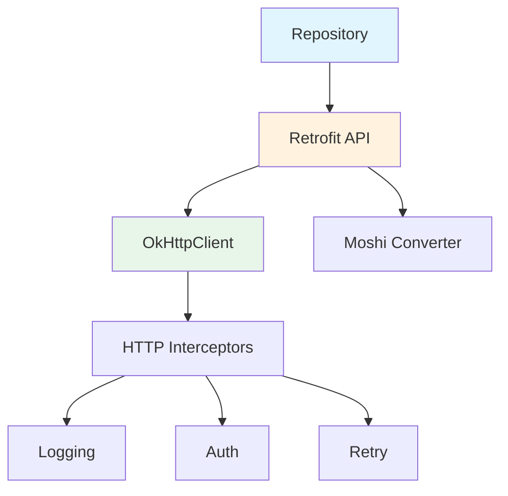

# Data Remote 模块文档

> [根目录](../../../../CLAUDE.md) > [项目文档](../../README.md) > [data](../README.md) > **remote**

## 模块职责

Data Remote模块负责远程数据访问：
- **API调用**: 与AI服务提供商通信
- **网络请求**: HTTP请求管理
- **数据转换**: 网络模型到领域模型转换
- **错误处理**: 网络错误处理与重试

## 核心组件

### API接口

#### OpenAiApi
- **文件**: `api/OpenAiApi.kt`
- **技术**: Retrofit
- **职责**: OpenAI API调用
- **端点**:
  - 聊天完成 (POST /v1/chat/completions)
  - 其他OpenAI端点

#### 其他API接口
- 支持多种AI服务商
- 统一的接口定义
- 可扩展架构

### 数据模型 (DTO)

#### 请求模型
- **ChatRequestDto**: 聊天请求
- **AnalysisRequestDto**: 分析请求
- **ReplyRequestDto**: 回复生成请求

#### 响应模型
- **ChatResponseDto**: 聊天响应
- **AnalysisResponseDto**: 分析响应
- **ErrorResponseDto**: 错误响应

## 网络架构



## 设计原则

### 1. 统一接口
- 统一的错误处理
- 统一的响应格式
- 统一的认证机制

### 2. 容错设计
- 自动重试机制
- 超时处理
- 降级策略

### 3. 安全通信
- HTTPS加密
- API密钥保护
- 证书验证

## 使用示例

### API调用示例

```kotlin
@Singleton
class AiRepositoryImpl @Inject constructor(
    private val api: OpenAiApi,
    private val apiKeyStorage: ApiKeyStorage
) : AiRepository {

    override suspend fun analyzeChat(
        request: AnalysisRequest
    ): Result<AnalysisResult> {
        return try {
            val apiKey = apiKeyStorage.getApiKey("openai")
            val dto = AnalysisRequestDto.fromDomain(request)
            val response = api.analyze(dto)
            Result.success(response.toDomainModel())
        } catch (e: Exception) {
            Result.failure(AppError.NetworkError(e))
        }
    }
}
```

## 配置

### Retrofit配置
```kotlin
@Provides
@Singleton
fun provideRetrofit(
    okHttpClient: OkHttpClient,
    moshi: Moshi
): Retrofit {
    return Retrofit.Builder()
        .baseUrl("https://api.openai.com/")
        .client(okHttpClient)
        .addConverterFactory(MoshiConverterFactory.create(moshi))
        .build()
}
```

### OkHttp配置
```kotlin
@Provides
@Singleton
fun provideOkHttpClient(): OkHttpClient {
    return OkHttpClient.Builder()
        .addInterceptor(AuthInterceptor())
        .addInterceptor(RetryInterceptor())
        .addInterceptor(HttpLoggingInterceptor())
        .connectTimeout(30, TimeUnit.SECONDS)
        .readTimeout(30, TimeUnit.SECONDS)
        .build()
}
```

## 相关文件清单

### API接口
- `api/OpenAiApi.kt` - OpenAI API

### 数据模型
- `model/*RequestDto.kt` - 请求DTO
- `model/*ResponseDto.kt` - 响应DTO

## 变更记录

### 2025-12-25 - 初始创建
- 创建data/remote模块文档
