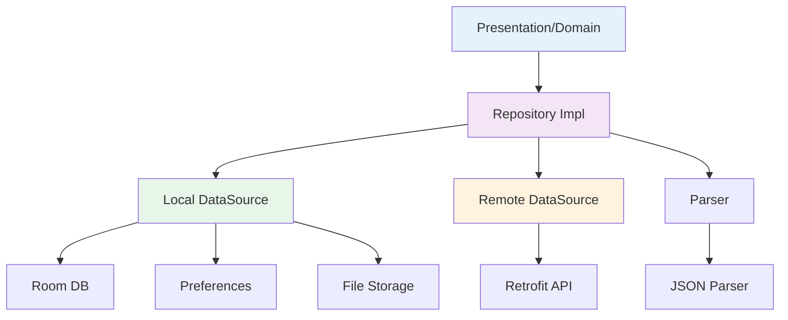

# Data Repository 模块文档

> [根目录](../../../../CLAUDE.md) > [项目文档](../../README.md) > [data](../README.md) > **repository**

## 模块职责

Data Repository模块实现domain层定义的Repository接口：
- **接口实现**: 实现domain层的Repository接口
- **数据协调**: 协调local和remote数据源
- **缓存策略**: 实现缓存优先策略
- **数据转换**: 在数据模型和领域模型之间转换

## 核心实现

### ContactRepositoryImpl
- **职责**: 联系人数据管理
- **数据源**: Room数据库
- **功能**: CRUD操作、搜索、过滤

### BrainTagRepositoryImpl
- **职责**: 脑标签数据管理
- **数据源**: Room数据库
- **功能**: 标签CRUD、事实管理

### AiRepositoryImpl
- **职责**: AI服务交互
- **数据源**: Remote API + 本地缓存
- **功能**: 分析、回复生成、润色

### PromptRepositoryImpl
- **职责**: 提示词管理
- **数据源**: 文件存储
- **功能**: 提示词CRUD、备份恢复

### SettingsRepositoryImpl
- **职责**: 应用设置管理
- **数据源**: SharedPreferences
- **功能**: 设置读写、默认值管理

## 架构设计



## 设计原则

### 1. 缓存优先
```
请求 → 检查本地缓存 → 缓存有效？ → 是 → 返回缓存数据
                         ↓ 否
                    网络请求 → 保存到本地 → 返回数据
```

### 2. 单一数据源
- 每个Repository负责一种数据类型
- 统一的数据访问接口
- 一致的数据转换

### 3. 错误处理
- 统一的错误类型转换
- 自动重试机制
- 降级策略

## 使用示例

### 基础Repository实现

```kotlin
@Singleton
class ContactRepositoryImpl @Inject constructor(
    private val contactDao: ContactDao,
    private val privacyEngine: PrivacyEngine
) : ContactRepository {

    override suspend fun getContact(id: String): Result<ContactProfile> {
        return try {
            val entity = contactDao.getById(id)
            val profile = entity.toDomainModel()
            Result.success(profile)
        } catch (e: Exception) {
            Result.failure(AppError.DatabaseError(e))
        }
    }

    override fun getAllContacts(): Flow<List<ContactProfile>> {
        return contactDao.getAll()
            .map { entities -> entities.map { it.toDomainModel() } }
    }

    override suspend fun saveContact(contact: ContactProfile): Result<ContactProfile> {
        return try {
            val entity = contact.toEntity()
            contactDao.insert(entity)
            Result.success(contact)
        } catch (e: Exception) {
            Result.failure(AppError.DatabaseError(e))
        }
    }
}
```

### 带缓存的Repository实现

```kotlin
@Singleton
class AiRepositoryImpl @Inject constructor(
    private val api: OpenAiApi,
    private val cache: AnalysisCache,
    private val apiKeyStorage: ApiKeyStorage
) : AiRepository {

    override suspend fun analyzeChat(
        request: AnalysisRequest
    ): Result<AnalysisResult> {
        // 1. 检查缓存
        val cached = cache.get(request.cacheKey)
        if (cached != null) {
            return Result.success(cached)
        }

        // 2. 网络请求
        return try {
            val apiKey = apiKeyStorage.getApiKey("openai")
            val dto = AnalysisRequestDto.fromDomain(request)
            val response = api.analyze(dto)
            val result = response.toDomainModel()

            // 3. 保存缓存
            cache.put(request.cacheKey, result)

            Result.success(result)
        } catch (e: Exception) {
            Result.failure(AppError.NetworkError(e))
        }
    }
}
```

## 数据转换

### Entity到Domain Model
```kotlin
fun ContactEntity.toDomainModel(): ContactProfile {
    return ContactProfile(
        id = id,
        name = name,
        relationshipLevel = RelationshipLevel.fromValue(relationshipLevel),
        tags = tagsJson?.let { parseTags(it) } ?: emptyList(),
        facts = factsJson?.let { parseFacts(it) } ?: emptyList(),
        createdAt = createdAt,
        updatedAt = updatedAt
    )
}
```

### Domain Model到Entity
```kotlin
fun ContactProfile.toEntity(): ContactEntity {
    return ContactEntity(
        id = id,
        name = name,
        relationshipLevel = relationshipLevel.value,
        tagsJson = serializeTags(tags),
        factsJson = serializeFacts(facts),
        createdAt = createdAt,
        updatedAt = updatedAt
    )
}
```

## 相关文件清单

### Repository实现
- `ContactRepositoryImpl.kt` - 联系人仓库实现
- `BrainTagRepositoryImpl.kt` - 脑标签仓库实现
- `AiRepositoryImpl.kt` - AI仓库实现
- `PromptRepositoryImpl.kt` - 提示词仓库实现
- `SettingsRepositoryImpl.kt` - 设置仓库实现

## 变更记录

### 2025-12-25 - 初始创建
- 创建data/repository模块文档
